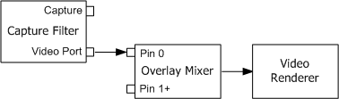

# Video Port Pins

\[The feature associated with this page, [DirectShow](/windows/win32/directshow/directshow), is a legacy feature. It has been superseded by [MediaPlayer](/uwp/api/Windows.Media.Playback.MediaPlayer) and [IMFMediaEngine](/windows/win32/api/mfmediaengine/nn-mfmediaengine-imfmediaengine). **MediaPlayer** and **IMFMediaEngine** have been optimized for Windows 10 and Windows 11. Microsoft strongly recommends that new code use **MediaPlayer** and **IMFMediaEngine** instead of **DirectShow**, when possible. Microsoft suggests that existing code that uses the legacy APIs be rewritten to use the new APIs if possible.\]

A capture device with a hardware video port might use the video port extensions (VPE) in Microsoft® DirectX®. If so, the capture filter will have a video port (VP) pin. No video data travels from the VP pin through the filter graph. Instead, video frames are produced in hardware and sent directly to video memory. The VP pin allows control messages to be sent to the hardware.

It is important to connect the VP pin, even if your application only performs file capture with no preview. If you leave the pin unconnected, the graph will not run correctly. This is different from preview pins, which do not have to be connected.

The different DirectShow video renderers provide varying support for VP pins:

-   Video Renderer: Connect the VP pin to pin 0 on the [Overlay Mixer](overlay-mixer-filter.md) filter, and connect the Overlay Mixer filter to the Video Renderer.
-   VMR-7: Connect the VP pin to the [Video Port Manager](video-port-manager.md) filter, and connect the Video Port Manager to the VMR-7.
-   VMR-9: You cannot use the VMR-9 if the device has a VP pin, because Direct3D 9 does not support video ports. Use either the Video Renderer or the VMR-7.

For video port scenarios, the Overlay Mixer and Video Renderer are recommended over the Video Port Manager and VMR-7, because not all drivers support the Video Port Manager. In general, the Overlay Mixer is the most reliable option for video ports.

The [**ICaptureGraphBuilder2::RenderStream**](/windows/desktop/api/Strmif/nf-strmif-icapturegraphbuilder2-renderstream) method automatically inserts the Overlay Mixer if there is a VP pin. If you are building the graph without using this method, you should check for a video port pin on the capture filter, and if one is present, connect it to the Overlay Mixer filter, as shown in the following diagram.



You can use the [**ICaptureGraphBuilder2::FindPin**](/windows/desktop/api/Strmif/nf-strmif-icapturegraphbuilder2-findpin) method to search for a VP pin on the capture filter:


```C++
hr = pBuild->FindPin(
    pCap,                    // Pointer to the capture filter.
    PINDIR_OUTPUT,           // Look for an output pin.
    &PIN_CATEGORY_VIDEOPORT, // Look for a video port pin.
    NULL,                    // Any media type.
    FALSE,                   // Pin can be connected.
    0,                       // Retrieve the first matching pin.
    &pVPPin                  // Receives a pointer to the pin.
);
```


After you add the Overlay Mixer to the graph, call **FindPin** again to find pin 0 on the Overlay Mixer. Pin 0 is always the first input pin on the filter.


```C++
pBuild->FindPin(pOvMix, PINDIR_INPUT, NULL, NULL, TRUE, 0, &pOVPin);
```


Connect the two pins by calling [**IGraphBuilder::Connect**](/windows/desktop/api/Strmif/nf-strmif-igraphbuilder-connect).


```C++
pGraph->Connect(pVPPin, pOvPin);
```


Then connect the Overlay Mixer's output pin to the Video Renderer filter. You can hide the video by calling the [**IVideoWindow::put\_AutoShow**](/windows/desktop/api/Control/nf-control-ivideowindow-put_autoshow) and [**IVideoWindow::put\_Visible**](/windows/desktop/api/Control/nf-control-ivideowindow-put_visible) methods on the Filter Graph Manager.

For TV tuners, the capture filter might also have a video port VBI pin (PIN\_CATEGORY\_VIDEOPORT\_VBI). If so, connect that pin to the [VBI Surface Allocator](vbi-surface-allocator.md) filter. For more information, see [Viewing Closed Captions](viewing-closed-captions.md).

## Related topics

<dl> <dt>

[Advanced Capture Topics](advanced-capture-topics.md)
</dt> <dt>

[Using the Overlay Mixer in Video Capture](using-the-overlay-mixer-in-video-capture.md)
</dt> </dl>

 

 


