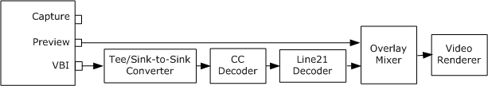
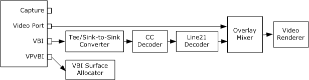

# Viewing Closed Captions

To support closed captions in analog television, the capture filter exposes a pin that delivers either VBI or closed caption data. The pin will have one of the following pin categories:

-   VBI pin (PIN\_CATEGORY\_VBI). Delivers a stream of VBI waveform samples. These are passed to a decoder filter that extracts the closed captioning data.
-   CC pin (PIN\_CATEGORY\_CC). Delivers closed-caption byte pairs, extracted from the line-21 data.
-   Hardware slicing CC pin (PINNAME\_VIDEO\_CC\_CAPTURE).

To preview closed captions, call [**ICaptureGraphBuilder2::RenderStream**](/windows/desktop/api/Strmif/nf-strmif-icapturegraphbuilder2-renderstream) with the VBI pin category, and if that fails, call it again with the CC category.


```C++
hr = pBuild->RenderStream(&PIN_CATEGORY_VBI, 0, pCap, 0, 0);
if (FAILED(hr))
{
    hr = pBuild->RenderStream(&PIN_CATEGORY_CC, 0, pCap, 0, 0);
}
```


The following diagram shows a typical filter graph for displaying closed captions.



This graph uses the following filters for closed caption display:

-   [Tee/Sink-to-Sink Converter](tee-sink-to-sink-converter.md). Accepts the VBI information from the capture filter and splits it into separate streams for each of the data services present on the signal. Microsoft provides VBI codecs for Closed Caption, NABTS, and World Standard Teletext (WST).
-   [CC Decoder](cc-decoder-filter.md). Decodes CC data from the sampled VBI waveforms provided by the capture filter.
-   [Line 21 Decoder](line-21-decoder-filter.md). Translates the CC byte pairs and draws the caption text onto bitmaps. The downstream filter (in this case the Overlay Mixer) overlays the bitmaps onto the video.

The Capture Graph Builder's [**RenderStream**](/windows/desktop/api/Strmif/nf-strmif-icapturegraphbuilder2-renderstream) method adds these filters automatically. If the capture filter has a CC pin instead of a VBI pin, the CC pin is connected directly to the Line 21 Decoder filter.

> [!Note]  
> If you are using the Video Mixing Renderer (VMR) filter for rendering, use the Line 21 Decoder Filter 2. This filter has the same functionality as the Line 21 Decoder, but the CLSID is CLSID\_Line21Decoder2.

 

> [!Note]  
> The CC Decoder filter was removed in Windows Vista. New applications should use the VBICodec filter, which is documented in the Microsoft TV Technologies documentation.

 

If the capture device uses a video port, the capture filter might have a video port VBI pin (PIN\_CATEGORY\_VIDEOPORT\_VBI). This pin must be connected to the [VBI Surface Allocator](vbi-surface-allocator.md) filter, which allocates surfaces to hold the captured VBI data. The [**RenderStream**](/windows/desktop/api/Strmif/nf-strmif-icapturegraphbuilder2-renderstream) method adds this filter if it is required. The following diagram shows a filter graph with the VBI Surface Allocator.



### Enabling and Disabling the Captions

To control the captioning display, use the [**IAMLine21Decoder**](/previous-versions/windows/desktop/api/il21dec/nn-il21dec-iamline21decoder) interface on the Line 21 Decoder filter. For example, you can turn off the captioning display using the [**IAMLine21Decoder::SetServiceState**](/previous-versions/windows/desktop/api/il21dec/nf-il21dec-iamline21decoder-setservicestate) method, as follows:


```C++
// Use the FindInterface method to find the interface.
IAMLine21Decoder *pLine21 = NULL;
hr = pBuild->FindInterface(
    &LOOK_DOWNSTREAM_ONLY, // Look downstream from pCap 
    NULL,                  // No particular media type
    pCap,                  // Pointer to the capture filter.
    IID_IAMLine21Decoder, (void**)&pLine21);
if (SUCCEEDED(hr))
{
    pLine21->SetServiceState(AM_L21_CCSTATE_Off);
    // (Use AM_L21_CCSTATE_On to enable.)
    pLine21->Release();
}
```


This example uses the [**ICaptureGraphBuilder2::FindInterface**](/windows/desktop/api/Strmif/nf-strmif-icapturegraphbuilder2-findinterface) method to locate the [**IAMLine21Decoder**](/previous-versions/windows/desktop/api/il21dec/nn-il21dec-iamline21decoder) interface. The first parameter to **FindInterface** is **&LOOK\_DOWNSTREAM\_ONLY**, which specifies to search downstream from the capture filter (*pCap*).

### Capturing Closed Caption Bitmaps

You can capture the caption bitmaps into a file. To do so, add the file-writing section of the filter graph, as described in [Capturing Video to a File](capturing-video-to-a-file.md). Then render the CC or VBI pin to the mux filter:


```C++
hr = pBuild->RenderStream(&PIN_CATEGORY_VBI, 0, pCap, 0, pMux);
if (FAILED(hr))
{
    hr = pBuild->RenderStream(&PIN_CATEGORY_CC, 0, pCap, 0, pMux);
}
```


If you are also capturing the video, this will create a file with two separate video streams. It will not capture video with captions overlaid on top of the picture.

## Related topics

<dl> <dt>

[Closed Captions and Teletext](closed-captions-and-teletext.md)
</dt> </dl>

 

 


