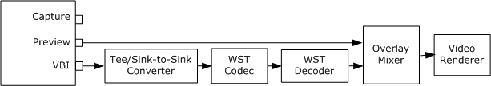

# Viewing World Standard Teletext

\[The feature associated with this page, [DirectShow](/windows/win32/directshow/directshow), is a legacy feature. It has been superseded by [MediaPlayer](/uwp/api/Windows.Media.Playback.MediaPlayer), [IMFMediaEngine](/windows/win32/api/mfmediaengine/nn-mfmediaengine-imfmediaengine), and [Audio/Video Capture in Media Foundation](windows/win32/medfound/audio-video-capture-in-media-foundation). Those features have been optimized for Windows 10 and Windows 11. Microsoft strongly recommends that new code use **MediaPlayer**, **IMFMediaEngine** and **Audio/Video Capture in Media Foundation** instead of **DirectShow**, when possible. Microsoft suggests that existing code that uses the legacy APIs be rewritten to use the new APIs if possible.\]

> [!Note]  
> This functionality has been removed from Windows Vista and later operating systems. It is available for use in the Microsoft Windows 2000, Windows XP, and Windows Server 2003 operating systems.

 

World Standard Teletext (WST) is encoded in the vertical blanking interval (VBI) of the analog television signal. The filter graph for previewing teletext is similar to the graph used to view closed captions. The following diagram illustrates this graph.



This graph uses the following filters for WST display:

-   [Tee/Sink-to-Sink Converter](tee-sink-to-sink-converter.md). Accepts the VBI information from the capture filter and splits it into separate streams for each of the data services present on the signal.
-   [WST Codec](wst-codec-filter.md). Decodes the Teletext data from the VBI samples.
-   [WST Decoder](wst-decoder-filter.md). Translates teletext data and draws the text onto bitmaps. The downstream filter (in this case the Overlay Mixer) overlays the bitmaps onto the video.

The Capture Graph Builder's **RenderStream** method does not support the WST filters directly, so your application must do some extra work.

1.  Add the Overlay Mixer filter to the filter graph. The following code uses the AddFilterByCLSID function described in [Add a Filter by CLSID](add-a-filter-by-clsid.md). (AddFilterByCLSID is not a DirectShow API.)
    ```C++
    IBaseFilter *pOvMix = NULL;  // Pointer to the Overlay Mixer filter.
    hr = AddFilterByCLSID(pGraph, CLSID_OverlayMixer, L"OVMix", &pOvMix);
    if (FAILED(hr)) 
    {
        // Handle the error ...
    }
    ```

    

2.  Connect the preview pin to the Video Renderer filter through the Overlay Mixer. You can use the **RenderStream** method, as follows:
    ```C++
    hr = pBuild->RenderStream(&PIN_CATEGORY_PREVIEW, &MEDIATYPE_Video, 
        pCap, pOvMix, 0);
    ```

    

3.  Add the Tee/Sink-to-Sink Converter filter to the filter graph. The following code uses the CreateKernelFilter function described in [Creating Kernel-Mode Filters](creating-kernel-mode-filters.md). (CreateKernelFilter is not a DirectShow API.)
    ```C++
    IBaseFilter* pKernelTee = NULL;
    hr = CreateKernelFilter(AM_KSCATEGORY_SPLITTER, 
        OLESTR("Tee/Sink-to-Sink Converter"), &pKernelTee);
    if (SUCCEEDED(hr))
    {
        hr = pGraph->AddFilter(pKernelTee, L"Kernel Tee");
    }
    ```

    

4.  Add the WST Codec filter to the filter graph:
    ```C++
    IBaseFilter* pWstCodec = NULL;
    hr = CreateKernelFilter(AM_KSCATEGORY_VBICODEC, 
        OLESTR("WST Codec"), &pWstCodec);
    if (SUCCEEDED(hr))
    {
        hr = pGraph->AddFilter(pWstCodec, L"WST Codec");
    }
    ```

    

5.  Call **RenderStream** to connect the capture filter's VBI pin to the Tee/Sink-to-Sink Converter, and the Tee/Sink-to-Sink Converter to the WST Codec filter:
    ```C++
    hr = pBuild->RenderStream(&PIN_CATEGORY_VBI, 0, pCap, 
        pKernelTee, pWstCodec);
    ```

    

6.  Call **RenderStream** again to connect the WST Codec filter to the Overlay Mixer. The WST Decoder filter is automatically brought into the graph.
    ```C++
    hr = pBuild->RenderStream(0, 0, pWstCodec, 0, pOvMix);
    ```

    

7.  Remember to release all of the filter interfaces.
    ```C++
    pOvMix->Release();
    pKernelTee->Release();
    pWstCodec->Release();
    ```

    

> [!Note]  
> Currently, the WST Decoder filter does not support connections to the Video Mixing Renderer (VMR) filter. Therefore, you must use the legacy Video Renderer filter to view teletext.

 

If the capture filter has a video port VBI pin (PIN\_CATEGPORY\_VIDEOPORT\_VBI), connect it to the [VBI Surface Allocator](vbi-surface-allocator.md) filter. The graph will not run correctly otherwise. The following code example uses the AddFilterByCLSID function, described in [Add a Filter by CLSID](add-a-filter-by-clsid.md), and the FindPinByCategory function, described in [Working with Pin Categories](working-with-pin-categories.md). (Neither function is a DirectShow API.)


```C++
// Look for a video port VBI pin on the capture filter.
IPin *pVPVBI = NULL;
hr = FindPinByCategory(pCap, PINDIR_OUTPUT, 
    PIN_CATEGORY_VIDEOPORT_VBI, &pVPVBI);
if (FAILED(hr))
{
    // No video port VBI pin; nothing else to do. OK to run the graph.
}
else
{
    // Found one. Connect it to the VBI Surface Allocator.
    IBaseFilter *pSurf = NULL;
    hr = AddFilterByCLSID(pGraph, CLSID_VBISurfaces, L"VBI Surf", &pSurf);
    if (SUCCEEDED(hr))
    {
        hr = pBuild->RenderStream(NULL, NULL, pVPVBI, 0, pSurf);
        pSurf->Release();
    }
    if (FAILED(hr))
    {
        // Handle the error (not shown). It is probably not safe to 
        // run the graph at this point.
    }
    pVPVBI->Release();
}
```


## Related topics

<dl> <dt>

[Closed Captions and Teletext](closed-captions-and-teletext.md)
</dt> </dl>

 

 


