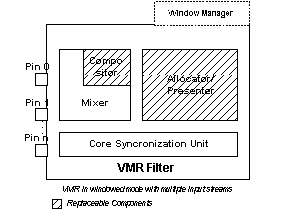

# VMR Filter Components

\[The feature associated with this page, [DirectShow](/windows/win32/directshow/directshow), is a legacy feature. It has been superseded by [MediaPlayer](/uwp/api/Windows.Media.Playback.MediaPlayer), [IMFMediaEngine](/windows/win32/api/mfmediaengine/nn-mfmediaengine-imfmediaengine), and [Audio/Video Capture in Media Foundation](/windows/win32/medfound/audio-video-capture-in-media-foundation). Those features have been optimized for Windows 10 and Windows 11. Microsoft strongly recommends that new code use **MediaPlayer**, **IMFMediaEngine** and **Audio/Video Capture in Media Foundation** instead of **DirectShow**, when possible. Microsoft suggests that existing code that uses the legacy APIs be rewritten to use the new APIs if possible.\]

The VMR employs a modular design that enables applications to configure it for many different rendering scenarios. Depending on its configuration, the VMR contains from two to five subcomponents (in addition to its input pins).

**Mixer:** The mixer is a COM object responsible for mixing multiple streams. Deinterlacing also occurs inside the mixer. The mixer is loaded by the VMR when multiple input streams are detected, or when the input video is interlaced. The mixer collects information about each input stream and sorts the streams into the correct Z-order. It is responsible for determining when each input pin receives a sample, and for instructing the image compositor at the proper time to perform the actual blending. The mixer also calculates the time stamp to be applied to each output image. When the application is supplying a bitmap to be displayed on top of the composited image, the mixer is responsible for ensuring that the bitmap is displayed on top even if the Z-order of the input streams is modified.

**Image Compositor:** The Image Compositor is a COM object that performs the actual blending of the input streams onto a single DirectDraw or Direct3D surface provided by the allocator-presenter. The VMR provides a default image compositor that enables applications to perform 2-D alpha-blending effects. Applications can provide a custom image compositor to enable other 2-D and 3-D effects, such as applying textures to portions of the image, per-pixel alpha blending, mapping the image to stationary or moving 3-D objects, and so on.

**Allocator-Presenter:** The allocator-presenter is a COM object that allocates the DirectDraw or Direct3D object and handles the communication with the graphics card. The drawing can be performed either as a flip or as a blit. You can plug in your own allocator-presenter in order to create and control the DirectDraw or Direct3D object, and/or to obtain access to the video bits at presentation time.

**Window Manager:** The Window Manager is used only in windowed mode. The Window Manager supports the legacy [**IVideoWindow**](/windows/desktop/api/Control/nn-control-ivideowindow) and [**IBasicVideo**](/windows/desktop/api/Control/nn-control-ibasicvideo) interfaces for backward-compatibility.

## Related topics

<dl> <dt>

[About the Video Mixing Render](about-the-video-mixing-render.md)
</dt> </dl>

 

 

