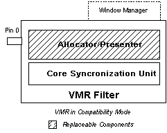

# VMR Windowed (Compatibility) Mode

\[The feature associated with this page, [DirectShow](/windows/win32/directshow/directshow), is a legacy feature. It has been superseded by [MediaPlayer](/uwp/api/Windows.Media.Playback.MediaPlayer) and [IMFMediaEngine](/windows/win32/api/mfmediaengine/nn-mfmediaengine-imfmediaengine). **MediaPlayer** and **IMFMediaEngine** have been optimized for Windows 10 and Windows 11. Microsoft strongly recommends that new code use **MediaPlayer** and **IMFMediaEngine** instead of **DirectShow**, when possible. Microsoft suggests that existing code that uses the legacy APIs be rewritten to use the new APIs if possible.\]

The VMR is designed to be compatible with all existing DirectShow applications. When it is used with an existing application, the VMR operates in windowed mode with a single video stream, also called compatibility mode. This mode is provided because the VMR-7 is the default renderer on Windows XP, and is therefore automatically used in calls to [Intelligent Connect](intelligent-connect.md) methods such as [**IGraphBuilder::RenderFile**](/windows/desktop/api/Strmif/nf-strmif-igraphbuilder-renderfile). If your application uses Intelligent Connect and requires only basic rendering capabilities, you do not need any special code to render correctly with the VMR-7 on Windows XP.

The VMR-9 also runs in windowed/compatibility mode by default. However, the VMR-9 is never the default video renderer. To use the VMR-9 in an application, you must explicitly add it to the filter graph. For that reason, and because windowless mode provides better functionality than windowed mode, there is no particular advantage to using the VMR-9 in windowed/compatibility mode.

**Using the VMR-7 in Windowed/Compatibility Mode**

No special programming is required to set up or control the VMR-7 in windowed/compatibility mode. Simply build the filter graph using the standard graph-building calls, and the VMR-7 will default to this mode.

In windowed/compatibility mode, the VMR-7 creates its own window to display the video. To do so, it loads the Window Manager component, which exposes the [**IVideoWindow**](/windows/desktop/api/Control/nn-control-ivideowindow) and [**IBasicVideo**](/windows/desktop/api/Control/nn-control-ibasicvideo) interfaces. Your application can query the Filter Graph Manager for these interfaces, exactly as you would with the old Video Renderer filter. For more information, see [Using Windowed Mode](using-windowed-mode.md).

The following illustration shows the VMR-7 in windowed/compatibility mode.

To guarantee the maximum level of compatibility, the video window has the same class name as the one created by the old Video Renderer filter, and most of the Window Manager code from the old Video Renderer is still used by the VMR. In windowed/compatibility mode, the VMR consumes no more system resources than the old Video Renderer. Since the VMR-7 has only one input stream in windowed/compatibility mode, it does not load its mixer or compositor components.

By default, the VMR stretches the image to fill the video window. To preserve the aspect ratio of the source, call the [**IVMRAspectRatioControl::SetAspectRatioMode**](/windows/desktop/api/Strmif/nf-strmif-ivmraspectratiocontrol-setaspectratiomode) method with the VMR\_ARMODE\_LETTER\_BOX flag.

> [!Note]  
> MFC applications that place the video window in a child window must define an empty WM\_ERASEBKGND message handler, or the video display area will not repaint correctly.

 

**Using the VMR-7 in Windowed/Compatibility Mode with Multiple Streams**

In windowed/compatibility mode, the VMR-7 creates a single input pin by default, and disables mixing mode. To enable mixing mode, you must configure the VMR before you connect it. For more information, see [VMR with Multiple Streams (Mixing Mode)](vmr-with-multiple-streams--mixing-mode.md). In mixing mode, the VMR loads the mixing and compositor components, which require more system resources.

**Using the VMR-9 in Windowed Mode**

Because the VMR-9 is not the default renderer, it does not have a compatibility mode as such. Instead, the VMR-9 defaults to windowed mode with four input pins. You can use this mode to mix up to four video streams. If you need to mix a larger number of streams, you must configure it as described in [VMR with Multiple Streams (Mixing Mode)](vmr-with-multiple-streams--mixing-mode.md). Otherwise, the VMR-9 in windowed mode behaves exactly like the VMR-7 in windowed/compatibility mode.

 

 

