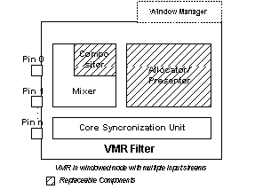

# VMR Windowless Mode

\[The feature associated with this page, [DirectShow](/windows/win32/directshow/directshow), is a legacy feature. It has been superseded by [MediaPlayer](/uwp/api/Windows.Media.Playback.MediaPlayer), [IMFMediaEngine](/windows/win32/api/mfmediaengine/nn-mfmediaengine-imfmediaengine), and [Audio/Video Capture in Media Foundation](windows/win32/medfound/audio-video-capture-in-media-foundation). Those features have been optimized for Windows 10 and Windows 11. Microsoft strongly recommends that new code use **MediaPlayer**, **IMFMediaEngine** and **Audio/Video Capture in Media Foundation** instead of **DirectShow**, when possible. Microsoft suggests that existing code that uses the legacy APIs be rewritten to use the new APIs if possible.\]

Windowless mode is the preferred way for applications to render video inside an application window. In windowless mode, the Video Mixing Renderer does not load its Window Manager component, and therefore does not support the [**IBasicVideo**](/windows/desktop/api/Control/nn-control-ibasicvideo) or [**IVideoWindow**](/windows/desktop/api/Control/nn-control-ivideowindow) interfaces. Instead, the application provides the playback window and sets a destination rectangle in the client area for the VMR to draw the video. The VMR uses a DirectDraw clipper object to ensure that the video is clipped to the application's window and does not appear on any other windows. The VMR does not subclass the application's window or install any system/process hooks.

In windowless mode, the sequence of events during connection and transition to the run state is as follows:

-   The upstream filter proposes a media type, which the VMR either accepts or rejects.
-   If the media type is accepted, the VMR calls the allocator-presenter to obtain a DirectDraw surface. If the surface is created successfully, the pins connect and the VMR is ready to transition into the run state.
-   When the filter graph runs, the decoder calls **GetBuffer** to get a media sample from the allocator. The VMR queries the allocator-presenter to ensure that the pixel depth, rectangle size, and other parameters on its DirectDraw surface are compatible with the incoming video. If they are compatible, the VMR returns the DirectDraw surface to the decoder. After the decoder has decoded into the surface, the VMR's Core Synchronization Unit validates the time stamps. This unit blocks the **Receive** call until the presentation time arrives. At that point, the VMR calls **PresentImage** on the allocator-presenter, which presents the surface to the graphics card.

The following illustration shows the VMR in windowless mode with multiple input streams.



**Configuring the VMR-7 for Windowless Mode**

To configure the VMR-7 for windowless mode, perform all of the following steps before connecting any of the VMR's input pins:

1.  Create the filter and add it to the graph.
2.  Call the [**IVMRFilterConfig::SetRenderingMode**](/windows/desktop/api/Strmif/nf-strmif-ivmrfilterconfig-setrenderingmode) method with the VMRMode\_Windowless flag.
3.  Optionally, configure the VMR for multiple input streams by calling [**IVMRFilterConfig::SetNumberOfStreams**](/windows/desktop/api/Strmif/nf-strmif-ivmrfilterconfig-setnumberofstreams). The VMR creates an input pin for each stream. Use the [**IVMRMixerControl**](/windows/desktop/api/Strmif/nn-strmif-ivmrmixercontrol) interface to set the Z-order and other parameters for the stream. For more information, see [VMR with Multiple Streams (Mixing Mode)](vmr-with-multiple-streams--mixing-mode.md).

    If you do not call **SetNumberOfStreams**, the VMR-7 defaults to one input pin. After the input pins are connected, the number of pins cannot be changed.

4.  Call [**IVMRWindowlessControl::SetVideoClippingWindow**](/windows/desktop/api/Strmif/nf-strmif-ivmrwindowlesscontrol-setvideoclippingwindow) to specify the window in which the rendered video will appear.

Once these steps are completed, you can connect the VMR filter's input pins. There are various ways to build the graph, such as connecting pins directly, using Intelligent Connect methods such as [**IGraphBuilder::RenderFile**](/windows/desktop/api/Strmif/nf-strmif-igraphbuilder-renderfile), or using the Capture Graph Builder's [**ICaptureGraphBuilder2::RenderStream**](/windows/desktop/api/Strmif/nf-strmif-icapturegraphbuilder2-renderstream) method. For more information, see [General Graph-Building Techniques](general-graph-building-techniques.md).

To set the position of the video within the application window, call the [**IVMRWindowlessControl::SetVideoPosition**](/windows/desktop/api/Strmif/nf-strmif-ivmrwindowlesscontrol-setvideoposition) method. The [**IVMRWindowlessControl::GetNativeVideoSize**](/windows/desktop/api/Strmif/nf-strmif-ivmrwindowlesscontrol-getnativevideosize) method returns the native video size. During playback, the application should notify the VMR of the following Windows messages:

-   WM\_PAINT: Call [**IVMRWindowlessControl::RepaintVideo**](/windows/desktop/api/Strmif/nf-strmif-ivmrwindowlesscontrol-repaintvideo) to repaint the image.
-   WM\_DISPLAYCHANGE: Call [**IVMRWindowlessControl::DisplayModeChanged**](/windows/desktop/api/Strmif/nf-strmif-ivmrwindowlesscontrol-displaymodechanged). The VMR takes any actions that are needed to display the video at the new resolution or color depth.
-   WM\_SIZE: Recalculate the position of the video and call [**SetVideoPosition**](/windows/desktop/api/Strmif/nf-strmif-ivmrwindowlesscontrol-setvideoposition) again if necessary.

> [!Note]  
> MFC applications must define an empty WM\_ERASEBKGND message handler, or the video display area will not repaint correctly.

 

**Configuring the VMR-9 for Windowless Mode**

To configure the VMR-9 for windowless mode, use the steps described for the VMR-7 for Windowless mode, but use the [**IVMRFilterConfig9**](/previous-versions/windows/desktop/api/Vmr9/nn-vmr9-ivmrfilterconfig9) and [**IVMRWindowlessControl9**](/previous-versions/windows/desktop/api/Vmr9/nn-vmr9-ivmrwindowlesscontrol9) interfaces. The only significant difference is that the VMR-9 creates four input pins by default, rather than one input pin. Therefore, you only need to call **SetNumberOfStreams** if you are mixing more than four video streams.

**Example Code**

The following code shows how to create a VMR-7 filter, add it to the DirectShow filter graph, and then put the VMR into windowless mode. For the VMR-9, use CLSID\_VideoMixingRenderer9 in **CoCreateInstance** and the corresponding VMR-9 interfaces.


```C++
HRESULT InitializeWindowlessVMR(
    HWND hwndApp,         // Application window.
    IFilterGraph* pFG,    // Pointer to the Filter Graph Manager.
    IVMRWindowlessControl** ppWc,  // Receives the interface.
    DWORD dwNumStreams,  // Number of streams to use.
    BOOL fBlendAppImage  // Are we alpha-blending a bitmap?
    )
{
    IBaseFilter* pVmr = NULL;
    IVMRWindowlessControl* pWc = NULL;
    *ppWc = NULL;

    // Create the VMR and add it to the filter graph.
    HRESULT hr = CoCreateInstance(CLSID_VideoMixingRenderer, NULL,
       CLSCTX_INPROC, IID_IBaseFilter, (void**)&pVmr);
    if (FAILED(hr))
    {
        return hr;
    }
    hr = pFG->AddFilter(pVmr, L"Video Mixing Renderer");
    if (FAILED(hr))
    {
        pVmr->Release();
        return hr;
    }

    // Set the rendering mode and number of streams.  
    IVMRFilterConfig* pConfig;
    hr = pVmr->QueryInterface(IID_IVMRFilterConfig, (void**)&pConfig);
    if (SUCCEEDED(hr)) 
    {
        pConfig->SetRenderingMode(VMRMode_Windowless);

        // Set the VMR-7 to mixing mode if you want more than one video
        // stream, or you want to mix a static bitmap over the video.
        // (The VMR-9 defaults to mixing mode with four inputs.)
        if (dwNumStreams > 1 || fBlendAppImage) 
        {
            pConfig->SetNumberOfStreams(dwNumStreams);
        }
        pConfig->Release();

        hr = pVmr->QueryInterface(IID_IVMRWindowlessControl, (void**)&pWc);
        if (SUCCEEDED(hr)) 
        {
            pWc->SetVideoClippingWindow(hwndApp);
            *ppWc = pWc;  // The caller must release this interface.
        }
    }
    pVmr->Release();

    // Now the VMR can be connected to other filters.
    return hr;
}
```


## Related topics

<dl> <dt>

[Using Windowless Mode](using-windowless-mode.md)
</dt> </dl>

 

 


