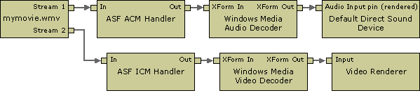

# Windows Media Source Filter

This filter is the legacy source filter for Windows Media® content. It is used by Windows Media Player 6.4. In general, the simplest and most reliable way to use this filter is to use the Windows Media Player 6.4 ActiveX control. Many of the methods exposed by this filter are also exposed through the ActiveX control. See the Windows Media Player SDK for more information.

When this filter is given the name of a local ASF file or a URL for a remote file, it reads the file, parses the compressed streams, and creates an output pin for each one. This filter does not use the Windows Media Format SDK. It uses the installable codec versions of the Windows Media decoders, not the DMO versions. The audio output pin always connects to the ASF ACM Handler filter, and the video pin always connects to the ASF ICM Handler. (ICM in this case refers to the original name of the Video Compression Manager.) The filter does not support seeking.

The following diagram shows a filter graph with this filter.



To maintain backward compatibility with Windows Media Player 6.4, this filter is the default source filter for files with .wma, .wmv, and .asf file extensions. For file playback, newer applications should use the [WM ASF Reader](wm-asf-reader-filter.md) filter. However, the WM ASF Reader does not support playback of streamed content.

The simplest way for an application to play streamed Windows Media-based content is to use the Windows Media Player SDK. Another option is to use the Windows Media Format SDK. Attempting to create a custom player based on the Windows Media Source Filter is not recommended.


| Label | Value |
|------------------------------------------|--------------------------------------------------------------------------------------------------------------------------------------------------------------------------------------------------------------------------------------------------------------------------------------------------------------------------------------------------------------------------------------------------------------------------------------------------------------------|
| Filter interfaces                        | [**IBaseFilter**](/windows/desktop/api/Strmif/nn-strmif-ibasefilter), [**IAMChannelInfo**](/previous-versions/windows/desktop/api/Qnetwork/nn-qnetwork-iamchannelinfo), [**IAMExtendedSeeking**](/previous-versions/windows/desktop/api/Qnetwork/nn-qnetwork-iamextendedseeking), [**IAMMediaContent**](/previous-versions/windows/desktop/api/Qnetwork/nn-qnetwork-iammediacontent), [**IAMOpenProgress**](/windows/desktop/api/Strmif/nn-strmif-iamopenprogress), [**IAMNetShowConfig**](/previous-versions/windows/desktop/api/Qnetwork/nn-qnetwork-iamnetshowconfig), [**IAMNetShowExProps**](/previous-versions/windows/desktop/api/Qnetwork/nn-qnetwork-iamnetshowexprops), [**IAMNetShowPreroll**](/previous-versions/windows/desktop/api/Qnetwork/nn-qnetwork-iamnetshowpreroll), [**IAMNetworkStatus**](/previous-versions/windows/desktop/api/Qnetwork/nn-qnetwork-iamnetworkstatus), [**IFileSourceFilter**](/windows/desktop/api/Strmif/nn-strmif-ifilesourcefilter) |
| Input pin media types                    | Not applicable.                                                                                                                                                                                                                                                                                                                                                                                                                                                    |
| Input pin interfaces                     | Not applicable.                                                                                                                                                                                                                                                                                                                                                                                                                                                    |
| Output pin media types                   | Varies depending on the streams within the ASF file.                                                                                                                                                                                                                                                                                                                                                                                                               |
| Output pin interfaces                    | [**IMediaSeeking**](/windows/desktop/api/Strmif/nn-strmif-imediaseeking)                                                                                                                                                                                                                                                                                                                                                                                                                             |
| Filter CLSID                             | See Remarks                                                                                                                                                                                                                                                                                                                                                                                                                                                        |
| Executable                               | dxmasf.dll                                                                                                                                                                                                                                                                                                                                                                                                                                                         |
| [Merit](merit.md)                       | MERIT\_NORMAL                                                                                                                                                                                                                                                                                                                                                                                                                                                      |
| [Filter Category](filter-categories.md) | CLSID\_LegacyAmFilterCategory                                                                                                                                                                                                                                                                                                                                                                                                                                      |


 

## Remarks

The filter's CLSID is not defined in qnetwork.h. Use this macro in your own header file:


```C++
//  {6B6D0800-9ADA-11d0-A520-00A0D10129C0}
DEFINE_GUID(CLSID_NetShowSource, 
0x6b6d0800, 0x9ada, 0x11d0, 0xa5, 0x20, 0x0, 0xa0, 0xd1, 0x1, 0x29, 0xc0);
```


## Related topics

<dl> <dt>

[DirectShow Filters](directshow-filters.md)
</dt> <dt>

[Reading ASF Files in DirectShow](reading-asf-files-in-directshow.md)
</dt> <dt>

[WM ASF Reader Filter](wm-asf-reader-filter.md)
</dt> </dl>

 

 


