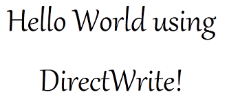
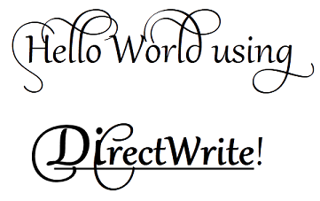

# Tutorial: Getting Started with DirectWrite

This document shows you how to use [DirectWrite](direct-write-portal.md) and [Direct2D](rendering-by-using-direct2d.md) to create simple text that contains a single format, and then text that contains multiple formats.

This tutorial contains the following parts:

-   [Source Code](#source-code)
-   [Drawing Simple Text](#drawing-simple-text)
    -   [Part 1: Declare DirectWrite and Direct2D Resources.](#part-1-declare-directwrite-and-direct2d-resources)
    -   [Part 2: Create Device Independent Resources.](#part-2-create-device-independent-resources)
    -   [Part 3: Create Device-Dependent Resources.](#part-3-create-device-dependent-resources)
    -   [Part 4: Draw Text By Using the Direct2D DrawText Method.](#part-4-draw-text-by-using-the-direct2d-drawtext-method)
    -   [Part 5: Render the Window Contents Using Direct2D](#part-5-render-the-window-contents-using-direct2d)
-   [Drawing Text with Multiple Formats.](#drawing-text-with-multiple-formats)
    -   [Part 1: Create an IDWriteTextLayout Interface.](#part-1-create-an-idwritetextlayout-interface)
    -   [Part 2: Applying Formatting with IDWriteTextLayout.](#part-2-applying-formatting-with-idwritetextlayout)
    -   [Part 3: Adding Typographic Features with IDWriteTypography.](#part-3-adding-typographic-features-with-idwritetypography)
    -   [Part 4: Draw Text Using the Direct2D DrawTextLayout Method.](#part-4-draw-text-using-the-direct2d-drawtextlayout-method)

## Source Code

The source code shown in this overview is taken from the [DirectWrite Hello World sample](/samples/browse/?redirectedfrom=MSDN-samples). Each part is implemented in a separate class (SimpleText and MultiformattedText) and is displayed in a separate child window. Each class represents a Microsoft Win32 window. In addition to the *WndProc* method, each class contains the following methods:


| Function                              | Description                                                                                         |
|---------------------------------------|-----------------------------------------------------------------------------------------------------|
| **CreateDeviceIndependentResources**  | Creates resources that are device independent, so they can be reused anywhere.                      |
| **DiscardDeviceIndependentResources** | Releases the device-independent resources after they are no longer needed.                          |
| **CreateDeviceResources**             | Creates resources, such as brushes and render targets, that are tied to a particular device.        |
| **DiscardDeviceResources**            | Releases the device-dependent resources after they are no longer needed.                            |
| **DrawD2DContent**                    | Uses [Direct2D](../direct2d/direct2d-portal.md) to render to the screen.                              |
| **DrawText**                          | Draws the text string by using [Direct2D](../direct2d/direct2d-portal.md).                            |
| **OnResize**                          | Resizes the [Direct2D](../direct2d/direct2d-portal.md) render target when the window size is changed. |


 

You can use the sample provided, or use the instructions that follow to add [DirectWrite](direct-write-portal.md) and [Direct2D](rendering-by-using-direct2d.md) to your own Win32 application. For more information about the sample and the associated project files, see the [DirectWriteHelloWorld sample](/samples/browse/?redirectedfrom=MSDN-samples).

## Drawing Simple Text

This section shows how to use [DirectWrite](direct-write-portal.md) and [Direct2D](../direct2d/direct2d-portal.md) to render simple text that has a single format, as shown in the following screen shot.



Drawing simple text to the screen requires four components:

-   A character string to render.
-   An instance of [**IDWriteTextFormat**](/windows/win32/api/dwrite/nn-dwrite-idwritetextformat).
-   The dimensions of the area to contain the text.
-   An object that can render the text. In this tutorial. you use a [Direct2D](../direct2d/direct2d-portal.md) render target.

The [**IDWriteTextFormat**](/windows/win32/api/dwrite/nn-dwrite-idwritetextformat) interface describes the font-family name, size, weight, style, and stretch used to format text, and it describes locale information. **IDWriteTextFormat** also defines methods for setting and getting the following properties:

-   The line spacing.
-   The text alignment relative to the left and right edges of the layout box.
-   The paragraph alignment relative to the top and bottom of the layout box.
-   The reading direction.
-   The text trimming granularity for text that overflows the layout box.
-   The incremental tab stop.
-   The paragraph flow direction.

The [**IDWriteTextFormat**](/windows/win32/api/dwrite/nn-dwrite-idwritetextformat) interface is required for drawing text that uses both of the processes described in this document .

Before you can create an [**IDWriteTextFormat**](/windows/win32/api/dwrite/nn-dwrite-idwritetextformat) object, or any other [DirectWrite](direct-write-portal.md) object, you need an [**IDWriteFactory**](/windows/win32/api/dwrite/nn-dwrite-idwritefactory) instance. You use an **IDWriteFactory** to create **IDWriteTextFormat** instances and other DirectWrite objects. To obtain a factory instance, use the [**DWriteCreateFactory**](/windows/win32/api/dwrite/nf-dwrite-dwritecreatefactory) function.

### Part 1: Declare DirectWrite and Direct2D Resources.

In this part, you declare the objects that you will use later for creating and displaying text as private data members of your class. All of the interfaces, functions, and datatypes for [DirectWrite](direct-write-portal.md) are declared in the *dwrite.h* header file, and those for [Direct2D](../direct2d/direct2d-portal.md) are declared in the *d2d1.h*; if you haven't already done this, include these headers in your project.

1.  In your class header file (SimpleText.h), declare pointers to [**IDWriteFactory**](/windows/win32/api/dwrite/nn-dwrite-idwritefactory) and [**IDWriteTextFormat**](/windows/win32/api/dwrite/nn-dwrite-idwritetextformat) interfaces as private members.
    ```C++
    IDWriteFactory* pDWriteFactory_;
    IDWriteTextFormat* pTextFormat_;
    
    ```

    

2.  Declare members to hold the text string to render and the length of the string.
    ```C++
    const wchar_t* wszText_;
    UINT32 cTextLength_;
    
    ```

    

3.  Declare pointers to [**ID2D1Factory**](/windows/win32/api/d2d1/nn-d2d1-id2d1factory), [**ID2D1HwndRenderTarget**](/windows/win32/api/d2d1/nn-d2d1-id2d1hwndrendertarget), and [**ID2D1SolidColorBrush**](/windows/win32/api/d2d1/nn-d2d1-id2d1solidcolorbrush) interfaces for rendering the text with [Direct2D](../direct2d/direct2d-portal.md).
    ```C++
    ID2D1Factory* pD2DFactory_;
    ID2D1HwndRenderTarget* pRT_;
    ID2D1SolidColorBrush* pBlackBrush_;
    
    ```

    

### Part 2: Create Device Independent Resources.

[Direct2D](rendering-by-using-direct2d.md) provides two types of resources: device-dependent resources and device-independent resources. Device-dependent resources are associated with a rendering device and no longer function if that device is removed. Device-independent resources, on the other hand, can last for the scope of your application.

[DirectWrite](direct-write-portal.md) resources are device-independent.

In this section, you create the device-independent resources that are used by your application. These resources must be freed with a call to the **Release** method of the interface.

Some of the resources that are used have to be created only one time and are not tied to a device. The initialization for these resources is put in the *SimpleText::CreateDeviceIndependentResources* method, which is called when initializing the class.

1.  Inside the *SimpleText::CreateDeviceIndependentResources* method in the class implementation file (SimpleText.cpp), call the [**D2D1CreateFactory**](/windows/win32/api/d2d1/nf-d2d1-d2d1createfactory) function to create an [**ID2D1Factory**](/windows/win32/api/d2d1/nn-d2d1-id2d1factory) interface, which is the root factory interface for all [Direct2D](../direct2d/direct2d-portal.md) objects. You use the same factory to instantiate other Direct2D resources.
    ```C++
    hr = D2D1CreateFactory(
        D2D1_FACTORY_TYPE_SINGLE_THREADED,
        &pD2DFactory_
        );
    
    ```

    

2.  Call the [**DWriteCreateFactory**](/windows/win32/api/dwrite/nf-dwrite-dwritecreatefactory) function to create an [**IDWriteFactory**](/windows/win32/api/dwrite/nn-dwrite-idwritefactory) interface, which is the root factory interface for all [DirectWrite](direct-write-portal.md) objects. You use the same factory to instantiate other DirectWrite resources.
    ```C++
    if (SUCCEEDED(hr))
    {
        hr = DWriteCreateFactory(
            DWRITE_FACTORY_TYPE_SHARED,
            __uuidof(IDWriteFactory),
            reinterpret_cast<IUnknown**>(&pDWriteFactory_)
            );
    }
    
    ```

    

3.  Initialize the text string and store its length.

    ```C++
    wszText_ = L"Hello World using  DirectWrite!";
    cTextLength_ = (UINT32) wcslen(wszText_);
    
    ```

    

4.  Create an [**IDWriteTextFormat**](/windows/win32/api/dwrite/nn-dwrite-idwritetextformat) interface object by using the [**IDWriteFactory::CreateTextFormat**](/windows/win32/api/dwrite/nf-dwrite-idwritefactory-createtextformat) method. The **IDWriteTextFormat** specifies the font, weight, stretch, style, and locale that will be used to render the text string.
    ```C++
    if (SUCCEEDED(hr))
    {
        hr = pDWriteFactory_->CreateTextFormat(
            L"Gabriola",                // Font family name.
            NULL,                       // Font collection (NULL sets it to use the system font collection).
            DWRITE_FONT_WEIGHT_REGULAR,
            DWRITE_FONT_STYLE_NORMAL,
            DWRITE_FONT_STRETCH_NORMAL,
            72.0f,
            L"en-us",
            &pTextFormat_
            );
    }
    
    ```

    

5.  Center the text horizontally and vertically by calling the [**IDWriteTextFormat::SetTextAlignment**](/windows/win32/api/dwrite/nf-dwrite-idwritetextformat-settextalignment) and [**IDWriteTextFormat::SetParagraphAlignment**](/windows/win32/api/dwrite/nf-dwrite-idwritetextformat-setparagraphalignment) methods.
    ```C++
    // Center align (horizontally) the text.
    if (SUCCEEDED(hr))
    {
        hr = pTextFormat_->SetTextAlignment(DWRITE_TEXT_ALIGNMENT_CENTER);
    }

    if (SUCCEEDED(hr))
    {
        hr = pTextFormat_->SetParagraphAlignment(DWRITE_PARAGRAPH_ALIGNMENT_CENTER);
    }
    
    ```

    

In this part, you initialized the device-independent resources that are used by your application. In the next part, you initialize the device-dependent resources.

### Part 3: Create Device-Dependent Resources.

In this part, you create an [**ID2D1HwndRenderTarget**](/windows/win32/api/d2d1/nn-d2d1-id2d1hwndrendertarget) and an [**ID2D1SolidColorBrush**](/windows/win32/api/d2d1/nn-d2d1-id2d1solidcolorbrush) for rendering your text.

A render target is a Direct2D object that creates drawing resources and renders drawing commands to a rendering device. An [**ID2D1HwndRenderTarget**](/windows/win32/api/d2d1/nn-d2d1-id2d1hwndrendertarget) is a render target that renders to an **HWND**.

One of the drawing resources that a render target can create is a brush for painting outlines, fills, and text. An [**ID2D1SolidColorBrush**](/windows/win32/api/d2d1/nn-d2d1-id2d1solidcolorbrush) paints with a solid color.

Both the [**ID2D1HwndRenderTarget**](/windows/win32/api/d2d1/nn-d2d1-id2d1hwndrendertarget) and the [**ID2D1SolidColorBrush**](/windows/win32/api/d2d1/nn-d2d1-id2d1solidcolorbrush) interfaces are bound to a rendering device when they are created and must be released and recreated if the device becomes invalid.

1.  Inside the SimpleText::CreateDeviceResources method, check whether the render target pointer is **NULL**. If it is, retrieve the size of the render area and create an [**ID2D1HwndRenderTarget**](/windows/win32/api/d2d1/nn-d2d1-id2d1hwndrendertarget) of that size. Use the **ID2D1HwndRenderTarget** to create an [**ID2D1SolidColorBrush**](/windows/win32/api/d2d1/nn-d2d1-id2d1solidcolorbrush).
    ```C++
    RECT rc;
    GetClientRect(hwnd_, &rc);

    D2D1_SIZE_U size = D2D1::SizeU(rc.right - rc.left, rc.bottom - rc.top);

    if (!pRT_)
    {
        // Create a Direct2D render target.
        hr = pD2DFactory_->CreateHwndRenderTarget(
                D2D1::RenderTargetProperties(),
                D2D1::HwndRenderTargetProperties(
                    hwnd_,
                    size
                    ),
                &pRT_
                );

        // Create a black brush.
        if (SUCCEEDED(hr))
        {
            hr = pRT_->CreateSolidColorBrush(
                D2D1::ColorF(D2D1::ColorF::Black),
                &pBlackBrush_
                );
        }
    }
    
    ```

    

2.  In the SimpleText::DiscardDeviceResources method, release both the brush and render target.
    ```C++
    SafeRelease(&pRT_);
    SafeRelease(&pBlackBrush_);
    
    ```

    

Now that you have created a render target and a brush, you can use them to render your text.

### Part 4: Draw Text By Using the Direct2D DrawText Method.

1.  In the SimpleText::DrawText method of your class, define the area for the text layout by retrieving the dimensions of the rendering area, and create a [Direct2D](../direct2d/direct2d-portal.md) rectangle that has the same dimensions.
    ```C++
    D2D1_RECT_F layoutRect = D2D1::RectF(
        static_cast<FLOAT>(rc.left) / dpiScaleX_,
        static_cast<FLOAT>(rc.top) / dpiScaleY_,
        static_cast<FLOAT>(rc.right - rc.left) / dpiScaleX_,
        static_cast<FLOAT>(rc.bottom - rc.top) / dpiScaleY_
        );
    
    ```

    

2.  Use the [**ID2D1RenderTarget::DrawText**](/windows/win32/api/d2d1/nf-d2d1-id2d1rendertarget-drawtext(constwchar_uint32_idwritetextformat_constd2d1_rect_f__id2d1brush_d2d1_draw_text_options_dwrite_measuring_mode)) method and the [**IDWriteTextFormat**](/windows/win32/api/dwrite/nn-dwrite-idwritetextformat) object to render text to the screen. The **ID2D1RenderTarget::DrawText** method takes the following parameters:
    -   A string to render.
    -   A pointer to an [**IDWriteTextFormat**](/windows/win32/api/dwrite/nn-dwrite-idwritetextformat) interface.
    -   A [Direct2D](../direct2d/direct2d-portal.md) layout rectangle.
    -   A pointer to an interface that exposes [**ID2D1Brush**](/windows/win32/api/d2d1/nn-d2d1-id2d1brush).

    ```C++
    pRT_->DrawText(
        wszText_,        // The string to render.
        cTextLength_,    // The string's length.
        pTextFormat_,    // The text format.
        layoutRect,       // The region of the window where the text will be rendered.
        pBlackBrush_     // The brush used to draw the text.
        );
    
    ```

    

### Part 5: Render the Window Contents Using Direct2D

To render the contents of the window by using [Direct2D](../direct2d/direct2d-portal.md) when a paint message is received, do the following:

1.  Create the device dependent resources by calling the SimpleText::CreateDeviceResources method implemented in Part 3.
2.  Call the [**ID2D1HwndRenderTarget::BeginDraw**](/windows/win32/api/d2d1/nf-d2d1-id2d1rendertarget-begindraw) method of the render target.
3.  Clear the render target by calling the [**ID2D1HwndRenderTarget::Clear**](/windows/win32/api/d2d1/nf-d2d1-id2d1rendertarget-clear(constd2d1_color_f)) method.
4.  Call the SimpleText::DrawText method, implemented in Part 4.
5.  Call the [**ID2D1HwndRenderTarget::EndDraw**](/windows/win32/api/d2d1/nf-d2d1-id2d1rendertarget-enddraw) method of the render target.
6.  If it is necessary, discard the device-dependent resources so that they can be recreated when the window is redrawn.


```C++
hr = CreateDeviceResources();

if (SUCCEEDED(hr))
{
    pRT_->BeginDraw();

    pRT_->SetTransform(D2D1::IdentityMatrix());

    pRT_->Clear(D2D1::ColorF(D2D1::ColorF::White));

    // Call the DrawText method of this class.
    hr = DrawText();

    if (SUCCEEDED(hr))
    {
        hr = pRT_->EndDraw(
            );
    }
}

if (FAILED(hr))
{
    DiscardDeviceResources();
}

```


The SimpleText class is implemented in SimpleText.h and SimpleText.cpp.

## Drawing Text with Multiple Formats.

This section shows how to use [DirectWrite](direct-write-portal.md) and [Direct2D](../direct2d/direct2d-portal.md) to render text with multiple formats, as shown in the following screen shot.



The code for this section is implemented as the MultiformattedText class in the [DWriteHelloWorld Sample](/samples/browse/?redirectedfrom=MSDN-samples). It is based on the steps from the previous section.

To create multi-formatted text, you use the [**IDWriteTextLayout**](/windows/win32/api/dwrite/nn-dwrite-idwritetextlayout) interface in addition to the [**IDWriteTextFormat**](/windows/win32/api/dwrite/nn-dwrite-idwritetextformat) interface introduced in the previous section. The **IDWriteTextLayout** interface describes the formatting and layout of a block of text. In addition to default formatting specified by an **IDWriteTextFormat** object, the formatting for specific ranges of text can be changed by using **IDWriteTextLayout**. This includes font family name, size, weight, style, stretch, strikethrough, and underlining.

[**IDWriteTextLayout**](/windows/win32/api/dwrite/nn-dwrite-idwritetextlayout) also provides hit-testing methods. The hit-testing metrics returned by these methods are relative to the layout box specified when the **IDWriteTextLayout** interface object is created by using the [**CreateTextLayout**](/windows/win32/api/dwrite/nf-dwrite-idwritefactory-createtextlayout) method of the [**IDWriteFactory**](/windows/win32/api/dwrite/nn-dwrite-idwritefactory) interface.

The [**IDWriteTypography**](/windows/win32/api/dwrite/nn-dwrite-idwritetypography) interface is used to add optional [OpenType](../intl/opentype-font-format.md) typographic features to a text layout, such as swashes and alternative stylistic text sets. Typographic features can be added to a specific range of text within a text layout by calling the [**AddFontFeature**](/windows/win32/api/dwrite/nf-dwrite-idwritetypography-addfontfeature) method of the **IDWriteTypography** interface. This method receives a [**DWRITE\_FONT\_FEATURE**](/windows/win32/api/dwrite/ne-dwrite-dwrite_font_feature_tag) structure as a parameter that contains a **DWRITE\_FONT\_FEATURE\_TAG** enumeration constant and a **UINT32** execution parameter. A list of registered OpenType features can be found at the [OpenType Layout Tag Registry](https://www.microsoft.com/typography/otspec/features_ae.htm) on microsoft.com. For the equivalent DirectWrite enumeration constants, see **DWRITE\_FONT\_FEATURE\_TAG**.

### Part 1: Create an IDWriteTextLayout Interface.

1.  Declare a pointer to an [**IDWriteTextLayout**](/windows/win32/api/dwrite/nn-dwrite-idwritetextlayout) interface as a member of the MultiformattedText class.
    ```C++
    IDWriteTextLayout* pTextLayout_;
    
    ```

    

2.  At the end of the MultiformattedText::CreateDeviceIndependentResources method, create an [**IDWriteTextLayout**](/windows/win32/api/dwrite/nn-dwrite-idwritetextlayout) interface object by calling the [**CreateTextLayout**](/windows/win32/api/dwrite/nf-dwrite-idwritefactory-createtextlayout) method. The **IDWriteTextLayout** interface provides additional formatting features, such as the ability to apply different formats to selected portions of text.
    ```C++
    // Create a text layout using the text format.
    if (SUCCEEDED(hr))
    {
        RECT rect;
        GetClientRect(hwnd_, &rect); 
        float width  = rect.right  / dpiScaleX_;
        float height = rect.bottom / dpiScaleY_;

        hr = pDWriteFactory_->CreateTextLayout(
            wszText_,      // The string to be laid out and formatted.
            cTextLength_,  // The length of the string.
            pTextFormat_,  // The text format to apply to the string (contains font information, etc).
            width,         // The width of the layout box.
            height,        // The height of the layout box.
            &pTextLayout_  // The IDWriteTextLayout interface pointer.
            );
    }
    
    ```

    

### Part 2: Applying Formatting with IDWriteTextLayout.

Formatting, such as the font size, weight, and underlining, can be applied to substrings of the text to be displayed by using the [**IDWriteTextLayout**](/windows/win32/api/dwrite/nn-dwrite-idwritetextlayout) interface.

1.  Set the font size for the substring "Di" of "DirectWrite" to 100 by declaring a [**DWRITE\_TEXT\_RANGE**](/windows/win32/api/dwrite/ns-dwrite-dwrite_text_range) and calling the [**IDWriteTextLayout::SetFontSize**](/windows/win32/api/dwrite/nf-dwrite-idwritetextlayout-setfontsize) method.
    ```C++
    // Format the "DirectWrite" substring to be of font size 100.
    if (SUCCEEDED(hr))
    {
        DWRITE_TEXT_RANGE textRange = {20,        // Start index where "DirectWrite" appears.
                                        6 };      // Length of the substring "Direct" in "DirectWrite".
        hr = pTextLayout_->SetFontSize(100.0f, textRange);
    }
    ```

    

2.  Underline the substring "DirectWrite" by calling the [**IDWriteTextLayout::SetUnderline**](/windows/win32/api/dwrite/nf-dwrite-idwritetextlayout-setunderline) method.
    ```C++
    // Format the word "DWrite" to be underlined.
    if (SUCCEEDED(hr))
    {
        
        DWRITE_TEXT_RANGE textRange = {20,      // Start index where "DirectWrite" appears.
                                       11 };    // Length of the substring "DirectWrite".
        hr = pTextLayout_->SetUnderline(TRUE, textRange);
    }
    ```

    

3.  Set the font weight to bold for the substring "DirectWrite" by calling the [**IDWriteTextLayout::SetFontWeight**](/windows/win32/api/dwrite/nf-dwrite-idwritetextlayout-setfontweight) method.
    ```C++
    if (SUCCEEDED(hr))
    {
        // Format the word "DWrite" to be bold.
        DWRITE_TEXT_RANGE textRange = {20,
                                       11 };
        hr = pTextLayout_->SetFontWeight(DWRITE_FONT_WEIGHT_BOLD, textRange);
    }
    ```

    

### Part 3: Adding Typographic Features with IDWriteTypography.

1.  Declare and create an [**IDWriteTypography**](/windows/win32/api/dwrite/nn-dwrite-idwritetypography) interface object by calling the [**IDWriteFactory::CreateTypography**](/windows/win32/api/dwrite/nf-dwrite-idwritefactory-createtypography) method.
    ```C++
    // Declare a typography pointer.
    IDWriteTypography* pTypography = NULL;

    // Create a typography interface object.
    if (SUCCEEDED(hr))
    {
        hr = pDWriteFactory_->CreateTypography(&pTypography);
    }
    
    ```

    

2.  Add a font feature by declaring a [**DWRITE\_FONT\_FEATURE**](/windows/win32/api/dwrite/ns-dwrite-dwrite_font_feature) object that has the stylistic set 7 specified and calling the [**IDWriteTypography::AddFontFeature**](/windows/win32/api/dwrite/nf-dwrite-idwritetypography-addfontfeature) method.
    ```C++
    // Set the stylistic set.
    DWRITE_FONT_FEATURE fontFeature = {DWRITE_FONT_FEATURE_TAG_STYLISTIC_SET_7,
                                       1};
    if (SUCCEEDED(hr))
    {
        hr = pTypography->AddFontFeature(fontFeature);
    }
    
    ```

    

3.  Set the text layout to use the typography over the whole string by declaring a [**DWRITE\_TEXT\_RANGE**](/windows/win32/api/dwrite/ns-dwrite-dwrite_text_range) variable and calling the [**IDWriteTextLayout::SetTypography**](/windows/win32/api/dwrite/nf-dwrite-idwritetextlayout-settypography) method and passing in the text range.
    ```C++
    if (SUCCEEDED(hr))
    {
        // Set the typography for the entire string.
        DWRITE_TEXT_RANGE textRange = {0,
                                       cTextLength_};
        hr = pTextLayout_->SetTypography(pTypography, textRange);
    }
    
    ```

    

4.  Set the new width and height for the text layout object in the MultiformattedText::OnResize method.
    ```C++
    if (pTextLayout_)
    {
        pTextLayout_->SetMaxWidth(static_cast<FLOAT>(width / dpiScaleX_));
        pTextLayout_->SetMaxHeight(static_cast<FLOAT>(height / dpiScaleY_));
    }
    ```

    

### Part 4: Draw Text Using the Direct2D DrawTextLayout Method.

To draw the text with the text layout settings specified by the [**IDWriteTextLayout**](/windows/win32/api/dwrite/nn-dwrite-idwritetextlayout) object, change the code in the MultiformattedText::DrawText method to use [**IDWriteTextLayout::DrawTextLayout**](/windows/win32/api/d2d1/nf-d2d1-id2d1rendertarget-drawtextlayout).

1.  Delcare a [**D2D1\_POINT\_2F**](../direct2d/d2d1-point-2f.md) variable and set it to the upper-left point of the window.
    ```C++
    D2D1_POINT_2F origin = D2D1::Point2F(
        static_cast<FLOAT>(rc.left / dpiScaleX_),
        static_cast<FLOAT>(rc.top / dpiScaleY_)
        );
    
    ```

    

2.  Draw the text to the screen by calling the [**ID2D1RenderTarget::DrawTextLayout**](/windows/win32/api/d2d1/nf-d2d1-id2d1rendertarget-drawtextlayout) method of the [Direct2D](../direct2d/direct2d-portal.md) render target and passing the [**IDWriteTextLayout**](/windows/win32/api/dwrite/nn-dwrite-idwritetextlayout) pointer.
    ```C++
    pRT_->DrawTextLayout(
        origin,
        pTextLayout_,
        pBlackBrush_
        );
    
    ```

    

The MultiformattedText class is implemented in MultiformattedText.h and MultiformattedText.cpp.

 

 