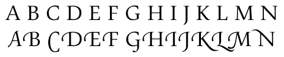
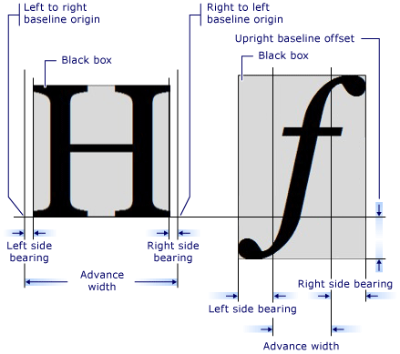

# Glyphs and Glyph Runs

Glyphs and glyph runs are available at the lowest layer of functionality of the [DirectWrite](direct-write-portal.md) API, the glyph-rendering layer.

## Glyphs

A glyph is a physical representation of a character in a given font. Characters might have many glyphs, with each font on a system potentially defining a different glyph for that character.

Two or more glyphs can also be combined into a single glyph, this process is called glyph composition. This can also be done in the opposite direction, a single glyph being split into multiple glyphs, known as glyph decomposition.

### Alternate Glyphs

Fonts may provide alternate glyphs for characters, such as the stylistic alternate glyphs for the Pericles OpenType font, as shown in the following screen shot. The 'A', 'E', and 'O' characters are rendered with stylistic alternate glyphs.

Another example of alternate glyphs are swash glyphs. The following screen shot shows standard and swash glyphs for the Pescadero font.

Swashes and other typographic features, including more elaborate alternate glyphs, are available through [OpenType](../intl/opentype-font-format.md). OpenType typographic features can be applied to a text range by using the [**IDWriteTextLayout::SetTypography**](/windows/win32/api/dwrite/nf-dwrite-idwritetextlayout-settypography) and passing the [**DWRITE\_FONT\_FEATURE\_TAG**](/windows/win32/api/dwrite/ne-dwrite-dwrite_font_feature_tag) enumeration constant associated with the desired feature.

## Glyph Runs

A glyph run represents a contiguous set of glyphs that all have the same font face and size, as well as the same client drawing effect, if any. Underline and strikethrough are not part of the glyph run for the text range they are applied to, and are drawn later. Inline objects, such as images, are also drawn separately, as they are not part of a font.

### The IDWriteFontFace Interface

[DirectWrite](direct-write-portal.md) uses the same system for font classification as Windows Pesentation Foundation (WPF), so there can be multiple physical fonts per each font family. A font face, such as the [**IDWriteFontFace**](/windows/win32/api/dwrite/nn-dwrite-idwritefontface) interface in DirectWrite, represents a physical font, with a specific weight, slant, and stretch. It contains the font face type, appropriate file references, face identification data and various font data such as metrics, names and glyph outlines.

The [**IDWriteFontFace**](/windows/win32/api/dwrite/nn-dwrite-idwritefontface) can be created directly from a font name or obtained from a font collection.

### Glyph Metrics

Individual glyphs have metrics associated with them. You can obtain the metrics for all of the glyphs in a glyph run by using the [**IDWriteFontFace::GetDesignGlyphMetrics**](/windows/win32/api/dwrite/nf-dwrite-idwritefontface-getdesignglyphmetrics) method. This returns a [**DWRITE\_GLYPH\_METRICS**](/windows/win32/api/dwrite/ns-dwrite-dwrite_glyph_metrics) structure that has the advance width, the left and right side bearing, the top and bottom side bearing, the height and the vertical baseline origin.

The following diagram shows various metrics of two different glyph characters.

## Drawing a Glyph Run

When implementing a custom text renderer, the rendering of glyphs is handled by the [**IDWriteTextRenderer::DrawGlyphRun**](/windows/win32/api/dwrite/nf-dwrite-idwritetextrenderer-drawglyphrun), a callback method that you implement as part of a class derived from [**IDWriteTextRenderer**](/windows/win32/api/dwrite/nn-dwrite-idwritetextrenderer). The [**DWRITE\_GLYPH\_RUN**](/windows/win32/api/dwrite/ns-dwrite-dwrite_glyph_run) structure that is passed to [**DrawGlyphRun**](/windows/win32/api/dwrite/nf-dwrite-idwritebitmaprendertarget-drawglyphrun) contains a [**IDWriteFontFace**](/windows/win32/api/dwrite/nn-dwrite-idwritefontface) object, named *fontFace*, that represents the font face for the entire glyph run.

The [**IDWriteFontFace**](/windows/win32/api/dwrite/nn-dwrite-idwritefontface) object also provides the [**GetGlyphRunOutline**](/windows/win32/api/dwrite/nf-dwrite-idwritefontface-getglyphrunoutline) method, which computes the glyph outlines by using a specified geometry sink callback, such as [**ID2D1SimplifiedGeometrySink**](/windows/win32/api/d2d1/nn-d2d1-id2d1simplifiedgeometrysink) when rendering with [Direct2D](../direct2d/direct2d-portal.md).

For more information, see the [How to Implement a Custom Text Renderer](how-to-implement-a-custom-text-renderer.md) topic.

 

 