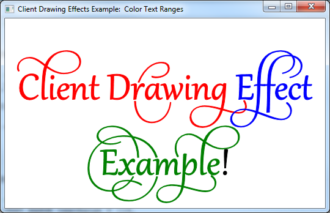

# How to Add Client Drawing Effects to a Text Layout

Provides a short tutorial on adding client drawing effects to a [DirectWrite](direct-write-portal.md) application that displays text using the [**IDWriteTextLayout**](/windows/win32/api/dwrite/nn-dwrite-idwritetextlayout) interface and a custom text renderer.

The end product of this tutorial is an application that displays text that has ranges of text with a different color drawing effect on each, as shown in the following screen shot.



> [!Note]  
> This tutorial is meant to be a simplified example of how to create custom client drawing effects, not an example of a simple method for drawing color text. See the [**IDWriteTextLayout::SetDrawingEffect**](/windows/win32/api/dwrite/nf-dwrite-idwritetextlayout-setdrawingeffect) reference page for more information.

 

This tutorial contains the following parts:

-   [Step 1: Create a Text Layout](#step-1-create-a-text-layout)
-   [Step 2: Implement a Custom Drawing Effect Class](#step-2-implement-a-custom-drawing-effect-class)
-   [Step 3: Implement a Custom Text Renderer Class](#step-3-implement-a-custom-text-renderer-class)
    -   [The Constructor](#the-constructor)
    -   [The DrawGlyphRun Method](#the-drawglyphrun-method)
    -   [The Destructor](#the-destructor)
-   [Step 4: Create the Text Renderer](#step-4-create-the-text-renderer)
-   [Step 5: Instantiate the Color Drawing Effect Objects](#step-5-instantiate-the-color-drawing-effect-objects)
-   [Step 6: Set the Drawing Effect for Specific Text Ranges](#step-6-set-the-drawing-effect-for-specific-text-ranges)
-   [Step 7: Draw the Text Layout Using the Custom Renderer](#step-7-draw-the-text-layout-using-the-custom-renderer)
-   [Step 8: Clean up](#step-8-clean-up)

## Step 1: Create a Text Layout

To begin, you will need an application with an [**IDWriteTextLayout**](/windows/win32/api/dwrite/nn-dwrite-idwritetextlayout) object. If you already have an application that displays text with a text layout, or you are using the Custom DrawingEffect Example Code, skip to Step 2.

To add a text layout you must do the following:

1.  Declare a pointer to an [**IDWriteTextLayout**](/windows/win32/api/dwrite/nn-dwrite-idwritetextlayout) interface as a member of the class.
    ```C++
    IDWriteTextLayout* pTextLayout_;
    
    ```

    

2.  At the end of the **CreateDeviceIndependentResources** method, create an [**IDWriteTextLayout**](/windows/win32/api/dwrite/nn-dwrite-idwritetextlayout) interface object by calling the [**CreateTextLayout**](/windows/win32/api/dwrite/nf-dwrite-idwritefactory-createtextlayout) method.
    ```C++
    // Create a text layout using the text format.
    if (SUCCEEDED(hr))
    {
        RECT rect;
        GetClientRect(hwnd_, &rect); 
        float width  = rect.right  / dpiScaleX_;
        float height = rect.bottom / dpiScaleY_;

        hr = pDWriteFactory_->CreateTextLayout(
            wszText_,      // The string to be laid out and formatted.
            cTextLength_,  // The length of the string.
            pTextFormat_,  // The text format to apply to the string (contains font information, etc).
            width,         // The width of the layout box.
            height,        // The height of the layout box.
            &pTextLayout_  // The IDWriteTextLayout interface pointer.
            );
    }
    
    ```

    

3.  Finally, remember to release the text layout in the destructor.
    ```C++
    SafeRelease(&pTextLayout_);
    ```

    

## Step 2: Implement a Custom Drawing Effect Class

Other than the methods inherited from IUnknown, a custom client drawing effect interface has no requirements as to what it must implement. In this case, the **ColorDrawingEffect** class simply holds a [**D2D1\_COLOR\_F**](../direct2d/d2d1-color-f.md) value and declares methods to get and set this value, as well as a constructor that can set the color initially.

After a client drawing effect is applied to a text range in a [**IDWriteTextLayout**](/windows/win32/api/dwrite/nn-dwrite-idwritetextlayout) object, the drawing effect is passed to the [**IDWriteTextRenderer::DrawGlyphRun**](/windows/win32/api/dwrite/nf-dwrite-idwritetextrenderer-drawglyphrun) method of any glyph run that is to be rendered. The methods of the drawing effect are then available to the text renderer.

A client drawing effect can be as complex as you want to make it, carrying more information than in this example, as well as providing methods to alter glyphs, create objects to be used for drawing, and so on.

## Step 3: Implement a Custom Text Renderer Class

In order to take advantage of a client drawing effect, you must implement a custom text renderer. This text renderer will apply the drawing effect passed to it by the [**IDWriteTextLayout::Draw**](/windows/win32/api/dwrite/nf-dwrite-idwritetextlayout-draw) method to the glyph run being drawn.

### The Constructor

The constructor for the custom text renderer stores the [**ID2D1Factory**](/windows/win32/api/d2d1/nn-d2d1-id2d1factory) object that will be used to create [Direct2D](../direct2d/direct2d-portal.md) objects, and the Direct2D render target that the text will be drawn on to.


```C++
CustomTextRenderer::CustomTextRenderer(
    ID2D1Factory* pD2DFactory, 
    ID2D1HwndRenderTarget* pRT
    )
:
cRefCount_(0), 
pD2DFactory_(pD2DFactory), 
pRT_(pRT)
{
    pD2DFactory_->AddRef();
    pRT_->AddRef();
}
```


### The DrawGlyphRun Method

A glyph run is a set of glyphs that share the same format, including the client drawing effect. The [**DrawGlyphRun**](/windows/win32/api/dwrite/nf-dwrite-idwritetextrenderer-drawglyphrun) method takes care of the text rendering for a specified glyph run.

First, create an [**ID2D1PathGeometry**](/windows/win32/api/d2d1/nn-d2d1-id2d1pathgeometry) and an [**ID2D1GeometrySink**](/windows/win32/api/d2d1/nn-d2d1-id2d1geometrysink), and then retrieve the glyph run outline by using [**IDWriteFontFace::GetGlyphRunOutline**](/windows/win32/api/dwrite/nf-dwrite-idwritefontface-getglyphrunoutline). Then transform the origin of the geometry by using the [Direct2D](../direct2d/direct2d-portal.md) [**ID2D1Factory::CreateTransformedGeometry**](../direct2d/id2d1factory-createtransformedgeometry.md) method, as shown in the following code.


```C++
HRESULT hr = S_OK;

// Create the path geometry.
ID2D1PathGeometry* pPathGeometry = NULL;
hr = pD2DFactory_->CreatePathGeometry(
        &pPathGeometry
        );

// Write to the path geometry using the geometry sink.
ID2D1GeometrySink* pSink = NULL;
if (SUCCEEDED(hr))
{
    hr = pPathGeometry->Open(
        &pSink
        );
}

// Get the glyph run outline geometries back from DirectWrite and place them within the
// geometry sink.
if (SUCCEEDED(hr))
{
    hr = glyphRun->fontFace->GetGlyphRunOutline(
        glyphRun->fontEmSize,
        glyphRun->glyphIndices,
        glyphRun->glyphAdvances,
        glyphRun->glyphOffsets,
        glyphRun->glyphCount,
        glyphRun->isSideways,
        glyphRun->bidiLevel%2,
        pSink
        );
}

// Close the geometry sink
if (SUCCEEDED(hr))
{
    hr = pSink->Close();
}

// Initialize a matrix to translate the origin of the glyph run.
D2D1::Matrix3x2F const matrix = D2D1::Matrix3x2F(
    1.0f, 0.0f,
    0.0f, 1.0f,
    baselineOriginX, baselineOriginY
    );

// Create the transformed geometry
ID2D1TransformedGeometry* pTransformedGeometry = NULL;
if (SUCCEEDED(hr))
{
    hr = pD2DFactory_->CreateTransformedGeometry(
        pPathGeometry,
        &matrix,
        &pTransformedGeometry
        );
}
```


Next, declare a [Direct2D](../direct2d/direct2d-portal.md) solid brush object.


```C++
ID2D1SolidColorBrush* pBrush = NULL;
```


If the *clientDrawingEffect* parameter is not NULL, query the object for the **ColorDrawingEffect** interface. This will work because you will set this class as the client drawing effect on text ranges of the text layout object.

Once you have a pointer to the **ColorDrawingEffect** interface, you can retrieve the [**D2D1\_COLOR\_F**](../direct2d/d2d1-color-f.md) value that it stores using the **GetColor** method. Then, use the **D2D1\_COLOR\_F** to create a [**ID2D1SolidColorBrush**](/windows/win32/api/d2d1/nn-d2d1-id2d1solidcolorbrush) in that color.

If the *clientDrawingEffect* parameter is **NULL**, then just create a black [**ID2D1SolidColorBrush**](/windows/win32/api/d2d1/nn-d2d1-id2d1solidcolorbrush).


```C++
// If there is a drawing effect create a color brush using it, otherwise create a black brush.
if (clientDrawingEffect != NULL)
{
    // Go from IUnknown to ColorDrawingEffect.
    ColorDrawingEffect *colorDrawingEffect;

    clientDrawingEffect->QueryInterface(__uuidof(ColorDrawingEffect), reinterpret_cast<void**>(&colorDrawingEffect));

    // Get the color from the ColorDrawingEffect object.
    D2D1_COLOR_F color;

    colorDrawingEffect->GetColor(&color);

    // Create the brush using the color pecified by our ColorDrawingEffect object.
    if (SUCCEEDED(hr))
    {
        hr = pRT_->CreateSolidColorBrush(
            color,
            &pBrush);
    }

    SafeRelease(&colorDrawingEffect);
}
else
{
    // Create a black brush.
    if (SUCCEEDED(hr))
    {
        hr = pRT_->CreateSolidColorBrush(
            D2D1::ColorF(
            D2D1::ColorF::Black
            ),
            &pBrush);
    }
}
```


Finally, draw the outline geometry and fill it using the solid color brush that you just created.


```C++
if (SUCCEEDED(hr))
{
    // Draw the outline of the glyph run
    pRT_->DrawGeometry(
        pTransformedGeometry,
        pBrush
        );

    // Fill in the glyph run
    pRT_->FillGeometry(
        pTransformedGeometry,
        pBrush
        );
}
```


### The Destructor

Don't forget to release the [Direct2D](../direct2d/direct2d-portal.md) factory and render target in the destructor.


```C++
CustomTextRenderer::~CustomTextRenderer()
{
    SafeRelease(&pD2DFactory_);
    SafeRelease(&pRT_);
}
```


## Step 4: Create the Text Renderer

In the **CreateDeviceDependent** resources, create the custom text renderer object. It is device dependent because it uses the **ID2D1RenderTarget**, which is itself device dependent.


```C++
// Create the text renderer
pTextRenderer_ = new CustomTextRenderer(
                        pD2DFactory_,
                        pRT_
                        );
```


## Step 5: Instantiate the Color Drawing Effect Objects

Instantiate **ColorDrawingEffect** objects in red, green, and blue.


```C++
// Instantiate some custom color drawing effects.
redDrawingEffect_ = new ColorDrawingEffect(
    D2D1::ColorF(
        D2D1::ColorF::Red
        )
    );

blueDrawingEffect_ = new ColorDrawingEffect(
    D2D1::ColorF(
        D2D1::ColorF::Blue
        )
    );

greenDrawingEffect_ = new ColorDrawingEffect(
    D2D1::ColorF(
        D2D1::ColorF::Green
        )
    );
```


## Step 6: Set the Drawing Effect for Specific Text Ranges

Set the drawing effect for specific ranges of text by using the [**IDWriteTextLayou::SetDrawingEffect**](/windows/win32/api/dwrite/nf-dwrite-idwritetextlayout-setdrawingeffect) method and a [**DWRITE\_TEXT\_RANGE**](/windows/win32/api/dwrite/ns-dwrite-dwrite_text_range) struct.


```C++
// Set the drawing effects.

// Red.
if (SUCCEEDED(hr))
{
    // Set the drawing effect for the specified range.
    DWRITE_TEXT_RANGE textRange = {0,
                                   14};
    if (SUCCEEDED(hr))
    {
        hr = pTextLayout_->SetDrawingEffect(redDrawingEffect_, textRange);
    }
}

// Blue.
if (SUCCEEDED(hr))
{
    // Set the drawing effect for the specified range.
    DWRITE_TEXT_RANGE textRange = {14,
                                   7};
    if (SUCCEEDED(hr))
    {
        hr = pTextLayout_->SetDrawingEffect(blueDrawingEffect_, textRange);
    }
}

// Green.
if (SUCCEEDED(hr))
{
    // Set the drawing effect for the specified range.
    DWRITE_TEXT_RANGE textRange = {21,
                                   8};
    if (SUCCEEDED(hr))
    {
        hr = pTextLayout_->SetDrawingEffect(greenDrawingEffect_, textRange);
    }
}
```


## Step 7: Draw the Text Layout Using the Custom Renderer

You must call the [**IDWriteTextLayout::Draw**](/windows/win32/api/dwrite/nf-dwrite-idwritetextlayout-draw) method rather than the [**ID2D1RenderTarget::DrawText**](/windows/win32/api/d2d1/nf-d2d1-id2d1rendertarget-drawtext(constwchar_uint32_idwritetextformat_constd2d1_rect_f__id2d1brush_d2d1_draw_text_options_dwrite_measuring_mode)) or [**ID2D1RenderTarget::DrawTextLayout**](/windows/win32/api/d2d1/nf-d2d1-id2d1rendertarget-drawtextlayout) methods.


```C++
// Draw the text layout using DirectWrite and the CustomTextRenderer class.
hr = pTextLayout_->Draw(
        NULL,
        pTextRenderer_,  // Custom text renderer.
        origin.x,
        origin.y
        );

```


## Step 8: Clean up

In the DemoApp destructor, release the custom text renderer.


```C++
SafeRelease(&pTextRenderer_);
```


After that, add code to release the client drawing effect classes.


```C++
SafeRelease(&redDrawingEffect_);
SafeRelease(&blueDrawingEffect_);
SafeRelease(&greenDrawingEffect_);
```


 

 