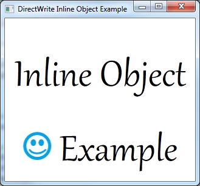

# How to Add Inline Objects to a Text Layout

Provides a short tutorial on adding inline objects to a [DirectWrite](direct-write-portal.md) application that displays text using the [**IDWriteTextLayout**](/windows/win32/api/dwrite/nn-dwrite-idwritetextlayout) interface.

The end product of this tutorial is an application that displays text with an inline image embedded in it, as shown in the following screen shot.



This tutorial contains the following parts:

-   [Step 1: Create a Text Layout.](#step-1-create-a-text-layout)
-   [Step 2: Define a class derived from the IDWriteInlineObject interface.](#step-2-define-a-class-derived-from-the-idwriteinlineobject-interface)
-   [Step 3: Implement the Inline Object Class.](#step-3-implement-the-inline-object-class)
    -   [The Constructor.](#the-constructor)
    -   [The Draw Method.](#the-draw-method)
    -   [The GetMetrics Method.](#the-getmetrics-method)
    -   [The GetOverhangMetrics Method.](#the-getoverhangmetrics-method)
    -   [The GetBreakConditions Method.](#the-getbreakconditions-method)
-   [Step 4: Create an Instance of the InlineImage Class and Add it to the Text Layout.](#step-4-create-an-instance-of-the-inlineimage-class-and-add-it-to-the-text-layout)

## Step 1: Create a Text Layout.

To begin, you will need an application with an [**IDWriteTextLayout**](/windows/win32/api/dwrite/nn-dwrite-idwritetextlayout) object. If you already have an application that displays text with a text layout, skip to Step 2.

To add a text layout you must do the following:

1.  Declare a pointer to an [**IDWriteTextLayout**](/windows/win32/api/dwrite/nn-dwrite-idwritetextlayout) interface as a member of the class.
    ```C++
    IDWriteTextLayout* pTextLayout_;
    
    ```

    

2.  At the end of the CreateDeviceIndependentResources method, create an [**IDWriteTextLayout**](/windows/win32/api/dwrite/nn-dwrite-idwritetextlayout) interface object by calling the [**CreateTextLayout**](/windows/win32/api/dwrite/nf-dwrite-idwritefactory-createtextlayout) method.
    ```C++
    // Create a text layout using the text format.
    if (SUCCEEDED(hr))
    {
        RECT rect;
        GetClientRect(hwnd_, &rect); 
        float width  = rect.right  / dpiScaleX_;
        float height = rect.bottom / dpiScaleY_;

        hr = pDWriteFactory_->CreateTextLayout(
            wszText_,      // The string to be laid out and formatted.
            cTextLength_,  // The length of the string.
            pTextFormat_,  // The text format to apply to the string (contains font information, etc).
            width,         // The width of the layout box.
            height,        // The height of the layout box.
            &pTextLayout_  // The IDWriteTextLayout interface pointer.
            );
    }
    
    ```

    

3.  Then, you must change the call to the [**ID2D1RenderTarget::DrawText**](/windows/win32/api/d2d1/nf-d2d1-id2d1rendertarget-drawtext(constwchar_uint32_idwritetextformat_constd2d1_rect_f__id2d1brush_d2d1_draw_text_options_dwrite_measuring_mode)) method to [**ID2D1RenderTarget::DrawTextLayout**](/windows/win32/api/d2d1/nf-d2d1-id2d1rendertarget-drawtextlayout), as shown in the following code.
    ```C++
    pRT_->DrawTextLayout(
        origin,
        pTextLayout_,
        pBlackBrush_
        );
    
    ```

    

## Step 2: Define a class derived from the IDWriteInlineObject interface.

Support for inline objects in [DirectWrite](direct-write-portal.md) is provided by the [**IDWriteInlineObject**](/windows/win32/api/dwrite/nn-dwrite-idwriteinlineobject) interface. To use inline objects, you must implement this interface. It handles the drawing of the inline object, as well as providing metrics and other information to the renderer.

Create a new header file and declare an interface called InlineImage, derived from [**IDWriteInlineObject**](/windows/win32/api/dwrite/nn-dwrite-idwriteinlineobject).

In addition to QueryInterface, AddRef, and Release inherited from IUnknown, this class must have the following methods:

-   [**Draw**](/windows/win32/api/dwrite/nf-dwrite-idwriteinlineobject-draw)
-   [**GetMetrics**](/windows/win32/api/dwrite/nf-dwrite-idwriteinlineobject-getmetrics)
-   [**GetOverhangMetrics**](idwriteinlineobject-getoverhangmetrics.md)
-   [**GetBreakConditions**](/windows/win32/api/dwrite/nf-dwrite-idwriteinlineobject-getbreakconditions)

## Step 3: Implement the Inline Object Class.

Create a new C++ file, named InlineImage.cpp, for the class implementation. In addition to the LoadBitmapFromFile method and the methods inherited from the IUnknown interface, the InlineImage class is made up of the following methods.

### The Constructor.


```C++
InlineImage::InlineImage(
    ID2D1RenderTarget *pRenderTarget, 
    IWICImagingFactory *pIWICFactory,
    PCWSTR uri
    )
{
    // Save the render target for later.
    pRT_ = pRenderTarget;

    pRT_->AddRef();

    // Load the bitmap from a file.
    LoadBitmapFromFile(
        pRenderTarget,
        pIWICFactory,
        uri,
        &pBitmap_
        );
}
```


The first argument of the constructor is the ID2D1RenderTarget that the inline image will be rendered to. This is stored for use later when drawing.

The render target, IWICImagingFactory, and the filename uri are all passed to the LoadBitmapFromFile method that loads the bitmap and stores the bitmap size (width and height) in the rect\_ member variable.

### The Draw Method.

The [**Draw**](/windows/win32/api/dwrite/nf-dwrite-idwriteinlineobject-draw) method is a callback that is called by the [**IDWriteTextRenderer**](/windows/win32/api/dwrite/nn-dwrite-idwritetextrenderer) object when the inline object needs to be drawn. The text layout does not call this method directly.


```C++
HRESULT STDMETHODCALLTYPE InlineImage::Draw(
    __maybenull void* clientDrawingContext,
    IDWriteTextRenderer* renderer,
    FLOAT originX,
    FLOAT originY,
    BOOL isSideways,
    BOOL isRightToLeft,
    IUnknown* clientDrawingEffect
    )
{
    float height    = rect_.bottom - rect_.top;
    float width     = rect_.right  - rect_.left;
    D2D1_RECT_F destRect  = {originX, originY, originX + width, originY + height};

    pRT_->DrawBitmap(pBitmap_, destRect);

    return S_OK;
}
```


In this case, drawing the bitmap is done by using the [**ID2D1RenderTarget::DrawBitmap**](/windows/win32/api/d2d1/nf-d2d1-id2d1rendertarget-drawbitmap(id2d1bitmap_constd2d1_rect_f__float_d2d1_bitmap_interpolation_mode_constd2d1_rect_f_)) method; however, any method for drawing can be used.

### The GetMetrics Method.


```C++
HRESULT STDMETHODCALLTYPE InlineImage::GetMetrics(
    __out DWRITE_INLINE_OBJECT_METRICS* metrics
    )
{
    DWRITE_INLINE_OBJECT_METRICS inlineMetrics = {};
    inlineMetrics.width     = rect_.right  - rect_.left;
    inlineMetrics.height    = rect_.bottom - rect_.top;
    inlineMetrics.baseline  = baseline_;
    *metrics = inlineMetrics;
    return S_OK;
}
```


For the [**GetMetrics**](/windows/win32/api/dwrite/nf-dwrite-idwriteinlineobject-getmetrics) method, store the width, height and baseline in an [**DWRITE\_INLINE\_OBJECT\_METRICS**](/windows/win32/api/dwrite/ns-dwrite-dwrite_inline_object_metrics) structure. [**IDWriteTextLayout**](/windows/win32/api/dwrite/nn-dwrite-idwritetextlayout) calls this callback function to get the measurement of the inline object.

### The GetOverhangMetrics Method.


```C++
HRESULT STDMETHODCALLTYPE InlineImage::GetOverhangMetrics(
    __out DWRITE_OVERHANG_METRICS* overhangs
    )
{
    overhangs->left      = 0;
    overhangs->top       = 0;
    overhangs->right     = 0;
    overhangs->bottom    = 0;
    return S_OK;
}
```


In this case, no overhang is necessary, so the [**GetOverhangMetrics**](idwriteinlineobject-getoverhangmetrics.md) method returns all zeros.

### The GetBreakConditions Method.


```C++
HRESULT STDMETHODCALLTYPE InlineImage::GetBreakConditions(
    __out DWRITE_BREAK_CONDITION* breakConditionBefore,
    __out DWRITE_BREAK_CONDITION* breakConditionAfter
    )
{
    *breakConditionBefore = DWRITE_BREAK_CONDITION_NEUTRAL;
    *breakConditionAfter  = DWRITE_BREAK_CONDITION_NEUTRAL;
    return S_OK;
}
```


## Step 4: Create an Instance of the InlineImage Class and Add it to the Text Layout.

Finally, in the CreateDeviceDependentResources method, create an instance of the InlineImage class and add it to the text layout. Because it holds a reference to the [**ID2D1RenderTarget**](/windows/win32/api/d2d1/nn-d2d1-id2d1rendertarget), which is a device dependent resource, and the [**ID2D1Bitmap**](/windows/win32/api/d2d1/nn-d2d1-id2d1bitmap) is created by using the render target, the InlineImage is also device dependent and must be recreated if the render target is recreated.


```C++
// Create an InlineObject.
pInlineImage_ = new InlineImage(pRT_, pWICFactory_, L"img1.jpg");

DWRITE_TEXT_RANGE textRange = {14, 1};

pTextLayout_->SetInlineObject(pInlineImage_, textRange);
```


The [**IDWriteTextLayout::SetInlineObject**](/windows/win32/api/dwrite/nf-dwrite-idwritetextlayout-setinlineobject) method takes a text range structure. The object applies to the range specified here, and any text in the range will be suppressed. If the length of the text range is 0, the object will not be drawn.

In this example, there is an asterisk (\*) as a place holder in the position where the image will be displayed.


```C++
// The string to display.  The '*' character will be suppressed by our image.
wszText_ = L"Inline Object * Example";
cTextLength_ = wcslen(wszText_);
```


Since the InlineImage class is dependent on the [**ID2D1RenderTarget**](/windows/win32/api/d2d1/nn-d2d1-id2d1rendertarget), you must release it when you release the render target.


```C++
SafeRelease(&pInlineImage_);
```


 

 