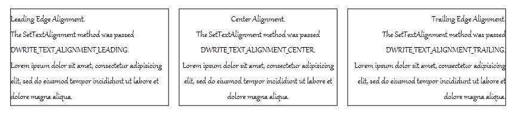

# How to Align Text

You can align [DirectWrite](direct-write-portal.md) text by using the [**SetTextAlignment**](idwritetextformat-settextalignment.md) method of the [**IDWriteTextFormat**](idwritetextformat.md) interface, as shown in the following code that centers the text.


```C++
if (SUCCEEDED(hr))
{
    hr = pTextFormat_->SetTextAlignment(DWRITE_TEXT_ALIGNMENT_CENTER);
}
```


The text can be aligned to the leading or trailing edge of the layout box, or it can be centered. The following illustration shows text with the alignment set to [**DWRITE\_TEXT\_ALIGNMENT\_LEADING**](dwrite-text-alignment.md), [**DWRITE\_TEXT\_ALIGNMENT\_CENTER**](dwrite-text-alignment.md), and [**DWRITE\_TEXT\_ALIGNMENT\_TRAILING**](dwrite-text-alignment.md), respectively.



> [!Note]  
> The alignment is dependent on reading direction, the above is for left-to-right reading direction. For right-to-left reading direction it would be the opposite.

 

An [**IDWriteTextLayout**](idwritetextlayout.md) object will use the alignment that has been designated for the [**IDWriteTextFormat**](idwritetextformat.md) provided by you when creating the layout. To change the text alignment, use [**IDWriteTextLayout::SetTextAlignment**](idwritetextformat-settextalignment.md).

 

 


