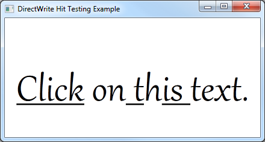

# How to Perform Hit Testing on a Text Layout

Provides a short tutorial about how to add hit testing to a [DirectWrite](direct-write-portal.md) application that displays text by using the [**IDWriteTextLayout**](/windows/win32/api/dwrite/nn-dwrite-idwritetextlayout) interface.

The result of this tutorial is an application that underlines the character that is clicked on by the left mouse button, as shown in the following screen shot.



This how to contains the following parts:

- [Step 1: Create a Text Layout.](#step-1-create-a-text-layout)
- [Step 2: Add an OnClick method.](#step-2-add-an-onclick-method)
- [Step 3: Perform Hit Testing.](#step-3-perform-hit-testing)
- [Step 4: Underline the Clicked Text.](#step-4-underline-the-clicked-text)
- [Step 5: Handle the WM\_LBUTTONDOWN message.](/windows)

## Step 1: Create a Text Layout.

To begin, you will need an application that uses an [**IDWriteTextLayout**](/windows/win32/api/dwrite/nn-dwrite-idwritetextlayout) object. If you already have an application that displays text with a text layout, go to Step 2.

To add a text layout you must do the following:

1. Declare a pointer to an [**IDWriteTextLayout**](/windows/win32/api/dwrite/nn-dwrite-idwritetextlayout) interface as a member of the class.

    ```cpp
    IDWriteTextLayout* pTextLayout_;
    ```

2. At the end of the **CreateDeviceIndependentResources** method, create an [**IDWriteTextLayout**](/windows/win32/api/dwrite/nn-dwrite-idwritetextlayout) interface object by calling the [**CreateTextLayout**](/windows/win32/api/dwrite/nf-dwrite-idwritefactory-createtextlayout) method.

    ```cpp
    // Create a text layout using the text format.
    if (SUCCEEDED(hr))
    {
        RECT rect;
        GetClientRect(hwnd_, &rect); 
        float width  = rect.right  / dpiScaleX_;
        float height = rect.bottom / dpiScaleY_;

        hr = pDWriteFactory_->CreateTextLayout(
            wszText_,      // The string to be laid out and formatted.
            cTextLength_,  // The length of the string.
            pTextFormat_,  // The text format to apply to the string (contains font information, etc).
            width,         // The width of the layout box.
            height,        // The height of the layout box.
            &pTextLayout_  // The IDWriteTextLayout interface pointer.
            );
    }
    ```

3. Then, you must change the call to the [**ID2D1RenderTarget::DrawText**](/windows/win32/api/d2d1/nf-d2d1-id2d1rendertarget-drawtext(constwchar_uint32_idwritetextformat_constd2d1_rect_f__id2d1brush_d2d1_draw_text_options_dwrite_measuring_mode)) method to [**ID2D1RenderTarget::DrawTextLayout**](/windows/win32/api/d2d1/nf-d2d1-id2d1rendertarget-drawtextlayout) as shown in the following code.

    ```cpp
    pRT_->DrawTextLayout(
        origin,
        pTextLayout_,
        pBlackBrush_
        );
    ```

## Step 2: Add an OnClick method.

Now add a method to the class that will use the hit testing functionality of the text layout.

1. Declare an **OnClick** method in the class header file.

    ```cpp
    void OnClick(
        UINT x,
        UINT y
        );
    ```

2. Define an **OnClick** method in the class implementation file.

   ```cpp
    void DemoApp::OnClick(UINT x, UINT y)
    {    
    }
    ```

## Step 3: Perform Hit Testing.

To determine where the user has clicked the text layout we will use the [**IDWriteTextLayout::HitTestPoint**](/windows/win32/api/dwrite/nf-dwrite-idwritetextlayout-hittestpoint) method.

Add the following to the **OnClick** method that you defined in Step 2.

1. Declare the variables we will pass as parameters to the method.

    ```cpp
    DWRITE_HIT_TEST_METRICS hitTestMetrics;
    BOOL isTrailingHit;
    BOOL isInside; 
    ```

    The [**HitTestPoint**](/windows/win32/api/dwrite/nf-dwrite-idwritetextlayout-hittestpoint) method outputs the following parameters.

    | Variable         | Description                                                                                                                             |
    |------------------|-----------------------------------------------------------------------------------------------------------------------------------------|
    | *hitTestMetrics* | The geometry fully enclosing the hit-test location.                                                                                     |
    | *isInside*       | Indicates whether the hit-test location is inside the text string or not. When FALSE, the position nearest the text's edge is returned. |
    | *isTrailingHit*  | Indicates whether the hit-test location is at the leading or the trailing side of the character.                                        |

2. Call the [**HitTestPoint**](/windows/win32/api/dwrite/nf-dwrite-idwritetextlayout-hittestpoint) method of the [**IDWriteTextLayout**](/windows/win32/api/dwrite/nn-dwrite-idwritetextlayout) object.

    ```cpp
    pTextLayout_->HitTestPoint(
                    (FLOAT)x, 
                    (FLOAT)y,
                    &isTrailingHit,
                    &isInside,
                    &hitTestMetrics
                    );
    ```

    The code in this example passes the *x* and *y* variables for the position without any modification. This can be done in this example because the text layout is the same size as the window and originates in the upper-left corner of the window. If this was not the case, you would have to determine the coordinates in relation to the origin of the text layout.

## Step 4: Underline the Clicked Text.

Add the following to the **OnClick** you defined in Step 2, after the call to the [**HitTestPoint**](/windows/win32/api/dwrite/nf-dwrite-idwritetextlayout-hittestpoint) method.

```cpp
if (isInside == TRUE)
{
    BOOL underline;

    pTextLayout_->GetUnderline(hitTestMetrics.textPosition, &underline);

    DWRITE_TEXT_RANGE textRange = {hitTestMetrics.textPosition, 1};

    pTextLayout_->SetUnderline(!underline, textRange);
}
```

This code does the following.

1. Checks if the hit-test point was inside the text using the *isInside* variable.
2. The **textPosition** member of the *hitTestMetrics* structure contains the zero-based index of the character clicked.

    Gets the underline for this character by passing this value to the [**IDWriteTextLayout::GetUnderline**](/windows/win32/api/dwrite/nf-dwrite-idwritetextlayout-getunderline) method.

3. Declares a [**DWRITE\_TEXT\_RANGE**](/windows/win32/api/dwrite/ns-dwrite-dwrite_text_range) variable with the start position set to **hitTestMetrics.textPosition** and a length of 1.
4. Toggles the underline by using the [**IDWriteTextLayout::SetUnderline**](/windows/win32/api/dwrite/nf-dwrite-idwritetextlayout-setunderline) method.

After setting the underline, redraw the text by calling the **DrawD2DContent** method of the class.

```cpp
DrawD2DContent();
```

## Step 5: Handle the WM\_LBUTTONDOWN message.

Finally, add the **WM\_LBUTTONDOWN** message to the message handler for your application and call the **OnClick** method of the class.

```cpp
case WM_LBUTTONDOWN:
    {
        int x = GET_X_LPARAM(lParam); 
        int y = GET_Y_LPARAM(lParam);

        pDemoApp->OnClick(x, y);
    }
    break;
```

**GET\_X\_LPARAM** and **GET\_X\_LPARAM** macros are declared in the windowsx.h header file. They easily retrieve the x and y position of the mouse click.
