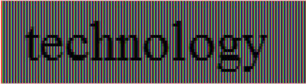

# Introducing DirectWrite

People communicate with text all the time in their daily lives. It is the primary way for people to consume an increasing volume of information. In the past, it used to be through printed content, primarily documents, newspapers, books, and so on. Increasingly, it is online content on their Windows PC. A typical Windows user spends a lot of time reading from their computer screen. They might be surfing the Web, scanning e-mail, composing a report, filling in a spreadsheet, or writing software, but what they're really doing is reading. Even though text and fonts permeate nearly every part of the user experience in Windows, for most users, reading on the screen is not as enjoyable as reading printed output.

For Windows application developers, writing text-handling code is a challenge because of the increased requirements for better readability, sophisticated formatting and layout control, and support for the multiple languages the application must display. Even the most basic text-handling system must allow for text input, layout, display, editing, and copying and pasting. Windows users commonly expect even more than these basic features, requiring even simple editors to support multiple fonts, various paragraph styles, embedded images, spell checking, and other features. Modern UI design is also no longer confined to single format, plain text, but needs to present a better experience with rich fonts and text layouts.

This is an introduction to how [DirectWrite](direct-write-portal.md) enables Windows applications to enhance the text experience for UI and documents.

## Improving the Text Experience

Modern Windows applications have sophisticated requirements for text in their UI and documents. These include better readability, support for a large variety of languages and scripts, and superior rendering performance. In addition, most existing applications require a way to carry forward existing investments in the WindowsWin32 code base.

[DirectWrite](direct-write-portal.md) provides the following three features that enable Windows application developers to improve the text experience within their applications: independence from the rendering system, high-quality typography, and multiple layers of functionality.

## Rendering-System Independence

[DirectWrite](direct-write-portal.md) is independent of any particular graphics technology. Applications are free to use the rendering technology best suited to their needs. This gives applications the flexibility to continue rendering some parts of their application through GDI and other parts through Direct3D or [Direct2D](../direct2d/direct2d-portal.md). In fact, an application could choose to render DirectWrite through a proprietary rendering stack.

## High-Quality Typography

[DirectWrite](direct-write-portal.md) takes advantage of the advances in [OpenType](../intl/opentype-font-format.md) Font technology to enable high quality typography within a Windows application. The DirectWrite font system provides services for dealing with font enumeration, font fallback, and font caching, which are all needed by applications for handling fonts.

The [OpenType](../intl/opentype-font-format.md) support provided by [DirectWrite](direct-write-portal.md) enables developers to add to their applications advanced typographic features and support for international text.

## Support for Advanced Typographic Features

[DirectWrite](direct-write-portal.md) enables application developers to unlock the features of OpenType fonts that they couldn't use in WinForms or GDI. The DirectWrite [**IDWriteTypography**](/windows/win32/api/dwrite/nn-dwrite-idwritetypography) object exposes many of the advanced features of OpenType fonts, such as stylistic alternates and swashes. The Microsoft Windows Software Development Kit (SDK) provides a set of sample [OpenType](../intl/opentype-font-format.md) fonts that are designed with rich features, such as the Pericles and Pescadero fonts. For more details on OpenType features, see [OpenType Font Features](/previous-versions/dotnet/netframework-3.0/ms745109(v=vs.85)).

## Support for International Text

[DirectWrite](direct-write-portal.md) uses [OpenType](../intl/opentype-font-format.md) fonts to enable broad support for international text. Unicode features such as surrogates, BIDI, line breaking, and UVS are supported. Language-guided script itemization, number substitution, and glyph shaping ensure that text in any script has the correct layout and rendering.

The following scripts are currently supported:

> [!Note]  
> For scripts marked with an \*, there are no default system fonts. Applications must install fonts that support these scripts.

 

-   Arabic
-   Armenian
-   Bengala
-   Bopomofo
-   Braille\*
-   Canadian aboriginal syllabics
-   Cherokee
-   Chinese (Simplified & Traditional)
-   Cyrillic
-   Coptic\*
-   Devanagari
-   Ethiopic
-   Georgian
-   Glagolitic\*
-   Greek
-   Gujarati
-   Gurmukhi
-   Hebrew
-   Japanese
-   Kannada
-   Khmer
-   Korean
-   Lao
-   Latin
-   Malayalam
-   Mongolian
-   Myanmar
-   New Tai Lue
-   Ogham\*
-   Odia
-   'Phags-pa
-   Runic\*
-   Sinhala
-   Syriac
-   Tai Le
-   Tamil
-   Telugu
-   Thaana
-   Thai
-   Tibetan
-   Yi

## Multiple Layers of Functionality

[DirectWrite](direct-write-portal.md) provides factored layers of functionality, with each layer interacting seamlessly with the next. The API design gives application developers the freedom and flexibility to adopt individual layers depending on their needs and schedule. The following diagram shows the relationship between these layers.


The text layout API provides the highest level functionality available from [DirectWrite](direct-write-portal.md). It provides services for the application to measure, display, and interact with richly formatted text strings. This text API can be used in applications that currently use Win32's DrawText to build a modern UI with richly formatted text.

Text-intensive applications that implement their own layout engine may use the next layer down: the script processor. The script processor breaks down a chunk of text into script blocks and handles the mapping between Unicode representations to the appropriate glyph representation in the font so the text of the script can be correctly displayed in the correct language. The layout system used by the text layout API layer is built upon the font and script processing system.

The glyph-rendering layer is the lowest layer of functionality and provides glyph-rendering functionality for applications that implement their own text layout engine. The glyph rendering layer is also useful for applications that implement a custom renderer to modify the glyph-drawing behavior through the callback function in the [DirectWrite](direct-write-portal.md) text-formatting API.

The [DirectWrite](direct-write-portal.md) font system is available to all the DirectWrite functional layers and enables an application to access font and glyph information. It is designed to handle common font technologies and data formats. The DirectWrite font model follows the common typographic practice of supporting any number of weights, styles, and stretches in the same font family. This model, the same model followed by WPF and CSS, specifies that fonts differing only in weight (bold, light, and so on), style (upright, italic, or oblique) or stretch (narrow, condensed, wide, and so on) are considered to be members of a single font family.

### Improved Text Rendering with ClearType

Improving readability on the screen is a key requirement for all Windows applications. The evidence from research in cognitive psychology indicates that we need to be able to recognize every letter accurately and that even spacing between letters is critical for fast processing. Letters and words that are not symmetrical are perceived as ugly and degrade the reading experience. Kevin Larson, Microsoft Advanced Reading Technologies group, wrote an article on the subject that was published in Spectrum IEEE. The article is called "The Technology of Text".

Text in [DirectWrite](direct-write-portal.md) is rendered using Microsoft ClearType, which enhances the clarity and readability of text. ClearType takes advantage of the fact that modern LCD displays have RGB stripes for each pixel that can be controlled individually. DirectWrite uses the latest enhancements to ClearType, first included with Windows Vista with Windows Presentation Foundation, that enables it to evaluate not just the individual letters but also the spacing between letters. Before these ClearType enhancements, text with a "reading" size of 10 or 12 points was difficult to display: we could place either 1 pixel in between letters, which was often too little, or 2 pixels, which was often too much. Using the extra resolution in the subpixels provides us with fractional spacing, which improves the evenness and symmetry of the entire page.

The following two illustration show how glyphs may begin on any sub-pixel boundary when sub-pixel positioning is used.

The following illustration is rendered using the GDI version of the ClearType renderer, which did not employ sub-pixel positioning.



The following illustration is rendered using the [DirectWrite](direct-write-portal.md) version of the ClearType renderer, which uses sub-pixel positioning.


Note that the spacing between the letters h and n is more even in the second image and the letter o is spaced further from the letter n, more even with the letter l. Also note how the stems on the letters l are more natural looking.

The subpixel ClearType positioning offers the most accurate spacing of characters on screen, especially at small sizes where the difference between a sub-pixel and a whole pixel represents a significant proportion of glyph width. It enables text to be measured in ideal resolution space and rendered at its natural position at the LCD color stripe, with subpixel granularity. Text measured and rendered using this technology is, by definition, resolution-independent, meaning that the exact same layout of text is achieved across the range of various display resolutions.

Unlike either type of GDI ClearType rendering, sub-pixel ClearType offers the most accurate width of characters.

The Text String API adopts sub-pixel text rendering by default, which means it measures text at its ideal resolution independent of the current display resolution, and produces the glyph positioning result based on the truly scaled glyph advance widths and positioning offsets.

For large-sized text, [DirectWrite](direct-write-portal.md) also enables anti-aliasing along the y-axis to make the edges smoother and render letters as the font designer intended. The following illustration shows y-direction anti-aliasing.


Although [DirectWrite](direct-write-portal.md) text is positioned and rendered using sub-pixel ClearType by default, other rendering options are available. Many existing applications use GDI to render most of their UI, and some applications use system editing controls that continue to use GDI for text rendering. When adding DirectWrite text to these applications, it may be necessary to sacrifice the reading experience improvements provided by sub-pixel ClearType so that text has a consistent appearance across the application.

To meet these requirements, [DirectWrite](direct-write-portal.md) also supports the following rendering options:

-   Sub-pixel ClearType (default).
-   Sub-pixel ClearType with anti-aliasing in both horizontal and vertical dimensions.
-   Aliased text.
-   GDI natural-width (used by Microsoft Word Reading View, for example).
-   GDI compatible-width (including East Asian embedded bitmap).

Each of these rendering modes can be fine-tuned through the DirectWrite API and through the new Windows 7 inbox ClearType tuner.

> [!Note]  
> Starting with Windows 8, you should use greyscale text antialiasing in most cases. See the next section for more information.

 

### Support for Natural Layout

Natural layout is resolution-independent, so the spacing of characters doesn't change as you zoom in or out, or depending on the DPI of the display. A secondary advantage is that spacing is true to the design of the font. Natural layout is made possible by DirectWrite's support for natural rendering, which means individual glyphs can be positioned to a fraction of a pixel.

While natural layout is the default, some applications need to render text with the same spacing and appearance as GDI. For such applications, DirectWrite provides GDI classic and GDI natural measuring modes and corresponding rendering modes.

Any of the above rendering modes can be combined with either of the two antialiasing modes: ClearType or grayscale. ClearType antialiasing simulations a higher resolution by individually manipulating the red, green, and blue color values of each pixel. Grayscale antialiasing computes only one coverage (or alpha) value for each pixel. ClearType is the default, but grayscale antialiasing is recommended for Windows Store apps because it is faster and is compatible with standard antialiasing, while still being highly readable.

## API Overview

The [**IDWriteFactory**](/windows/win32/api/dwrite/nn-dwrite-idwritefactory) interface is the starting point for using DirectWrite functionality. The factory is the root object that creates a set of objects that can be used together.

The formatting and layout operation is a prerequisite to the operations, as text needs to be properly formatted and laid out to a specified set of constraints before it can be drawn or hit-tested. Two key objects that you can create with an [**IDWriteFactory**](/windows/win32/api/dwrite/nn-dwrite-idwritefactory) for this purpose are [**IDWriteTextFormat**](/windows/win32/api/dwrite/nn-dwrite-idwritetextformat) and [**IDWriteTextLayout**](/windows/win32/api/dwrite/nn-dwrite-idwritetextlayout). An **IDWriteTextFormat** object represents the formatting information for a paragraph of text. The [**IDWriteFactory::CreateTextLayout**](/windows/win32/api/dwrite/nf-dwrite-idwritefactory-createtextlayout) function takes the input string, the associated constraints such as the dimension of the space to be filled, and the **IDWriteTextFormat** object, and puts the fully analyzed and formatted result into **IDWriteTextLayout** to use in subsequent operations.

The application can then render the text using the [**DrawTextLayout**](/windows/win32/api/d2d1/nf-d2d1-id2d1rendertarget-drawtextlayout) function provided by [Direct2D](../direct2d/direct2d-portal.md) or by implementing a callback function that can use GDI, Direct2D, or other graphics systems to render the glyphs. For a single format text, the [**DrawText**](/windows/win32/api/d2d1/nf-d2d1-id2d1rendertarget-drawtext(constwchar_uint32_idwritetextformat_constd2d1_rect_f__id2d1brush_d2d1_draw_text_options_dwrite_measuring_mode)) function on Direct2D provides a simpler way to draw text without having to first create a [**IDWriteTextLayout**](/windows/win32/api/dwrite/nn-dwrite-idwritetextlayout) object.

## Formatting and Drawing "Hello World" Using DirectWrite

The following code example shows how an application can format a single paragraph using [**IDWriteTextFormat**](/windows/win32/api/dwrite/nn-dwrite-idwritetextformat) and draw it using the [Direct2D](../direct2d/direct2d-portal.md)[**DrawText**](/windows/win32/api/d2d1/nf-d2d1-id2d1rendertarget-drawtext(constwchar_uint32_idwritetextformat_constd2d1_rect_f__id2d1brush_d2d1_draw_text_options_dwrite_measuring_mode)) function.


```C++
HRESULT DemoApp::DrawHelloWorld(
    ID2D1HwndRenderTarget* pIRenderTarget
    )
{
    HRESULT hr = S_OK;
    ID2D1SolidColorBrush* pIRedBrush = NULL;
    IDWriteTextFormat* pITextFormat = NULL;
    IDWriteFactory* pIDWriteFactory = NULL;

    if (SUCCEEDED(hr))
    {
        hr = DWriteCreateFactory(DWRITE_FACTORY_TYPE_SHARED,
                __uuidof(IDWriteFactory),
                reinterpret_cast<IUnknown**>(&pIDWriteFactory));
    }

    if(SUCCEEDED(hr))
    {
        hr = pIDWriteFactory->CreateTextFormat(
            L"Arial", 
            NULL,
            DWRITE_FONT_WEIGHT_NORMAL, 
            DWRITE_FONT_STYLE_NORMAL, 
            DWRITE_FONT_STRETCH_NORMAL, 
            10.0f * 96.0f/72.0f, 
            L"en-US", 
            &pITextFormat
        );
    }

    if(SUCCEEDED(hr))
    {
        hr = pIRenderTarget->CreateSolidColorBrush(
            D2D1:: ColorF(D2D1::ColorF::Red),
            &pIRedBrush
        );
    }
    
   D2D1_RECT_F layoutRect = D2D1::RectF(0.f, 0.f, 100.f, 100.f);

    // Actually draw the text at the origin.
    if(SUCCEEDED(hr))
    {
        pIRenderTarget->DrawText(
            L"Hello World",
            wcslen(L"Hello World"),
            pITextFormat,
            layoutRect, 
            pIRedBrush
        );
    }

    // Clean up.
    SafeRelease(&pIRedBrush);
    SafeRelease(&pITextFormat);
    SafeRelease(&pIDWriteFactory);

    return hr;
}
```


## Accessing the Font System

In addition to specifying a font family name for the text string by using the [**IDWriteTextFormat**](/windows/win32/api/dwrite/nn-dwrite-idwritetextformat) interface in the example above, [DirectWrite](direct-write-portal.md) provides applications more control over font selection through font enumeration and the ability to create custom font collection based on embedded document fonts.

The [**IDWriteFontCollection**](/windows/win32/api/dwrite/nn-dwrite-idwritefontcollection) object is a collection of font families. DirectWrite provides access to the set of fonts installed on the system through a special font collection called the system font collection. This is obtained by calling the [**GetSystemFontCollection**](/windows/win32/api/dwrite/nf-dwrite-idwritefactory-getsystemfontcollection) method of the [**IDWriteFactory**](/windows/win32/api/dwrite/nn-dwrite-idwritefactory) object. An application can also create a custom font collection from a set of fonts enumerated by an application-defined callback, that is, private fonts installed by an application, or fonts embedded in a document.

The application can then call [**GetFontFamily**](/windows/win32/api/dwrite/nf-dwrite-idwritefont-getfontfamily) to get to a specific FontFamily object within the collection, and then call [**IDWriteFontFamily::GetFirstMatchingFont**](/windows/win32/api/dwrite/nf-dwrite-idwritefontfamily-getfirstmatchingfont) to get to a specific [**IDWriteFont**](/windows/win32/api/dwrite/nn-dwrite-idwritefont) object. The **IDWriteFont** object represents a font in a font collection and exposes properties and a few basic font metrics.

The [**IDWriteFontFace**](/windows/win32/api/dwrite/nn-dwrite-idwritefontface) is another object that represents a font and exposes a full set of metrics on a font. The **IDWriteFontFace** can be created directly from a font name; an application does not have to get a font collection to access it. It is useful for a text layout application such as Microsoft Word that needs to query the details for a specific font.

The following diagram illustrates the relationship between these objects.


### IDWriteFontFace

The [**IDWriteFontFace**](/windows/win32/api/dwrite/nn-dwrite-idwritefontface) object represents a font and provides more detailed information about the font than the [**IDWriteFont**](/windows/win32/api/dwrite/nn-dwrite-idwritefont) object does. The font and glyph metrics from the **IDWriteFontFace** are useful for applications that implement text layout.

Most mainstream applications will not use these APIs directly, and instead will use [**IDWriteFont**](/windows/win32/api/dwrite/nn-dwrite-idwritefont) or specify the font family name directly.

The following table summarizes the usage scenarios for the two objects.


| Category                                                                                                         | [**IDWriteFont**](/windows/win32/api/dwrite/nn-dwrite-idwritefont) | [**IDWriteFontFace**](/windows/win32/api/dwrite/nn-dwrite-idwritefontface) |
|------------------------------------------------------------------------------------------------------------------|--------------------------------------------|----------------------------------------------------|
| APIs to support user interaction such as a font-chooser user interface: description and other informational APIs | Yes                                        | No                                                 |
| APIs to support font mapping: family, style, weight, stretch, character coverage                                 | Yes                                        | No                                                 |
| DrawText API                                                                                                     | Yes                                        | No                                                 |
| APIs used for rendering                                                                                          | No                                         | Yes                                                |
| APIs used for text layout: glyph metrics, and so on                                                              | No                                         | Yes                                                |
| APIs for UI control and text layout: font-wide metrics                                                           | Yes                                        | Yes                                                |


 

The following is an example application that enumerates the fonts in the system font collection.


```C++
#include <dwrite.h>
#include <string.h>
#include <stdio.h>
#include <new>

// SafeRelease inline function.
template <class T> inline void SafeRelease(T **ppT)
{
    if (*ppT)
    {
        (*ppT)->Release();
        *ppT = NULL;
    }
}

void wmain()
{
    IDWriteFactory* pDWriteFactory = NULL;

    HRESULT hr = DWriteCreateFactory(
            DWRITE_FACTORY_TYPE_SHARED,
            __uuidof(IDWriteFactory),
            reinterpret_cast<IUnknown**>(&pDWriteFactory)
            );

    IDWriteFontCollection* pFontCollection = NULL;

    // Get the system font collection.
    if (SUCCEEDED(hr))
    {
        hr = pDWriteFactory->GetSystemFontCollection(&pFontCollection);
    }

    UINT32 familyCount = 0;

    // Get the number of font families in the collection.
    if (SUCCEEDED(hr))
    {
        familyCount = pFontCollection->GetFontFamilyCount();
    }

    for (UINT32 i = 0; i < familyCount; ++i)
    {
        IDWriteFontFamily* pFontFamily = NULL;

        // Get the font family.
        if (SUCCEEDED(hr))
        {
            hr = pFontCollection->GetFontFamily(i, &pFontFamily);
        }

        IDWriteLocalizedStrings* pFamilyNames = NULL;
        
        // Get a list of localized strings for the family name.
        if (SUCCEEDED(hr))
        {
            hr = pFontFamily->GetFamilyNames(&pFamilyNames);
        }

        UINT32 index = 0;
        BOOL exists = false;
        
        wchar_t localeName[LOCALE_NAME_MAX_LENGTH];

        if (SUCCEEDED(hr))
        {
            // Get the default locale for this user.
            int defaultLocaleSuccess = GetUserDefaultLocaleName(localeName, LOCALE_NAME_MAX_LENGTH);

            // If the default locale is returned, find that locale name, otherwise use "en-us".
            if (defaultLocaleSuccess)
            {
                hr = pFamilyNames->FindLocaleName(localeName, &index, &exists);
            }
            if (SUCCEEDED(hr) && !exists) // if the above find did not find a match, retry with US English
            {
                hr = pFamilyNames->FindLocaleName(L"en-us", &index, &exists);
            }
        }
        
        // If the specified locale doesn't exist, select the first on the list.
        if (!exists)
            index = 0;

        UINT32 length = 0;

        // Get the string length.
        if (SUCCEEDED(hr))
        {
            hr = pFamilyNames->GetStringLength(index, &length);
        }

        // Allocate a string big enough to hold the name.
        wchar_t* name = new (std::nothrow) wchar_t[length+1];
        if (name == NULL)
        {
            hr = E_OUTOFMEMORY;
        }

        // Get the family name.
        if (SUCCEEDED(hr))
        {
            hr = pFamilyNames->GetString(index, name, length+1);
        }
        if (SUCCEEDED(hr))
        {
            // Print out the family name.
            wprintf(L"%s\n", name);
        }

        SafeRelease(&pFontFamily);
        SafeRelease(&pFamilyNames);

        delete [] name;
    }

    SafeRelease(&pFontCollection);
    SafeRelease(&pDWriteFactory);
}

```


## Text rendering

The text rendering APIs enable glyphs in a [DirectWrite](direct-write-portal.md) font to be rendered to a [Direct2D](../direct2d/direct2d-portal.md) surface or to a GDI device independent bitmap, or to be converted to outlines or bitmaps. The ClearType rendering in DirectWrite supports sub-pixel positioning with improved sharpness and contrast compared to previous implementations on Windows. DirectWrite also supports aliased black-and-white text to support scenarios involving East Asian fonts with embedded bitmaps, or where the user has disabled font smoothing of any type.

All the options are adjustable by all the available ClearType knobs accessible through the [DirectWrite](direct-write-portal.md) APIs, and also exposed via the new Windows 7 ClearType tuner control panel applet.

There are two APIs available for rendering glyphs, one providing hardware-accelerated rendering through [Direct2D](../direct2d/direct2d-portal.md) and the other providing software rendering to a GDI bitmap. An application using [**IDWriteTextLayout**](/windows/win32/api/dwrite/nn-dwrite-idwritetextlayout) and implementing the [**IDWriteTextRenderer**](/windows/win32/api/dwrite/nn-dwrite-idwritetextrenderer) callback can call either of these functions in response to a [**DrawGlyphRun**](/windows/win32/api/dwrite/nf-dwrite-idwritetextrenderer-drawglyphrun) callback. Also, applications that implement their own layout or deal with glyph-level data can use these APIs.

1.  [**ID2DRenderTarget::DrawGlyphRun**](/windows/win32/api/d2d1/nf-d2d1-id2d1rendertarget-drawglyphrun)

    Applications can use the [Direct2D](../direct2d/direct2d-portal.md) API [**DrawGlyphRun**](/windows/win32/api/d2d1/nf-d2d1-id2d1rendertarget-drawglyphrun) to provide hardware acceleration for text rendering using the GPU. Hardware acceleration affects all phases of the text rendering pipeline—from merging glyphs into glyph runs and filtering the glyph-run bitmap, to applying the ClearType blending algorithm to the final displayed output. This is the recommended API for getting the best rendering performance.

2.  [**IDWriteBitmapRenderTarget::DrawGlyphRun**](/windows/win32/api/dwrite/nf-dwrite-idwritebitmaprendertarget-drawglyphrun)

    Applications can use the [**IDWriteBitmapRenderTarget::DrawGlyphRun**](/windows/win32/api/dwrite/nf-dwrite-idwritebitmaprendertarget-drawglyphrun) method to perform a software-rendering of a run of glyphs to a 32-bpp bitmap. The [**IDWriteBitmapRenderTarget**](/windows/win32/api/dwrite/nn-dwrite-idwritebitmaprendertarget) object encapsulates a bitmap and a memory device context that can be used for rendering glyphs. This API is useful if you want to stay with GDI because you have an existing code base that renders in GDI.

If you have an application that has existing text layout code that uses GDI, and you want to preserve its existing layout code but use [DirectWrite](direct-write-portal.md) just for the final step of rendering glyphs, [**IDWriteGdiInterop::CreateFontFaceFromHdc**](/windows/win32/api/dwrite/nf-dwrite-idwritegdiinterop-createfontfacefromhdc) provides the bridge between the two APIs. Before calling this function, the application will use the **IDWriteGdiInterop::CreateFontFaceFromHdc** function to get a font-face reference from a device context.

> [!Note]  
> For most scenarios, applications may not need to use these glyph-rendering APIs. After an application has created an [**IDWriteTextLayout**](/windows/win32/api/dwrite/nn-dwrite-idwritetextlayout) object, it can use the [**ID2D1RenderTarget::DrawTextLayout**](/windows/win32/api/d2d1/nf-d2d1-id2d1rendertarget-drawtextlayout) method to render the text.

 

## Custom Rendering Modes

A number of parameters affect text rendering, such as gamma, ClearType level, pixel geometry, and enhanced contrast. Rendering parameters are encapsulated by an object, which implements the public [**IDWriteRenderingParams**](/windows/win32/api/dwrite/nn-dwrite-idwriterenderingparams) interface. The rendering parameters object is automatically initialized based on hardware properties and/or user preferences specified through the ClearType control panel applet in Windows 7. Generally, if a client uses the [DirectWrite](direct-write-portal.md) layout API, DirectWrite will automatically select a rendering mode that corresponds to the specified measuring mode.

Applications that want more control can use [**IDWriteFactory::CreateCustomRenderingParams**](/windows/win32/api/dwrite/nf-dwrite-idwritefactory-createcustomrenderingparams) to implement the different rendering options. This function can also be used to set the gamma, pixel geometry, and enhanced contrast.

The following are the various rendering options available:

-   Sub-pixel anti-aliasing

    The application sets the *renderingMode* parameter to DWRITE\_RENDERING\_MODE\_NATURAL to specify rendering with anti-aliasing in the horizontal dimension only.

-   Sub-pixel anti-aliasing in both horizontal and vertical dimensions.

    The application sets the *renderingMode* parameter to DWRITE\_RENDERING\_MODE\_NATURAL\_SYMMETRIC to specify rendering with anti-aliasing in both horizontal and vertical dimensions. This makes curves and diagonal lines look smoother at the expense of some softness, and is typically used at sizes above 16 ppem.

-   Aliased Text

    The application sets the *renderingMode* parameter to DWRITE\_RENDERING\_MODE\_ALIASED to specify aliased text.

-   Grayscale Text

    The application sets the *pixelGeometry* parameter to DWRITE\_PIXEL\_GEOMETRY\_FLAT to specify grayscale text.

-   GDI compatible-width (including East Asian embedded bitmap)

    The application sets the *renderingMode* parameter to DWRITE\_RENDERING\_MODE\_GDI\_CLASSIC to specify GDI compatible-width anti-aliasing.

-   GDI natural-width

    The application sets the *renderingMode* parameter to DWRITE\_RENDERING\_MODE\_GDI\_NATURAL to specify GDI natural-width compatible anti-aliasing.

-   Outline text

    For rendering at large sizes, an application developer might prefer to render by using the font outline rather than by rasterizing into a bitmap. The application sets the *renderingMode* parameter to **DWRITE\_RENDERING\_MODE\_OUTLINE** to specify that rendering should bypass the rasterizer and use the outlines directly.

## GDI Interoperability

The [**IDWriteGdiInterop**](/windows/win32/api/dwrite/nn-dwrite-idwritegdiinterop) interface provides interoperability with GDI. This enables applications to continue their existing investment in GDI code bases and selectively use [DirectWrite](direct-write-portal.md) for either rendering or layout.

The following are the APIs that enable an application to migrate to or from the GDI font system:

-   [**CreateFontFromLOGFONT**](/windows/win32/api/dwrite/nf-dwrite-idwritegdiinterop-createfontfromlogfont)

    Creates an [**IDWriteFont**](/windows/win32/api/dwrite/nn-dwrite-idwritefont) object that matches the properties specified by the [**LOGFONT**](/windows/win32/api/wingdi/ns-wingdi-logfonta) structure.

-   [**ConvertFontToLOGFONT**](/windows/win32/api/dwrite/nf-dwrite-idwritegdiinterop-convertfonttologfont)

    Initializes a [**LOGFONT**](/windows/win32/api/wingdi/ns-wingdi-logfonta) structure based on the GDI-compatible properties of the specified [**IDWriteFont**](/windows/win32/api/dwrite/nn-dwrite-idwritefont).

-   [**ConvertFontFaceToLOGFONT**](/windows/win32/api/dwrite/nf-dwrite-idwritegdiinterop-convertfontfacetologfont)

    Initializes a [**LOGFONT**](/windows/win32/api/wingdi/ns-wingdi-logfonta) structure based on the GDI-compatible properties of the specified [**IDWriteFontFace**](/windows/win32/api/dwrite/nn-dwrite-idwritefontface).

-   [**CreateFontFaceFromHdc**](/windows/win32/api/dwrite/nf-dwrite-idwritegdiinterop-createfontfacefromhdc)

    Creates an [**IDWriteFontFace**](/windows/win32/api/dwrite/nn-dwrite-idwritefontface) object that corresponds to the currently selected **HFONT**.

## Conclusion

Improving the reading experience is of great value to users whether it is on the screen or on paper. [DirectWrite](direct-write-portal.md) provides the ease of use and the layered programming model for application developers to improve the text experience for their Windows applications. Applications can use DirectWrite to render richly formatted text for their UI and documents with the layout API. For more complex scenarios, an application can work directly with glyphs, access fonts, and so on, and harness the power of DirectWrite to deliver high-quality typography.

The interoperability capabilities of [DirectWrite](direct-write-portal.md) enable application developers to carry forward their existing Win32 codebases and adopt DirectWrite selectively within their applications.

 

 
