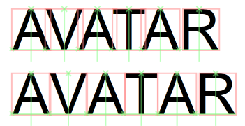

# Justification, Kerning, and Spacing

Starting with Windows 8, [DirectWrite](direct-write-portal.md) provides a number of features that allow you to control basic typographic, layout, and spacing features, such as character spacing, pair kerning, and justification.

## Character spacing

Character spacing, also known as "tracking", is the spacing between characters in a run of text.

Here is an example of tracking. The first line applies no tracking to the text. The second line increases character spacing, and the third line decreases the character spacing.

Starting with Windows 8, [DirectWrite](direct-write-portal.md) adds these methods here to control the spacing of characters in your text.

If you are using the [DirectWrite](direct-write-portal.md) layout, you can use the [**IDWriteTextLayout1::GetCharacterSpacing**](/windows/win32/api/dwrite_1/nf-dwrite_1-idwritetextlayout1-getcharacterspacing) and [**IDWriteTextLayout1::SetCharacterSpacing**](/windows/win32/api/dwrite_1/nf-dwrite_1-idwritetextlayout1-setcharacterspacing) methods for this purpose.

Use the [**GetCharacterSpacing**](/windows/win32/api/dwrite_1/nf-dwrite_1-idwritetextlayout1-getcharacterspacing) method to determine the current character spacing and it returns the current character, the spacing before and after the character, the minimum advance width, and a [**DWRITE\_TEXT\_RANGE**](/windows/win32/api/dwrite/ns-dwrite-dwrite_text_range) structure that contains information about the starting position and length of the remaining text.

Use the [**SetCharacterSpacing**](/windows/win32/api/dwrite_1/nf-dwrite_1-idwritetextlayout1-setcharacterspacing) on a [**DWriteTextLayout1**](/windows/win32/api/dwrite_1/nn-dwrite_1-idwritetextlayout1) interface to apply your own character spacing to the text in the layout. The **SetCharacterSpacing** method takes in the amount of space you want before and after the character, the minimum advance allowed, and a [**DWRITE\_TEXT\_RANGE**](/windows/win32/api/dwrite/ns-dwrite-dwrite_text_range) that defines the range to apply the spacing.

If you are using a custom layout, [DirectWrite](direct-write-portal.md) has support for setting character spacing with [**IDWriteTextAnalyzer1::ApplyCharacterSpacing**](/windows/win32/api/dwrite_1/nf-dwrite_1-idwritetextanalyzer1-applycharacterspacing). Use this method if you require a custom text layout in order to have advanced control over your layout. This method allows you to provide **ApplyCharacterSpacing** with the leading and trailing spacing, minimum advance width, length of the cluster map, number of glyphs, mapping from character ranges to glyphs, and advance width of each glyph if you use a custom layout. The method returns the modified glyph advances and a [**DWRITE\_GLYPH\_OFFSET**](/windows/win32/api/dwrite/ns-dwrite-dwrite_glyph_offset) enumeration with the new offsets to the origin of each glyph.

## Kerning

Kerning is the contextual spacing adjustment between pairs or triplets of letters. Specific spacing between sets of characters can increase readability and make text look better. The important difference between kerning and character spacing is the fact that letter spacing is agnostic to the text it spaces, while kerning is used in certain situations between certain pairs of characters as defined in the font.

The image her is an example of kerning. The word AVATAR on the top line is kerned in order to make the word look more natural. As you can see from the red boxes around the characters, there is more spacing applied between the first four letters, while the R on the end has more space before it. The original text without kerning is on the second line. The kerning in this example makes the word more readable and more natural.

The character advances between pairs of characters that the font kerns are stored in the kern table and [DirectWrite](direct-write-portal.md) parses that table and returns the information to you through the kerning APIs.

If you want to know whether or not a font supports pair kerning, you can use the [**IDWriteFontFace1::HasKerningPairs**](/windows/win32/api/dwrite_1/nf-dwrite_1-idwritefontface1-haskerningpairs) method. This method returns a bool value of 1 if the font supports kerning pairs.

The [**IDWriteFontFace1**](/windows/win32/api/dwrite_1/nn-dwrite_1-idwritefontface1) also has a method that allows you to get access to the kerning pair adjustments for glyph indices. [**GetKerningPairAdjustments**](/windows/win32/api/dwrite_1/nf-dwrite_1-idwritefontface1-getkerningpairadjustments) allows you to input an array of glyph indices and [DirectWrite](direct-write-portal.md) returns an array of glyph advance adjustments. If a font doesn't support the kern table, the method returns zeroes for the glyph advance adjustments.

If you are using the [DirectWrite](direct-write-portal.md) layout, there are two methods on the [**IDWriteTextLayout1**](/windows/win32/api/dwrite_1/nn-dwrite_1-idwritetextlayout1) interface that allow you to set pair kerning and learn more about pair kerning in the layout. The [**SetPairKerning**](/windows/win32/api/dwrite_1/nf-dwrite_1-idwritetextlayout1-setpairkerning) method takes in a Boolean representation of whether or not you want pair kerning enabled and a [**DWRITE\_TEXT\_RANGE**](/windows/win32/api/dwrite/ns-dwrite-dwrite_text_range) that defines the range of text to apply it to. If you want to learn whether or not pair kerning is enabled on a text range you can use the [**GetPairKerning**](/windows/win32/api/dwrite_1/nf-dwrite_1-idwritetextlayout1-getpairkerning) method, which takes in the current position and returns a bool corresponding to whether or not pair kerning is enabled, and the text range that the kerning setting applies to.

## Justification

Justification is the process of aligning text so that it fills all the space within a column by increasing the advances between characters or glyph clusters or adding justification characters to achieve the same effect. In general, this is accomplished by determining where space needs to be added to a line of text, and inserting spacing characters in those breaking opportunities. These spacing elements can differ as well, in Latin scripts, text is justified by increasing the advance widths between elements, while in Arabic, text is justified with a kashida. Here is an example of Arabic and Latin script both justified and not justified.

Starting with Windows 8, [DirectWrite](direct-write-portal.md) has a number of methods that allow you to justify text in your apps.

There is an additional value in the [**DWRITE\_TEXT\_ALIGNMENT**](/windows/win32/api/dwrite/ne-dwrite-dwrite_text_alignment) enumeration. You can use the [**SetTextAlignment**](/windows/win32/api/dwrite/nf-dwrite-idwritetextformat-settextalignment) method and pass in the **DWRITE\_TEXT\_ALIGNMENT\_JUSTIFIED** constant and [DirectWrite](direct-write-portal.md) justifies the text and inserts the appropriate justification character for the script.

If you are using a custom layout have a number of methods available so you can take advantage of justification. [DirectWrite](direct-write-portal.md) has three methods on the [**IDWriteTextAnalyzer1**](/windows/win32/api/dwrite_1/nn-dwrite_1-idwritetextanalyzer1) interface that you can use to add justification to a custom layout.

The first method is [**GetJustificationOpportunities**](/windows/win32/api/dwrite_1/nf-dwrite_1-idwritetextanalyzer1-getjustificationopportunities), which takes in the text that you want to justify and returns a [**DWRITE\_JUSTIFICATION\_OPPORTUNITY**](/windows/win32/api/Dwrite_1/ns-dwrite_1-dwrite_justification_opportunity) structure that outlines where justification characters can be added to justify the text.

The second function is [**JustifyGlyphAdvances**](/windows/win32/api/dwrite_1/nf-dwrite_1-idwritetextanalyzer1-justifyglyphadvances), which justifies an array of glyph advances so that they fit the line width. This method takes in the [**DWRITE\_JUSTIFICATION\_OPPORTUNITY**](/windows/win32/api/Dwrite_1/ns-dwrite_1-dwrite_justification_opportunity) structure that [**GetJustificationOpportunities**](/windows/win32/api/dwrite_1/nf-dwrite_1-idwritetextanalyzer1-getjustificationopportunities) generates, the glyph advances, and the glyph offsets. It then generates the justified glyph advances and a [**DWRITE\_GLYPH\_OFFSET**](/windows/win32/api/dwrite/ns-dwrite-dwrite_glyph_offset) enumeration that contains the justified glyph offsets.

The third function is [**GetJustifiedGlyphs**](/windows/win32/api/dwrite_1/nf-dwrite_1-idwritetextanalyzer1-getjustifiedglyphs), which fills in the new glyphs for complex scripts where justification has increased the advances for glyphs. **GetJustifiedGlyphs** only needs to be called if the script has a specific justification character as returned by [**GetScriptProperties**](/windows/win32/api/dwrite_1/nf-dwrite_1-idwritetextanalyzer1-getscriptproperties). This method takes in information about the font, length of the text, em size of the glyphs, script of the text, number of glyphs, cluster map, original glyph advances/offsets, justified glyph advances/offsets, and glyph properties. The method returns the actual glyph count, updated cluster map, updated glyph indices with inserted justification glyphs, updated glyph offsets, and updated glyph advances.

 

 