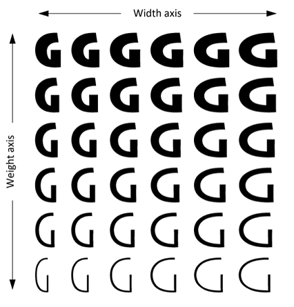

# OpenType Variable Fonts

This topic describes OpenType variable fonts, their support in DirectWrite and Direct2D, and how to use them in your app. 

-   [What are OpenType variable fonts?](#what-are-opentype-variable-fonts)
-   [OpenType variable font support in DirectWrite](#opentype-variable-font-support-in-directwrite)
-   [Using OpenType variable fonts](#using-opentype-variable-fonts)

## What are OpenType variable fonts?

Version 1.8 of the [OpenType font format specification](https://www.microsoft.com/typography/otspec/) introduced a new extension to the format known as [OpenType Font Variations](/typography/opentype/spec/otvaroverview). Fonts that use these extensions are known as OpenType variable fonts. An OpenType variable font is a single font that can behave like several fonts by using continuous interpolation between different designs, all defined within the single font.

An OpenType variable font can define continuous variation of its design along one or more independent axes, such as weight or width: 

 

A font developer determines a set of variation axes to use in a given font. These axes can include a set of well-known (or “registered”) axes of variation, such as weight and width, but they can also include arbitrary, custom axes of variation defined by the font developer.  

By selecting a set of variation axes for a font, the font developer defines an abstract, n-dimensional space of design variation for the font. Text engines can specify potentially any position, or “instance”, within that continuous space for laying out and rendering text. 

The font developer can also select and assign names to particular instances within the design-variation space; these are referred to as “named instances”. For example, a font with weight variation may support continuous variation between very light and very heavy strokes, while the font developer has selected particular weights along that continuum and assigned names to them, such as “Light”, “Regular” and “Semibold”. 

The OpenType variable font format uses data tables found in traditional OpenType fonts plus certain additional tables that describe how the values of various data items change for different instances. The format designates one variation instance as a “default instance”, which uses traditional tables to get default values. All other instances depend on the default data plus other delta data. For example, a ‘glyf’ table can have a Bezier-curve description of a nominal glyph shape, which is the shape used for the default instance, while a ‘gvar’ table will describe how the Bezier control points for the glyph are adjusted for other instances. Similarly, other font values can have a nominal value plus delta data describing how those values change for different instances; for example, x-height and other font-wide metrics, or glyph-specific mark-anchoring positions and kerning adjustments. 

Because variable fonts can support an arbitrary set of variation axes, they require an extensible model of font families that more directly reflects how font designers create families of fonts: a font family is defined by a family name and certain design characteristics that are constant, with an arbitrary number (determined by the font developer) of ways in which the design can vary. One font family may be created with variants for weight, but a different font family may be created with variants for x-height, serif-size, “funkiness”, or whatever the font developer wishes. In this model, a font face selection is best described using the general, or “preferred” or "typographic", family name plus a set of key-value pairs, each representing a kind of variation and specific value, with the kinds of variation in general being an extensible set. This general notion of a font family can apply to traditional, non-variable fonts as well as to variable fonts. For example, under this general, typographic family model, a family "Selawik VF" might have variations for weight, optical size and serif design, with instances such as "Semilight Banner Sans". 

Some existing software implementations, however, including existing DirectWrite APIs, may be designed assuming a more limited model of font families. For example, some applications may assume that a font family can have, at most, Regular, Bold, Italic and Bold Italic variants. The existing [**IDWriteFontCollection**](/windows/win32/api/dwrite/nn-dwrite-idwritefontcollection) and [**IDWriteFontFamily**](/windows/win32/api/dwrite/nn-dwrite-idwritefontfamily) interfaces assume a weight/stretch/style (“WSS”) family model, allowing for variants within a family to be specified using the [**DWRITE\_FONT\_WEIGHT**](/windows/win32/api/dwrite/ne-dwrite-dwrite_font_weight), [**DWRITE\_FONT\_STRETCH**](/windows/win32/api/dwrite/ne-dwrite-dwrite_font_stretch) or [**DWRITE\_FONT\_STYLE**](/windows/win32/api/dwrite/ne-dwrite-dwrite_font_style) enumerations as parameters. Taking the previous example, the optical size and serif axes would not be treated as family-internal axes of variation in the WSS model. 

Complete support for variable fonts would require APIs that allow a family member to be specified with potentially several parameters, as determined by the font. But existing API designs may be able to provide partial support for variable fonts by projecting the named instances defined in a variable font into the more-limited font-family models. In the previous example, "Selawik VF Semilight Banner Sans" could be projected into the WSS model as a "Selawik VF Banner Sans" family with "Semilight" as a weight variant. 

For another example, consider a typographic font family such as Sitka, with weight and optical size variants. Named variants within the family include Sitka Text Regular and Sitka Banner Bold (plus many others). The typographic family name is “Sitka” while the face names for these variants in the typographic family model would be “Text Regular” and “Banner Bold”. The four-member and WSS family models do not allow for optical size variants within a family, and so optical-size distinctions must be treated like family-level distinctions. The following table illustrates how a selection of fonts from the Sitka typographic family would be treated in the WSS family model: 

Typographic family model

WSS family model

Family

Face

Family

Face

Sitka

Text Regular

Sitka Text

Regular

Sitka

Banner Bold

Sitka Banner

Bold

Sitka

Caption Italic

Sitka Caption

Italic

 

The projection of names from a typographic family model to the WSS family model can be applied to non-variable fonts, and to the named instances of variable fonts. This cannot be done, however, for other, non-named instances from the continuous design-variation space of a variable font. For this reason, support for the complete functionality of variable fonts will require APIs designed to reference faces within a typographic family in terms of an unconstrained set of variation axes and axis values. 

## OpenType variable font support in DirectWrite

As of the release of the Windows 10 Creators Update, the OpenType variable font format is still very new, and font vendors, platforms and apps are still in the process of implementing the new format. This update provides initial implementation for this format in DirectWrite. 

DirectWrite internals have been updated to support OpenType variable fonts. Using current APIs, this provides support for any named instances of a variable font. This support can be used for complete workflows — from enumeration of the named instances, selection of a named instance, use in layout and shaping, to rendering and printing. For the benefit of apps that also use GDI text interop for certain operations, similar support has also been added in existing GDI APIs. 

In the Windows 10 Creators Update, DirectWrite does not support arbitrary instances that utilize the continuous-variation capability of variable fonts.

In many operations, the behavior in DirectWrite of named instances of a variable font cannot be distinguished from the behavior of non-variable fonts. And since support is provided using existing DirectWrite APIs, the named instances of variable fonts can even work in many existing DirectWrite apps without any changes. Exceptions may apply, however, in certain situations:  

-   If an app processes font data directly for certain operations. For example, if an app reads glyph outline data directly from the font file to create certain visual effects.
-   If an app uses a third-party library for certain operations. For example, if an app uses DirectWrite for layout, to get final glyph indices and positions, but then uses a third-party library for rendering.
-   If an app embeds font data into a document or in some other way passes font data to a downstream process.

If operations are performed using implementations that do not support variable fonts, then these operations may not produce the expected results. For example, glyph positions might be calculated for one named instance of the variable font, but the glyphs might be rendered assuming a different named instance. Depending on application implementation, results may work in some contexts but not in other contexts in which other libraries may be used. For example, text may display correctly on screen, but not when printed. If end-to-end workflows are implemented using only DirectWrite, then correct behavior for named instances of a variable font can be expected. 

Since existing DirectWrite APIs support face selection using the weight/stretch/style model, the named instances of fonts that use other axes of variation will be projected from the general, typographic family model into the WSS model, as described above. This relies on a variable font including a “style attributes” (‘STAT’) table with axis-value subtables, which DWrite uses to distinguish face name tokens that designate weight, stretch or style attributes from tokens that pertain to other axes of variation.  

If a variable font does not include a ‘STAT’ table, as required for variable fonts by the OpenType specification, then DirectWrite will treat the font as a non-variable font containing only the default instance.  

If a font does contain a ‘STAT’ table but it does not include appropriate axis-value subtables, this may lead to unexpected results, such as having multiple faces that have identical face names. Such fonts are not supported at this time. 

The OpenType specification allows for glyph outline data to be represented in one of two formats: using a ‘glyf’ table, which uses TrueType outline and hinting format, or using a ‘CFF’ table, which uses Compact Font Format (“CFF”) representation. In a variable font with TrueType outlines, the ‘glyf’ table continues to be used, and is supplemented with a ‘gvar’ table that supplies the variation data for the outlines. This means that the default instance of a variable font with TrueType outlines uses only traditional OpenType tables that will be supported in older software that has no variable font support. In a variable font with CFF outlines, however, the ‘CFF’ table is superseded by the ‘CFF2’ table, which encapsulates the default outline data and the associated variation data in one table. CFF data is processed by a separate rasterizer from that used for TrueType data, and a ‘CFF2’ table requires an updated CFF rasterizer that has ‘CFF2’ support. A ‘CFF2’ table cannot be processed by older CFF rasterizers. For a variable font with CFF outline data, this means that even the default instance will not work in older software. 

In the Windows 10 Creators Update, DirectWrite does not support variable fonts with CFF outline data using the ‘CFF2’ table. 

## Using OpenType variable fonts

OpenType variable fonts can be easy to use, keeping in mind the current limitations noted above: 

-   Only named instances of a variable font are supported at this time.
-   Only variable fonts that use TrueType glyph outline data (not CFF outlines) are supported at this time. 
-   For fonts that use axes of design variation other than weight, stretch or style, named instances will get projected into the WSS family model, which may result in some named instances appearing as separate families (as would happen in the past for non-variable fonts). To support this, variable fonts must have a ‘STAT’ table that includes appropriate axis-value subtables.
-   Named instances of variable fonts are supported in DirectWrite APIs, but if certain operations are performed in older implementations that do not support variable fonts, those may produce incorrect results. 
-   Certain DirectWrite APIs use the [**DWRITE\_FONT\_WEIGHT**](/windows/win32/api/dwrite/ne-dwrite-dwrite_font_weight), [**DWRITE\_FONT\_STRETCH**](/windows/win32/api/dwrite/ne-dwrite-dwrite_font_stretch) and [**DWRITE\_FONT\_STYLE**](/windows/win32/api/dwrite/ne-dwrite-dwrite_font_style) enumerations for specifying weight, stretch and style attributes when selecting faces. If a variable font uses corresponding variation axes but has many named instances that require finer granularity, not all of the named instances will be selectable in those APIs.

OpenType variable fonts that conform to these requirements can be installed from the Windows shell just like other OpenType fonts, and can also be used in custom font sets created by an app.  

When installed in the system, all named instances of a variable font will be included in the font set returned by calling the IDWriteFontFamily3::[**GetSystemFontSet**](/windows/win32/api/dwrite_3/nf-dwrite_3-idwritefactory3-getsystemfontset) method. Note that a font set is a flat list without a family-grouping hierarchy, but each item in the set has a family-name property based on the WSS family model. The font set can be filtered for a particular variable-font named instance using the [**IDWriteFontSet::GetMatchingFonts**](idwritefontset-getmatchingfonts-overload.md) methods. If using the **GetMatchingFonts** overload that takes a familyName, though, the familyName specified must use the name conforming to the WSS font-family model. The complete list of WSS-compatible family names occurring in a font set can be obtained using the [**IDWriteFontSet::GetPropertyValues**](/windows/win32/api/dwrite_3/nf-dwrite_3-idwritefontset-getpropertyvalues(dwrite_font_property_id_idwritestringlist)) methods using DWRITE\_FONT\_PROPERTY\_ID\_FAMILY\_NAME.  

Similarly, all of the named instances of a variable font will be represented in the font collection returned by the IDWriteFactory::[**GetSystemFontCollection**](/windows/win32/api/dwrite/nf-dwrite-idwritefactory-getsystemfontcollection) method. Because the elements of a font collection are font families based on the WSS model, the named instances of a variable font may be represented in a collection as members of two or more font families. If the [**IDWriteFontCollection::FindFamilyName**](/windows/win32/api/dwrite/nf-dwrite-idwritefontcollection-findfamilyname) method is used, the familyName parameter must be a WSS-compatible family name. To find all of the WSS-compatible family names from a font collection, an app can loop through each family and call [**IDWriteFontFamily::GetFamilyNames**](/windows/win32/api/dwrite/nf-dwrite-idwritefontfamily-getfamilynames), though it may be easier to obtain a corresponding font set and use the [**GetPropertyValues**](/windows/win32/api/dwrite_3/nf-dwrite_3-idwritefontset-getpropertyvalues(dwrite_font_property_id_idwritestringlist)) method as described above. 

When working with custom fonts, various approaches described in the [Custom Font Sets](custom-font-sets-win10.md) topic can be used to create a font set. To add a variable font to a custom font set, the [**IDWriteFontSetBuilder1::AddFontFile**](/windows/win32/api/dwrite_3/nf-dwrite_3-idwritefontsetbuilder1-addfontfile) method is recommended since it supports variable fonts and will add all of the named instances of a variable font in a single call. There is no way at this time to add individual named instances of a custom variable font to a font set using the [**IDWriteFontSetBuilder::AddFontFaceReference**](/windows/win32/api/dwrite_3/nf-dwrite_3-idwritefontsetbuilder-addfontfacereference(idwritefontfacereference)) methods since there is no way to create a font face reference specifying which of the named instances from a variable font file is intended. This means that currently there is no way to add named instances of a custom font to a custom font set with custom properties assigned. That in turn means that custom variable fonts currently cannot easily be used in conjunction with DirectWrite APIs for remote fonts. If named instances of a variable font are included in a system font set, however, font face references for each named instance will already exist, and these can be added to custom font sets, including with the use of custom property values. See the Custom Font Sets topic for more details. 

When working with variable fonts, the DirectWrite [**DWRITE\_FONT\_WEIGHT**](/windows/win32/api/dwrite/ne-dwrite-dwrite_font_weight) and [**DWRITE\_FONT\_STRETCH**](/windows/win32/api/dwrite/ne-dwrite-dwrite_font_stretch) enumerations are closely connected to the weight and width variation axes defined in the OpenType specification, but are not the same. First, the numeric scale for any variation axis always supports fractional values, while fontWeight and fontStretch use integers. The OpenType weight axis scale uses values ranging from 1 to 1000, which is also supported by fontWeight. Thus the change from a variation weight axis value to fontWeight is relatively minor: the fontWeight reported for a named instance may be rounded from the precise value used to define the named instance within the font. The distinction between DirectWrite fontStretch and the OpenType width axis scale is greater: DirectWrite uses values from 1 to 9, following the [usWidthClass](/typography/opentype/spec/os2#uswidthclass) values of the OpenType OS/2 table, while the OpenType width axis scale uses positive values representing a percentage of normal width. The [usWidthClass](/typography/opentype/spec/os2#uswidthclass) documentation in the OpenType specification provides a mapping between values 1 to 9 and percent-of-normal values. The fontStretch value reported for a named instance may involve rounding when converting from width axis values. 

When creating an [**IDWriteTextFormat**](/windows/win32/api/dwrite/nn-dwrite-idwritetextformat), a font collection and WSS-compatible font properties (family name, weight, stretch and style) must be specified. This also applies when setting font formatting properties on a [**IDWriteTextLayout**](/windows/win32/api/dwrite/nn-dwrite-idwritetextlayout) text range. The properties can be obtained from an [**IDWriteFontFace3**](/windows/win32/api/dwrite_3/nn-dwrite_3-idwritefontface3) object or from [**IDWriteFont**](/windows/win32/api/dwrite/nn-dwrite-idwritefont) and [**IDWriteFontFamily**](/windows/win32/api/dwrite/nn-dwrite-idwritefontfamily) objects that represent a particular named instance. As observed above, the values returned by the GetWeight and GetStretch methods may be rounded approximations for the actual axis values used to define the named instance, but DirectWrite will map the combination of properties back to the desired named instance. 

Similarly, if an app uses [**IDWriteFontFallbackBuilder**](idwritefontfallbackbuilder.md) to create custom font fallback data, families are specified for character-range mappings using WSS-compatible family names. Font fallback within DirectWrite is based on families with DirectWrite selecting a variant within a fallback family that is a nearest match for the variant of the starting family. For variants that involve dimensions other than weight, stretch and style, DirectWrite currently would not be able to select such variants within a fallback family unless custom fallback data were created specifically to provide fallback mappings for families that have particular non-WSS attributes, such as “Caption” optical size variants.

 

 