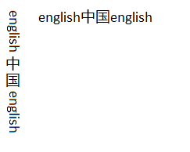

# Vertical Text

Starting with the Windows 8, [DirectWrite](direct-write-portal.md) has a number of new APIs that allow you to use vertical text in your apps.

## Drawing vertical text

You can draw vertical text with Direct2D by using the [**DrawTextLayout**](https://msdn.microsoft.com/library/windows/desktop/dd371913) methods. To draw the text vertically, pass [**DWRITE\_READING\_DIRECTION\_TOP\_TO\_BOTTOM**](/windows/desktop/api/dwrite/ne-dwrite-dwrite_reading_direction) to the [**IDWriteTextFormat::SetReadingDirection**](https://msdn.microsoft.com/en-us/library/Dd316705(v=VS.85).aspx) method and [**DWRITE\_FLOW\_DIRECTION\_RIGHT\_TO\_LEFT**](/windows/desktop/api/dwrite/ne-dwrite-dwrite_flow_direction) to the [**IDWriteTextFormatSetFlowDirection**](https://msdn.microsoft.com/en-us/library/Dd316691(v=VS.85).aspx) method. Then you can create and draw a vertical [**IDWriteTextLayout**](https://msdn.microsoft.com/en-us/library/Dd316718(v=VS.85).aspx) object.

## Analyzing character orientation

Every character has a preferred character orientation, or the direction that the character should be oriented in any directional layout. For example, in traditional horizontal layout, both the Latin text and the Chinese text are oriented vertically. On the other hand, in a vertical layout, the Chinese text remains upright, and the Latin text is rotated 90 degrees. This difference in orientation is seen in the example here.

To determine the orientation of the text you have, you need to implement the [**IDWriteTextAnalysisSink1**](https://msdn.microsoft.com/en-us/library/Hh780424(v=VS.85).aspx) and [**IDWriteTextAnalysisSource1**](https://msdn.microsoft.com/en-us/library/Hh780426(v=VS.85).aspx) interfaces. The source and sink take in the glyph runs and let you check if they are oriented vertically or not.

After you implement your source and sink, you call the [**AnalyzeVerticalGlyphOrientation**](https://msdn.microsoft.com/en-us/library/Hh780429(v=VS.85).aspx) method. In the example image, this function returns 3 runs: "English", "中国", and "English."

## Going from characters to glyphs

Now that you know the run contains vertical glyphs, you need to get access to those glyphs. In the example so far, there are 3 runs: one with vertical glyphs and two without. To transition from characters to glyphs, you call [**GetGlyphIndices**](https://msdn.microsoft.com/en-us/library/Dd370998(v=VS.85).aspx). This method returns the corresponding glyph indices for the characters in the example. Because the [**AnalyzeVerticalGlyphOrientation**](https://msdn.microsoft.com/en-us/library/Hh780429(v=VS.85).aspx) method returns a run with vertical glyphs, you need to call [**GetVerticalGlyphVariants**](https://msdn.microsoft.com/en-us/library/Hh780418(v=VS.85).aspx), which returns the vertically oriented glyph IDs in place of the current glyph IDs.

## Drawing text vertically

Finally, you need to lay out and draw the text. Because you're drawing the text vertically, you need to get some more info so that the Latin text is drawn correctly. If you draw all of the text along the central baseline, the Latin text appears to float in the middle of the line. You need access to both the central and Roman baseline to align the text correctly. Use the [**IDWriteTextAnalyzer1::GetBaseline**](https://msdn.microsoft.com/en-us/library/Hh780431(v=VS.85).aspx) method to get the numerical values of the baselines you specify. You can subtract the Roman baseline from the central baseline to get the offset between the two.

With all this info, you can draw the text on the screen. First, call the [**GetGlyphOrientationTransform**](https://msdn.microsoft.com/en-us/library/Hh780432(v=VS.85).aspx) method with the results from the [**IDWriteTextAnalysisSink1**](https://msdn.microsoft.com/en-us/library/Hh780424(v=VS.85).aspx) and [**IDWriteTextAnalysisSource1**](https://msdn.microsoft.com/en-us/library/Hh780426(v=VS.85).aspx) objects.

If you’re using [Direct2D](rendering-by-using-direct2d.md) you also need to set the world transform on the Direct2D render target for vertical rendering.

Finally, call [**DrawGlyphRun**](https://msdn.microsoft.com/en-us/library/Dd368167(v=VS.85).aspx) three times, once on each block of text. On the two blocks of text that are in English, you need to apply the offset that we calculated between the Roman and central baselines.

Now, the text in your app will be drawn vertically, with the correct glyph orientation.

 

 

