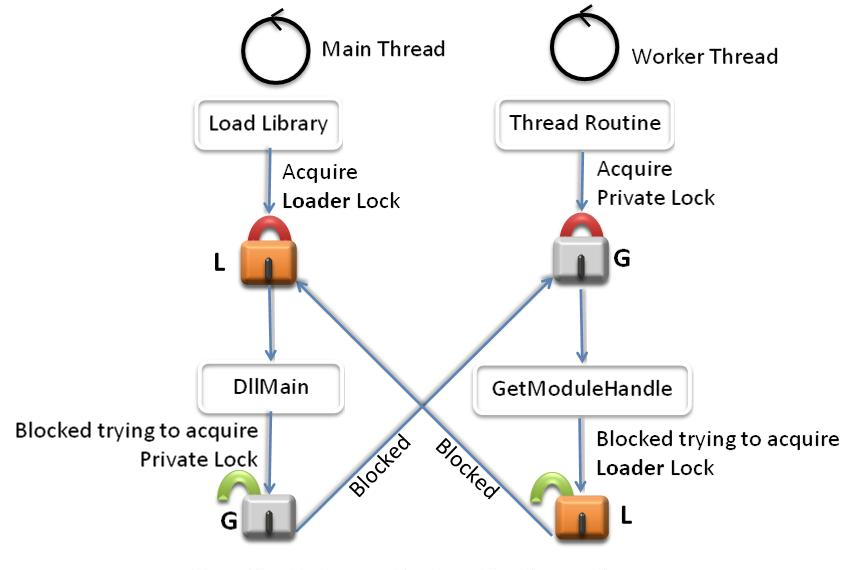

# Dynamic-Link Library Best Practices

**Updated: **

-   May 17, 2006

**Important APIs**

-   [**DllMain**](dllmain.md)
-   [**LoadLibraryEx**](/windows/desktop/api/LibLoaderAPI/nf-libloaderapi-loadlibraryexa)
-   [**CreateProcess**](/windows/desktop/api/processthreadsapi/nf-processthreadsapi-createprocessa)

Creating DLLs presents a number of challenges for developers. DLLs do not have system-enforced versioning. When multiple versions of a DLL exist on a system, the ease of being overwritten coupled with the lack of a versioning schema creates dependency and API conflicts. Complexity in the development environment, the loader implementation, and the DLL dependencies has created fragility in load order and application behavior. Lastly, many applications rely on DLLs and have complex sets of dependencies that must be honored for the applications to function properly. This document provides guidelines for DLL developers to help in building more robust, portable, and extensible DLLs.

Improper synchronization within [**DllMain**](dllmain.md) can cause an application to deadlock or access data or code in an uninitialized DLL. Calling certain functions from within **DllMain** causes such problems.

## General Best Practices

[**DllMain**](dllmain.md) is called while the loader-lock is held. Therefore, significant restrictions are imposed on the functions that can be called within **DllMain**. As such, **DllMain** is designed to perform minimal initialization tasks, by using a small subset of the Microsoft® Windows® API. You cannot call any function in **DllMain** that directly or indirectly tries to acquire the loader lock. Otherwise, you will introduce the possibility that your application deadlocks or crashes. An error in a **DllMain** implementation can jeopardize the entire process and all of its threads.

The ideal [**DllMain**](dllmain.md) would be just an empty stub. However, given the complexity of many applications, this is generally too restrictive. A good rule of thumb for **DllMain** is to postpone as much initialization as possible. Lazy initialization increases robustness of the application because this initialization is not performed while the loader lock is held. Also, lazy initialization enables you to safely use much more of the Windows API.

Some initialization tasks cannot be postponed. For example, a DLL that depends on a configuration file should fail to load if the file is malformed or contains garbage. For this type of initialization, the DLL should attempt the action and fail quickly rather than waste resources by completing other work.

You should never perform the following tasks from within [**DllMain**](dllmain.md):

-   Call [**LoadLibrary**](/windows/win32/api/libloaderapi/nf-libloaderapi-loadlibrarya) or [**LoadLibraryEx**](/windows/desktop/api/LibLoaderAPI/nf-libloaderapi-loadlibraryexa) (either directly or indirectly). This can cause a deadlock or a crash.
-   Call [**GetStringTypeA**](/windows/desktop/api/winnls/nf-winnls-getstringtypea), [**GetStringTypeEx**](/windows/win32/api/stringapiset/nf-stringapiset-getstringtypeexw), or [**GetStringTypeW**](/windows/desktop/api/stringapiset/nf-stringapiset-getstringtypew) (either directly or indirectly). This can cause a deadlock or a crash.
-   Synchronize with other threads. This can cause a deadlock.
-   Acquire a synchronization object that is owned by code that is waiting to acquire the loader lock. This can cause a deadlock.
-   Initialize COM threads by using [**CoInitializeEx**](/windows/desktop/api/combaseapi/nf-combaseapi-coinitializeex). Under certain conditions, this function can call [**LoadLibraryEx**](/windows/desktop/api/LibLoaderAPI/nf-libloaderapi-loadlibraryexa).
-   Call the registry functions.
-   Call [**CreateProcess**](/windows/desktop/api/processthreadsapi/nf-processthreadsapi-createprocessa). Creating a process can load another DLL.
-   Call [**ExitThread**](/windows/win32/api/libloaderapi/nf-libloaderapi-freelibraryandexitthread). Exiting a thread during DLL detach can cause the loader lock to be acquired again, causing a deadlock or a crash.
-   Call [**CreateThread**](/windows/desktop/api/processthreadsapi/nf-processthreadsapi-createthread). Creating a thread can work if you do not synchronize with other threads, but it is risky.
-   Create a named pipe or other named object (Windows 2000 only). In Windows 2000, named objects are provided by the Terminal Services DLL. If this DLL is not initialized, calls to the DLL can cause the process to crash.
-   Use the memory management function from the dynamic C Run-Time (CRT). If the CRT DLL is not initialized, calls to these functions can cause the process to crash.
-   Call functions in User32.dll or Gdi32.dll. Some functions load another DLL, which may not be initialized.
-   Use managed code.

The following tasks are safe to perform within **DllMain**:

-   Initialize static data structures and members at compile time.
-   Create and initialize synchronization objects.
-   Allocate memory and initialize dynamic data structures (avoiding the functions listed above.)
-   Set up thread local storage (TLS).
-   Open, read from, and write to files.
-   Call functions in Kernel32.dll (except the functions that are listed above).
-   Set global pointers to NULL, putting off the initialization of dynamic members. In Microsoft Windows Vista™, you can use the one-time initialization functions to ensure that a block of code is executed only once in a multithreaded environment.

## Deadlocks Caused by Lock Order Inversion

When you are implementing code that uses multiple synchronization objects such as locks, it is vital to respect lock order. When it is necessary to acquire more than one lock at a time, you must define an explicit precedence that is called a lock hierarchy or lock order. For example, if lock A is acquired before lock B somewhere in the code, and lock B is acquired before lock C elsewhere in the code, then the lock order is A, B, C and this order should be followed throughout the code. Lock order inversion occurs when the locking order is not followed—for example, if lock B is acquired before lock A. Lock order inversion can cause deadlocks that are difficult to debug. To avoid such problems, all threads must acquire locks in the same order.

It is important to note that the loader calls [**DllMain**](dllmain.md) with the loader lock already acquired, so the loader lock should have the highest precedence in the locking hierarchy. Also note that code only has to acquire the locks it requires for proper synchronization; it does not have to acquire every single lock that is defined in the hierarchy. For example, if a section of code requires only locks A and C for proper synchronization, then the code should acquire lock A before it acquires lock C; it is not necessary for the code to also acquire lock B. Furthermore, DLL code cannot explicitly acquire the loader lock. If the code must call an API such as [**GetModuleFileName**](/windows/win32/api/libloaderapi/nf-libloaderapi-getmodulefilenamea) that can indirectly acquire the loader lock and the code must also acquire a private lock, then the code should call **GetModuleFileName** before it acquires lock P, thus ensuring that load order is respected.

Figure 2 is an example that illustrates lock order inversion. Consider a DLL whose main thread contains [**DllMain**](dllmain.md). The library loader acquires the loader lock L and then calls into **DllMain**. The main thread creates synchronization objects A, B, and G to serialize access to its data structures and then tries to acquire lock G. A worker thread that has already successfully acquired lock G then calls a function such as GetModuleHandle that attempts to acquire the loader lock L. Thus, the worker thread is blocked on L and the main thread is blocked on G, resulting in a deadlock.

To prevent deadlocks that are caused by lock order inversion, all threads should attempt to acquire synchronization objects in the defined load order at all times.

## Best Practices for Synchronization

Consider a DLL that creates worker threads as part of its initialization. Upon DLL cleanup, it is necessary to synchronize with all the worker threads to ensure that the data structures are in a consistent state and then terminate the worker threads. Today, there is no straightforward way to completely solve the problem of cleanly synchronizing and shutting down DLLs in a multithreaded environment. This section describes the current best practices for thread synchronizing during DLL shutdown.

Thread Synchronization in [**DllMain**](dllmain.md) during Process Exit

-   By the time [**DllMain**](dllmain.md) is called at process exit, all the process’s threads have been forcibly cleaned up and there is a chance that the address space is inconsistent. Synchronization is not required in this case. In other words, the ideal DLL\_PROCESS\_DETACH handler is empty.
-   Windows Vista ensures that core data structures (environment variables, current directory, process heap, and so on) are in a consistent state. However, other data structures can be corrupted, so cleaning memory is not safe.
-   Persistent state that needs to be saved must be flushed to permanent storage.

Thread Synchronization in **DllMain** for DLL\_THREAD\_DETACH during DLL Unload

-   When the DLL is unloaded, the address space is not thrown away. Therefore, the DLL is expected to perform a clean shutdown. This includes thread synchronization, open handles, persistent state, and allocated resources.
-   Thread synchronization is tricky because waiting on threads to exit in [**DllMain**](dllmain.md) can cause a deadlock. For example, DLL A holds the loader lock. It signals thread T to exit and waits for the thread to exit. Thread T exits and the loader tries to acquire the loader lock to call into DLL A’s **DllMain** with DLL\_THREAD\_DETACH. This causes a deadlock. To minimize the risk of a deadlock:
    -   DLL A gets a DLL\_THREAD\_DETACH message in its [**DllMain**](dllmain.md) and sets an event for thread T, signaling it to exit.
    -   Thread T finishes its current task, brings itself to a consistent state, signals DLL A, and waits infinitely. Note that the consistency-checking routines should follow the same restrictions as [**DllMain**](dllmain.md) to avoid deadlocking.
    -   DLL A terminates T, knowing that it is in a consistent state.

If a DLL is unloaded after all its threads have been created, but before they begin executing, the threads may crash. If the DLL created threads in its **DllMain** as part of its initialization, some threads may not have finished initialization and their DLL\_THREAD\_ATTACH message is still waiting to be delivered to the DLL. In this situation, if the DLL is unloaded, it will begin terminating threads. However, some threads may be blocked behind the loader lock. Their DLL\_THREAD\_ATTACH messages are processed after the DLL has been unmapped, causing the process to crash.

## Recommendations

The following are recommended guidelines:

-   Use Application Verifier to catch the most common errors in [**DllMain**](dllmain.md).
-   If using a private lock inside [**DllMain**](dllmain.md), define a locking hierarchy and use it consistently. The loader lock must be at the bottom of this hierarchy.
-   Verify that no calls depend on another DLL that may not have been fully loaded yet.
-   Perform simple initializations statically at compile time, rather than in [**DllMain**](dllmain.md).
-   Defer any calls in [**DllMain**](dllmain.md) that can wait until later.
-   Defer initialization tasks that can wait until later. Certain error conditions must be detected early so that the application can handle errors gracefully. However, there are tradeoffs between this early detection and the loss of robustness that can result from it. Deferring initialization is often best.

 

 
