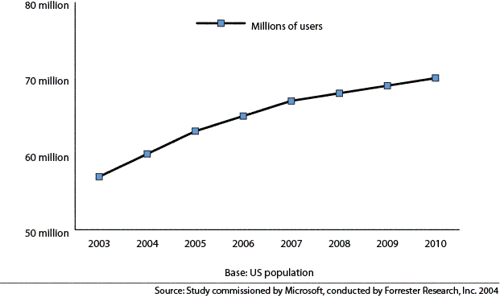

# Making Video Games Accessible: Business Justifications and Design Considerations

Game publishers and developers love to focus on features that will get their titles noticed by the mainstream gaming community, such as graphics and audio. But there is another audience, eager to take part in these games as well. These gamers come from the accessibility community   a community of people with disabilities, as well as those who care about their welfare.

This article is for game content developers and producers who want to reach the accessibility community market by adding basic accessibility features to help people with disabilities or impairments. The following topics will be discussed:

-   [What is Accessibility?](#what-is-accessibility)
-   [Why is Accessibility Important?](#why-is-accessibility-important)
-   [The State of Accessibility in the Games Industry](#the-state-of-accessibility-in-the-games-industry)
-   [The Need for Accessible Games](#the-need-for-accessible-games)
-   [Visual Impairments](#visual-impairments)
-   [Auditory Impairments](#auditory-impairments)
-   [Mobility Impairments](#mobility-impairments)
-   [Vocal Impairments](#vocal-impairments)
-   [Conclusion](#conclusion)
-   [More Resources](#more-resources)

## What is Accessibility?

Often, when people think of accessibility, they think of things like wheelchair ramps and closed captioning on television. This is because these sorts of accessibility features stand out and are used by those with obvious disabilities. However, accessibility features aren't designed just for those with the most severe disabilities. Among US computer users who range from 18 to 64 years old, 57% (74.2 million) are likely to benefit from the use of accessible technology due to disabilities and impairments that may impact computer use. ("[The Market for Accessible Technology: The Wide Range of Abilities and Its Impact on Computer Use](https://www.microsoft.com/enable/research/phase1.aspx)," Microsoft Corporation) Being able to turn up a payphone's volume allows people with mild hearing loss to use them. A hand rail on a flight of stairs allows a mobility-impaired person to climb them more easily.

Sometimes, regular features of a product end up being features that can help people with impairments. For instance, someone with a visual impairment can use the contrast settings on a television to make the screen easier to see. A person with Parkinson's disease can use one touch dialing to make it easier to make a telephone call.

Accessibility features generally tend to serve one of five types of disabilities:

-   Vision - Blindness, inability to distinguish colors, blurred Vision, and so on.
-   Hearing - Hard-of-hearing, deafness.
-   Speech - Speech impairments, language differences.
-   Mobility - Wrist, arm, leg, and hand impairments.
-   Cognitive - Learning impairments and reasoning challenges, including dyslexia.

In the context of video games, adding accessibility means making a title usable to someone with one of these disabilities.

## Why is Accessibility Important?

There are both social and financial reasons why game developers should think about making their products accessible.

For children and young adults who have disabilities that range from mild to severe, video games can offer a number of benefits. Researchers at the Wheeling Jesuit University recently discovered that playing sports games or fighting games helps distract children and young adults suffering from chronic pain (The Edmonton Journal, Feb 13th 2006). Furthermore, video games have been proven to help children facing surgery more effectively-and with fewer side effects-than tranquilizers (The Associated Press, Dec 19th 2004). Games are even being used for cancer treatment; exercise, vitally important to recovery after chemotherapy, has been encouraged through the use of games such as Dance Dance Revolution(c) when children refuse to participate in other forms of physical activity.

In addition, allowing people with impairments (especially children) to participate in activities that most individuals enjoy and take for granted can help reduce emotional pain and the feeling of being an outsider.

Social reasons aren't the only reasons why game developers should introduce accessibility features into their titles. Accessibility features can increase sales by encouraging people with disabilities to buy an accessible title. Increased sales can also come from gamers who want to support a company that supports the accessibility community. And finally, the positive P.R. from the media as well as accessibility advocacy groups provides free advertising.

The demand for accessibility will continue to grow as the gaming population ages. As people grow older, mild impairments can become more severe. Also, people are likely to develop new difficulties and impairments as they age. Adding basic accessibility features to titles can help publishers and developers continue to draw revenue from these customers.

## The State of Accessibility in the Games Industry

For most of the games industry, accessibility in video games is a low priority. One reason is because of a lack of awareness among developers about accessibility issues-developers who are not disabled might not be aware of the ways that they can make a title more accessible to people with disabilities or impairments.

Another reason is that developers have limited amounts of time and resources. Cost-benefit analyses often conclude that accessibility issues aren't worth the attention and investment of the games industry because of assumptions like:

-   The cost of implementing accessibility features isn't worth the return.
-   There isn't a wide-enough audience to make accessibility development worthwhile.

These assumptions are faulty. Making games accessible is well worth the investment.

## The Need for Accessible Games

In 2003, Microsoft Corporation commissioned Forrester Research, Inc., to conduct a comprehensive study to measure the current and potential market of accessible technology in the United States and understand how accessible technology is being used today. The study determined that 57% of computer users are likely or very likely to benefit from the use of accessible technology. And the future demand for accessibility is only projected to grow ("[Accessible Technology in Computing: Examining Awareness, Use, and Future Potential](https://www.microsoft.com/enable/research/phase2.aspx)," Microsoft Corporation).

**Figure 1. Predicted Growth in Number of Accessible Technology Users from 2003 to 2010**

The study also determined that the use of accessibility features was not restricted to people with disabilities. Among computer users who use built-in accessibility options and utilities:

-   32% have no disability or impairment.
-   68% have a mild or severe disability or impairment.

Empirical observation suggests this is not just a trend limited to PCs. Accessibility features are often used by people without any disability just to improve their game experience. For instance, a gamer could be compensating for a temporary disability (like a broken thumb), environmental issues (such as background noise), or other situational factors.

Given the potential increase in the use of accessibility technology, it is crucial to educate management, designers, developers, and testers. Many companies are looking for ways to expand into new markets outside of the 18-32 male demographic. While publishers mull over how to convince little Suzy to play games or Grandma and Grandpa to pick up a controller, there is a market comprised of people who want desperately to play mainstream games that is going unnoticed. The potential revenue to be gained from a relatively small amount of effort providing basic accessibility features in a title is very tangible.

Including basic accessibility features in a title can increase sales through a "domino effect"-for example, by reaching gamers who would normally be unable to play the title or would have their experience significantly diminished. By reaching these gamers, you also reach the accessibility community (which is known for a rapid sharing of information on accessible products and its loyal support of businesses that promote accessibility). By extension, businesses that take an active role in this community benefit from positive media exposure.

By not including accessibility features, you run the risk of potential boycotts and lawsuits-and the resulting loss of sales. Many retailers and airlines have been sued for lack of accessibility, and in the technology sector, the blind community boycotted Internet Explorer 4 for its lack of accessibility.

Below are different categories of disabilities. Each category includes some relatively easy-to-implement suggestions that can make a title accessible to a wider audience.

## Visual Impairments

*"My presentation was followed by a lively question and answer session, and one notable moment occurred when one of the staffers asked a question about accessibility in \[our\] games... this 28-year-old staffer is an avid gamer who used to play \[our game\] with a wide circle of friends. Because he is color blind, however, it was hard for him to tell the good guys from the bad guys and the game finally became too frustrating. When the new version... came out and \[we\] hadn't fixed the problem, he and his friends all decided to buy a competitor's game instead." an anonymous industry executive*

The term "visual impairment" often brings to mind someone who is completely blind. However, it is startling to know that 8.7% of the male population is affected by some level of color blindness ("[How do people inherit colorblindness? How often?](http://www.webexhibits.org/causesofcolor/2C.html)," WebExhibits.org). Another 1.2% of individuals are affected by more severe forms of visual impairment ("[Disability Info: Visual Impairments Fact Sheet](https://nichcy.org/disability/specific/visualimpairment)," National Dissemination Center for Children with Disabilities). That means almost one out of every ten potential gamers have issues affecting their eyesight that can impact their gaming experience.

To help you understand visual impairment issues, imagine that:

| You Are A Gamer      | And You Are In This Scenario                                                                                                                                                                         |
|----------------------|------------------------------------------------------------------------------------------------------------------------------------------------------------------------------------------------------|
| With normal vision   | It is bright and sunny so you can't see dark objects on your screen.   You have an old television set so you can't see small objects and text because of poor picture quality.   |
| With impaired vision | Some game text is so small you can't read it.   You are color blind so you don't know which button to press when the game tells you to press the red button.                     |

 

With a few simple steps and features, you can address these issues and improve the gaming experience for both gamers with normal vision and gamers with a visual impairment.

1.  Test titles on black and white televisions. Note any instances where items, players, objectives, and commands can't be distinguished and adjust your color palette accordingly.
2.  Give gamers an option to increase the size of text on their screen. Also provide the capability to change the scrolling rate of text. It is important to remember that the console experience is 10-foot, not the 2-foot gaming experience many PC developers are used to. Even for gamers with no vision problems, small UI and text can be difficult to read at long distances.
3.  Provide text-to-speech features that can voice all game text, including game menus that track focus on buttons. Allow the user to control the speed, pitch, and gender of the voice. To help prevent text-to-speech from being drowned out by other game noises, give users the ability to adjust the volume of speech, ambient noise, active game sounds, and music. Also, include the option to play distinct sounds when transitioning through menu items and over buttons.
4.  Finally, give gamers the option to change brightness and contrast settings in- game. Provide users with the ability to choose their own custom color schemes so that text, background, and HUD colors can be custom configured to suit an individual's needs.

## Auditory Impairments

*"Memories of Half-Life return to haunt us as yet another technological masterpiece \[Halo\] is useless to the deaf gamer... Let's hope, no pray! that if Halo 2 ever sees the light of day that it will be fully subtitled." www.DeafGamers.com*

The next most prevalent form of impairments that can affect game play is auditory impairments. In the U.S. alone, over 28 million people are affected by some sort of hearing impairment. While hearing impairments are often associated with age, 17 out of every 1,000 children under the age of 18 are affected with a hearing impairment ("[Statistics about Hearing Disorders, Ear Infections, and Deafness](https://www.nidcd.nih.gov/health/statistics/pages/hearing.aspx)," National Institute on Deafness and Other Communication Disorders). When one considers that the gamers of today are getting older and losing their hearing at an ever-increasing rate, it is clear that demand for audio accessibility will only grow.

To help you understand auditory impairment issues, imagine that:

| You Are A Gamer           | And You Are In This Scenario                                                                                                                                                                                                                                                            |
|---------------------------|-----------------------------------------------------------------------------------------------------------------------------------------------------------------------------------------------------------------------------------------------------------------------------------------|
| With normal hearing       | You don't want to disturb anyone so you play with the sound muted but you can't play the game because the directions are only given in audio.                                                                                                                                 |
| With a hearing impairment | You are gaming at a loud party but you can't tell that you are under fire because you can't hear the gun shots.  The game has a lot of ambient noise and you can't hear the verbal instructions given to you.                                                       |
| Who is deaf               | The audio commentary is so soft, you can't hear it, even in a quiet room.   All of your objectives are given to you in audio and you can't determine what you are supposed to do.   All of the storyline is given verbally, and you can't follow along.   |

 

With some relatively minor work, you can make your game usable and enjoyable for gamers with normal hearing and for gamers who have an auditory impairment.

1.  Close caption all dialogs. This includes in-game content and cinematics. Give the gamer the ability to turn these captions on and off.
2.  When a sound effect delivers vital information, provide a textual or tactile (vibration) mechanism for feedback as well. For example, if normally a bomb in your game makes a faster beeping noise close to its explosion, provide a visual indicator (such as a time bar) that also allows the gamer to know how much time is left before the explosion.
3.  If your game supports online play, give gamers the option to send text messages as well as use their voice to deliver information amongst team members and other online players. A headset is not useful to an individual who can't hear and, more and more, players are looking to play with other individuals with whom they can communicate and strategize online.

## Mobility Impairments

*"Videogames offer people with disabilities the opportunity to reconnect with their peers and abilities that have been lost or never had. My personal experience comes from being paralyzed at the age of 14 years old and visiting the recreational center in the hospital and the only interest I had to break out of my depression was to play the videogame system. I quickly lost interest when I learned I could not play them..." Robert Florio*

Mobility impairments are perhaps the hardest of the various impairments to get firm statistics on. This is primarily due to the fact that these impairments can be caused by disease, neurological disorders, loss of limbs/digits, paralysis, etc. which each can have a varying degree of impact on a video gamer's experience. These impairments may be congenital, or may occur later in life.

To help you understand auditory impairment issues, imagine that:

| You Are A Gamer                                 | And You Are In This Scenario                                                                                                                                                                                                                                                                                     |
|-------------------------------------------------|------------------------------------------------------------------------------------------------------------------------------------------------------------------------------------------------------------------------------------------------------------------------------------------------------------------|
| With no mobility impairment                     | The game controller has so many buttons, you (as a casual gamer) are intimidated and you don't want to learn how to use it.                                                                                                                                                                            |
| With a temporary mobility impairment            | You have a broken thumb so you can't use the thumbstick on your controller.   You have a broken leg so you can't use the dance pad for a dancing title.                                                                                                                                      |
| With a permanent and severe mobility impairment | You have lost an arm so you cannot use a two handed controller.   You have Parkinson's disease, your hands shake, and that makes you accidentally trigger buttons on the controller.   You are paralyzed from the neck down so you cannot use a standard game controller at all.   |

 

Thinking about accommodating all these gamers is challenging, but there are some easy things you can keep in mind when developing your games.

1.  Minimize button use and think more about menu interfaces for commands. This is particularly useful for individuals who may be missing digits or a hand. It is also useful for paralyzed individuals who use custom controllers.
2.  Allow gamers to customize their controller configuration and button/thumbstick sensitivity. This will allow individuals who have fine motor skills problems customize the controller to minimize the impact their disability has on game play. It also allows for better support of custom controllers for people with disabilities.
3.  If your game utilizes a specific type of peripheral (dance pad, light gun, etc.), allow other controllers to perform the same functions. For instance, a game such as Dance Dance Revolution(c) allows even wheelchair-restricted individuals to play along with their friends through the use of a regular hand- held controller.

## Vocal Impairments

Vocal impairments make up a relatively small percentage of the disability community. Specific statistics are hard to come by, but evidence shows that a majority of vocal impairments are linked to other disabilities (such as motor or hearing impairments). However, as more game publishers begin to explore making use of voice conferencing and speech recognition in their titles, people with vocal impairments will begin to see the quality of their gaming experience decline. To counter this, there are basic accessibility features that can be implemented.

To help you understand auditory impairment issues, imagine that:

| You Are A Gamer             | And You Are In This Scenario                                                                                                                                                                                                                                           |
|-----------------------------|------------------------------------------------------------------------------------------------------------------------------------------------------------------------------------------------------------------------------------------------------------------------|
| With no vocal impairment    | You are playing a game that requires spoken commands to control your characters and you can't play because you don't have a microphone.   You are playing late at night and you don't want to disturb anyone so you can't use your communicator.   |
| Who has a speech impairment | You are playing a game that requires spoken commands to control your characters and you can't play because the game can't recognize what you are saying.                                                                                                               |
| Who is unable to speak      | The game you are playing requires speech input so you are unable to play.   The online game you're playing expects you to coordinate strategy via the communicator so you cannot play effectively.                                                 |

 

Fortunately, there are some easy fixes that can make your game usable and enjoyable for these gamers.

1.  If a game uses speech recognition, provide gamers with an option to choose commands from a menu or button combination.
2.  If your title also supports online multiplayer, give gamers the option of a customizable macro with either audio messages or (even better for those with hearing impairments) text messages. Providing keyboard support for chat is also an option.

## Conclusion

At this point, you might be thinking that you couldn't possibly accommodate all of these gamers in all of these scenarios. And even if you were to implement every suggestion in this paper, you couldn't ensure that a title would be completely accessible to everyone. But by following these accessibility guidelines, you can make your title much more appealing to the accessibility community. And that can only increase sales.

To make a title more accessible, developers and publishers need to find people with various types of disabilities to usability test their games. This approach provides first-hand information about whether or not a game is accessible for a certain audience. As an added benefit, having diverse development and testing resources can offer additional insights that can improve game play for all gamers. Most importantly, engage the accessibility community and get to know these potential customers. Hold a game bash for your title at a local deaf service center, children's hospital, or veteran's center. Encourage developers and testers to volunteer with local organizations that work with people with disabilities, to take a sign language class, or to sign up for accessibility-related newsletters to keep up with the community. Solicit feedback on previous titles from disabled-gamers at local schools and colleges.

No one likes feeling an outsider. By including the accessibility community in game testing and design, you will be able to market your title to a much wider audience and do the right thing for the community and your bottom line.

## More Resources

There are a number of web resources available that discuss video game accessibility, as well as a number of companies that focus on disabled gamers. In addition, the Accessible Technology Group at Microsoft can be contacted with PC-related accessibility questions at: ablecat@microsoft.com. Xbox-related accessibility questions can be sent to: xaccess@microsoft.com.

General Disability sites:

-   [Game Accessibility](https://www.game-accessibility.com/)
-   [Microsoft's Accessibility Site](https://www.microsoft.com/enable/)
-   [Accessibility](/previous-versions/windows/internet-explorer/ie-developer/accessibility/gg701968(v=vs.85))

Auditory Impairment Sites:

-   [DeafGamers.com](https://www.deafgamers.com/)
-   [The Deaf Resource Library](http://www.deaflibrary.org/)

Visual Impairment Sites:

-   [National Eye Institute](https://www.nei.nih.gov/)
-   [Vischeck](https://www.vischeck.com/)
-   [WebExhibits.org](http://www.webexhibits.org/causesofcolor/2A.html)

Mobility impairment Sites:

-   [RobertFlorio.com](https://www.robertflorio.com/games)
-   [WebAIM](https://webaim.org/articles/motor/)

Speech Impairment Sites:

-   [American Speech-Language-Hearing Association](https://www.asha.org/public/speech/)

 

