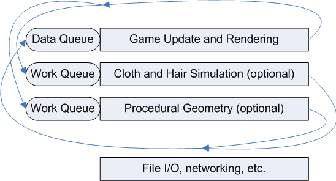
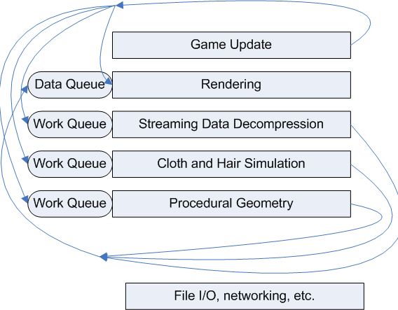

# Coding for multicore on Xbox 360 and Windows

For years the performance of processors has increased steadily, and games and other programs have reaped the benefits of this increasing power without having to do anything special.

The rules have changed. The performance of single processor cores is now increasing very slowly, if at all. However, the computing power available in a typical computer or console continues to grow. The difference is that most of this performance gain now comes from having multiple processor cores in a single machine, often in a single chip. The Xbox 360 CPU has three processor cores on one chip, and roughly 70 percent of PC processors sold in 2006 were multi-core.

The increases in available processing power are just as dramatic as in the past, but now developers have to write multithreaded code in order to use this power. Multi-threaded programming brings with it new design and programming challenges. This topic gives some advice on how to get started with multithreaded programming.

## The Importance of Good Design

Good multithreaded program design is critical, but it can be very difficult. If you haphazardly move your major game systems onto different threads, you will likely find that each thread spends most of its time waiting on the other threads. This type of design leads to increased complexity and significant debugging effort, with virtually no performance gain.

Every time that threads have to synchronize or share data there is the potential for data corruption, synchronization overhead, deadlocks, and complexity. Therefore, your multithreaded design needs to clearly document every synchronization and communication point, and it should minimize such points as much as possible. Where threads need to communicate, coding effort will increase, which can lower productivity if it affects too much source code.

The simplest design goal for multithreading is to break up the code into large independent pieces. If you then restrict these pieces to communicating just a few times per frame, you will see significant speedup from multithreading, without undue complexity.

## Typical Threaded Tasks

A few types of tasks have proven amenable to being put onto separate threads. The following list is not intended to be exhaustive, but should give some ideas.

### Rendering

Rendering — which may include walking the scene graph or, possibly, only calling D3D functions — often accounts for 50 percent or more of CPU time. Therefore, moving rendering to another thread can have significant benefits. The update thread can fill in some sort of render description buffer, which the rendering thread can then process.

The game update thread is always one frame ahead of the render thread, which means that it takes two frames before user actions show up on the screen. Although this increased latency can be a problem, the increased frame rate from splitting up the workload generally keeps the total latency acceptable.

In most cases all rendering is still done on a single thread, but it is a different thread from the game update.

The D3DCREATE\_MULTITHREADED flag is sometimes used to allow rendering on one thread and resource creation on other threads; this flag is ignored on Xbox 360, and you should avoid using it on Windows. On Windows, specifying this flag forces D3D to spend a significant amount of time on synchronization, thus slowing down the render thread.

### File Decompression

Load times are always too long, and streaming data into memory without affecting the frame rate can be challenging. If all data is aggressively compressed on disc, then data transfer speed from the hard drive or optical disc is less likely to be a limiting factor. On a single-threaded processor, there is usually not enough processor time available for compression to help load times. On a multiprocessor system, however, file decompression uses CPU cycles that would otherwise be wasted; it improves load times and streaming; and it saves space on the disc.

Do not use file decompression as a replacement for processing that should be done during production. For instance, if you devote an extra thread to parsing XML data during level loading, you are not using multithreading to improve the player's experience.

When using a file decompression thread, you should still use asynchronous file I/O and large reads in order to maximize data-reading efficiency.

### Graphics Fluff

There are many graphical niceties that improve the look of the game but aren't strictly necessary. These include things like procedurally generated cloud animations, cloth and hair simulations, procedural waves, procedural vegetation, more particles, or non-gameplay physics.

Because these effects don't affect gameplay, they don't cause tricky synchronization problems—they can synchronize with the other threads once per frame or less often. Additionally, on games for Windows these effects can add value for gamers with multicore CPUs, while silently being omitted on single-core computers, thus giving an easy way of scaling across a wide range of capabilities.

### Physics

Physics often cannot be put onto a separate thread to run in parallel with the game update because the game update usually requires the results of the physics calculations immediately. The alternative for multithreading physics is to run it on multiple processors. Although this can be done, it is a complex task requiring frequent access to shared data structures. If you can keep your physics workload low enough to fit on the main thread, your job will be simpler.

Libraries that support running physics on multiple threads are available. However, this can lead to a problem: when your game is running physics, it uses many threads, but the rest of the time it uses few. Running physics on multiple threads will require addressing this so that the workload is distributed evenly over the frame. If you write a multithreaded physics engine, you must pay careful attention to all of your data structures, synchronization points, and load balancing.

## Example Multithreaded Designs

Games for Windows need to run on computers with different numbers of CPU cores. Most game machines still have only one core, although the number of two-core machines is growing rapidly. A typical game for Windows might break its workload into one thread for update and rendering, with optional worker threads for adding extra functionality. In addition, some background threads for doing file I/O and networking would probably be used. Figure 1 shows the threads, together with the main data transfer points.

**Figure 1. Threading design in a game for Windows**



A typical Xbox 360 game can use additional CPU-intensive software threads, so it might break up its workload into an update thread, rendering thread, and three worker threads, as shown in Figure 2.

**Figure 2. Threading design in a game for Xbox 360**



With the exception of file I/O and networking, these tasks all have the potential to be CPU-intensive enough to benefit from being on their own hardware thread. These tasks also have the potential to be independent enough that they can run for an entire frame without communicating.

The game update thread manages controller input, AI, and physics, and prepares instructions for the other four threads. These instructions are placed into buffers owned by the game update thread, so no synchronization is required as the instructions are generated.

At the end of the frame, the game update thread hands off the instruction buffers to the four other threads, and then starts working on the next frame, filling in another set of instruction buffers.

Because the update and rendering threads work in lockstep with each other, their communication buffers are simply double buffered: at any given time, the update thread is filling one buffer while the render thread is reading from the other.

The other worker threads are not necessarily tied to the frame rate. Decompressing a piece of data may take much less than a frame, or it may take many frames. Even the cloth and hair simulation may not need to run exactly at the frame rate because less frequent updates may be quite acceptable. Therefore, these three threads need different data structures to communicate with the update thread and the render thread. They each need an input queue that can hold work requests, and the render thread needs a data queue that can hold the results produced by the threads. At the end of each frame the update thread will add a block of work requests to worker threads' queues. Adding to the list just once per frame ensures that the update thread minimizes the synchronization overhead. Each of the worker threads pulls assignments from the work queue as quickly as it can, using a loop that looks something like this:


```C++
for(;;)
{
    while( WorkQueueNotEmpty() )
    {
        RemoveWorkItemFromWorkQueue();
        ProcessWorkItem();
        PutResultInDataQueue();
    }
    WaitForSingleObject( hWorkSemaphore ); 
}
```


Because the data goes from the update threads to the worker threads and then to the render thread, there can be a delay of three or more frames before some actions make it to the screen. However, if you assign latency-tolerant tasks to the worker threads, then this should not be a problem.

An alternate design would be to have several worker threads all drawing from the same work queue. This would give automatic load balancing and would make it more likely that all of the worker threads would stay busy.

The game update thread must take care to not give too much work to the worker threads, or else the work queues may continuously grow. How the update thread manages this depends on what sort of tasks the worker threads are doing.

## Simultaneous Multithreading and Number of Threads

All threads are not created equal. Two hardware threads might be on separate chips, on the same chip, or even on the same core. The most important configuration for game programmers to be aware of is two hardware threads on one core—Simultaneous Multi-Threading (SMT) or Hyper-Threading Technology (HT Technology).

SMT or HT Technology threads share the resources of the CPU core. Because they share the execution units, the maximum speedup from running two threads instead of one is typically 10 to 20 percent, instead of the 100 percent that is possible from two independent hardware threads.

More significantly, SMT or HT Technology threads share the L1 instruction and data caches. If their memory access patterns are incompatible, they can end up fighting over the cache and causing many cache misses. In the worst case, the total performance for the CPU core can actually decrease when a second thread is run. On Xbox 360, this is a fairly simple problem. The configuration of the Xbox 360 is known—three CPU cores each with two hardware threads—and developers assign their software threads to specific CPU threads and can measure to see whether their threading design gives them extra performance.

On Windows, the situation is more complicated. The number of threads and their configuration will vary from computer to computer, and determining the configuration is complicated. The function [**GetLogicalProcessorInformation**](/windows/win32/api/sysinfoapi/nf-sysinfoapi-getlogicalprocessorinformation) gives information about the relationship between different hardware threads, and this function is available on Windows Vista, Windows 7, and Windows XP SP3. Therefore, for now you have to use the CPUID instruction and the algorithms given by Intel and AMD in order to decide how many "real" threads you have available. See the references for more information.

The CoreDetection sample in the DirectX SDK contains sample code that uses the [**GetLogicalProcessorInformation**](/windows/win32/api/sysinfoapi/nf-sysinfoapi-getlogicalprocessorinformation) function or the CPUID instruction to return the CPU core topology. The CPUID instruction is used if **GetLogicalProcessorInformation** is not supported on the current platform. CoreDetection can be found in the following locations:

<dl> <dt>

<span id="Source_"></span><span id="source_"></span><span id="SOURCE_"></span>Source:
</dt> <dd>

*DirectX SDK root*\\Samples\\C++\\Misc\\CoreDetection

</dd> <dt>

<span id="Executable_"></span><span id="executable_"></span><span id="EXECUTABLE_"></span>Executable:
</dt> <dd>

*DirectX SDK root*\\Samples\\C++\\Misc\\Bin\\CoreDetection.exe

</dd> </dl>

The safest assumption is to have no more than one CPU-intensive thread per CPU core. Having more CPU-intensive threads than CPU cores gives little or no benefits, and brings the extra overhead and complexity of additional threads.

## Creating Threads

Creating threads is a fairly simple operation, but there are many potential errors. The code below shows the proper way of creating a thread, waiting for it to terminate, and then cleaning up.


```C++
const int stackSize = 65536;
HANDLE hThread = (HANDLE)_beginthreadex( 0, stackSize,
            ThreadFunction, 0, 0, 0 );
// Do work on main thread here.
// Wait for child thread to complete
WaitForSingleObject( hThread, INFINITE );
CloseHandle( hThread );

...

unsigned __stdcall ThreadFunction( void* data )
{
#if _XBOX_VER >= 200
    // On Xbox 360 you must explicitly assign
    // software threads to hardware threads.
    XSetThreadProcessor( GetCurrentThread(), 2 );
#endif
    // Do child thread work here.
    return 0;
}
```


When you create a thread, you have the option to specify the stack size for the child thread, or specify zero, in which case the child thread will inherit the parent thread's stack size. On Xbox 360, where stacks are fully committed when the thread starts, specifying zero can waste significant memory, because many child threads will not need as much stack as the parent. On Xbox 360 it is also important that the stack size be a multiple of 64-KB.

If you use the [**CreateThread**](/windows/win32/api/processthreadsapi/nf-processthreadsapi-createthread) function to create threads, then the C/C++ runtime (CRT) will not get properly initialized on Windows. We recommend that you use the CRT [**\_beginthreadex**](https://msdn.microsoft.com/library/ms397047(v=VS.70).aspx) function instead.

The return value from [**CreateThread**](/windows/win32/api/processthreadsapi/nf-processthreadsapi-createthread) or [**\_beginthreadex**](https://msdn.microsoft.com/library/ms397047(v=VS.70).aspx) is a thread handle. This thread can be used to wait for the child thread to terminate, which is much simpler and much more efficient than spinning in a loop checking the thread status. To wait for the thread to terminate, simply call [**WaitForSingleObject**](/windows/win32/api/synchapi/nf-synchapi-waitforsingleobject) with the thread handle.

The resources for the thread will not be freed until the thread has terminated and the thread handle has been closed. Therefore, it is important to close the thread handle with [**CloseHandle**](/windows/win32/api/handleapi/nf-handleapi-closehandle) when you are finished with it. If you will be waiting for the thread to terminate with [**WaitForSingleObject**](/windows/win32/api/synchapi/nf-synchapi-waitforsingleobject), be sure to not close the handle until after the wait has completed.

On Xbox 360, you must explicitly assign software threads to a particular hardware thread by using **XSetThreadProcessor**. Otherwise, all child threads will stay on the same hardware thread as the parent. On Windows, you can use [**SetThreadAffinityMask**](/windows/win32/api/winbase/nf-winbase-setthreadaffinitymask) to strongly suggest to the operating system which hardware threads your thread should run on. This technique should generally be avoided on Windows since you don't know what other processes might be running on the system. It is typically better to let the Windows scheduler assign your threads to idle hardware threads.

Creating threads is an expensive operation. Threads should be created and destroyed rarely. If you find yourself wanting to create and destroy threads frequently, use a pool of threads that wait around for work instead.

## Synchronizing Threads

For multiple threads to work together, you must be able to synchronize threads, pass messages, and request exclusive access to resources. Windows and Xbox 360 come with a rich set of synchronization primitives. For full details on these synchronization primitives, see the platform documentation.

### Exclusive Access

Gaining exclusive access to a resource, data structure, or code path is a common need. One option for gaining exclusive access is a mutex, whose typical usage is shown here.


```C++
// Initialize
HANDLE mutex = CreateMutex( 0, FALSE, 0 );

// Use
void ManipulateSharedData()
{
    WaitForSingleObject( mutex, INFINITE );
    // Manipulate stuff...
    ReleaseMutex( mutex );
}

// Destroy
CloseHandle( mutex );
The kernel guarantees that, for a particular mutex, only one thread at a time can 
acquire it.
The main disadvantage to mutexes is that they are relatively expensive to acquire 
and release. A faster alternative is a critical section.
// Initialize
CRITICAL_SECTION cs;
InitializeCriticalSection( &cs );

// Use
void ManipulateSharedData()
{
    EnterCriticalSection( &cs );
    // Manipulate stuff...
    LeaveCriticalSection( &cs );
}

// Destroy
DeleteCriticalSection( &cs );
```


Critical sections have similar semantics to mutexes, but they can be used to synchronize only within a process, not between processes. Their main advantage is that they execute roughly twenty times faster than mutexes.

### Events

If two threads—perhaps an update thread and a render thread—are taking turns using a pair of render description buffers, they need a way to indicate when they are done with their particular buffer. This can be done by associating an event (allocated with [**CreateEvent**](/windows/win32/api/synchapi/nf-synchapi-createeventa)) with each buffer. When a thread is done with a buffer, it can use [**SetEvent**](/windows/win32/api/synchapi/nf-synchapi-setevent) to signal this, and can then call [**WaitForSingleObject**](/windows/win32/api/synchapi/nf-synchapi-waitforsingleobject) on the other buffer's event. This technique extrapolates easily to triple buffering of resources.

### Semaphores

A semaphore is used to control how many threads can be running and is commonly used to implement work queues. One thread adds work to a queue and uses [**ReleaseSemaphore**](/windows/win32/api/synchapi/nf-synchapi-releasesemaphore) whenever it adds a new item to the queue. This allows one worker thread to be released from the pool of waiting threads. The worker threads just call [**WaitForSingleObject**](/windows/win32/api/synchapi/nf-synchapi-waitforsingleobject), and when it returns they know there is a work item in the queue for them. In addition, a critical section or other synchronization technique must be used in order to guarantee safe access to the shared work queue.

### Avoid SuspendThread

Sometimes when you want a thread to stop what it is doing, it is tempting to use [**SuspendThread**](/windows/win32/api/processthreadsapi/nf-processthreadsapi-suspendthread) instead of the correct synchronization primitives. This is always a bad idea and can easily lead to deadlocks and other problems. **SuspendThread** also interacts badly with the Visual Studio debugger. Avoid **SuspendThread**. Use [**WaitForSingleObject**](/windows/win32/api/synchapi/nf-synchapi-waitforsingleobject) instead.

### WaitForSingleObject and WaitForMultipleObjects

The function [**WaitForSingleObject**](/windows/win32/api/synchapi/nf-synchapi-waitforsingleobject) is the most commonly used synchronization function. However, sometimes you want a thread to wait until several conditions are simultaneously satisfied, or until one of a set of conditions are satisfied. In this case, you should use [**WaitForMultipleObjects**](/windows/win32/api/synchapi/nf-synchapi-waitformultipleobjects).

### Interlocked Functions and Lockless Programming

There is a family of functions for performing simple thread-safe operations without using locks. These are the Interlocked family of functions, such as [**InterlockedIncrement**](/windows/win32/api/winnt/nf-winnt-interlockedincrement). These functions, plus other techniques using careful setting of flags, are together known as lockless programming. Lockless programming can be extremely tricky to do correctly, and is substantially more difficult on Xbox 360 than on Windows.

For more information about programming without locks, see [Lockless Programming Considerations for Xbox 360 and Microsoft Windows](./lockless-programming.md).

### Minimizing Synchronization

Some synchronization methods are faster than others. However, rather than optimizing your code by choosing the fastest synchronization techniques possible, it is usually better to synchronize less often. This is faster than synchronizing too frequently, and it makes for simpler code that is easier to debug.

Some operations, such as memory allocation, may have to use synchronization primitives in order to work correctly. Therefore, doing frequent allocations from the default shared heap will result in frequent synchronization, which will waste some performance. Avoiding frequent allocations or using per-thread heaps (using HEAP\_NO\_SERIALIZE if you use HeapCreate) can avoid this hidden synchronization.

Another cause of hidden synchronization is D3DCREATE\_MULTITHREADED, which causes D3D on Windows to use synchronization on many operations. (The flag is ignored on Xbox 360.)

Per-thread data, also known as thread local storage, can be an important way of avoiding synchronization. Visual C++ allows you to declare global variables as being per-thread with the **\_\_declspec(thread)** syntax.


```C++
__declspec( thread ) int tls_i = 1;
```


This gives each thread in the process its own copy of tls\_i, which can be referenced safely and efficiently without requiring synchronization.

The **\_\_declspec(thread)** technique does not work with dynamically loaded DLLs. If you use dynamically loaded DLLs, you will need to use the TLSAlloc family of functions to implement thread local storage.

## Destroying Threads

The only safe way to destroy a thread is to have the thread itself exit, either by returning from the main thread function or by having the thread call [**ExitThread**](/windows/win32/api/processthreadsapi/nf-processthreadsapi-exitthread) or [**\_endthreadex**](https://msdn.microsoft.com/library/hw264s73(v=VS.71).aspx). If a thread is created with [**\_beginthreadex**](https://msdn.microsoft.com/library/ms397047(v=VS.70).aspx), then it should use **\_endthreadex** or return from the main thread function, since using **ExitThread** won't properly free CRT resources. Never call the [**TerminateThread**](/windows/win32/api/processthreadsapi/nf-processthreadsapi-terminatethread) function, because the thread will not be properly cleaned up. Threads should always commit suicide—they should never be murdered.

## OpenMP

OpenMP is a language extension for adding multithreading to your program by using pragmas to guide the compiler in parallelizing loops. OpenMP is supported by Visual C++ 2005 on Windows and Xbox 360 and can be used in conjunction with manual thread management. OpenMP can be a convenient way to multithread parts of your code, but is unlikely to be the ideal solution, especially for games. OpenMP may be more applicable to longer-running production tasks such as processing art and other resources. For more information, see the Visual C++ documentation or go to the OpenMP [website](https://www.openmp.org/).

## Profiling

Multithreaded profiling is important. It is easy to end up with long stalls where threads are waiting on each other. These stalls can be difficult to find and diagnose. To help identify them, consider adding instrumentation to your synchronization calls. A sampling profiler can also help identify these problems because it can record timing information without substantially altering it.

## Timing

The rdtsc instruction is one way to get accurate timing information on Windows. Unfortunately, rdtsc has multiple problems that make it a poor choice for your shipping title. The rdtsc counters are not necessarily synchronized between CPUs, so when your thread moves between hardware threads you may get large positive or negative differences. Depending on power management settings, the frequency at which the rdtsc counter increments may also change as your game runs. To avoid these difficulties, you should prefer [**QueryPerformanceCounter**](/windows/win32/api/profileapi/nf-profileapi-queryperformancecounter) and [**QueryPerformanceFrequency**](/windows/win32/api/profileapi/nf-profileapi-queryperformancefrequency) for high-precision timing in your shipping game. For more information about timing, see [Game Timing and Multicore Processors](./game-timing-and-multicore-processors.md).

## Debugging

Visual Studio fully supports multithreaded debugging for Windows and Xbox 360. The Visual Studio threads window lets you switch between threads in order to see the different call stacks and local variables. The threads window also lets you freeze and thaw particular threads.

On Xbox 360, you can use the **\@hwthread** meta-variable in the watch window to show the hardware thread on which the currently selected software thread is running.

The threads window is easier to use if you name your threads meaningfully. Visual Studio and other Microsoft debuggers allow you to name your threads. Implement the following **SetThreadName** function and call it from each thread as it starts up.


```C++
typedef struct tagTHREADNAME_INFO
{
    DWORD dwType;     // must be 0x1000
    LPCSTR szName;    // pointer to name (in user address space)
    DWORD dwThreadID; // thread ID (-1 = caller thread)
    DWORD dwFlags;    // reserved for future use, must be zero
} THREADNAME_INFO;

void SetThreadName( DWORD dwThreadID, LPCSTR szThreadName )
{
    THREADNAME_INFO info;
    info.dwType = 0x1000;
    info.szName = szThreadName;
    info.dwThreadID = dwThreadID;
    info.dwFlags = 0;

    __try
    {
        RaiseException( 0x406D1388, 0,
                    sizeof(info) / sizeof(DWORD),
            (DWORD*)&info );
    }
    __except( EXCEPTION_CONTINUE_EXECUTION ) {
    }
}

// Example usage:
SetThreadName(-1, "Main thread");
```


The kernel debugger (KD) and WinDBG also support multithreaded debugging.

## Testing

Multithreaded programming can be tricky, and some multithreaded bugs show up only rarely, making them difficult to find and fix. One of the best ways to flush them out is to test on a wide range of computers, particularly those with four or more processors. Multithreaded code that works perfectly on a single-threaded computer may fail instantly on a four-processor computer. The performance and timing characteristics of AMD and Intel CPUs can vary substantially, so be sure to test on multiprocessor computers based on CPUs from both vendors.

## Windows Vista and Windows 7 Improvements

For games targeting the newer versions of Windows, there are a number of APIs that can simplify the creation of scalable multithreaded applications. This is particularly true with the new ThreadPool API and some additional syncrhonziation primitives (condition variables, the slim read/writer lock, and one-time initialization). You can find an overview of these technologies in the following MSDN Magazine articles:

-   [Improve Scalability With New Thread Pool APIs](/archive/msdn-magazine/2007/october/pooled-threads-improve-scalability-with-new-thread-pool-apis)
-   [Synchronization Primitives New To Windows Vista](/archive/msdn-magazine/2007/june/concurrency-synchronization-primitives-new-to-windows-vista)

Applications using [Direct3D 11 Features](../direct3d11/direct3d-11-features.md) on these operating systems can also take advantage of the new design for concurrent object creation and deferred context command lists for better scalability for multithreaded rendering.

## Summary

With careful design that minimizes the interactions between threads, you can get substantial performance gains from multithreaded programming without adding excessive complexity to your code. This will let your game code ride the next wave of processor improvements and deliver ever more compelling gaming experiences.

## References

-   Jim Beveridge & Robert Weiner, *Multithreading Applications in Win32*, Addison-Wesley, 1997
-   Chuck Walbourn, [Game Timing and Multicore Processors](./game-timing-and-multicore-processors.md), Microsoft Corporation, 2005
-   MSDN Library: [**GetLogicalProcessorInformation**](/windows/win32/api/sysinfoapi/nf-sysinfoapi-getlogicalprocessorinformation)
-   [OpenMP](https://www.openmp.org/)

 

 