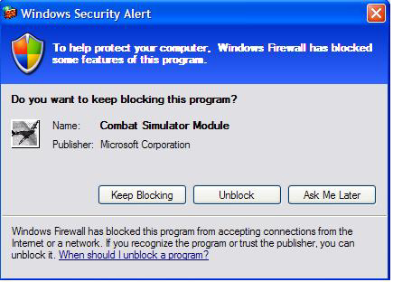
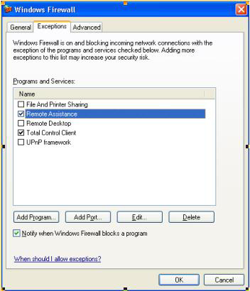
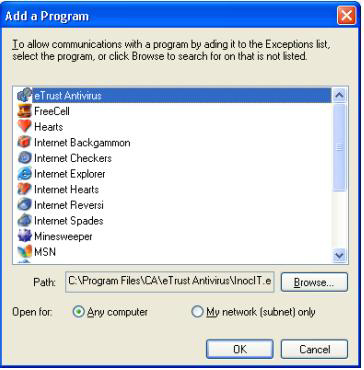

# Windows Firewall for Game Developers

This article describes the Windows Firewall - why it exists, what it accomplishes, and how it does so. Most importantly, it describes how to configure your game to work well with the firewall.

Contents:

-   [What is a Firewall?](#what-is-a-firewall)
-   [How can I tell if my game is affected?](#how-can-i-tell-if-my-game-is-affected)
-   [The Firewall Before Windows XP SP2](#the-firewall-before-windows-xp-sp2)
-   [Windows XP SP2 Firewall Is Better](#windows-xp-sp2-firewall-is-better)
-   [Working with the Windows Firewall](#working-with-the-windows-firewall)
-   [Integrating using InstallShield InstallScript](#integrating-using-installshield-installscript)
-   [Integrating into Wise for Windows Installer](#integrating-into-wise-for-windows-installer)
-   [Integrating into Windows Installer](#integrating-into-windows-installer)
-   [Recommendations](#recommendations)

## What is a Firewall?

The firewall provides a barrier against network-based intrusions. It blocks unsolicited incoming traffic, and makes the system mostly invisible on the internet by rejecting Internet Control Message Protocol (ICMP) requests. This means that ping and tracert will not work. The firewall also looks and rejects invalid packets.

This barrier prevents opportunistic attacks. Attacks spread by finding many systems with the same vulnerability. The firewall can thwart many attacks by putting up a "do not disturb" sign for those features not currently in use; the attack is ignored and does not strike home. The essential benefit of the Windows Firewall is that features and applications that are not in use cannot be avenues for attack.

The user configures the system to identify what applications and features are needed and should be open to the network. This happens either when an application is installed or when it tries to open itself to the network.

## How can I tell if my game is affected?

With the arrival of Windows XP SP2, the Windows Firewall has been widely deployed. All multiplayer Windows games are affected to some degree. While clients are generally in good shape, servers, hosts, and peers in peer-to-peer all need the firewall configured to continue working. Specifically, incoming unsolicited traffic is dropped. The firewall intercepts network-traffic filter packets based on the packet contents and recent network activity. The firewall uses the contents and activity to decide to forward or drop a packet. Once the firewall is properly configured, a game will be able to accept inbound unsolicited traffic as before.

Who has inbound unsolicited traffic?

-   Client/Server: All participants connect to a central server. The central server is the one with incoming unsolicited traffic. The clients connecting to the server are soliciting return traffic, which is expected and is allowed to pass through the firewall if the rules for clients are followed. The central server must be configured to accept the unsolicited traffic to allow the client traffic to pass through the firewall.
-   Massively Multiplayer (MMP): All participants are connected to a data center. This amounts to a complex client/server relationship, as the data center has the inbound unsolicited traffic. The participants are clients, and in general do not need to accept unsolicited traffic.
-   Peer-to-Peer, where all participants are connected to each other directly: All participants must be ready to accept unsolicited traffic from any new player joining the group. In a sense, each of the participants must function as a host, so they must all be configured as if they were hosts.

Clients are generally in good shape. Their outgoing Transmission Control Protocol/Internet Protocol (TCP/IP) connections will work fine, as will outgoing User Datagram Protocol (UDP) messages along with timely responses to those messages - the firewall keeps the port open for 90 seconds after each outgoing message in anticipation of a reply.

## The Firewall Before Windows XP SP2

The Internet Connection Firewall (ICF) in Windows XP and Windows Server 2003 is a stateful packet filter, and handles both Internet Protocol, version 4 (IPv4) and Internet Protocol, version 6 (IPv6). However, it is not on by default and does not support 3rd party network stacks, of which there are a significant number in the world, such as large internet providers including national telephone companies.

For those not on Windows XP SP2, turning on the ICF is highly recommended. See the instructions "Use an Internet Firewall" on https://www.microsoft.com/security/protect as the first step to securing your PC. The Internet Connection Firewall (ICF) provides port mapping to override the packet filter. Essentially, you specify the port to open and it remains opened until you close it. If the user reboots before it is closed, it will remain open until specifically closed. The control of the firewall and the management of the port mappings is done via [**INetSharingManager**](/previous-versions/windows/desktop/api/netcon/nn-netcon-inetsharingmanager) (IPv4) and [**INetFwV6Mgr**](/previous-versions/windows/desktop/ics/inetfwv6mgr) (IPv6).

The Windows Firewall for Windows XP SP2 is a more comprehensive solution that does support 3rd party network stacks, and handles ports more intelligently: ports are kept open only so long as the application that needs them is still active.

## Windows XP SP2 Firewall Is Better

Windows XP SP2 puts the security choices and settings out front. The goal is to protect by default, and allow the user to make informed choices about what applications are allowed to run on their machine.

The new Windows Firewall is available on both Windows XP SP2 and Windows Server 2003 Service Pack 1 (SP1). Like the ICF, it is a software firewall that supports both IPv4 and IPv6, but unlike ICF the Windows Firewall:

-   Has boot-time protection of the system, eliminating a small window of vulnerability during boot.
-   Supports 3rd party network stacks.
-   Has an "on with no exceptions" mode that blocks all unsolicited incoming packets. This is great when you're using a public network, such as in an airport or coffee shop.

In the "on with no exceptions" mode, all static holes are closed. API calls to open a static hole are allowed but deferred; that is, they are not applied until the firewall switches back to normal operation. All listen requests by applications will also be ignored. Outbound connections will still succeed.

For new applications, add your application to the "Exceptions List" during installation. You can add the application using the [**INetFwAuthorizedApplications**](/previous-versions/windows/desktop/api/netfw/nn-netfw-inetfwauthorizedapplications) interface, supplying the full path. We'll cover the details in the sample.

As a side note, you may be wondering if it is a security risk that applications can add and remove applications from the exceptions list any user intervention, or perhaps you think that the bigger risk is that applications can disable the firewall altogether. To perform these feats, the application must have administrator privileges. If you have malicious code running in administrator mode on your system, the game is already over and the hacker has already won. The hacker's ability to disable the firewall would merit little more than a footnote.

Legacy applications, including applications installed before the user upgraded to Windows XP SP2, are handled with the Exceptions List popup (see Figure 1). This dialog shows when an application tries to open a port for incoming traffic - either when calling bind() with a non-zero port for UDP, or accept() for TCP/IP protocol. You must be running as an Administrator to "Unblock" applications, while "Ask Me Later" disallows this time around but asks again next time.

This is a non-blocking, system modal dialog box. When running a fullscreen Microsoft Direct3D application, the dialog comes in underneath; and the user can then handle it when the application exits fullscreen mode or alt-tabs back to the desktop. However, it is not always obvious to the user that this dialog has appeared when a game is running fullscreen, so it is important to avoid causing this dialog to appear by using [**INetFwAuthorizedApplications**](/previous-versions/windows/desktop/api/netfw/nn-netfw-inetfwauthorizedapplications) interface as discussed below.

**Figure 1. Exceptions List Popup Dialog**



You'll notice that the popup knows the name and publisher of the application. There's no magic here - it's pulled from the executable's version information. This information is an important system administration tool; it is even used for ongoing application compatibility work. Some applications neglect to keep this version information up-to-date.

Users can also add their applications through the user interface (UI) (see Figure 2)

**Figure 2. Configuring the Firewall**



**Figure 3. Adding a Program to the Firewall Exceptions List**



The best scenario is to make additions and removals from the exception list automated. The best time to perform these additions and removals is during the install and uninstall process. Adding or removing from the firewall exception list requires administrator privileges, so be sure to take this into account.

## Working with the Windows Firewall

Again, most games only need to be added to the firewall exception list if they can function as a server or if they implement a peer-to-peer communication protocol. The FirewallInstallHelper.dll is a sample DLL that can be called from an installer. Source is provided if you want to integrate the source directly into your own application. The sample can be found here:


|             | File                                                                             |
|-------------|------------------------------------------------------------------------------|
| **Source:**     | (SDK root)\\Samples\\C++\\Misc\\FirewallInstallHelper                        |
| **Executable:** | (SDK root)\\Samples\\C++\\Misc\\Bin\\&lt;arch&gt;\\FirewallInstallHelper.dll |


 

The functions exported by this DLL are the following:

<dl> <dt>

<span id="AddApplicationToExceptionListW"></span><span id="addapplicationtoexceptionlistw"></span><span id="ADDAPPLICATIONTOEXCEPTIONLISTW"></span>**AddApplicationToExceptionListW**
</dt> <dd>

This function adds an application to the exception list. It takes a complete path to the executable and a friendly name that will appear in the firewall exception list. This function requires administrator privileges.

</dd> <dt>

<span id="AddApplicationToExceptionListA"></span><span id="addapplicationtoexceptionlista"></span><span id="ADDAPPLICATIONTOEXCEPTIONLISTA"></span>**AddApplicationToExceptionListA**
</dt> <dd>

ANSI version of **AddApplicationToExceptionListW**

</dd> <dt>

<span id="RemoveApplicationFromExceptionListW"></span><span id="removeapplicationfromexceptionlistw"></span><span id="REMOVEAPPLICATIONFROMEXCEPTIONLISTW"></span>**RemoveApplicationFromExceptionListW**
</dt> <dd>

This function removes the application from the exception list. It takes in a complete path to the executable. This function requires administrator privileges

</dd> <dt>

<span id="RemoveApplicationFromExceptionListA"></span><span id="removeapplicationfromexceptionlista"></span><span id="REMOVEAPPLICATIONFROMEXCEPTIONLISTA"></span>**RemoveApplicationFromExceptionListA**
</dt> <dd>

ANSI version of **RemoveApplicationFromExceptionListW**

</dd> <dt>

<span id="CanLaunchMultiplayerGameW"></span><span id="canlaunchmultiplayergamew"></span><span id="CANLAUNCHMULTIPLAYERGAMEW"></span>**CanLaunchMultiplayerGameW**
</dt> <dd>

This function reports if the application has been disabled or removed from the exceptions list. It should be called every time the game is run. The function takes in a complete path to the executable. This function does not require administrator privileges.

</dd> <dt>

<span id="CanLaunchMultiplayerGameA"></span><span id="canlaunchmultiplayergamea"></span><span id="CANLAUNCHMULTIPLAYERGAMEA"></span>**CanLaunchMultiplayerGameA**
</dt> <dd>

ANSI version of **CanLaunchMultiplayerGameW**

</dd> <dt>

<span id="SetMSIFirewallProperties"></span><span id="setmsifirewallproperties"></span><span id="SETMSIFIREWALLPROPERTIES"></span>**SetMSIFirewallProperties**
</dt> <dd>

Call this only if you are using custom actions in Windows Installer. See below for more details.

</dd> <dt>

<span id="AddToExceptionListUsingMSI"></span><span id="addtoexceptionlistusingmsi"></span><span id="ADDTOEXCEPTIONLISTUSINGMSI"></span>**AddToExceptionListUsingMSI**
</dt> <dd>

Call this only if you are using custom actions in Windows Installer. See below for more details.

</dd> <dt>

<span id="RemoveFromExceptionListUsingMSI"></span><span id="removefromexceptionlistusingmsi"></span><span id="REMOVEFROMEXCEPTIONLISTUSINGMSI"></span>**RemoveFromExceptionListUsingMSI**
</dt> <dd>

Call this only if you are using custom actions in Windows Installer. See below for more details.

</dd> </dl>

The following sections describe specific methods of calling the exported DLL functions from this FirewallInstallHelper from within an InstallShield, Wise, or Windows Installer package. All methods render the same results and it is up to the developer to determine which method to implement.

## Integrating using InstallShield InstallScript

An alternate method of using the Firewall APIs is to add the function calls to an InstallShield InstallScript. The steps required to integrate are fairly simple:

1.  Open an InstallScript project in the InstallShield editor.
2.  Add the FirewallInstallHelper.dll to the project as a support file.

    1.  Under Project Assistant tab, open the Application Files tab.
    2.  Click on the Add Files button to add files to the Application Target Folder.
    3.  Browse to the FirewallInstallHelper.dll that you have built or use the one provided in the DirectX SDK and add it to the project.

3.  Add InstallScript to the project.

    1.  Open the Installation Designer view, and click on the Behavior and Logic \| InstallScript
    2.  Click on the InstallScript file (usually setup.rul) to open it in the editor
    3.  Paste the following code into the InstallScript file:

    ``` syntax
    #include "ifx.h"

    prototype BOOL FirewallInstallHelper.AddApplicationToExceptionListW( WSTRING, WSTRING );
    prototype BOOL FirewallInstallHelper.RemoveApplicationFromExceptionListW( WSTRING );

    function OnMoved()
        WSTRING path[256];
    begin
        // The DLL has been installed into the TARGETDIR
        if !MAINTENANCE then // TRUE when installing
            UseDLL( TARGETDIR ^ "FirewallInstallHelper.dll" );
            path = TARGETDIR ^ "TODO: change to relative path to executable from install directory";
            FirewallInstallHelper.AddApplicationToExceptionListW( path, "TODO: change to friendly app name" );
            UnUseDLL( TARGETDIR ^ "FirewallInstallHelper.dll" );
        endif;
    end;
          

    function OnMoving()
        WSTRING path[256];
    begin
        // The DLL is about to be removed from TARGETDIR
        if MAINTENANCE && UNINST != "" then // TRUE when uninstalling
            UseDLL( TARGETDIR ^ "FirewallInstallHelper.dll" );
            path = TARGETDIR ^ "TODO: change to relative path to executable from install directory";
            FirewallInstallHelper.RemoveApplicationFromExceptionListW( path );
            UnUseDLL( TARGETDIR ^ "FirewallInstallHelper.dll" );
        endif;
    end;
    ```

    4.  Change the TODO comments with the application name that will be shown in the Firewall Exception List and the path to the game executable relative to the installation directory.

## Integrating into Wise for Windows Installer

To integrate with Wise for Windows Installer, these steps have to be done:

1.  Open your Wise for Windows Installer project.
2.  Select the "Installation Expert" tab at the bottom.
3.  Click on Files, and add the FirewallInstallHelper.dll from the DXSDK to the game's install directory.
4.  Select the "MSI script" tab at the bottom.
5.  Select the "Execute Immediate" tab near the bottom.
6.  After CostFinalize, add a "Set Property" action that sets FULLPATH to "\[INSTALLDIR\]relative path to executable from install directory". For example, "\[INSTALLDIR\]game.exe" without the quotes
7.  Select the "Execute Deferred" tab near the bottom.
8.  After PublishProduct, add an "If statement" with the condition "NOT Installed" (case sensitive).
9.  Within the If block, add a "Call Custom DLL from Destination" action.

    1.  Set the DLL File field to "\[INSTALLDIR\]FirewallInstallHelper.dll."
    2.  Set the Function Name field to "AddApplicationToExceptionListA."
    3.  Add a parameter with type "string pointer", value source "Property", and property name "FULLPATH."
    4.  Add a second parameter with type "string pointer", value source "Constant", and set the constant value to the friendly application name you want displayed in the firewall exception list.
    5.  Close the If block by adding an "End Statement."

10. Just above the RemoveFiles action near the top, add another If block, with the condition to be "REMOVE~="ALL"" (case sensitive and without the outer quotes).
11. Within the second If block, add a "Call Custom DLL from Destination" action.

    1.  Set the DLL File field to "\[INSTALLDIR\]FirewallInstallHelper.dll."
    2.  Set the Function Name field to "RemoveApplicationFromExceptionListA."
    3.  Add a parameter with type "string pointer", value source "Property", and property name "FULLPATH."
    4.  Close the second If block by adding an "End Statement."

## Integrating into Windows Installer

To integrate with Windows Installer at the high level, these steps have to be done. They will be explained in detail below:

-   Add 2 properties "FriendlyNameForFirewall" and "RelativePathToExeForFirewall" as described below.
-   After the CostFinalize action, call "SetMSIFirewallProperties" in an immediate custom action to set the appropriate MSI properties for the other custom actions.
-   During install after the InstallFiles action, call a deferred custom action that uses the FirewallInstallHelper's "AddToExceptionListUsingMSI" function.
-   During uninstall after the InstallFiles action, call a deferred custom action that uses the FirewallInstallHelper's "RemoveFromExceptionListUsingMSI" function.
-   During rollback, call a deferred custom action which also calls the FirewallInstallHelper's "RemoveFromExceptionListUsingMSI" function.

The following is the steps needed to do this using an MSI editor such as Orca found in the Platform SDK. Note that some editors have wizards that simplify some of these steps:

1.  Open the MSI package in Orca.
2.  Add the following to the Binary table:

    

    | Name     | Data                                                                                                                                                                          |
    |----------|-------------------------------------------------------------------------------------------------------------------------------------------------------------------------------|
    | FIREWALL | Point it to the FirewallInstallHelper.dll. This file will be embedded in the MSI package so you will have to do this step every time you recompile FirewallInstallHelper.dll. |

    

     

3.  Add the following to CustomAction table:

    

    | Action                   | Type                                                                                                                                                                                                   | Source   | Target                          |
    |--------------------------|--------------------------------------------------------------------------------------------------------------------------------------------------------------------------------------------------------|----------|---------------------------------|
    | FirewallSetMSIProperties | msidbCustomActionTypeDll + msidbCustomActionTypeBinaryData + msidbCustomActionTypeContinue = 65                                                                                                        | FIREWALL | SetMSIFirewallProperties        |
    | FirewallAdd              | msidbCustomActionTypeDll + msidbCustomActionTypeBinaryData + msidbCustomActionTypeContinue + msidbCustomActionTypeInScript + msidbCustomActionTypeNoImpersonate = 3137                                 | FIREWALL | AddToExceptionListUsingMSI      |
    | FirewallRemove           | msidbCustomActionTypeDll + msidbCustomActionTypeBinaryData + msidbCustomActionTypeContinue + msidbCustomActionTypeInScript + msidbCustomActionTypeNoImpersonate = 3137                                 | FIREWALL | RemoveFromExceptionListUsingMSI |
    | FirewallRollBackAdd      | msidbCustomActionTypeDll + msidbCustomActionTypeBinaryData + msidbCustomActionTypeContinue + msidbCustomActionTypeRollback + msidbCustomActionTypeInScript + msidbCustomActionTypeNoImpersonate = 3393 | FIREWALL | RemoveFromExceptionListUsingMSI |
    | FirewallRollBackRemove   | msidbCustomActionTypeDll + msidbCustomActionTypeBinaryData + msidbCustomActionTypeContinue + msidbCustomActionTypeRollback + msidbCustomActionTypeInScript + msidbCustomActionTypeNoImpersonate = 3393 | FIREWALL | AddToExceptionListUsingMSI      |

    

     

4.  Add the following to the InstallExecuteSequence table:

    

    | Action                   | Condition     | Sequence | Notes                                                                                                                                                                      |
    |--------------------------|---------------|----------|----------------------------------------------------------------------------------------------------------------------------------------------------------------------------|
    | FirewallSetMSIProperties |               | 1010     | This places soon after CostFinalize.                                                                                                                                       |
    | FirewallAdd              | NOT Installed | 4021     | This custom action will only happen during a fresh install. The sequence number places the action after InstallFiles and after the rollbacks.                              |
    | FirewallRollBackAdd      | NOT Installed | 4020     | This custom action will only happen when a fresh install is cancelled. The sequence number places the action after InstallFiles and before the Add custom action.          |
    | FirewallRemove           | Installed     | 3461     | This custom action will only happen during uninstall. The sequence number places the action directly before RemoveFiles and after the rollbacks.                           |
    | FirewallRollBackRemove   | NOT Installed | 3460     | This custom action will only happen when an uninstall is cancelled. The sequence number places the action directly before RemoveFiles and before the Remove custom action. |

    

     

5.  Add the following to the Property table:

    

    | Property                     | Value                                                                             |
    |------------------------------|-----------------------------------------------------------------------------------|
    | FriendlyNameForFirewall      | Needs to be the name the exception list will display. For example, "Example Game" |
    | RelativePathToExeForFirewall | Needs to be the installed executable of the game. For example, "ExampleGame.exe"  |

    

     

For more information on Windows Installer, see [Windows Installer](/windows/desktop/Msi/windows-installer-portal).

## Recommendations

The firewall is here to stay. These recommendations will give your customers a good firewall experience with your Windows game:

-   Don't tell users to disable the firewall to play your game. This makes the entire machine vulnerable even when they aren't playing your game.
-   Make the firewall configuration seamless for your users. Add your application to the exception list during installation, and remove your application from the exception list during installation.
-   Give feedback to the user if multiplayer is blocked by the firewall state. For example, disable networking features if they won't work either because the application is disallowed or because the system is in the "no exceptions" mode.

 

 
