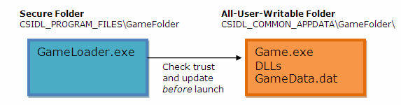

# Installation Best Practices for Massively Multiplayer Online Games

This article describes creating a chain of trust design for Massively Multiplayer Online Games (MMOG) client installation and custom game update systems that work well with Windows and the security model of Windows Vista and Windows 7. The approach is designed to enable patching of MMOG titles while supporting standard user accounts, which have restricted access to the hard drive and system registry.

-   [Why MMOG Clients Have Different Requirements to Traditional Retail Purchased Games](#why-mmog-clients-have-different-requirements-to-traditional-retail-purchased-games)
-   [Overview of a Chain of Trust Approach](#overview-of-a-chain-of-trust-approach)
-   [Everything is validated on the server, why should I worry if my client gets hacked?](#everything-is-validated-on-the-server-why-should-i-worry-if-my-client-gets-hacked)
-   [Construction of the Trust-Worthy Loader Application](#construction-of-the-trust-worthy-loader-application)
    -   [Background Reading](#background-reading)
    -   [Installation of the Trusted Loader and Patcher](#installation-of-the-trusted-loader-and-patcher)
    -   [Installation of the Game Executables, DLLs, and Data](#installation-of-the-game-executables-dlls-and-data)
    -   [Access Control List Modification Code](#access-control-list-modification-code)
    -   [Installations for Advanced Users](#installations-for-advanced-users)
    -   [The Loader's Verification of Trust](#the-loaders-verification-of-trust)
    -   [Data Validation](#data-validation)

## Why MMOG Clients Have Different Requirements to Traditional Retail Purchased Games

The constantly connected and evolving nature of MMOGs makes it a fundamental requirement to provide regular updates of client code and content to fix security vulnerabilities and extend the gameplay experience. With the potential for almost daily updates, the MMOG scenario requires careful management to ensure a user friendly experience. This differs from the traditional retail purchase model where a small number of patches may be provided close to the retail ship date of the product. The Windows Installer limited user patching technology provided with the operating system is designed to handle small numbers of application patches, and not the large quantity and high frequency needed by MMOGs. It is therefore often necessary for custom patching systems to be developed to address the needs of MMOGs, including any special requirements specific to the particular MMOG being developed.

Because so many computers are connected to the Internet, Windows Vista and Windows 7 have tougher security restrictions and safeguards for users, which limit the access that applications have to various areas of the hard drive. Unlike Windows XP, these restrictions are enabled for the default mode for user accounts. These restrictions must be taken into account when designing the layout of a game, executable and data, and its associated patching system. For more details about the security measures provided by the operating system, see [User Account Control for Game Developers](/windows/desktop/DxTechArts/user-account-control-for-game-developers).

## Overview of a Chain of Trust Approach

The custom update approach presented in this whitepaper is based upon having a trustworthy loader application installed to the protected Program Files folder while keeping the games executable files and data in a shared all-user-accessible area. A chain of trust starts with the loader which performs validity checks on the game binaries and data before launch.



The trustworthy loader needs to have enough logic to be able to verify that the game's executable and other binaries have not been tampered with before launching the game. The loader may also verify game data as often as needed, however, the size of game data is usually too large to allow it be checked every time in a single pass. An alternative approach is to use a sampling pattern which ensures that verification of the entire data set occurs over an extended period of time. The loader application may contain a game patching engine, which provides a trust worthy method by to integrate updates with the installed game.

## Everything is validated on the server, why should I worry if my client gets hacked?

It is impossible to trust that the client has not been compromised; therefore it is common for MMOG servers to validate all data received from the client. While this processing can identify compromised or cheating game clients within the game universe, the server cannot easily identify all issues the game client can be exposed to. It's important to strengthen protection from hackers who wish to use your client as a platform for attacks on your service, other users, or even simply as a vector for attacking the client machines themselves. The application of code signing and data verification techniques can help detect compromised clients before they get executed. Since the patching mechanism requires exposing executable and DLL binaries that are not protected by the standard read-only permissions on Program Files, validating these files before launching them is important for overall system security.

This model does not attempt to deal with the malicious admin user scenario where the loader itself could become compromised but focuses on protecting standard users from accidentally running tampered code. Traditional server-client validation techniques are really the only possible mitigation for malicious client system administrators.

## Construction of the Trust-Worthy Loader Application

### Background Reading

Readers should familiarize themselves with the following documentation, which provides details of the foundation technology for ensuring best practice for software based trust.

<dl> <dt>

<span id="Code_Signing"></span><span id="code_signing"></span><span id="CODE_SIGNING"></span>Code Signing
</dt> <dd>

[Authenticode Signing for Game Developers](/windows/desktop/DxTechArts/authenticode-signing-for-game-developers)

</dd> <dt>

<span id="SignTool"></span><span id="signtool"></span><span id="SIGNTOOL"></span>SignTool
</dt> <dd>

[SignTool](/windows/desktop/SecCrypto/signtool) on MSDN

</dd> </dl>

The following section details the APIs that should be used to construct the loader application, which support disc layout for install and verification of trust checking.

### Installation of the Trusted Loader and Patcher

The trusted loader and base version of the patcher utility should be installed under the protected Program Files folder on the HDD just as in traditional installs. Installation and patching of the loader application requires Admin rights so it is important to minimize the frequency of update for the loader to ensure end users do not need to elevate often, although Windows Installer limited user patching could be used to avoid elevation for loader patches.

See the article Patching Game Software in Windows XP, Windows Vista, and Windows 7.

### Installation of the Game Executables, DLLs, and Data

In order to facilitate Standard User updates of the game without administrative privilege, the games executable, DLLs, and data must be installed to an area of the hard disk that is write accessible for all users. The operating system provides an "All Users Application Data" area which can be used as the default location for installation. [**SHGetFolderPath**](/windows/desktop/api/shlobj_core/nf-shlobj_core-shgetfolderpatha) should be used with the CSIDL\_COMMON\_APPDATA key to determine the file path for this area. It is important that no assumptions be made about the path to which this key returns as it may be user configurable.

The installation needs to alter or manage the folder permissions in order to achieve the all-user-shared-write access needed for updating the title. With the correct permissions, the game updater functionality of the loader program can easily patch the game without the need for special privilege from any users account including times when launched by standard users.

### Access Control List Modification Code

For Windows XP, you will need to execute code to change the access control list (ACL) manually, here is an example function that demonstrates how to do this:

``` syntax
HRESULT ChangeACLtoAllowUserRW( WCHAR* strDir )
{
    EXPLICIT_ACCESS explicitaccess;
    PACL NewAcl = NULL;
    DWORD dwError;

    BuildExplicitAccessWithName( &explicitaccess, L"BUILTIN\\Users",
                                 GENERIC_ALL, GRANT_ACCESS,
                                 SUB_CONTAINERS_AND_OBJECTS_INHERIT );
                                 
    dwError = SetEntriesInAcl( 1, &explicitaccess, NULL, &NewAcl );
    if( dwError == ERROR_SUCCESS) 
    {
        dwError = SetNamedSecurityInfo( strDir, SE_FILE_OBJECT,
                                        DACL_SECURITY_INFORMATION,
                                        NULL, NULL, NewAcl, NULL );
        if( dwError == ERROR_SUCCESS)
        {
            if( NewAcl != NULL ) AccFree( NewAcl );
            return S_OK;
        }
    }

    if( NewAcl != NULL ) AccFree( NewAcl );
    return E_FAIL;
}
```

This code example will also work for Windows Vista and Windows 7; however, they also provide the command line utility icacls to edit file ACLS which you may choose to use instead.

The tool provides a detailed help when executed however, one example usage for the tool is:

``` syntax
icacls "C:\Users\All Users\Game" /grant Rex:(D,WDAC)
```

This usage will grant the user Rex Delete and Write DAC permissions to game folder stored in the All Users areas of the hard drive.

### Installations for Advanced Users

For advanced user installation scenarios, a user may want to specify the games installation path manually. The directory selection should be restricted to one outside of program files to ensure the folder is in a truly sharable area of the hard drive. The user selected path should only be used for the games exes and data as the game Loader and Patcher exes should always be installed under the secure Program Files folder for better security.

### The Loader's Verification of Trust

Windows provides the [**WinVerifyTrust**](/windows/desktop/api/wintrust/nf-wintrust-winverifytrust) function for checking the validity of signed code and is based on the cryptographic services in the operating system. The function is fully documented on MSDN: **WinVerifyTrust** Function.

The following example program on MSDN details the use of the function to determine whether a program executable is signed with a valid certificate: [Example C Program: Verifying the Signature of a PE File](/windows/desktop/SecCrypto/example-c-program--verifying-the-signature-of-a-pe-file).

For the purposes of verifying that the signed game executable is trustworthy to be executed from within the loader, the Generic Verify action will suffice:

<dl> <dt>

<span id="Value"></span><span id="value"></span><span id="VALUE"></span>Value
</dt> <dd>

WINTRUST\_ACTION\_GENERIC\_VERIFY\_V2

</dd> <dt>

<span id="Meaning"></span><span id="meaning"></span><span id="MEANING"></span>Meaning
</dt> <dd>

Verify a file or object using the Authenticode policy provider.

</dd> </dl>

The function takes an input structure argument which contains information that the trust provider needs to process the specified action. Typically, as in the preceding example case, the structure includes information that identifies the object that the trust provider must evaluate.

The format of the structure is specific to the action identifier. The following topic on MSDN details the example structure for the WinTrust provider: [**WINTRUST\_DATA**](/windows/desktop/api/wintrust/ns-wintrust-wintrust_data) Structure.

If the trust provider verifies that the subject is trusted for the specified action, the return value is zero. No other value besides zero should be considered a successful return.

### Data Validation

The codesigning mechanism only supports signing a few specific types of files, including executables, DLLs, Windows Installer packages (.msi files), and cabinet (.cab) files. The [**WinVerifyTrust**](/windows/desktop/api/wintrust/nf-wintrust-winverifytrust) API should not be used to verify that large data files (.cab files for example) have not been tampered with, as there are some issues with performance and stability when validating very large files. Program executables tend be small enough for a full trust check to occur using the WinTrust provider but data files for games are often of the realm of many gigabytes in size. The approach taken by the loader for verification of game data should be one where a small sample of the dataset is tested over the run time of the game. This approach spreads the cost of verification tests over the life of the game play experience and can provide a seamless user experience without long wait times. To achieve this, careful organization of the data may be required. Some MMOGs employ a database approach to help manage, maintain and verify correctness of game assets over time.

From a security standpoint, the client code should be designed to not trust data files even if using some kind of basic data validation with the trusted loader. Header checks, hashes, and other traditional integrity checking should be employed. Work to hardened the client's I/O code should also be done using techniques such as fuzz testing as well as taking advantage of automatic static code analysis tools such as the **/analyze** switch in Visual Studio 2005 and Visual Studio 2008 (available in Visual Studio Team System and the free compiler that ships with the Windows SDK).

For more information about software security, see [Best Security Practices in Game Development](/windows/desktop/DxTechArts/best-security-practices-in-game-development).

 

 