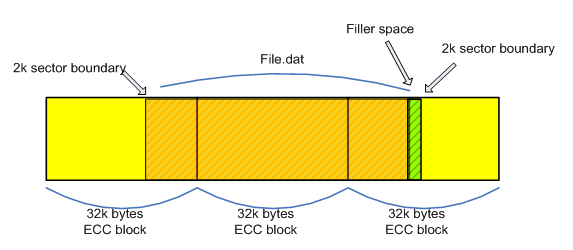

# Optimizing DVD performance for Windows Games

A high percentage of computers that run Windows have a DVD drive, and many games ship on DVD. As a result, we recommend that you ensure that your games use the DVD drive to its full advantage. By understanding how data is read from a DVD and how the data's location affects its reading time, you can reduce loading times and improve the overall performance during game play. This article discusses how to optimize DVD performance for Windows games.

-   [Basic Layout of a DVD](#basic-layout-of-a-dvd)
-   [Reading from a DVD](#reading-from-a-dvd)
-   [Reading Errors](#reading-errors)
-   [Data Throughput](#data-throughput)
-   [Examples of Wasted Throughput](#examples-of-wasted-throughput)
-   [Reading Synchronously vs. Asynchronously](#reading-synchronously-vs-asynchronously)
-   [Reading Optimally](#reading-optimally)
-   [DVD Compatibility](#dvd-compatibility)
-   [Summary](#summary)

## Basic Layout of a DVD

This figure shows the basic layout of a DVD.

Data on a DVD is stored as a continuous spiral, like on a CD; however, the files are broken up into blocks and sectors. Files are spread over error correction code (ECC) blocks, and each block is divided into sixteen 2-KB sectors (that is, 32 KB of data in each block). Files are aligned along the sector boundaries, and any unused space in a sector is left empty. If a file has only 10 bytes, then the rest of the space in that 2-KB sector is wasted; so when possible, bundle files into 2-KB increments to get the best data density. Be aware that these specifications are for DVD only, and CD and HD-DVD have different specifications.

## Reading from a DVD

Here is the sequence that a DVD drive executes upon receiving a request to read from a DVD:

1.  Change layers, if necessary
2.  Seek
3.  Refocus the optical pickup unit (OPU) to read data
4.  Check the actual position
5.  Adjust and repeat until the correct data is found

Drive reading operations are quantized differently, depending on whether they are logical drive reads or physical drive reads. Logical drive reads can only read an integer quantity of DVD sectors, while a physical drive read request can only read an integer quantity of ECC blocks. Typically, physical drive receives a read request; it will try to fill its cache. The DVD drive cache size depends on the individual drive's specifications.

When a DVD drive gets a read request that exceeds the cache size, the request is broken down into cache-sized requests. The drive seeks the ECC block that contains the first sector of the request and reads the whole ECC block. The drive firmware decodes the ECC block and then reads the next ECC block. The process is repeated till the drive cache is filled or all requests are fulfilled. The kernel then reads the decoded data from the drive cache. It then flushes the cache and starts the next read operation, if any read requests remain.

> [!Note]  
> Every uncached read flushes the drive cache.

 

## Reading Errors

DVDs and DVD drives are not perfect, and errors can occur during reading. Like CDs, portions of a DVD can become unreadable from dust or scratches. If any part of a block is unreadable, the whole block is considered unreadable. If a read error occurs, the drive tries re-reading the ECC block. If the block is still unreadable, the drive aborts the read operation and returns a value to the kernel that indicates that the block was unreadable. The kernel then decides what step to take next. The kernel can either reissue the request, abort the reading altogether, or spin the drive down and reissue the request.

## Data Throughput

The data throughput of a DVD drive depends on multiple factors: the location of requested data, how clean or scratched the disk is, the number of streams that are being read from the disk, the size of the buffers associated with those streams, and the specifications of the individual drive. Throughput also depends on whether the drive has constant angular velocity (CAV) or constant linear velocity (CLV). If a drive spins with CAV, the disc spins at the same speed regardless of where the optical pickup unit (OPU) is located. This means that the data track moves past the OPU faster as the OPU gets closer to the outer edge of the disc. With CLV, the disc spins more slowly as the OPU moves outward, so the data track moves past the OPU at a constant speed. The DVD drives in most PCs use CLV.

While the drive is seeking and changing layers, data can't be read from the disc. It is a good practice to minimize these operations, especially when reading data for an initial loading screen.

## Examples of Wasted Throughput

To understand how data throughput can be wasted, consider a hypothetical drive and DVD. Let's assume that a file in the middle of the disc needs to be read. The throughput from that area of the disc is approximately 8.25 MB/sec. If the seek stroke is a half or a third of full, then the average seek time is 150 ms. In this example, 1.2 MB (150 ms × 8.25 MB/sec) could have been read in the time that it took just to get the OPU to where it can read. Adding a layer change raises the wasted throughput to 1.8 MB (225 ms × 8.25 MB/sec).

Another example that demonstrates wasted throughput is loading 20 poorly located files from a CAV drive with no layer changes. If the seek time for each file, plus the latency before data can be read, is approximately 200 ms, then 4 seconds (20 files × 200 ms) are spent just seeking the data. If the files are located on the outer diameter and read at 11× speed, then the throughput averages 15.2 MB/sec (11 speed/12 speed × 16 MB/sec). The wasted throughput in this example is approximately 60.8 MB (15.2 MB/sec × 4 sec).

## Reading Synchronously vs. Asynchronously

Asynchronous reading is more efficient than synchronous reading. When reading synchronously, one or more ECC blocks of data are read into system memory before being copied into application memory. In contrast, asynchronous reading copies decoded ECC blocks directly to application memory, which avoids the L2 cache and creates less CPU overhead. To read asynchronously, use the FILE\_FLAG\_OVERLAPPED flag when using the [**CreateFile**](/windows/desktop/api/fileapi/nf-fileapi-createfilea) function to open files. The [**ReadFile**](/windows/desktop/api/fileapi/nf-fileapi-readfile) function also needs a valid OVERLAPPED structure passed in to perform asynchronous I/O.

More information on asynchronous I/O can be found at [Synchronous and Asynchronous I/O](/windows/desktop/FileIO/synchronous-and-asynchronous-i-o).

## Reading Optimally

The best principle in reading from a DVD is to avoid seeking and reading small amounts of data. When the amount of data read is less than the capacity of an ECC block — less than 32 KB — the rest of the block is wasted. Since cache sizes vary from drive to drive, developers must decide on a minimum amount of data for read requests and not make any smaller than that. The minimum size should be an integer multiple of an ECC block to avoid wasting time on reading and decoding data that won't be used. It is also important to avoid seeking at all costs, because any time spent seeking is time spent not reading data.

## DVD Compatibility

There are some important compatibility issues to be aware of when releasing on DVD. First, DVD drives in Windows-based computers can vary in performance, so if your DVD has a specific requirement for throughput, it is important to make sure that your users' hardware meets those requirements. Also, multilayer DVDs can cause compatibility issues on the some DVD drives. To avoid these issues, it is advisable to deliver a single-layer DVD or to thoroughly test a multi-layer DVD on a majority of drives before release.

## Summary

To improve DVD performance, some general rules can be applied. The following techniques can help maximize throughput and reduce wasted data:

-   Avoid reads that are smaller than 32 KB
-   Lay out data to reduce or eliminate seeks
-   Lay out data on ECC block boundaries
-   Maximize capacity by bundling small files into 2-KB blocks, and reduce padding space in DVD sectors
-   Read asynchronously to reduce CPU load and excessive memory usage
-   Avoid releasing multilayer DVDs

 

 