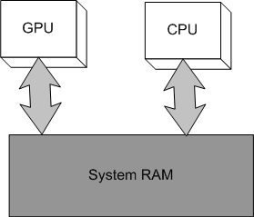
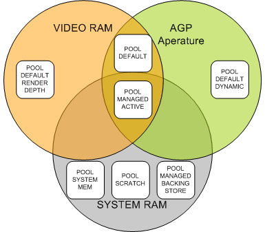

# Resource Management Best Practices

Managed textures, also known as automatic texture management, have been available in DirectX since version 6, with several revisions and enhancements made in subsequent releases. As of the release of the Direct3D 9 API, the automatic resource management includes support for textures, vertex buffers, and index buffers, all with a consistent shared interface. By using the Direct3D resource manager, applications can greatly simplify the handling of lost-device situations and can rely on the system to handle a reasonable amount of over-commitment of video memory resources.

Developers sometimes have difficulties using managed resources, in part due to the abstract nature of the system. While many common scenarios for resources are a good fit for managed resources, some cases perform better when using unmanaged resources. This article discusses best practices for dealing with resources generally, how managed and unmanaged resources behave, and provides some detail on how resources are typically handled by the runtime and drivers.

This article covers these concepts:

-   [Video Memory](#video-memory)
-   [Managed Resources](#managed-resources)
-   [Driver-Managed Resources](#driver-managed-resources)
-   [Default Resources](#default-resources)
    -   [Using Both Managed and Default Resources](#using-both-managed-and-default-resources)
    -   [Dynamic Default Resources](#dynamic-default-resources)
-   [System Memory Resources](#system-memory-resources)
-   [General Recommendations](#general-recommendations)
-   [Related topics](#related-topics)

## Video Memory

For the video system to make use of a resource, it must be located in memory that is accessible to the GPU. Local video memory provides the best performance for the GPU, and certain resources (such as render targets and depth/stencil buffers) must be located in local video memory. With the advent of AGP, the GPU can also access a portion of the system memory directly. This memory area, known as the AGP aperture, is referred to as non-local video memory and is not available for other purposes. Non-local video memory can be read from and written to by the CPU, which typically has no high-performance access to local video memory, and is thus ideal for use as a shared memory resource. A key thing to remember about AGP memory is that it, like local video memory, is invalidated in lost-device situations, and persistent assets located there must be restored.

**Figure 1. Relationship of the GPU, CPU, video RAM, and system RAM**

Some integrated video solutions make use of a unified memory architecture (UMA), where main memory is addressable by all components of the systems. Direct3D supports UMA without requiring any change to the application, utilizing the same hints as for local video memory configurations. For such systems, resources are always located in system memory, and the driver is responsible for ensuring that resources work much like they do in a more traditional architecture while taking advantage of UMA's properties and any specific behavior of the hardware implementation.

**Figure 2. GPU and CPU have equal access to system RAM in a unified memory architecture**

## Managed Resources

The majority of your resources should be created as managed resources in POOL\_MANAGED. All your resources will be created in system memory and then copied as needed into video memory. Lost-device situations will be handled automatically from the system memory copy. Since not all managed resources are required to fit into video memory all at once, you can over-commit memory where a smaller video memory working set of resources is all that is required to render in any given frame. Note that it is likely that the majority of this backing-store system memory will be paged out to disk over time, which is why the Reset operation can be slow due to the need to page this data back in to restore the lost video memory.

The runtime keeps a timestamp for the last time a resource is used, and when a video memory allocation fails for loading a needed managed resource, it will release resources based on this timestamp in a LRU fashion. Usage of [**SetPriority**](/windows/desktop/api/d3d9helper/nf-d3d9helper-idirect3dresource9-setpriority) takes precedence over the timestamp, so more commonly used resources should be set to a higher priority value. Direct3D 9.0 has limited information about the video memory managed by the driver, so the runtime may need to evict several resources to create a large enough region for the allocation to succeed. Proper priorities can help eliminate situations where something gets evicted and then is required again shortly thereafter. The application can also call [**EvictManagedResources**](/windows/desktop/api/d3d9/nf-d3d9-idirect3ddevice9-evictmanagedresources) to force all the managed resources to be removed. Again, this can be a time-consuming operation to reload all the resources required for the next frame, but is very useful for level transitions where the working set changes significantly and for removing video memory fragmentation.

A frame count is also kept to allow the runtime to detect if the resource it just chose to evict was used early the current frame, which implies a thrashing situation where more resources are in use in a single frame than will fit into video memory. This triggers the replacement policy to switch to a MRU fashion rather than LRU for the remainder of the frame as this tends to perform slightly better under such conditions. Such thrashing behavior will significantly impact the rendering performance. Note that the notion of current frame is tied to [**EndScene**](/windows/desktop/api/d3d9/nf-d3d9-idirect3ddevice9-endscene), so any application making use of managed resources needs to make regular calls to this method.

Developers looking to find more information about how managed resources are behaving in their application can make use of the RESOURCEMANAGER event query via the [**IDirect3DQuery9**](/windows/desktop/api/d3d9helper/nn-d3d9helper-idirect3dquery9) interface. This only works when using the debug runtimes, so this information cannot be depended upon by the application, but it provides deep detail on the resources managed by the runtime.

While understanding how the resource manager works can help when tuning and debugging your applications, it is important to not tie your application too tightly to the implementation details of the current runtime or drivers. Revisions of the driver or changes in hardware can significantly change the behavior, and future versions of Direct3D will have significantly improved and sophisticated resource management.

## Driver-Managed Resources

Direct3D drivers are free to implement the driver managed textures capability, indicated by D3DCAPS2\_CANMANAGERESOURCE, which allows the driver to handle the resource management instead of the runtime. For the (rare) driver that implements this feature, the exact behavior of the driver's resource manager can vary widely, and you should contact the driver's vendor for details on how this works for their implementation. Alternatively, you can ensure that the runtime manager is always used instead by specifying D3DCREATE\_DISABLE\_DRIVER\_MANAGEMENT when creating the device.

## Default Resources

While managed resources are simple, efficient, and easy to use, there are times when using video memory directly is preferred or even required. Such resources are created in the POOL\_DEFAULT category. Making use of such resources does cause additional complications for your application. Code is required to cope with the lost-device situation for all the POOL\_DEFAULT resources, and performance considerations must be taken into account when copying data into them. Failure to specify USAGE\_WRITEONLY or making a render target lockable can also impose serious performance penalties.

Calling **Lock** on a POOL\_DEFAULT resource is more likely to cause the GPU to stall than working with a POOL\_MANAGED resource, unless using certain hint flags. Depending on the location of the resource, the pointer returned could be to a temporary system memory buffer, or it can be a pointer directly into AGP memory. If it is a temporary system memory buffer, data will need to be transferred to the video memory after the **Unlock** call. If the video resource is not write-only, data will have to be transferred into the temporary buffer during the **Lock**. If it is an AGP memory area, temporary copies are avoided but the cache behavior required can result in slow performance.

Care should be taken to write a full cache line of data into any pointer to AGP aperture memory to avoid the penalty of write-combing, which induces a read-write cycle, and sequential access of the memory area is preferred. If your application needs to make random access to data during creation, and you do not wish to make use of a managed resource for the buffer, you should work with a system memory copy instead. Once the data has been created, you can then stream the result into the locked resource memory to avoid paying a high penalty for the cache write-combining operation.

The LOCK\_NOOVERWRITE flag can be used to append data in an efficient manner for some resources, but ideally, multiple **Lock** and **Unlock** calls to the same resource can be avoided. Making proper use of the various lock flags is important to optimal performance, as is using a cache-friendly pattern of data access when filling locked memory.

### Using Both Managed and Default Resources

Mixing allocations of managed and POOL\_DEFAULT resources can cause video memory fragmentation and confuse the runtime's view of the video memory available for managed resources. Ideally, you should create all POOL\_DEFAULT resources before making use of POOL\_MANAGED resources or make use of the [**EvictManagedResources**](/windows/desktop/api/d3d9/nf-d3d9-idirect3ddevice9-evictmanagedresources) call before allocating unmanaged resources. Remember that all allocations made from POOL\_DEFAULT that reside in video memory tie up memory for the life that resource that is unavailable for use by the resource manager or for any other purpose.

Note that unlike previous versions of Direct3D, the version 9 runtime automatically evicts some managed resources before giving up on a failed unmanaged resource allocation for a lack of video memory, but this can potentially create additional fragmentation and even force a resource into a sub-optimal location (for example, having a static texture in non-local video memory). Again, it is best to allocate all required unmanaged resources up front and before using any managed resources.

### Dynamic Default Resources

Data that is generated and updated at a high frequency has no need for the backing-store since all the information will be re-created when restoring the device. Such data is typically best created in POOL\_DEFAULT, specifying the USAGE\_DYNAMIC hint, so that the driver can make optimization decisions when placing the resource, knowing that it will be updated often. This typically means putting the resource into non-local video memory, and thus, it is usually much slower for the GPU to access than local video memory. For UMA architectures, the driver might choose a particular placement for dynamic resources to optimize for CPU write access.

This usage is typical for software skinning solutions and CPU-based particle systems filling out vertex/index buffers, and the LOCK\_DISCARD flag will ensure that stalls are not created in cases where the resource is still in use from the previous frame. Using a managed resource in this case would update a system memory buffer, which would then be copied to video memory, and then used for only a frame or two before being replaced. For systems with non-local video memory, the extra copy is eliminated by proper use of this dynamic pattern.

Standard textures cannot be locked, and can only be updated via [**UpdateSurface**](/windows/desktop/api/d3d9/nf-d3d9-idirect3ddevice9-updatesurface) or [**UpdateTexture**](/windows/desktop/api/d3d9/nf-d3d9-idirect3ddevice9-updatetexture). Some systems support dynamic textures, which can be locked, and use the LOCK\_DISCARD pattern, but a capabilities bit (D3DCAPS2\_DYNAMICTEXTURES) must be checked before making use of such resources. For highly dynamic textures (video or procedural), your application could create matching POOL\_DEFAULT and POOL\_SYSTEMMEM resources and handle video-memory updates by using **UpdateTexture**. For highly frequent and partial updates, the **UpdateTexture** paradigm is likely the better choice.

As useful as dynamic resources can be, be careful when designing systems that rely heavily on dynamic submission. Static resources should be placed into POOL\_MANAGED to ensure both good utilization of local video memory, and to make more efficient use of limited bus and main memory bandwidth. For resources that are semi-static, you may find that the cost of an occasional upload to local video memory is much less than the constant bus traffic generated by making them dynamic.

## System Memory Resources

Resources can also be created in POOL\_SYSTEMMEM. While they cannot be used by the graphics pipeline, they can be used as sources for updating POOL\_DEFAULT resources by using [**UpdateSurface**](/windows/desktop/api/d3d9/nf-d3d9-idirect3ddevice9-updatesurface) or [**UpdateTexture**](/windows/desktop/api/d3d9/nf-d3d9-idirect3ddevice9-updatetexture). Their locking behavior is simple, although stalls might occur if they are in use by one of the previously mentioned methods.

Though they reside in system memory, POOL\_SYSTEMMEM resources are limited to the same formats and capabilities (such as maximum size) supported by the device driver. The POOL\_SCRATCH resource type is another form of system memory resource that can utilize all formats and capabilities supported by the runtime, but cannot be accessed by the device. Scratch resources are intended primarily for use by content tools.

**Figure 3. Memory resources in video RAM, AGP aperture, and system RAM**

## General Recommendations

Getting the technical implementation details of resource management correct will go a long way toward achieving your performance goals for your application. Planning how the resources are presented to Direct3D and the architectural design around getting the data loaded in a timely fashion is a more complicated task. We recommend a number of best practices when making these decisions for your application:

-   Pre-process all your resources. Relying on expensive load-time conversion and optimization for your resources is convenient during development, but doing so puts a great performance burden on your users' computers. Pre-processed resources are faster to load, faster to use, and give you the option of doing sophisticated off-line work.
-   Avoid creating many resources per frame. The driver interactions required can serialize the CPU and GPU, and the operations involved are heavy-weight, as they often require kernel transitions. Spread out creation over several frames or reuse resources without creating/releasing them. Ideally, you should wait several frames before locking or releasing resources that were recently used to render.
-   At the end of the frame, be sure to unbind all resource channels (that is, stream sources, texture stages, and current indices). Doing so will ensure that dangling references to resources are removed before they cause the resource manager to keep resources resident that are actually no longer in use.
-   For textures, use compressed formats (for example, DXTn) with mip-maps, and consider making use of a texture atlas. These greatly reduce bandwidth requirements, and they can reduce the overall size of the resources, thus making them more efficient.
-   For geometry, make use of indexed geometry as this helps compress vertex buffer resources, and modern video hardware is heavily optimized around reuse of vertices. By making use of programmable vertex shaders, you can compress the vertex information and expand it during the vertex processing. Again, this helps reduce bandwidth requirements and makes vertex buffer resources more efficient.
-   Avoid over-optimizing your resource management. Future revisions of drivers, hardware, and the operating system can potentially cause compatibility problems if the application is tuned too heavily to a particularly combination. Since most applications are CPU-bound, expensive CPU-based management generally causes more performance issues than it solves.

## Related topics

<dl> <dt>

[Managing Resources](/windows/desktop/direct3d9/managing-resources)
</dt> <dt>

[Lost Devices](/windows/desktop/direct3d9/lost-devices)
</dt> <dt>

[Performance Optimizations](/windows/desktop/direct3d9/performance-optimizations)
</dt> <dt>

[Compressed Texture Resources](/windows/desktop/direct3d9/compressed-texture-resources)
</dt> <dt>

[Queries](/windows/desktop/direct3d9/queries)
</dt> <dt>

[**D3DUSAGE**](/windows/desktop/direct3d9/d3dusage)
</dt> <dt>

[**D3DPOOL**](/windows/desktop/direct3d9/d3dpool)
</dt> <dt>

[D3DCREATE](/windows/desktop/direct3d9/d3dcreate)
</dt> </dl>

 

 