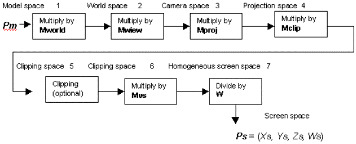
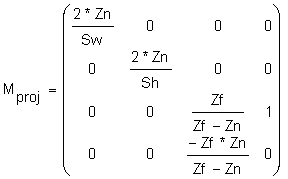
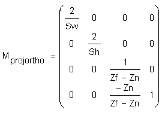
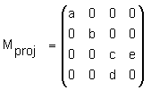
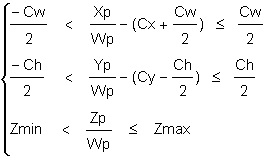
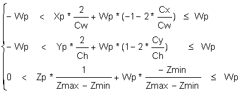
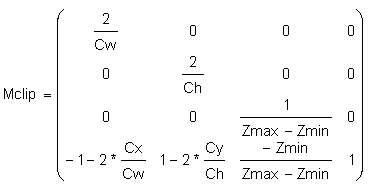
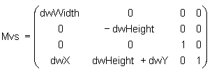
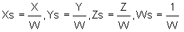

# The Direct3D Transformation Pipeline

This article provides a technical explanation for Direct3D application developers on how to set the parameters of the Direct3D Transformation Pipeline by the direct manipulation of Direct3D matrices.

-   [Overview](#overview)
-   [The Transformation Pipeline](#the-transformation-pipeline)
-   [Usage Tips](#usage-tips)

## Overview

Direct3D uses three transformations to change your 3D model coordinates into pixel coordinates (screen space). These transformations are world transform, view transform, and projection transform.

World transform controls how model coordinates are transformed into world coordinates. World transform can include translations, rotations, and scalings, but it does not apply to lights. For more information on working with world transforms, see [World Transform](/windows/desktop/direct3d9/world-transform).

View transform controls the transition from world coordinates into "camera space," determining camera position in the world. For an example of working with view transforms, see [View Transform](/windows/desktop/direct3d9/view-transform).

Projection transform changes the geometry from camera space into "clip space" and applies perspective distortion. The term "clip space" refers to how the geometry is clipped to the view volume during this transform. For an example of working with projection transforms, see [Projection Transform](/windows/desktop/direct3d9/projection-transform).

Finally, the geometry in clip space is transformed into pixel coordinates (screen space). This transformation is controlled by the viewport settings.

Clipping and transforming vertices must take place in homogenous space (simply put, space in which the coordinate system includes a fourth element), but the final result for most applications needs to be non-homogenous three-dimensional (3D) coordinates defined in "screen space." This means that both the input vertices and the clipping volume must be translated into homogenous space to perform the clipping and then translated back into non-homogenous space to be displayed.

The three Direct3D transformations-world, view, and projection transform-are defined by Direct3D matrices. A Direct3D matrix is a 4x4 homogenous matrix defined by a [**D3DMATRIX**](/windows/desktop/direct3d9/d3dmatrix) structure. Although Direct3D matrices are not standard objects-they are not represented by a COM interface-you can create and set them just as you would any other Direct3D object. For more information on Direct3D matrices, see [Transforms](/windows/desktop/direct3d9/transforms).

## The Transformation Pipeline

If a vertex in the model coordinate is given by Pm = (Xm, Ym, Zm, 1), then the transformations shown in the following figure are applied to compute screen coordinates Ps = (Xs, Ys, Zs, Ws).



Here are descriptions of the stages that are shown in the preceding figure:

1.  World matrix Mworld transforms vertices from the model space to the world space. This matrix is set by:

    ``` syntax
        d3dDevice->SetTransform (D3DTRANSFORMSTATE_WORLD, matrix address) 
    ```

    Direct3D implementation assumes that the last column of this matrix is (0, 0, 0, 1). No error is returned if the user specifies a matrix with a different last column, but the lighting and fog will be incorrect.

2.  View matrix Mview transforms vertices from the world space to the camera space. This matrix is set by:

    ``` syntax
        d3dDevice->SetTransform (D3DTRANSFORMSTATE_VIEW, matrix address) 
    ```

    Direct3D implementation assumes that the last column of this matrix is (0, 0, 0, 1). No error is returned if the user specifies a matrix with different last column, but the lighting and fog will be incorrect.

3.  Projection matrix Mproj transforms vertices from the camera space to the projection space. This matrix is set by:

    ``` syntax
        d3dDevice->SetTransform (D3DTRANSFORMSTATE_PROJECTION, matrix address) 
    ```

    The last column of the projection matrix should be (0, 0, 1, 0), or (0, 0, a, 0) for correct fog and lighting effects; (0, 0, 1, 0) form is preferred.

    Clipping volume for all points Xp = (Xp, Yp, Zp, Wp) in the projection space is defined as:

    ``` syntax
        -Wp < Xp <= Wp 
        -Wp < Yp <= Wp 
        0 < Zp <= Wp 
    ```

    All points that do not satisfy these equations will be clipped.

    If a view volume is defined as:

    -   Sw-screen window width in camera space in near clipping plane
    -   Sh-screen window height in camera space in near clipping plane
    -   Zn-distance to the near clipping plane along Z axes in camera space
    -   Zf-distance to the far clipping plane along Z axes in camera space

    then a perspective projection matrix could be written as follows:

    

    where Mij are members of Mproj.

    For the orthogonal projection we have:

    

    Direct3D assumes that the perspective projection matrix has the form:

    

    If the perspective projection matrix does not have this form, there will be some artifacts. For example, table fog will not work.

4.  Direct3D allows the user to change the clip volume as follows:

    

    This can be rewritten as:

    

    where:

    ``` syntax
        Cx, Cy - dvClipX, dvClipY from D3DVIEWPORT9  
        Cw, Ch - dvClipWidth, dvClipHeight from D3DVIEWPORT9  
        Zmin, Zmax - dvMinZ, dvMaxZ from D3DVIEWPORT9  
    ```

    This transformation can provide increased precision and is equivalent to scaling and shifting the clipping volume.

    The corresponding Mclip matrix is:

    

    A vertex is transformed by:

    ``` syntax
        dvClipWidth = 2   
        dvClipHeight = 2   
        dvClipX = -1   
        dvClipY = 1   
        dvMinZ = 0   
        dvMaxZ = 1   
    ```

    If you do not want to scale the clip volume, you can set viewport parameters to default values:

    ``` syntax
        (Xc, Yc, Zc, Wc) = (Xp, Yp, Zp, Wp) * Mclip   
    ```

5.  The clipping stage is optional if the user specifies the D3DDP\_DONOTCLIP flag in a DrawPrimitive call. In this case, all matrices (including Mvs) can be combined.
6.  The viewport scale matrix Mvs scales coordinates to be within the viewport window and flips the Y axis from up to down:

    

    where:

    ``` syntax
        dwX, dwY - viewport offsets in pixels from D3DVIEWPORT9 
        dwWidth, dwHeight - viewport width and height in pixels from D3DVIEWPORT9    
    ```

7.  Finally, screen coordinates are computed and passed to the rasterizer:

    

## Usage Tips

Here are some tips for how to use the Direct3D Transformation Pipeline:

-   The last column of the world and view matrices should be (0, 0, 0, 1), or the lighting will be incorrect.
-   Set the viewport parameters to build an identity Mclip matrix, unless you understand exactly what it is needed for.

    ``` syntax
        dvClipWidth = 2 
        dvClipHeight = 2
        dvClipX = -1
        dvClipY = 1
        dvMinZ = 0 
        dvMaxZ = 1
    ```

 

 