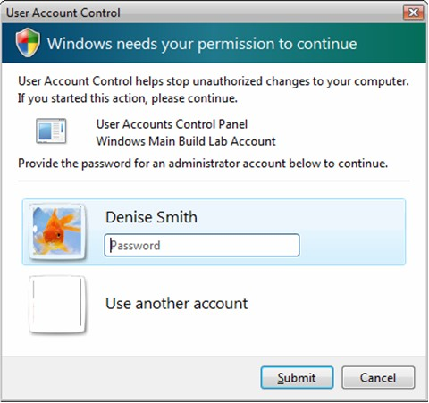
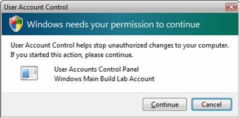
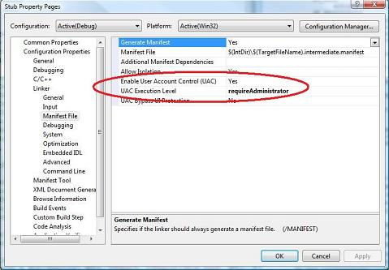
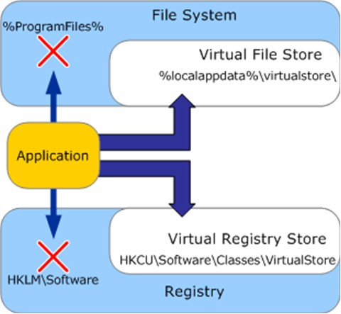

# User Account Control for Game Developers

This article describes the guidelines and best practices for game developers to work effectively with the User Account Control (UAC) security feature introduced in Windows Vista.

-   [Overview of User Account Control](#overview-of-user-account-control)
-   [User Accounts in Windows Vista](#user-accounts-in-windows-vista)
-   [File Access as a Standard User](#file-access-as-a-standard-user)
-   [Registry Access as a Standard User](#registry-access-as-a-standard-user)
-   [Privilege Elevation](#privilege-elevation)
-   [UAC Implications with CreateProcess()](#uac-implications-with-createprocess)
-   [Setting the Execution Level in the Application Manifest](#setting-the-execution-level-in-the-application-manifest)
-   [Embedding a Manifest in Visual Studio](#embedding-a-manifest-in-visual-studio)
-   [UAC Compatibility with Older Games](#uac-compatibility-with-older-games)
-   [Legacy Scenarios and Manifests](#legacy-scenarios-and-manifests)
-   [Conclusion](#conclusion)
-   [Further Reading](#further-reading)

## Overview of User Account Control

User Account Control (UAC), introduced in Windows Vista, is a security feature that is designed to help prevent malicious attackers from using weaknesses or bugs found in widely-used applications to alter the operating system or other installed programs. This is accomplished by running the vast majority of programs and processes as a Standard User (also known as a Limited User, Restricted User, or Least-Privileged User) even if the current user's account has administrative credentials. A process with standard user privileges has many inherent restrictions that prevent it from making system-wide changes.

UAC is also responsible for privilege elevation of a process by use of a dialog-based, authentication scheme initiated upon execution of certain processes that are designated as requiring administrative privileges. Privilege elevation allows administrators to run the majority of their applications at a safe privilege level (the same as any other standard user), but also allow processes and operations that require administrative privileges. UAC supports over-the-shoulder authentication so that an administrator can grant elevated privileges to a program while a standard user is currently logged onto the system.

The UAC feature is enabled by default. While it is possible for an administrator to disable UAC system-wide, doing so has a number of negative ramifications. First, this weakens the security of all administrative accounts, as all processes would be run with administrative credentials, even when most applications do not actually require them. With UAC disabled, a standard user application that exposes an exploitable vulnerability in security can potentially be used to steal private information, install rootkits or spyware, destroy the system integrity, or host zombie attacks on other systems. Whereas with UAC enabled, running the majority of software as a standard user greatly limits the potential damage from such a bug. Secondly, turning off UAC disables many of the workarounds for application compatibility that allow true standard users to successfully run a broad range of applications. Disabling UAC should never be recommended as a compatibility workaround.

It is important to note that applications should strive to only use standard user rights if at all possible. While administrators can easily elevate the privileges of a process, the elevation still requires user interaction and acknowledgement every time that an application is run that requires administrative credentials. This elevation must also be done at the time that the program starts, so requiring administrative credentials   even for a single operation   requires exposing the system to greater risk for the entire running time of the application. Standard users without any ability to elevate their privileges are also common in family and business settings. "Run As Administrator" is not a good workaround for compatibility, exposes the user and the system to greater security risk, and creates frustration for users in many situations.

> [!Note]  
> The User Account Control feature introduced in Windows Vista is also present in Windows 7. While the user experience working with the various system features has been improved with respect to User Account Control, the impact on applications is basically the same. All of the Windows Vista recommendations in this article apply to Windows 7 as well. For details on the UAC UI changes for Windows 7, see [User Interface - User Account Control Dialog Updates](../win7appqual/user-interface---user-account-control-dialog-updates.md).

 

## User Accounts in Windows Vista

Windows Vista categorizes every user into two user account types: administrators and standard users.

A standard user account is similar to a limited-user account in Windows XP. Like in Windows XP, a standard user cannot write to the Program Files folder, cannot write to the HKEY\_LOCAL\_MACHINE portion of the registry, and cannot perform tasks that alter the system, such as installing a kernel-mode driver or accessing system-level process spaces.

The Administrator account has significantly changed since Windows XP was released. Previously, all processes launched by a member of the Administrators group were given administrative privileges. With UAC enabled, all processes execute with standard user privileges, unless specifically elevated by an administrator. This difference makes accounts in the Administrators group more secure by reducing the security risk posed by potential bugs in most programs.

It is important that all applications, especially games, operate effectively and responsibly when run as a standard user process. All operations that require administrative privileges should be done either at installation time or by auxiliary programs that explicitly request administrative credentials. While privilege elevation is fairly trivial for a member of the Administrators group, standard users must defer to someone with administrative credentials to physically enter their password to elevate privileges. Since accounts protected by parental controls must be standard users, this will be a very common situation for gamers who are using Windows Vista.

If your game is already working on Windows XP with limited-user accounts, then the move to User Account Control on Windows Vista should be very easy. The majority of such applications will work as-is, although adding an application manifest is highly recommended. (Manifests are described later in this topic in [Setting the Execution Level in the Application Manifest](#setting-the-execution-level-in-the-application-manifest).)

## File Access as a Standard User

The aspect of your game most affected by standard user restrictions is file system organization and accessibility. You should never assume that your game can write files to the folder where your game is installed. In Windows Vista for instance, a user s privileges must be elevated by the operating system before an application can write to the Program Files folder. To avoid this, you should categorize your game s data files by scope and accessibility, and use the [**SHGetFolderPath**](/windows/win32/api/shlobj_core/nf-shlobj_core-shgetfolderpatha) function, along with the CSIDL constants provided by the Windows shell, to generate the appropriate file paths. The CSIDL constants correspond to known folders in the file system that the operating system uses and promotes to partition global and user-specific files.

Attempting to create or write a file or directory under a folder which does not grant write permission to the process will fail under Windows Vista if the application does not have administrative privileges. If your 32-bit game executable is running in legacy mode, because it did not declare a requested execution level, its write operations will succeed, but they will be subjected to virtualization as described in the section "UAC Compatibility with Older Games" later in this article.

**Table 1. Known Folders**


| CSIDL Name             | Typical Path (Windows Vista)                                                   | Standard User Rights | Administrator Rights | Access Scope | Description                                                                                                                      | Examples                                                          |
|------------------------|--------------------------------------------------------------------------------|----------------------|----------------------|--------------|----------------------------------------------------------------------------------------------------------------------------------|-------------------------------------------------------------------|
| CSIDL\_PERSONAL        | C:\\Users\\user name\\Documents                                                | Read/Write           | Read/Write           | Per-User     | User-specific game files that are read and modified and can be manipulated outside of the game context.                          | Screen shots. Saved game files with a file extension association. |
| CSIDL\_LOCAL\_APPDATA  | C:\\Users\\user name\\AppData\\Local                                           | Read/Write           | Read/Write           | Per-User     | User-specific game files that are read and modified and are of use only within the game context.                                 | Game cache files. Player configurations.                          |
| CSIDL\_COMMON\_APPDATA | C:\\ProgramData                                                                | Read/Write if owner  | Read/Write           | All Users    | Game files that can be created by a user and read by all users. Write access is granted only to the creator of the file (owner). | User Profiles                                                     |
| CSIDL\_PROGRAM\_FILES  | C:\\Program Files<br/> or<br/> C:\\Program Files (x86) <br/> | Read only            | Read/Write           | All Users    | Static game files written by the game s installer that are read by all users.                                                    | Game assets, such as materials and meshes.                        |


 

Your game will typically be installed in a folder under the folder represented by the CSIDL\_PROGRAM\_FILES constant. However, this is not always the case. You should instead use a relative path from your executable file when generating path strings to files or directories located under your installation folder.

You should also refrain from hard-coded assumptions about the known folder paths. For example, on Windows XP Professional 64-bit Edition and Windows Vista x64, the program files path is C:\\Program Files (x86) for 32-bit programs and C:\\Program Files for 64-bit programs. These known paths are changed from Windows XP, and users can reconfigure the location of many of these folders and even locate them on different drives. So, always use the CSIDL constants to avoid confusion and potential problems. Windows Setup understands these known folder locations and will move the data when upgrading the operating system from Windows XP; in contrast, use of non-standard locations or hard-coded paths may well fail after an OS upgrade.

Attention should be given to the subtle usability differences between the user-specific folders specified by CSIDL\_PERSONAL and CSIDL\_LOCAL\_APPDATA. The recommended practice for selecting the CSIDL constant to use for writing a file is to use CSIDL\_PERSONAL if the user is expected to interact with the file, such as double-clicking on it to open it in a tool or application, and to use CSIDL\_LOCAL\_APPDATA for other files. Both folders can be leveraged by your application to store and organize user-specific data files, as there is no difference in their access scope or privilege level. Care should be taken to create path names that are unique enough to not collide with other applications, but short enough to keep the number of characters in the full path fewer than the value of MAX\_PATH, 260.

The following code provides an example of how to write a file to a known folder:

``` syntax
#include <windows.h>
#include <shlobj.h>
#include <shlwapi.h>
        ...
        ...
        ...
        TCHAR strPath[MAX_PATH];
        if( SUCCEEDED(
        SHGetFolderPath( NULL, CSIDL_PERSONAL, NULL, SHGFP_TYPE_CURRENT, strPath ) ) )
        {
        PathAppend( strPath, TEXT( "Company Name\\Title" ) );

        if( !PathFileExists( strPath ) )
        {
        if( ERROR_SUCCESS != SHCreateDirectoryEx( NULL, strPath, NULL ) )
        return E_FAIL;
        }

        PathAppend( strPath, TEXT( "gamefile.txt" ) );

        // strPath is now something like:
        // C:\Users\<current user>\Documents\Company Name\Title\gamefile.txt
        // Open the file for writing
        HANDLE hFile = CreateFile(strPath, GENERIC_WRITE, NULL, NULL, CREATE_ALWAYS, FILE_ATTRIBUTE_NORMAL, NULL);

        if( INVALID_HANDLE_VALUE != hFile )
        {
        // TODO: Write to file
        CloseHandle(hFile);
        }
        }
```

## Registry Access as a Standard User

Registry access by a standard user is restricted in a similar fashion as the file system. A standard user is permitted read access to all keys in the registry; however, write access is only granted to the HKEY\_CURRENT\_USER (HKCU) subtree, which is mapped internally to the user-specific subkey HKEY\_USERS\\Security ID (SID) of current user. An application that needs to write to any registry location other than HKEY\_CURRENT\_USER requires administrative privileges.

If the 32-bit application does not contain a requested execution level in its manifest, then all writes to HKEY\_LOCAL\_MACHINE\\Software will be virtualized, while writes to other locations outside of HKEY\_CURRENT\_USER will fail.

Storing persistent data in the registry, like a user's configuration, is not recommended. The preferred method of storing persistent data from your game is to write the data to the file system by calling [**SHGetFolderPath**](/windows/win32/api/shlobj_core/nf-shlobj_core-shgetfolderpatha) and to get the value of a CSIDL constant, described in the previous section.

## Privilege Elevation

In Windows Vista, any application that requires administrative privileges must declare a request for an administrative execution level in its manifest (described in the next section, [Setting the Execution Level in the Application Manifest](#setting-the-execution-level-in-the-application-manifest)).

Elevation, as it is known, is the procedure driven by UAC to promote a process to an administrative process. The privileges of a process can only be elevated at creation time. Once created, a process will never be promoted to a higher privilege level. For this reason. operations that require administrative credentials should be isolated to separate installers and other auxiliary programs.

Upon execution of a program, UAC inspects the requested execution level in the manifest, and if elevated privileges are required, prompts the current user with one of two standard dialog boxes: one for a standard user and one for an administrator.

If the current user is a standard user, UAC prompts the user for the credentials of an administrator before allowing the program to run.

**Figure 1. Prompt for a Standard User to enter credentials for an administrative account**



If the current user is an administrator, UAC prompts the user for permission before allowing the program to run.

**Figure 2. Prompt for an Administrator to authorize changes to the computer**



The application will only be granted administrative privileges if a standard user provides the proper administrative credentials or an administrative user provides acknowledgement; anything else will cause the application to terminate.

It is important to note that a process with elevated privileges runs as the administrative user who entered credentials in the UAC prompt rather than as the standard user who is currently logged in. This is similar to **RunAs** in Windows XP   the elevated process gets the administrator's folder and registry keys when accessing per-user data, and all programs that the elevated process launches also inherit both the administrative rights and user account locations. For administrators who are prompted for acknowledgement (**Continue** or **Cancel**), these locations will match the currently user's locations. In general, however, processes that require elevation should not operate on per-user data. Note that this can substantially affect how your installer must operate! If the installer, running as an administrator, writes to HKCU or to a user's profile, it may very well be writing to the wrong location. Consider creating these per-user values upon the first run of the game.

## UAC Implications with CreateProcess()

The UAC elevation mechanism will not be invoked from a call to the Win32 [**CreateProcess**](/windows/win32/api/processthreadsapi/nf-processthreadsapi-createprocessa)() function to start an executable which is configured to require a higher execution level than the current process. As a result, the call to **CreateProcess**() will fail with [**GetLastError**](/windows/win32/api/errhandlingapi/nf-errhandlingapi-getlasterror)() returning ERROR\_ELEVATION\_REQUIRED. **CreateProcess**() will only succeed when the execution level of the callee is equal-to or less-than that of the caller. A non-elevated process that must spawn elevated processes should do so using the [**ShellExecute**](/windows/win32/api/shellapi/nf-shellapi-shellexecutea)() function, which will cause the UAC elevation mechanism to be triggered by means of the shell.

## Setting the Execution Level in the Application Manifest

You declare the requested execution level of your game by adding an extension to the application s manifest. The following XML code shows the minimal configuration required to set the execution level for an application:

``` syntax
<?xml version="1.0" encoding="UTF-8" standalone="yes"?>
<assembly xmlns="urn:schemas-microsoft-com:asm.v1" manifestVersion="1.0">
    <ms_asmv2:trustInfo xmlns:ms_asmv2="urn:schemas-microsoft-com:asm.v2">
        <ms_asmv2:security>
            <ms_asmv2:requestedPrivileges>
                <ms_asmv2:requestedExecutionLevel level="asInvoker" uiAccess="false" />
            </ms_asmv2:requestedPrivileges>
        </ms_asmv2:security>
    </ms_asmv2:trustInfo>
</assembly>
```

In the preceding code, the operating system is informed that the game only requires standard user privileges by the following tag:

``` syntax
<ms_asmv2:requestedExecutionLevel level="asInvoker" uiAccess="false" />
```

By explicitly setting requestedExecutionLevel to "asInvoker", this example asserts to the operating system that the game will behave properly without administrative privileges. As a result, UAC disables virtualization and runs the game with the same privileges as the invoker   which is typically standard user privileges, since Windows Explorer runs as standard user.

The operating system can be informed a game requires elevation to administrative privileges by replacing "asInvoker" with "requireAdministrator", to create the following tag:

``` syntax
<ms_asmv2:requestedExecutionLevel level="requireAdministrator" uiAccess="false" />
```

With this configuration, the operating system prompts the current user with one of the standard UAC elevation dialogs every time that the game is executed. It is highly recommended that no game require administrator privileges to run, because not only will this dialog quickly become annoying, but it also makes the game incompatible with parental controls. Think very carefully before adding this requirement to any executable.

A common misconception is that adding a manifest that sets requestedExecutionLevel to "requireAdministrator" bypasses the need for an elevation prompt. This is not true. It simply prevents the operating system from guessing whether your setup or update application needs administrative privileges. The user is still prompted to authorize elevation.

Windows checks the signature of any application that is marked for elevation before it displays the UAC prompt. A large executable that is marked for elevation takes longer to check than a small executable and longer than an executable that is marked as "asInvoker". Setup executables that are self-extracting should, therefore, be marked as "asInvoker", and any portion that needs to be marked as "requireAdministrator" should be placed in a separate helper executable.

The uiAccess attribute, shown in the preceding examples, should always be FALSE for games. This attribute specifies whether UI automation clients have access to the protected system UI, and it has special security implications if set to TRUE.

## Embedding a Manifest in Visual Studio

Manifest support was first added to Visual Studio beginning in VS2005. By default, an executable built in Visual Studio 2005 (or newer) will have an auto-generated manifest embedded in it as part of the build process. The contents of the auto-generated manifest are dependent on certain project configurations that you specify in the project properties dialog.

The manifest that is auto-generated by Visual Studio 2005 will not contain a &lt;trustInfo&gt; block as there is no way to configure the UAC execution level in the project properties. The preferred way to add this information is to let VS2005 merge a user-defined manifest containing the &lt;trustInfo&gt; block with the auto-generated manifest. This is as simple as adding a \*.manifest file to your solution that contains the XML listed in the previous section. When Visual Studio encounters a .manifest file in your solution, it will automatically invoke the Manifest Tool (mt.exe) to merge the .manifest files with the auto-generated one.

> [!Note]  
> There is a bug in the Manifest Tool (mt.exe) provided by Visual Studio 2005 that results in a merged and embedded manifest which can cause problems when the executable is run on Windows XP prior to SP3. The bug is a result of how the tool redefines the default namespace upon declaration of the &lt;trustInfo&gt; block. Fortunately, it is easy to bypass the issue entirely by explicitly declaring a different namespace in the &lt;trustInfo&gt; block and by scoping the child nodes to the new namespace. The XML provided in the previous section demonstrates this fix.

 

A caveat in using the mt.exe tool included in Visual Studio 2005 is that it will generate a warning when processing the &lt;trustInfo&gt; block as the tool does not contain an updated schema to validate the XML against. To remedy this warning, it is recommended that you replace all mt.exe files under the Visual Studio 2005 install directory (there are multiple instances) with the mt.exe provided in the latest Windows SDK.

Beginning in Visual Studio 2008, you can now specify an application's execution level from within the project properties dialog (Figure 3), or by using the /MANIFESTUAC linker flag. Setting these options will cause Visual Studio 2008 to auto-generate and embed a manifest with the appropriate &lt;trustInfo&gt; block into the executable.

**Figure 3. Setting the execution level in Visual Studio 2008**



Embedding a manifest in older versions of Visual Studio without manifest support is still possible, but does require more work from the developer. For an example on how to do this, please examine the Visual Studio 2003 project included in any sample in the DirectX SDK prior to the March 2008 release.

## UAC Compatibility with Older Games

If your game appears to be saving and loading a file successfully to the Program Files directory, yet no evidence of the file iOn Windows Vista, any 32-bit application that does not contain a requested execution level in its manifest is considered a legacy application. Prior to Windows Vista, most applications were typically run by users with administrative privileges. As a result, these applications could freely read and write system files and registry keys, and many developers did not make the changes needed to work properly on Limited User Accounts on Windows XP. However on Windows Vista, these same applications would now fail due to insufficient access privileges under the new security model, which enforces standard user execution for legacy applications. To mitigate the impact of this, virtualization was also added to Windows Vista. Virtualization will keep thousands of legacy applications working well on Windows Vista without requiring those applications to have elevated privileges at all times simply to succeed at a few minor operations. s found, chances are your game is running in legacy mode and was subjected to virtualization.

Virtualization affects the file system and registry by redirecting system-sensitive writes (and subsequent file or registry operations) to a per-user location within the current user's profile. For example, if an application attempts to write to the following file:

<dl> C:\\Program Files\\Company Name\\Title\\config.ini  
</dl>

the write is automatically redirected to:

<dl> C:\\Users\\user name\\AppData\\Local\\VirtualStore\\Program Files\\Company Name\\Title\\config.ini  
</dl>

Likewise, if an application attempts to write a registry value like the following:

<dl> HKEY\_LOCAL\_MACHINE\\Software\\Company Name\\Title  
</dl>

it will be redirected instead to:

<dl> HKEY\_CURRENT\_USER\\Software\\Classes\\VirtualStore\\MACHINE\\Software\\Company Name\\Title  
</dl>

Files and registry keys affected by virtualization are only be accessed by file and registry operations from virtualized applications that are running as the current user.

However, there are many restrictions to virtualization. One is that 64-bit applications are never run in legacy mode for compatibility   operations subjected to virtualization in 32-bit applications will just fail in 64-bit. Also if a legacy application running as a standard user tries to write any type of executable file to a location that requires administrative credentials, then virtualization will not occur and the write will fail.

**Figure 4. Virtualization Process**



When a legacy application attempts a read operation on system-sensitive locations in the file system or registry, the virtual locations are searched first. If the file or registry key is not found, then the operating system accesses the default system locations.

Virtualization will be removed from subsequent versions of Windows so it important not to rely on this feature. Instead, you should explicitly configure your application manifest for either standard user or administrative privileges, as this will disable virtualization. Virtualization is also not obvious to end users, so even though virtualization may allow your application to run, it can generate support calls and make it difficult to trouble-shoot for these customers.

Note that if UAC is disabled, then virtualization is also disabled. If virtualization is disabled, standard user accounts behave exactly like limited user accounts in Windows XP, and legacy applications may not function correctly for standard users that would otherwise have succeeded due to virtualization.

## Legacy Scenarios and Manifests

For the majority of usage scenarios, simply marking the .exe with the correct UAC manifest elements and ensuring the application works correctly as a Standard User is sufficient for excellent UAC compatibility. Most gamers are running Windows Vista or Windows 7 with User Account Control enabled. For Windows XP and users on Windows Vista or Windows7 with the User Account Control feature disabled, they typically run using administrator accounts. While this is a less secure mode of operation, it will generally not run into any additional compatibility issues although as noted above, disabling UAC disables virtualization as well.

There is a special case worth noting when the program is marked as "requireAdministrator" in the UAC manifest. On Windows XP and on Windows Vista or Windows 7 with User Account Control disabled, the UAC manifest elements are ignored by the system. In this situation, users with administrator accounts will always run all programs with full administrator rights, and thus these programs will function as expected. Windows XP Restricted Users and Standard Users running on Windows Vista or Windows 7, however, will always run these programs with restricted rights and all administrator-level operations will fail. It is therefore recommended that programs marked as "requiretAdministrator" call [**IsUserAnAdmin**](/windows/win32/api/shlobj_core/nf-shlobj_core-isuseranadmin) on startup, and display a fatal error message if it returns FALSE. For the majority scenario above, this will always succeed, but provides a better user experience and a clear error message for this rare situation.

## Conclusion

As a game developer targeting the Windows multi-user environment, it is imperative that you design your game to operate effectively and responsibly. Your game's main executable file should not be dependent on administrative privileges. This not only prevents the appearance of prompts for elevation every time that your game is run   which can negatively impact the overall user experience   but it also enables your game to take advantage of other features that require execution with standard user privileges, such as Parental Controls.

Applications that are properly designed to operate as with the credentials of a standard user (or limited user) under previous versions of Windows will not be impacted by UAC   they will run without elevation. However, they should include a manifest with their requested execution level set to "asInvoker" to conform to application standards for Vista.

## Further Reading

For assistance with designing applications for Windows Vista that are compliant with User Account Control, download the following white paper: [Windows Vista Application Development Requirements for User Account Control Compatibility](/previous-versions/dotnet/articles/bb530410(v=msdn.10)).

This white paper provides detailed steps about the design process, along with code samples, requirements, and best practices. This paper also details the technical updates and changes to the user experience in Windows Vista.

For more information about User Account Control, visit [Windows Vista: User Account Control](https://www.microsoft.com/technet/windowsvista/security/uac.mspx) on [Microsoft TechNet](https://www.microsoft.com/technet/).

Another useful resource is the article [Teach Your Apps To Play Nicely with Windows Vista User Account Control](/archive/msdn-magazine/2007/january/teach-your-apps-to-work-with-windows-vista-user-account-control), from [MSDN Magazine](/archive/msdn-magazine/msdn-magazine-issues), January 2007. This article discusses general issues of application compatibility, as well as the advantages and issues of using Windows Installer packages on Windows Vista.

For more information about the bug and the fix for mt.exe, the tool used by Visual Studio 2005 to automatically merge and embed a manifest into an executable, see [Exploring Manifests Part 2: Default Namespaces and UAC Manifests in Windows Vista](https://techcommunity.microsoft.com/t5/Windows-Blog-Archive/bg-p/Windows-Blog-Archive/2006/09/08/exploring-manifests-part-2-default-namespaces-and-uac-manifests-in-windows-vista/) on Chris Jackson's blog on [MSDN](/archive/blogs/).

 

