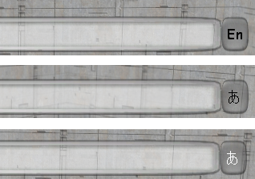

# Using an Input Method Editor in a Game

> [!Note]  
> This article details working with the Windows XP Input Method Editor (IME). Changes were made to the IME for Windows Vista that are not fully detailed in this article. For more info about changes to the IME for Windows Vista, see [Input Method Editors (IME)](https://www.microsoft.com/globaldev/vista/Whats_New_Vista.mspx#e4eac) in [Windows Vista - An Ever-Expanding View of Internationalization](https://www.microsoft.com/globaldev/vista/Whats_New_Vista.mspx) on the Microsoft Global Development and Computing Portal.

 

An input method editor (IME) is a program that allows easy text entry using a standard keyboard for East Asian languages such as Chinese, Japanese, Korean, and other languages with complex characters. For example, with IMEs a user can type complex characters in a word processor, or a player of a massive multiplayer online game can chat with friends in complex characters.

This article explains how you can implement a basic IME edit control in a full-screen Microsoft DirectX application. Applications that take advantage of DXUT automatically get IME functionality. For applications that do not make use of the framework, this article describes how to add IME support to an edit control.

Contents:

-   [Default IME Behavior](#default-ime-behavior)
-   [Using IMEs with DXUT](#using-imes-with-dxut)
-   [Overriding the Default IME Behavior](#overriding-the-default-ime-behavior)
-   [Functions](#functions)
-   [Messages](#ime-messages)
-   [Examples](#examples)
    -   [CHT IME version 4.2, 4.3 and 4.4](#cht-ime-version-42-43-and-44)
    -   [CHT IME version 5.0](#cht-ime-version-50)
    -   [CHT IME version 5.1, 5.2 and CHS IME version 5.3](#cht-ime-version-51-52-and-chs-ime-version-53)
    -   [CHS IME version 4.1](#chs-ime-version-41)
    -   [CHS IME version 4.2](#chs-ime-version-42)
-   [IME Messages](#ime-messages)
    -   [WM\_INPUTLANGCHANGE](#wm_inputlangchange)
    -   [WM\_IME\_STARTCOMPOSITION](/windows)
    -   [WM\_IME\_COMPOSITION](/windows)
    -   [WM\_IME\_ENDCOMPOSITION](/windows)
    -   [WM\_IME\_NOTIFY](/windows)
-   [Rendering](#rendering)
    -   [Input Locale Indicator](#input-locale-indicator)
    -   [Composition Window](#composition-window)
    -   [Reading and Candidate Windows](#reading-and-candidate-windows)
-   [Limitations](#limitations)
-   [Registry Information](#registry-information)
-   [Appendix A: CHT Versions per Operating System](#appendix-a-cht-versions-per-operating-system)
-   [Further Information](#further-information)
-   [GetReadingString](#getreadingstring)
-   [ShowReadingWindow](#showreadingwindow)

## Default IME Behavior

IMEs map keyboard input to phonetic components or other language elements specific to a selected language. In a typical scenario, the user types keys that represent pronunciation of a complex character. If the IME recognizes the pronunciation as valid, it presents the user with a list of word or phrase candidates from which the user can select a final choice. The chosen word is then sent to the application through a series of Microsoft Windows [**WM\_CHAR**](/windows/desktop/inputdev/wm-char) messages. Because the IME works at a level below the application by intercepting keyboard input, the presence of an IME is transparent to the application. Almost all Windows applications can readily take advantage of IMEs without being aware of their existence and without requiring special coding.

A typical IME displays several windows to guide the user through character entry, as shown in the following examples.


| Window Type                                       | Description                                                                                                                                                                                                                                                                                                                 | IME Output                                   |
|---------------------------------------------------|-----------------------------------------------------------------------------------------------------------------------------------------------------------------------------------------------------------------------------------------------------------------------------------------------------------------------------|----------------------------------------------|
| A. Reading Window                                 | Contains keystrokes from the keyboard; typically changes after each keystroke.                                                                                                                                                                                                                                              | reading string                               |
| B. Composition Window                             | Contains the collection of characters that the user has composed with the IME. These characters are drawn by the IME on top of the application. When the user notifies the IME that the composition string is satisfactory, the IME then sends the composition string to the application via a series of WM\_CHAR messages. | composition string                           |
| C. Candidate Window                               | When the user has entered a valid pronunciation, the IME displays a list of candidate characters that all match the given pronunciation. The user then selects the intended character from this list, and the IME adds this character to the Composition Window display.                                                    | the next character in the composition string |
| D. [Input Locale](/windows/desktop/Intl/nls-terminology) indicator | Shows the language the user has selected for keyboard input. This indicator is embedded in the Windows taskbar. The input language can be selected by opening the Regional and Language Options Control Panel and then clicking Details on the Languages tab.                                                               | \-                                           |


 

## Using IMEs with DXUT

In DXUT, the CDXUTIMEEditBox class implements IME functionality. This class is derived from the CDXUTEditBox class, the basic edit control provided by the framework. CDXUTIMEEditBox extends that edit control to support IMEs by overriding the CDXUTIMEEditBox methods. The classes are designed this way to help developers learn what they need to take from the framework to implement IME support in their own edit controls. The rest of this topic explains how the framework, and CDXUTIMEEditBox in particular, overrides a basic edit control to implement IME functionality.

Most of the IME-specific variables in CDXUTIMEEditBox are declared as static, because many IME buffers and states are specific to the process. For instance, a process has only one buffer for the composition string. Even if the process has ten edit controls, they will all be sharing the same composition string buffer. The composition string buffer for CDXUTIMEEditBox is therefore static, preventing the application from taking up unnecessary memory space.

CDXUTIMEEditBox is implemented in the following DXUT code:

(SDK root)\\Samples\\C++\\Common\\DXUTgui.cpp

## Overriding the Default IME Behavior

Normally an IME uses standard Windows procedures to create a window (see [Using Windows](/windows/desktop/winmsg/using-windows)). Under normal circumstances, this produces satisfactory results. However, when the application presents in full-screen mode, as is common for games, standard windows no longer work and may not display on top of the application. To overcome this issue, the application must draw the IME windows itself instead of relying on Windows to perform this task.

When the default IME window creation behavior does not provide what an application requires, the application can override the IME window handling. An application can achieve this by processing IME-related messages and calling the [Input Method Manager](/windows/desktop/Intl/input-method-manager) (IMM) API.

When a user interacts with an IME to input complex characters, the IMM sends messages to the application to notify it of important events, such as starting a composition or showing the candidate window. An application typically ignores these messages and passes them to the default message handler, which causes the IME to handle them. When the application, instead of the default handler, handles the messages, it controls exactly what happens at each of the IME events. Often the message handler retrieves the content of the various IME windows by calling the IMM API. Once the application has this information, it can properly draw the IME windows itself when it needs to render to the display.

## Functions

An IME needs to get the reading string, hide the reading window, and get the orientation of reading window. This table shows the functionalities per IME version:


|                    | Getting reading string                                                | Hiding reading window                       | Orientation of reading window                              |
|--------------------|-----------------------------------------------------------------------|---------------------------------------------|------------------------------------------------------------|
| Before version 6.0 | A. Reading Window Access IME private data directly. See "4 Structure" | Trap IME private messages. See "3 Messages" | Examine registry information. See "5 Registry Information" |
| After version 6.0  | [GetReadingString](#getreadingstring)                                 | [ShowReadingWindow](#showreadingwindow)     | [GetReadingString](#getreadingstring)                      |


 

## Messages

The following messages don't have to be processed for newer IME that implements [ShowReadingWindow](#showreadingwindow)().

The following messages are trapped by application message handler (i.e. they are not passed to DefWindowProc) to prevent the reading window from showing up.

``` syntax
Msg == WM_IME_NOTIFY
wParam == IMN_PRIVATE
lParam == 1, 2 (CHT IME version 4.2, 4.3 and 4.4 / CHS IME 4.1 and 4.2)
lParam == 16, 17, 26, 27, 28 (CHT IME version 5.0, 5.1, 5.2 / CHS IME 5.3)
```

## Examples

The following examples illustrate how to get reading string information from older IME that doesn't have GetReadingString(). The code generates the following outputs:


|              |                                                                                       |
|--------------|---------------------------------------------------------------------------------------|
| DWORD dwlen  | Length of the reading string                                                          |
| DWORD dwerr  | Index of error char                                                                   |
| LPWSTR wstr  | Pointer to the reading string                                                         |
| BOOL unicode | If true, the reading string is in Unicode format. Otherwise it's in multibyte format. |


 

### CHT IME version 4.2, 4.3 and 4.4

``` syntax
LPINPUTCONTEXT lpIMC = _ImmLockIMC(himc);
LPBYTE p = *(LPBYTE *)((LPBYTE)_ImmLockIMCC(lpIMC->hPrivate) + 24);
if (!p) break;
dwlen = *(DWORD *)(p + 7*4 + 32*4);
dwerr = *(DWORD *)(p + 8*4 + 32*4);
wstr = (WCHAR *)(p + 56);
unicode = TRUE;
```

### CHT IME version 5.0

``` syntax
LPINPUTCONTEXT lpIMC = _ImmLockIMC(himc);
LPBYTE p = *(LPBYTE *)((LPBYTE)_ImmLockIMCC(lpIMC->hPrivate) + 3*4);
if (!p) break;
p = *(LPBYTE *)((LPBYTE)p + 1*4 + 5*4 + 4*2 );
if (!p) break;
dwlen = *(DWORD *)(p + 1*4 + (16*2+2*4) + 5*4 + 16);
dwerr = *(DWORD *)(p + 1*4 + (16*2+2*4) + 5*4 + 16 + 1*4);
wstr = (WCHAR *)(p + 1*4 + (16*2+2*4) + 5*4);
unicode = FALSE;
```

### CHT IME version 5.1, 5.2 and CHS IME version 5.3

``` syntax
LPINPUTCONTEXT lpIMC = _ImmLockIMC(himc);
LPBYTE p = *(LPBYTE *)((LPBYTE)_ImmLockIMCC(lpIMC->hPrivate) + 4);
if (!p) break;
p = *(LPBYTE *)((LPBYTE)p + 1*4 + 5*4); 
if (!p) break;
dwlen = *(DWORD *)(p + 1*4 + (16*2+2*4) + 5*4 + 16 * 2);
dwerr = *(DWORD *)(p + 1*4 + (16*2+2*4) + 5*4 + 16 * 2 + 1*4);
wstr  = (WCHAR *) (p + 1*4 + (16*2+2*4) + 5*4);
unicode = TRUE;
```

### CHS IME version 4.1

``` syntax
// GetImeId(1) returns VS_FIXEDFILEINFO:: dwProductVersionLS of IME file
int offset = ( GetImeId( 1 ) >= 0x00000002 ) ? 8 : 7;
LPINPUTCONTEXT lpIMC = _ImmLockIMC(himc);
BYTE p = *(LPBYTE *)((LPBYTE)_ImmLockIMCC(lpIMC->hPrivate) + offset * 4);
if (!p) break;
dwlen = *(DWORD *)(p + 7*4 + 16*2*4);
dwerr = *(DWORD *)(p + 8*4 + 16*2*4);
dwerr = min(dwerr, dwlen);
wstr = (WCHAR *)(p + 6*4 + 16*2*1);
unicode = TRUE;
```

### CHS IME version 4.2

``` syntax
int nTcharSize = IsNT() ? sizeof(WCHAR) : sizeof(char);
LPINPUTCONTEXT lpIMC = _ImmLockIMC(himc);
BYTE p = *(LPBYTE *)((LPBYTE)_ImmLockIMCC(lpIMC->hPrivate) + 1*4 + 1*4 + 6*4);
if (!p) break;
dwlen = *(DWORD *)(p + 1*4 + (16*2+2*4) + 5*4 + 16 * nTcharSize);
dwerr = *(DWORD *)(p + 1*4 + (16*2+2*4) + 5*4 + 16 * nTcharSize + 1*4);
wstr  = (WCHAR *) (p + 1*4 + (16*2+2*4) + 5*4);
unicode = IsNT() ? TRUE : FALSE;
```

## IME Messages

A full-screen application must properly handle the following IME-related messages:

### WM\_INPUTLANGCHANGE

The IMM sends a WM\_INPUTLANGCHANGE message to the active window of an application after the input locale has been changed by the user with a key combination (usually ALT+SHIFT), or with the input locale indicator on the taskbar or language bar. The language bar is an on-screen control with which the user can configure a text service. (See [How to show the language bar](/windows/desktop/TSF/how-to-set-up-tsf).) The following screen shot shows a language selection list that is displayed when the user clicks on the locale indicator.


When the IMM sends a WM\_INPUTLANGCHANGE message, CDXUTIMEEditBox must perform several important tasks:

1.  The GetKeyboardLayout method is called to return the input locale identifier (ID) for the application thread. The CDXUTIMEEditBox class saves this ID in its static member variable s\_hklCurrent for later use. It is important for the application to know the current input locale, because the IME for each language has its own distinct behavior. The developer may need to provide different code for different input locales.
2.  CDXUTIMEEditBox initializes a string to display in the edit box language indicator. This indicator can display the active input language when the application is running in full-screen mode and neither the taskbar nor language bar is visible.
3.  The ImmGetConversionStatus method is called to indicate whether the input locale is in native or non-native conversion mode. Native conversion mode lets the user enter text in the chosen language. Non-native conversion mode makes the keyboard act as a standard English keyboard. It is important to give the user a visual cue as to what type of conversion mode the IME is in, so that the user can easily know what characters to expect when hitting a key. CDXUTIMEEditBox provides this visual cue with a language indicator color. When the input locale uses an IME with native conversion mode, the CDXUTIMEEditBox class draws the indicator text with the color defined by the m\_IndicatorImeColor parameter. When the IME is in non-native conversion mode, or no IME is used at all, the class draws the indicator text with the color defined by the m\_IndicatorEngColor parameter.
4.  CDXUTIMEEditBox checks the input locale and sets the static member variable s\_bInsertOnType to TRUE for Korean and FALSE for all other languages. This flag is required because of the different behaviors of Korean IMEs and all other IMEs. When entering characters in languages other than Korean, the user-entered text is displayed in the composition window, and the user can freely change the content of the composition string. The user presses the ENTER key when satisfied with the composition string, and the composition string is sent to the application as a series of WM\_CHAR messages. In Korean IMEs, however, when a user presses a key to enter text, a character is immediately sent to the application. When the user subsequently presses more keys to modify that initial character, the character in the edit box changes to reflect additional input from the user. Essentially, the user is composing characters in the edit box. These two behaviors are different enough that CDXUTIMEEditBox must code for each of them specifically.
5.  The static member method SetupImeApi is called to retrieve addresses of two functions from the IME module: GetReadingString and ShowReadingWindow. If these functions exist, ShowReadingWindow is called to hide the default reading window for this IME. Because the application renders the reading window itself, it notifies the IME to disable drawing the default reading window so that it will not interfere with full-screen rendering.

The IMM sends a WM\_IME\_SETCONTEXT message when a window of the application is activated. The lParam parameter of this message contains a flag that indicates to the IME which windows should get drawn and which should not. Because the application is handling all of the drawing, it does not need the IME to draw any of the IME windows. Therefore, the application's message handler simply sets lParam to 0 and returns.

In order for applications to support IME, special processing is needed for the IME-related message WM\_IME\_SETCONTEXT. Since Windows typically sends this message to the application prior to calling the PanoramaInitialize() method, Panorama doesn't have a chance to process the UI for showing candidate list windows.

The following code snippet specifies to Windows applications not to display any UI associated with the candidate list window, allowing Panorama to specifically handle this UI.

``` syntax
case WM_IME_SETCONTEXT:
         lParam = 0;
    lRet = DefWindowProc(hWnd, msg, wParam, lParam);
    break;
    //... more message processing
    return lRet;
```

### WM\_IME\_STARTCOMPOSITION

The IMM sends a WM\_IME\_STARTCOMPOSITION message to the application when an IME composition is about to begin as a result of keystrokes by the user. If the IME uses the composition window, it displays the current composition string in a composition window. CDXUTIMEEditBox handles this message by performing two tasks:

1.  CDXUTIMEEditBox clears the composition string buffer and attribute buffer. These buffers are static members of CDXUTIMEEditBox.
2.  CDXUTIMEEditBox sets the s\_bHideCaret static member variable to TRUE. This member, defined in the base CDXUTEditBox class, controls whether the cursor in the edit box should be drawn when the edit box is rendered. The composition window functions similarly to an edit box with text and cursor. To avoid confusion when the composition window is visible, the edit box hides its cursor so that only one cursor is visible at a time.

### WM\_IME\_COMPOSITION

The IMM sends a WM\_IME\_COMPOSITION message to the application when the user enters a keystroke to change the composition string. The value of lParam indicates what type of information the application can retrieve from the Input Method Manager (IMM). The application should retrieve the available information by calling [**ImmGetCompositionString**](/windows/desktop/api/imm/nf-imm-immgetcompositionstringa) and then should save the information in its private buffer so that it can render the IME elements later.

CDXUTIMEEditBox checks for and retrieves the following composition string data:


| [**WM\_IME\_COMPOSITION**](/windows/desktop/Intl/wm-ime-composition) lParam Flag Value | Data                           | Description                                                                                                                                                                                                                                                                                                                                                          |
|-----------------------------------------------------------------------|--------------------------------|----------------------------------------------------------------------------------------------------------------------------------------------------------------------------------------------------------------------------------------------------------------------------------------------------------------------------------------------------------------------|
| GCS\_COMPATTR                                                         | Composition Attribute          | This attribute contains information such as the status of each character in the composition string (for example, converted or non-converted). This information is needed because CDXUTIMEEditBox colors the composition string characters differently based upon their attributes.                                                                                   |
| GCS\_COMPCLAUSE                                                       | Composition Clause Information | This clause information is used when the Japanese IME is active. When a Japanese composition string is converted, characters may be grouped together as a clause that gets converted to a single entity. When the user moves the cursor, CDXUTIMEEditBox uses this information to highlight the entire clause, instead of just a single character within the clause. |
| GCS\_COMPSTR                                                          | Composition String             | This string is the up-to-date string being composed by the user. This is also the string displayed in the composition window.                                                                                                                                                                                                                                        |
| GCS\_CURSORPOS                                                        | Composition Cursor Position    | The composition window implements a cursor, similar to the cursor in an edit box. The application can retrieve the cursor position when processing the WM\_IME\_COMPOSITION message in order to draw the cursor properly.                                                                                                                                            |
| GCS\_RESULTSTR                                                        | Result String                  | The result string is available when the user is about to complete the composition process. This string should be retrieved and the characters should be sent to the edit box.                                                                                                                                                                                        |


 

### WM\_IME\_ENDCOMPOSITION

The IMM sends a WM\_IME\_ENDCOMPOSITION message to the application when the IME composition operation is ending. This can occur when the user presses the ENTER key to approve the composition string, or the ESC key to cancel the composition. CDXUTIMEEditBox handles this message by setting the composition string buffer to be empty. It then sets s\_bHideCaret to FALSE because the composition window is closed and the cursor in the edit box should again be visible.

The CDXUTIMEEditBox message handler also sets s\_bShowReadingWindow to FALSE. This flag controls whether the class draws the reading window when the edit box renders itself, so it must be set to FALSE when a composition ends.

### WM\_IME\_NOTIFY

The IMM sends a WM\_IME\_NOTIFY message to the application whenever an IME window changes. An application that handles the drawing of the IME windows should process this message so that it is aware of any update to the content of the window. The wParam indicates the command or the change that is taking place. CDXUTIMEEditBox handles the following commands:


<table>
<colgroup>
<col style="width: 50%" />
<col style="width: 50%" />
</colgroup>
<thead>
<tr class="header">
<th>IME Command</th>
<th>Description</th>
</tr>
</thead>
<tbody>
<tr class="odd">
<td><a href="/windows/desktop/Intl/imn-setopenstatus">IMN_SETOPENSTATUS</a></td>
<td>This attribute contains information such as the status of each character in the composition string (for example, converted or non-converted). This information is needed because CDXUTIMEEditBox colors the composition string characters differently based upon their attributes.</td>
</tr>
<tr class="even">
<td><a href="/windows/desktop/Intl/imn-opencandidate">IMN_OPENCANDIDATE</a> / <a href="/windows/desktop/Intl/imn-changecandidate">IMN_CHANGECANDIDATE</a></td>
<td>Sent to the application when the candidate window is about to be opened or updated, respectively. The candidate window opens when a user wishes to change the converted text choice. The window is updated when a user moves the selection indicator or changes the page. CDXUTIMEEditBox uses one message handler for both of these commands because the tasks required are exactly the same:<br/>
<ol>
<li>CDXUTIMEEditBox sets the bShowWindow member of the candidate list structure s_CandList to TRUE to indicate that the candidate window needs to be drawn during frame rendering.</li>
<li>CDXUTIMEEditBox retrieves the candidate list by calling <a href="/windows/desktop/api/imm/nf-imm-immgetcandidatelista"><strong>ImmGetCandidateList</strong></a>, first to get the required buffer size, and then again to get the actual data.</li>
<li>The private candidate list structure s_CandList is initialized with the retrieved candidate data.</li>
<li>The candidate strings are stored as an array of strings.</li>
<li>The index of the selected entry, as well as the page index, is saved.</li>
<li>CDXUTIMEEditBox checks whether the candidate window style is vertical or horizontal. If the window style is horizontal, an additional string buffer, the HoriCand member of s_CandList, must be initialized with all of the candidate strings, with space characters inserted between all adjacent strings. When rendering a vertical candidate window, the individual candidate strings are drawn one at a time, with the y coordinates incremented for each string. However, this HoriCand string should be used when rendering a horizontal candidate window, because the space character is the best way to separate two adjacent strings on the same line.</li>
</ol></td>
</tr>
<tr class="odd">
<td><a href="/windows/desktop/Intl/imn-closecandidate">IMN_CLOSECANDIDATE</a></td>
<td>Sent to the application when a candidate window is about to close. This happens when a user has made a selection from the candidate list. CDXUTIMEEditBox handles this command by setting the visible flag of the candidate window to FALSE and then clearing the candidate string buffer.</td>
</tr>
<tr class="even">
<td>IMN_PRIVATE</td>
<td>Sent to the application when the IME has updated its reading string as a result of the user typing or removing characters. The application should retrieve the reading string and save it for rendering. CDXUTIMEEditBox has two methods to retrieve the reading string, based upon how reading strings are supported in the IME: <br/>
<ul>
<li>If the IME supports the GetReadingString function, GetReadingString is called to retrieve the reading string.</li>
<li>If the IME does not implement GetReadingString, CDXUTIMEEditBox retrieves the reading string from the input context content.</li>
</ul></td>
</tr>
</tbody>
</table>


 

## Rendering

Rendering of the IME elements and windows is straightforward. CDXUTIMEEditBox lets the base class render first because IME windows should appear on top of the edit control. After the base edit box is rendered, CDXUTIMEEditBox checks the visibility flag of each IME window (indicator, composition, candidate, and reading window) and draws the window if it should be visible. See Default IME Behavior for descriptions of the different IME window types.

### Input Locale Indicator

The input locale indicator is rendered before any other IME windows because it is an element that is always displayed. It should therefore appear below other IME windows. CDXUTIMEEditBox renders the indicator by calling the RenderIndicator method, in which the indicator font color is determined by examining the s\_ImeState static variable, which reflects the current IME conversion mode. When the IME is enabled and native conversion is active, the method uses m\_IndicatorImeColor as the indicator color. If the IME is disabled or is in non-native conversion mode, m\_IndicatorImeColor is used to draw the indicator text. By default, the indicator window itself is drawn to the right of the edit box. Applications can change this behavior by overriding the RenderIndicator method.

The following figure shows the different appearances of an input locale indicator for English, Japanese in alphanumeric conversion mode, and Japanese in native conversion mode:



### Composition Window

The drawing of the composition window is handled in the RenderComposition method of CDXUTIMEEditBox. The composition window floats above the edit box. It should be drawn at the cursor position of the underlying edit control. CDXUTIMEEditBox handles the rendering as follows:

1.  The entire composition string is drawn using the default composition string colors.
2.  Characters with certain special attributes should be drawn in different colors, so CDXUTIMEEditBox reviews the characters of the composition string and inspects the string attribute. If the attribute calls for different colors, the character is drawn again with the appropriate colors.
3.  The cursor of the composition window is drawn to complete the rendering.

The cursor should blink for Korean IMEs, but it should not for other IMEs. RenderComposition determines whether the cursor should be visible based upon timer values when the Korean IME is used.

### Reading and Candidate Windows

The reading and candidate windows are rendered by the same CDXUTIMEEditBox method, RenderCandidateReadingWindow. Both windows contain an array of strings for vertical layout, or a single string in the case of horizontal layout. The bulk of the code in RenderCandidateReadingWindow is used to position the window so that no part of the window falls outside the application window and gets clipped.

## Limitations

IMEs sometimes contain advanced features to improve the ease of inputting text. Some of the features found in newer IMEs are shown in the following figures. These advanced features are not present in DXUT. Implementing support for these advanced features can be challenging because there is no interface defined to obtain the necessary information from the IMEs.

Advanced Traditional Chinese IME with expanded candidate list:


Advanced Japanese IME with some candidate entries that contain additional text to describe their meanings:


Advanced Korean IME that includes a handwriting recognition system:


## Registry Information

The following registry information is checked to determine the orientation of the reading window, when the current IME is older CHT New Phonetic that doesn't implement GetReadingString().


| Key                                                           | Value            |
|---------------------------------------------------------------|------------------|
| HKCU\\software\\microsoft\\windows\\currentversion\\IME\_Name | keyboard mapping |


 

Where: IME\_Name is MSTCIPH if the IME file version is 5.1 or later; otherwise IME\_Name is TINTLGNT.

The orientation of reading window is horizontal if either:

-   The IME is version 5.0 and keyboard mapping value is 0x22 or 0x23
-   The IME is version 5.1 or version 5.2 and keyboard mapping value is 0x22, 0x23 or 0x24.

If neither condition is met, the reading window is vertical.

## Appendix A: CHT Versions per Operating System


| Operating System           | CHT IME Version |
|----------------------------|-----------------|
| Windows 98                 | 4.2             |
| Windows 2000               | 4.3             |
| unknown                    | 4.4             |
| Windows ME                 | 5.0             |
| Office XP                  | 5.1             |
| Windows XP                 | 5.2             |
| Standalone web downloadble | 6.0             |


 

## Further Information

For additional information, see the following:

-   [Installing and Using Input Method Editors](/windows/desktop/DxTechArts/installing-and-using-input-method-editors)
-   [International Text Display](/windows/desktop/Intl/creating-your-own-format-selection-user-interface)
-   [The Unicode Consortium](https://www.unicode.org/)
-   Developing International Software. Dr. International. 2nd ed. Redmond, WA: Microsoft Press, 2003.

## GetReadingString

Gets reading string information.

**Parameters**

<dl> <dt>

<span id="himc_"></span><span id="HIMC_"></span>*himc* 
</dt> <dd>

\[in\] Input context.

</dd> <dt>

<span id="uReadingBufLen"></span><span id="ureadingbuflen"></span><span id="UREADINGBUFLEN"></span>*uReadingBufLen*
</dt> <dd>

\[in\] Length of lpwReadingBuf, in WCHAR. If it is zero, it means query reading buffer length.

</dd> <dt>

<span id="lpwReadingBuf_"></span><span id="lpwreadingbuf_"></span><span id="LPWREADINGBUF_"></span>*lpwReadingBuf* 
</dt> <dd>

\[out\] Return reading string (not zero end).

</dd> <dt>

<span id="pnErrorIndex_"></span><span id="pnerrorindex_"></span><span id="PNERRORINDEX_"></span>*pnErrorIndex* 
</dt> <dd>

\[out\] Return index of error character in the reading string if there is.

</dd> <dt>

<span id="pfIsVertical_"></span><span id="pfisvertical_"></span><span id="PFISVERTICAL_"></span>*pfIsVertical* 
</dt> <dd>

\[out\] If it is TRUE, reading UI is vertical. Otherwise, horizontal puMaxReadingLen.

</dd> <dt>

<span id="puMaxReadingLen_"></span><span id="pumaxreadinglen_"></span><span id="PUMAXREADINGLEN_"></span>*puMaxReadingLen* 
</dt> <dd>

\[out\] The reading UI length. The max reading length is not fixed; it depends not only on keyboard layout, but also on input mode (for example, internal code, surrogate input).

</dd> </dl>

**Return Values**

The reading string length.

**Remarks**

If the return value is greater than the value of uReadingBufLen, then all output parameters are undefined.

This function is implemented in CHT IME 6.0 or later, and can be acquired by GetProcAddress on an IME module handle; the IME module handle can be acquired by ImmGetIMEFileName and LoadLibrary.

**Requirements**

<dl> <dt>

<span id="Header"></span><span id="header"></span><span id="HEADER"></span>**Header**
</dt> <dd>

Declared in Imm.h.

</dd> <dt>

<span id="Import_Library"></span><span id="import_library"></span><span id="IMPORT_LIBRARY"></span>**Import Library**
</dt> <dd>

Use Imm.lib.

</dd> </dl>

## ShowReadingWindow

Show (or hide) the reading window.

**Parameters**

<dl> <dt>

<span id="himc_"></span><span id="HIMC_"></span>*himc* 
</dt> <dd>

\[in\] Input context.

</dd> <dt>

<span id="bShow_"></span><span id="bshow_"></span><span id="BSHOW_"></span>*bShow* 
</dt> <dd>

\[in\] Set to TRUE to show the reading window (or FALSE to hide it).

</dd> </dl>

**Return Values**

**Remarks**

Return TRUE if successful or FALSE if otherwise.

**Requirements**

<dl> <dt>

<span id="Header"></span><span id="header"></span><span id="HEADER"></span>**Header**
</dt> <dd>

Declared in Imm.h.

</dd> <dt>

<span id="Import_Library"></span><span id="import_library"></span><span id="IMPORT_LIBRARY"></span>**Import Library**
</dt> <dd>

Use Imm.lib.

</dd> </dl>