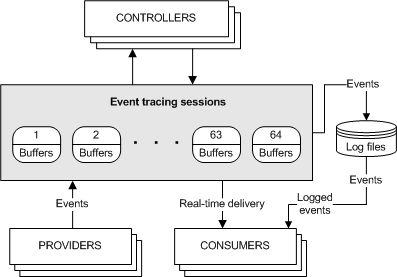

# About Event Tracing

Event Tracing for Windows (ETW) is an efficient kernel-level tracing facility that lets you log kernel or application-defined events to a log file. You can consume the events in real time or from a log file and use them to debug an application or to determine where performance issues are occurring in the application.

ETW lets you enable or disable event tracing dynamically, allowing you to perform detailed tracing in a production environment without requiring computer or application restarts.

The Event Tracing API is broken into three distinct components:

-   [Controllers](#controllers), which start and stop an event tracing session and enable providers
-   [Providers](#providers), which provide the events
-   [Consumers](#consumers), which consume the events

The following diagram shows the event tracing model.

## Controllers

Controllers are applications that define the size and location of the log file, start and stop [event tracing sessions](event-tracing-sessions.md), enable providers so they can log events to the session, manage the size of the buffer pool, and obtain execution statistics for sessions. Session statistics include the number of buffers used, the number of buffers delivered, and the number of events and buffers lost. 

For more information, see [Controlling Event Tracing Sessions](controlling-event-tracing-sessions.md).

## Providers

Providers are applications that contain event tracing instrumentation. After a provider registers itself, a controller can then enable or disable event tracing in the provider. The provider defines its interpretation of being enabled or disabled. Generally, an enabled provider generates events, while a disabled provider does not. This lets you add event tracing to your application without requiring that it generate events all the time. 

Although the ETW model separates the controller and provider into separate applications, an application can include both components.

For more information, see [Providing Events](providing-events.md).

### Types of Providers

There are four main types of providers: MOF (classic) providers, WPP providers, manifest-based providers, and TraceLogging providers. You should use a manifest-based provider or a TraceLogging provider if you are writing applications for Windows Vista or later that do not need to support legacy systems.

#### MOF (classic) providers:

-   Use the [RegisterTraceGuids](/windows/win32/api/evntrace/nf-evntrace-registertraceguidsa) and [TraceEvent](/windows/win32/api/evntrace/nf-evntrace-traceevent) functions to register and write events.
-   Use MOF classes to define events so that consumers know how to consume them.
-   Can be enabled by only one trace session at a time.

#### WPP providers:

-   Use the [RegisterTraceGuids](/windows/win32/api/evntrace/nf-evntrace-registertraceguidsa) and [TraceEvent](/windows/win32/api/evntrace/nf-evntrace-traceevent) functions to register and write events.
-   Have associated TMF files (compiled into a binary's .pdb) containing decoding information inferred from the preprocessor's scan of WPP instrumentation in source code.
-   Can be enabled by only one trace session at a time.

#### Manifest-based providers:

-   Use [EventRegister](/windows/desktop/api/Evntprov/nf-evntprov-eventregister) and [EventWrite](/windows/desktop/api/Evntprov/nf-evntprov-eventwrite) to register and write events.
-   Use a manifest to define events so that consumers know how to consume them.
-   Can be enabled by up to eight trace sessions simultaneously.

#### [TraceLogging](/windows/desktop/tracelogging/trace-logging-about) providers:

-   Use [TraceLoggingRegister](/windows/desktop/api/traceloggingprovider/nf-traceloggingprovider-traceloggingregister) and [TraceLoggingWrite](/windows/desktop/api/traceloggingprovider/nf-traceloggingprovider-traceloggingwrite) to register and write events.
-   Use self-describing events so that the events themselves contain all required information for consuming them.
-   Can be enabled by up to eight trace sessions simultaneously.

All event providers fundamentally use the Event Tracing family of APIs ([TraceEvent](/windows/win32/api/evntrace/nf-evntrace-traceevent) for legacy technologies and [EventWrite](/windows/desktop/api/Evntprov/nf-evntprov-eventwrite)/[EventWriteEx](/windows/desktop/api/Evntprov/nf-evntprov-eventwriteex) for newer ones). Event providers simply differ in what field types they store in event payloads and where they store the associated event decoding information.

## Consumers

Consumers are applications that select one or more event tracing sessions as a source of events. A consumer can request events from multiple event tracing sessions simultaneously; the system delivers the events in chronological order. Consumers can receive events stored in log files, or from sessions that deliver events in real time. When processing events, a consumer can specify start and end times, and only events that occur in the specified time frame will be delivered. 

For more information, see [Consuming Events](consuming-events.md).

## Missing Events

Perfmon, System Diagnostics, and other system tools may report on missing events in the Event Log and indicate that the settings for Event Tracing for Windows (ETW) may not be optimal. Events can be lost for a number of reasons:

-   The total event size is greater than 64K. This includes the ETW header plus the data or payload. A user has no control over these missing events since the event size is configured by the application.

-   The ETW buffer size is smaller than the total event size. A user has no control over these missing events since the event size is configured by the application logging the events.

-   For real-time logging, the real-time consumer is not consuming events fast enough or is not present altogether and then the backing file is filling up. This can result if the Event Log service is stopped and started when events are being logged. A user has no control over these missing events.

-   When logging to a file, the disk is too slow to keep up with the logging rate.

For any of these reasons, please report these problems to the provider of the application or service that is generating the events. These issues can only be fixed by the application developer or the service logging the events. If the missing events are being reported in the Event Log Service, this may indicate a problem with the configuration of the Event Log service. The user may have some limited ability to increase the maximum disk space to be used by the Event Log Service which may reduce the number of missing events.

 

 
