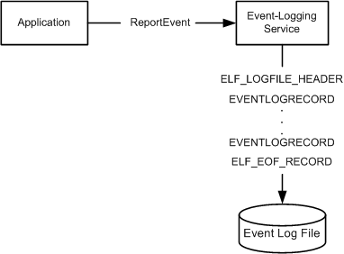

# Event Log File Format

Each event log contains a header (represented by the [**ELF\_LOGFILE\_HEADER**](/previous-versions/windows/desktop/legacy/bb309024(v=vs.85)) structure) that has a fixed size, followed by a variable number of event records (represented by [**EVENTLOGRECORD**](/windows/desktop/api/winnt/ns-winnt-eventlogrecord) structures), and an end-of-file record (represented by the [**ELF\_EOF\_RECORD**](/previous-versions/windows/desktop/legacy/bb309022(v=vs.85)) structure).

The **ELF\_LOGFILE\_HEADER** structure and the **ELF\_EOF\_RECORD** structure are written in the event log when the event log is created and are updated each time an event is written to the log.

When an application calls the [**ReportEvent**](/windows/desktop/api/Winbase/nf-winbase-reporteventa) function to write an entry to the event log, the system passes the parameters to the event-logging service. The event-logging service uses the information to write an **EVENTLOGRECORD** structure to the event log. The following diagram illustrates this process.



The event records are organized in one of the following ways:

-   Non-wrapping. The oldest record is immediately after the event log header and new records are added after the last record that was added (before the **ELF\_EOF\_RECORD**). The following example shows the non-wrapping method:

    ``` syntax
    HEADER                   (ELF_LOGFILE_HEADER)
    EVENT RECORD 1           (EVENTLOGRECORD)
    EVENT RECORD 2           (EVENTLOGRECORD)
    EOF RECORD               (ELF_EOF_RECORD)
    ```

    Non-wrapping can occur when the event log is created or when the event log is cleared. The event log continues to be non-wrapping until the event log size limit is reached. The event log size is limited by either the **MaxSize** configuration value or the amount of system resources.

    When the event log size limit is reached, it might start wrapping. Wrapping is controlled by the **Retention** configuration value. For more information about the event log configuration values, see [Eventlog Key](eventlog-key.md).

-   Wrapping. The records are organized as a circular buffer. As new records are added, the oldest records are replaced. The location of the oldest and newest records will vary. The following example shows the wrapping method.

    ``` syntax
    HEADER                   (ELF_LOGFILE_HEADER)
    Part of EVENT RECORD 300 (EVENTLOGRECORD)
    EVENT RECORD 301         (EVENTLOGRECORD)
    .
    .
    .
    EVENT RECORD 400         (EVENTLOGRECORD)
    EOF RECORD               (ELF_EOF_RECORD)
    Wasted space
    EVENT RECORD 102         (EVENTLOGRECORD)
    EVENT RECORD 103         (EVENTLOGRECORD)
    .
    .
    .
    EVENT RECORD 299         (EVENTLOGRECORD)
    Part of EVENT RECORD 300 (EVENTLOGRECORD)
    ```

    In the example the oldest record is no longer 1, but is 102 because the space for records 1 to 101 was overwritten.

    There is some space between the **ELF\_EOF\_RECORD** and the oldest record because the system will erase an integral number of records to free space for the newest record. For example, if the newest record is 100 bytes long and the two oldest records are 75 bytes long, then the system will remove the two oldest records. The extra 50 bytes will be used later when new records are written.

    An event log file has a fixed size and when the records in the file wrap, the record at the end of the file will typically be split into two records. For example, if the position for the next write is 100 bytes from the end of the file and the size of the record is 300 bytes, the first 100 bytes will be written at the end of the file and the next 200 bytes will be written at the beginning of the file immediately after the **ELF\_LOGFILE\_HEADER**. If the available space at the end of the file is less than the fixed portion of the **EVENTLOGRECORD** (0x38 bytes), all of the new record will be written at the beginning of the file immediately after the **ELF\_LOGFILE\_HEADER**. The unused bytes at the end of the file will be filled with the pattern 0x00000027.

For more information and a code example, see [Reporting an Event](reporting-an-event.md).

 

 
