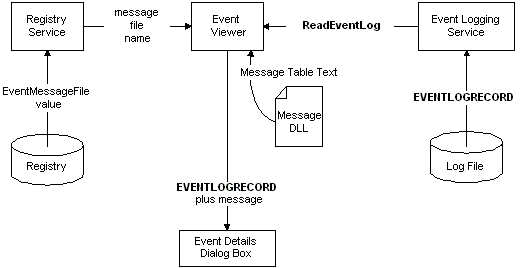

# Reading from the Event Log

An event viewer application uses the [**OpenEventLog**](openeventlog.md) function to open the event log for an event source. The event viewer can then use the [**ReadEventLog**](readeventlog.md) function to read event records from the log. **ReadEventLog** returns a buffer containing an [**EVENTLOGRECORD**](eventlogrecord-str.md) structure and additional information that describes a logged event. The following diagram illustrates this process.

For example code, see [Querying for Event Information](querying-for-event-source-messages.md).

 

 

