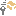

# JET\_COMMIT\_ID members

Include protected members  
Include inherited members  

Information context surrounded data emitted from JET\_PFNEMITLOGDATA.

The [JET\_COMMIT\_ID](dn335448\(v=exchg.10\).md) type exposes the following members.

## Methods

<table>
<thead>
<tr class="header">
<th> </th>
<th>Name</th>
<th>Description</th>
</tr>
</thead>
<tbody>
<tr class="odd">
<td></td>
<td><a href="dn335450(v=exchg.10).md">CompareTo</a></td>
<td>Returns a value comparing this instance with another.</td>
</tr>
<tr class="even">
<td></td>
<td><a href="dn335458(v=exchg.10).md">Equals(Object)</a></td>
<td>Returns a value indicating whether this instance is equal to another instance. (Overrides <a href="http://msdn2.microsoft.com/en-us/library/bsc2ak47">Object.Equals(Object)</a>.)</td>
</tr>
<tr class="odd">
<td></td>
<td><a href="dn335328(v=exchg.10).md">Equals(JET_COMMIT_ID)</a></td>
<td>Returns a value indicating whether this instance is equal to another instance.</td>
</tr>
<tr class="even">
<td></td>
<td><a href="http://msdn2.microsoft.com/en-us/library/4k87zsw7">Finalize</a></td>
<td>(Inherited from <a href="http://msdn2.microsoft.com/en-us/library/e5kfa45b">Object</a>.)</td>
</tr>
<tr class="odd">
<td></td>
<td><a href="dn335459(v=exchg.10).md">GetHashCode</a></td>
<td>Returns the hash code for this instance. (Overrides <a href="http://msdn2.microsoft.com/en-us/library/zdee4b3y">Object.GetHashCode()</a>.)</td>
</tr>
<tr class="even">
<td></td>
<td><a href="http://msdn2.microsoft.com/en-us/library/dfwy45w9">GetType</a></td>
<td>(Inherited from <a href="http://msdn2.microsoft.com/en-us/library/e5kfa45b">Object</a>.)</td>
</tr>
<tr class="odd">
<td></td>
<td><a href="http://msdn2.microsoft.com/en-us/library/57ctke0a">MemberwiseClone</a></td>
<td>(Inherited from <a href="http://msdn2.microsoft.com/en-us/library/e5kfa45b">Object</a>.)</td>
</tr>
<tr class="even">
<td></td>
<td><a href="dn335330(v=exchg.10).md">ToString</a></td>
<td>Generate a string representation of the structure. (Overrides <a href="http://msdn2.microsoft.com/en-us/library/7bxwbwt2">Object.ToString()</a>.)</td>
</tr>
</tbody>
</table>

Top

## Operators

<table>
<thead>
<tr class="header">
<th> </th>
<th>Name</th>
<th>Description</th>
</tr>
</thead>
<tbody>
<tr class="odd">
<td></td>
<td><a href="dn335331(v=exchg.10).md">Equality</a></td>
<td>Determine whether one commitid is is equal to another commitid.</td>
</tr>
<tr class="even">
<td></td>
<td><a href="dn335457(v=exchg.10).md">GreaterThan</a></td>
<td>Determine whether one commitid is before another commitid.</td>
</tr>
<tr class="odd">
<td></td>
<td><a href="dn335332(v=exchg.10).md">GreaterThanOrEqual</a></td>
<td>Determine whether one commitid is before another commitid.</td>
</tr>
<tr class="even">
<td></td>
<td><a href="dn335462(v=exchg.10).md">Inequality</a></td>
<td>Determine whether one commitid is not equal to another commitid.</td>
</tr>
<tr class="odd">
<td></td>
<td><a href="dn335335(v=exchg.10).md">LessThan</a></td>
<td>Determine whether one commitid is before another commitid.</td>
</tr>
<tr class="even">
<td></td>
<td><a href="dn335463(v=exchg.10).md">LessThanOrEqual</a></td>
<td>Determine whether one commitid is before another commitid.</td>
</tr>
</tbody>
</table>

Top

## See also

#### Reference

[JET\_COMMIT\_ID class](dn335448\(v=exchg.10\).md)

[Microsoft.Isam.Esent.Interop.Windows8 namespace](dn335439\(v=exchg.10\).md)

