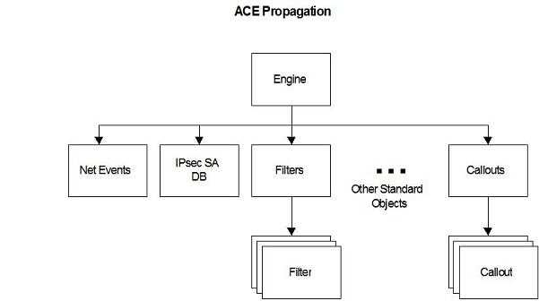

# Access Control (Windows Filtering Platform)

In Windows Filtering Platform (WFP), the Base Filtering Engine (BFE) service implements the standard [Windows access control model](/windows/desktop/SecAuthZ/access-control-model) based on access tokens and security descriptors.

## Access Control Model

Security descriptors can be specified when adding new WFP objects, such as filters and sub-layers. Security descriptors are managed using the WFP management functions **Fwpm\*GetSecurityInfo0** and **Fwpm\*SetSecurityInfo0**, where **\*** stands for the WFP object's name. These functions are semantically identical to the Windows [**GetSecurityInfo**](/windows/desktop/api/aclapi/nf-aclapi-getsecurityinfo) and [**SetSecurityInfo**](/windows/desktop/api/aclapi/nf-aclapi-setsecurityinfo) functions.

> [!Note]  
> The **Fwpm\*SetSecurityInfo0** functions cannot be called from within an explicit transaction.

 

> [!Note]  
> The **Fwpm\*SetSecurityInfo0** functions can only be called from within a dynamic session if they are being used to manage a dynamic object created within the same session.

 

The default security descriptor for the filter engine (the root Engine object in the diagram below) is as follows.

-   Grant **GENERIC\_ALL** (GA) access rights to the built-in Administrators group.
-   Grant **GENERIC\_READ** (GR) **GENERIC\_WRITE** (GW) **GENERIC\_EXECUTE** (GX) access rights to network configuration operators.
-   Grant **GRGWGX** access rights to the following service security identifiers (SSIDs): MpsSvc (Windows Firewall), NapAgent (Network Access Protection Agent), PolicyAgent (IPsec Policy Agent), RpcSs (Remote Procedure Call), and WdiServiceHost (Diagnostic Service Host).
-   Grant **FWPM\_ACTRL\_OPEN** and **FWPM\_ACTRL\_CLASSIFY** to everyone. (These are WFP-specific access rights, described in table below.)

The remaining default security descriptors are derived through inheritance.

There are some access checks, such as for **Fwpm\*Add0**, **Fwpm\*CreateEnumHandle0**, **Fwpm\*SubscribeChanges0** function calls, that cannot be done at the individual object level. For these functions, there are container objects for each object type. For the standard object types (for example, providers, callouts, filters), the existing **Fwpm\*GetSecurityInfo0** and **Fwpm\*SetSecurityInfo0** functions are overloaded, such that a null **GUID** parameter identifies the associated container. For the other object types (for example, network events and IPsec security associations), there are explicit functions for managing the container's security information.

BFE supports automatic inheritance of Discretionary Access Control List (DACL) access control entries (ACEs). BFE does not support System Access Control List (SACL) ACEs. Objects inherit ACEs from their container. Containers inherit ACEs from the filter engine. The propagation paths are shown in the diagram below.

For the standard object types, BFE enforces all the generic and standard access rights. In addition, WFP defines the following specific access rights.

| WFP Access Right                                                                                                                        | Description                                                                                                                                                              |
|-----------------------------------------------------------------------------------------------------------------------------------------|--------------------------------------------------------------------------------------------------------------------------------------------------------------------------|
| **FWPM\_ACTRL\_ADD**                                        | Required to add an object to a container.                                                                                                                      |
| **FWPM\_ACTRL\_ADD\_LINK**                        | Required to create an association to an object. For example, to add a filter that references a callout, the caller must have ADD\_LINK access to the callout.  |
| **FWPM\_ACTRL\_BEGIN\_READ\_TXN**     | Required to begin an explicit read transaction.                                                                                                                |
| **FWPM\_ACTRL\_BEGIN\_WRITE\_TXN**  | Required to begin an explicit write transaction.                                                                                                               |
| **FWPM\_ACTRL\_CLASSIFY**                         | Required to classify against a user-mode layer.                                                                                                                |
| **FWPM\_ACTRL\_ENUM**                                     | Required to enumerate the objects in a container. However, the enumerator only returns objects to which the caller has FWPM\_ACTRL\_READ access.               |
| **FWPM\_ACTRL\_OPEN**                                     | Required to open a session with BFE.                                                                                                                           |
| **FWPM\_ACTRL\_READ**                                     | Required to read an object's properties.                                                                                                                       |
| **FWPM\_ACTRL\_READ\_STATS**                  | Required to read statistics.                                                                                                                                   |
| **FWPM\_ACTRL\_SUBSCRIBE**                      | Required to subscribe for notifications. Subscribers will only receive notifications for objects to which they have FWPM\_ACTRL\_READ access.                  |
| **FWPM\_ACTRL\_WRITE**                                  | Required to set engine options.                                                                                                                                |

 

BFE skips all access checks for kernel-mode callers.

In order to prevent administrators from locking themselves out of BFE, members of the built-in administrators group are always granted **FWPM\_ACTRL\_OPEN** to the engine object. Thus, an administrator can regain access through the following steps.

-   Enable the **SE\_TAKE\_OWNERSHIP\_NAME** privilege.
-   Call [**FwpmEngineOpen0**](/windows/desktop/api/Fwpmu/nf-fwpmu-fwpmengineopen0). The call succeeds because the caller is a member of Built-in Administrators.
-   Take ownership of the engine object. This succeeds because the caller has the **SE\_TAKE\_OWNERSHIP\_NAME** privilege.
-   Update the DACL. This succeeds because the owner always has **WRITE\_DAC** access

Since BFE supports its own custom auditing, it does not generate generic object access audits. Thus, the SACL is ignored.

## WFP Required Access Rights

The table below shows the access rights required by the WFP functions in order to access various filtering platform objects. The **FwpmFilter\*** functions are listed as an example for accessing the standard objects. All the other functions that access standard objects follow the **FwpmFilter\*** functions access model.

Function

Object Checked

Access Required

[**FwpmEngineOpen0**](/windows/desktop/api/Fwpmu/nf-fwpmu-fwpmengineopen0)

Engine

**FWPM\_ACTRL\_OPEN**

[**FwpmEngineGetOption0**](/windows/desktop/api/Fwpmu/nf-fwpmu-fwpmenginegetoption0)

Engine

**FWPM\_ACTRL\_READ**

[**FwpmEngineSetOption0**](/windows/desktop/api/Fwpmu/nf-fwpmu-fwpmenginesetoption0)

Engine

**FWPM\_ACTRL\_WRITE**

[**FwpmSessionCreateEnumHandle0**](/windows/desktop/api/Fwpmu/nf-fwpmu-fwpmsessioncreateenumhandle0)

Engine

**FWPM\_ACTRL\_ENUM**

[**FwpmTransactionBegin0**](/windows/desktop/api/Fwpmu/nf-fwpmu-fwpmtransactionbegin0)

Engine

**FWPM\_ACTRL\_BEGIN\_READ\_TXN** & **FWPM\_ACTRL\_BEGIN\_WRITE\_TXN**

[**FwpmFilterAdd0**](/windows/desktop/api/Fwpmu/nf-fwpmu-fwpmfilteradd0)

Container Provider  Layer  Sub-Layer  Callout  Provider Context 

**FWPM\_ACTRL\_ADDFWPM\_ACTRL\_ADD\_LINK**  **FWPM\_ACTRL\_ADD\_LINK**  **FWPM\_ACTRL\_ADD\_LINK**  **FWPM\_ACTRL\_ADD\_LINK**  **FWPM\_ACTRL\_ADD\_LINK** 

[**FwpmFilterDeleteById0**](/windows/desktop/api/Fwpmu/nf-fwpmu-fwpmfilterdeletebyid0)[**FwpmFilterDeleteByKey0**](/windows/desktop/api/Fwpmu/nf-fwpmu-fwpmfilterdeletebykey0) 

Filter

**DELETE**

[**FwpmFilterGetById0**](/windows/desktop/api/Fwpmu/nf-fwpmu-fwpmfiltergetbyid0)[**FwpmFilterGetByKey0**](/windows/desktop/api/Fwpmu/nf-fwpmu-fwpmfiltergetbykey0) 

Filter

**FWPM\_ACTRL\_READ**

[**FwpmFilterCreateEnumHandle0**](/windows/desktop/api/Fwpmu/nf-fwpmu-fwpmfiltercreateenumhandle0)

Container Filter 

**FWPM\_ACTRL\_ENUMFWPM\_ACTRL\_READ** 

[**FwpmFilterSubscribeChanges0**](/windows/desktop/api/Fwpmu/nf-fwpmu-fwpmfiltersubscribechanges0)

Container

**FWPM\_ACTRL\_SUBSCRIBE**

[**FwpmFilterSubscriptionsGet0**](/windows/desktop/api/Fwpmu/nf-fwpmu-fwpmfiltersubscriptionsget0)

Container

**FWPM\_ACTRL\_READ**

[**IPsecGetStatistics0**](/windows/desktop/api/Fwpmu/nf-fwpmu-ipsecgetstatistics0)

IPsec SA DB

**FWPM\_ACTRL\_READ\_STATS**

[**IPsecSaContextCreate0**](/windows/desktop/api/Fwpmu/nf-fwpmu-ipsecsacontextcreate0)[**IPsecSaContextGetSpi0**](/windows/desktop/api/Fwpmu/nf-fwpmu-ipsecsacontextgetspi0)  [**IPsecSaContextAddInbound0**](/windows/desktop/api/Fwpmu/nf-fwpmu-ipsecsacontextaddinbound0)  [**IPsecSaContextAddOutbound0**](/windows/desktop/api/Fwpmu/nf-fwpmu-ipsecsacontextaddoutbound0) 

IPsec SA DB

**FWPM\_ACTRL\_ADD**

[**IPsecSaContextDeleteById0**](/windows/desktop/api/Fwpmu/nf-fwpmu-ipsecsacontextdeletebyid0)[**IPsecSaContextExpire0**](/windows/desktop/api/Fwpmu/nf-fwpmu-ipsecsacontextexpire0) 

IPsec SA DB

**DELETE**

[**IPsecSaContextGetById0**](/windows/desktop/api/Fwpmu/nf-fwpmu-ipsecsacontextgetbyid0)

IPsec SA DB

**FWPM\_ACTRL\_READ**

[**IPsecSaContextCreateEnumHandle0**](/windows/desktop/api/Fwpmu/nf-fwpmu-ipsecsacontextcreateenumhandle0)[**IPsecSaCreateEnumHandle0**](/windows/desktop/api/Fwpmu/nf-fwpmu-ipsecsacreateenumhandle0) 

IPsec SA DB

**FWPM\_ACTRL\_ENUM** & **FWPM\_ACTRL\_READ**

[**IkeextGetStatistics0**](/windows/desktop/api/Fwpmu/nf-fwpmu-ikeextgetstatistics0)

IKE SA DB

**FWPM\_ACTRL\_READ\_STATS**

[**IkeextSaDeleteById0**](/windows/desktop/api/Fwpmu/nf-fwpmu-ikeextsadeletebyid0)

IKE SA DB

**DELETE**

[**IkeextSaGetById0**](/windows/desktop/api/Fwpmu/nf-fwpmu-ikeextsagetbyid0)

IKE SA DB

**FWPM\_ACTRL\_READ**

[**IkeextSaCreateEnumHandle0**](/windows/desktop/api/Fwpmu/nf-fwpmu-ikeextsacreateenumhandle0)

IKE SA DB

**FWPM\_ACTRL\_ENUM** & **FWPM\_ACTRL\_READ**

[**FwpmNetEventCreateEnumHandle0**](/windows/desktop/api/Fwpmu/nf-fwpmu-fwpmneteventcreateenumhandle0)

Container

**FWPM\_ACTRL\_ENUM**

[**FwpmIPsecTunnelAdd0**](/windows/desktop/api/Fwpmu/nf-fwpmu-fwpmipsectunneladd0)[**FwpmIPsecTunnelDeleteByKey0**](/windows/desktop/api/Fwpmu/nf-fwpmu-fwpmipsectunneldeletebykey0) 

No additional access checks beyond those for the individual filters and provider contexts

 

## Related topics

<dl> <dt>

[**Standard Access Rights**](/windows/desktop/SecAuthZ/standard-access-rights)
</dt> <dt>

[Windows access control model](/windows/desktop/SecAuthZ/access-control-model)
</dt> <dt>

[**Windows Filtering Platform Access Rights Identifiers**](access-right-identifiers.md)
</dt> </dl>

 

