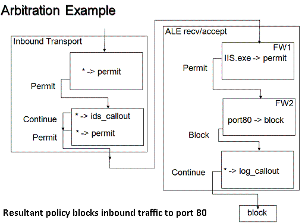

# Filter Arbitration

Filter arbitration is the logic built into the Windows Filtering Platform (WFP) that is used to determine how filters interact with each other when making network traffic filtering decisions.

## Filter Arbitration Behaviors

The following behaviors characterize the filter arbitration system:

-   All traffic can be inspected. No traffic can bypass filters at a given layer.
-   Traffic can be blocked by a callout filter via a **Veto** even if a higher priority filter has permitted it.
-   Multiple providers can inspect traffic at the same layer. For example, firewall followed by intrusion-detection system (IDS) filters, or IPsec followed by Quality of Service (QoS) filters may all examine the traffic at the same layer.

## Filtering Model

Each filter layer is divided into sub-layers ordered by priority (also called weight). Network traffic traverses sub-layers from the highest priority to the lowest priority. Sub-layers are created and managed by the developers using the WFP API.

Within each sub-layer, filters are ordered by weight. Network traffic is indicated to matching filters from highest weight to lowest weight.

The filter arbitration algorithm is applied to all sub-layers within a layer and the final filtering decision is made after all sub-layers have been evaluated. This provides for multiple matching capability.

Within a sub-layer, filter arbitration is performed as follows:

-   Compute the list of matching filters ordered by weight from highest to lowest.
-   Evaluate matching filters in order until a "Permit" or a "Block" is returned (filters can also return "Continue") or until the list is exhausted.
-   Skip the remaining filters and return the action from the last evaluated filter.

Within a layer, filter arbitration is performed as follows:

-   Perform filter arbitration at every sub-layer in order from highest priority to lowest priority.
-   Evaluate all sub-layers even if a higher priority sub-layer has decided to block the traffic.
-   Return the resulting action based on the policy rules described in the following section.

The diagram below illustrates a sample sub-layer configuration. The outer boxes represent layers. The inner boxes represent sub-layers that contain filters. The wildcard (\*) in a filter means all traffic matches the filter.

The only way for a filter to be bypassed is if a higher weight filter has permitted or blocked the traffic within the same sub-layer. Conversely, one way of ensuring that a filter always sees all traffic within a layer is to add a sub-layer that contains a single filter that matches all traffic.

## Configurable Override Policy

The rules described below govern the arbitration decisions within a layer. These rules are used by the filter engine to decide which one of the sub-layer actions is applied to the network traffic.

The basic policy is as follows.

-   Actions are evaluated in priority order of sub-layers from highest priority to lowest priority.
-   "Block" overrides "Permit".
-   "Block" is final (cannot be overridden) and stops the evaluation. The packet is discarded.

The basic policy does not support the scenario of an exception not overridden by a firewall. Typical examples of this type of scenario are:

-   Remote administration port required to be opened even in the presence of a third-party firewall.
-   Components that require ports to be opened in order to function (for example, Universal Plug and Play UPnP). If the administrator has explicitly enabled the component, the firewall should not silently block the traffic.

In order to support the above scenarios, a filtering decision must be made more difficult to override than another filtering decision by managing the action override permission. This permission is implemented as the **FWPS\_RIGHT\_ACTION\_WRITE** flag and it is set on a per-filter basis.

The evaluation algorithm maintains the current action ("Permit" or "Block") along with the **FWPS\_RIGHT\_ACTION\_WRITE** flag. The flag controls whether a lower priority sub-layer is allowed to override the action. By setting or resetting the **FWPS\_RIGHT\_ACTION\_WRITE** flag in the [FWPS\_CLASSIFY\_OUT0](/windows/win32/api/fwpstypes/ns-fwpstypes-fwps_classify_out0) structure, a provider governs how actions can or cannot be overridden. If the flag is set, it indicates that the action can be overridden. If the flag is absent, the action cannot be overridden.

| Action | Allow override (FWPS\_RIGHT\_ACTION\_WRITE is set) | Description                                                                                                          |
|--------|----------------------------------------------------|----------------------------------------------------------------------------------------------------------------------|
| Permit | Yes                                                | The traffic can be blocked at another sub-layer. This is called a soft permit.                             |
| Permit | No                                                 | The traffic can be blocked at another sub-layer only by a callout **Veto**. This is called a hard permit.  |
| Block  | Yes                                                | The traffic can be permitted at another sub-layer. This is called a soft block.                            |
| Block  | No                                                 | The traffic cannot be permitted at another sub-layer. This is called a hard block.                         |

 

The filter action can be set by setting the **type** member in the structure [**FWPM\_ACTION0**](/windows/desktop/api/Fwpmtypes/ns-fwpmtypes-fwpm_action0) to either **FWP\_ACTION\_BLOCK** or **FWP\_ACTION\_PERMIT**. Along with the action type, a filter also exposes the flag **FWPM\_FILTER\_FLAG\_CLEAR\_ACTION\_RIGHT**. If this flag is cleared, then the action type is hard and cannot be overridden except when a hard permit is overridden by a **Veto** as explained later on, else it is soft which can be overridden by high priority action.

The following table lists the default behavior for filter and callout actions.

| Action         | Default Behavior |
|----------------|------------------|
| Filter permit  | Soft permit      |
| Callout permit | Soft permit      |
| Filter block   | Hard block       |
| Callout block  | Soft block       |

 

A **Veto** is a "Block" action returned by the filter when the **FWPS\_RIGHT\_ACTION\_WRITE** flag was reset prior to calling the filter. A **Veto** will block traffic that was permitted with a hard permit.

When a **Veto** is issued, it is an indication of conflict in the configuration. The following actions are taken to mitigate the conflict.

-   The traffic is blocked.
-   An audit event is generated.
-   A notification is generated.
    > [!Note]  
    > The notification is received by all entities that have subscribed to it. This will typically include the firewall (in order to detect mis-configurations), or applications (in order to detect if their particular filter is overridden).

     

    > [!Note]  
    > There is no mandatory user interface (UI) instantiated when a "Hard Permit" filter is overridden. The notifications of the override are sent to any provider that registered to receive them, which allows firewalls, or the applications that created the "Permit" filters, to show UI asking for user action. There is no value in having a platform UI notification for these override events since firewall ISVs that do not want to silently block can do so by registering at a different place in WFP, or (less preferred) handle all their logic in a call-out driver. ISVs that do think prompting users is a good idea will want to own the user experience and create their own UI.

     

The mitigation behavior described above ensures that a "Hard Permit" filter is not silently overridden by a "Block" filter, and covers the scenario where a remote administration port is not allowed to be blocked by the firewall. In order to silently override "Hard Permit" filters a firewall has to add its filters within a higher priority sub-layer.

> [!Note]  
> Since there is no cross-layer arbitration, traffic permitted with "Hard Permit" may still be blocked at another layer. It is the responsibility of the policy author to ensure that traffic is permitted at each layer if necessary.

 

User applications requesting ports to be opened add overridable filters to a low priority sub-layer. The firewall can subscribe to the filter add notification events and add a matching filter after user (or policy) validation.

## Related topics

<dl> <dt>

[Filter Weight Assignment](filter-weight-assignment.md)
</dt> </dl>

 

