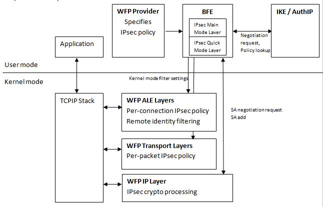

# IPsec Configuration

Windows Filtering Platform (WFP) is the underlying platform for Windows Firewall with Advanced Security. WFP is used to configure network filtering rules, which include rules that govern securing network traffic with IPsec. Application developers may configure IPsec directly using the WFP API, in order to take advantage of a more granular network traffic filtering model than the model exposed through the Microsoft Management Console (MMC) snap-in for Windows Firewall with Advanced Security.

## What is IPsec

Internet Protocol Security (IPsec) is a set of security protocols used to transfer IP packets confidentially across the Internet. IPsec is ~mandatory~ (optional, see [RFC6434](https://www.rfc-editor.org/rfc/rfc6434.txt)) for all IPv6 implementations and optional for IPv4.

Secured IP traffic has two optional IPsec headers, which identify the types of cryptographic protection applied to the IP packet and include information for decoding the protected packet.

The Encapsulating Security Payload (ESP) header is used for privacy and protection against malicious modification by performing authentication and optional encryption. It can be used for traffic that traverses Network Address Translation (NAT) routers.

The Authentication Header (AH) is used only for protection against malicious modification by performing authentication. It cannot be used for traffic that traverses NAT routers.

For more information on IPsec, see also:

<dl>

[IPsec Technical Reference](/previous-versions/windows/it-pro/windows-server-2003/cc740240(v=ws.10))  
</dl>

## What is IKE

Internet Key Exchange (IKE) is a key exchange protocol that is part of the IPsec protocol set. IKE is used while setting up a secure connection and accomplishes the safe exchange of secret keys and other protection-related parameters without the intervention of the user.

For more information on IKE, see also:

<dl>

[Internet Key Exchange](/previous-versions/windows/it-pro/windows-server-2003/cc784994(v=ws.10))  
</dl>

## What is AuthIP

Authenticated Internet Protocol (AuthIP) is a new key exchange protocol that expands IKE as follows.

<dl> While IKE only supports computer authentication credentials, AuthIP also supports:

-   User credentials: NTLM, Kerberos, certificates.
-   Network Access Protection (NAP) health certificates.
-   Anonymous credential, used for optional authentication.
-   Combination of credentials; for example, a combination of machine and user Kerberos credentials.

  
AuthIP has an authentication-retry mechanism that verifies all configured authentication methods before failing the connection.  
AuthIP can be used with secure sockets to implement application-based IPsec secured traffic. It provides:

-   Per-socket authentication and encryption. See [**WSASetSocketSecurity**](/windows/desktop/api/ws2tcpip/nf-ws2tcpip-wsasetsocketsecurity) for more information.
-   Client impersonation. (IPsec impersonates the security context under which the socket is created.)
-   Inbound and outbound peer name validation. See [**WSASetSocketPeerTargetName**](/windows/desktop/api/ws2tcpip/nf-ws2tcpip-wsasetsocketpeertargetname) for more information.

  
</dl>

For more information on AuthIP, see also:

<dl>

[AuthIP in Windows Vista](https://www.microsoft.com/technet/community/columns/cableguy/cg0806.mspx)  
</dl>

## What is an IPsec Policy

An IPsec policy is a set of rules that determine which type of IP traffic needs to be secured using IPsec and how to secure that traffic. Only one IPsec policy is active on a computer at one time.

To learn more about implementing IPsec policies, open the Local Security Policy MMC snap-in (secpol.msc), press F1 to display the Help, and then select Creating and Using IPsec Policies from the table of contents.

For more information on IPsec policies, see also:

<dl>

[Overview of IPsec Policy Concepts](/previous-versions/windows/it-pro/windows-server-2003/cc776080(v=ws.10))  
[Description of an IPsec Policy](/previous-versions/windows/it-pro/windows-server-2003/cc781593(v=ws.10))  
</dl>

## How to Use WFP to Configure IPsec Policies

The Microsoft implementation of IPsec uses Windows Filtering Platform to setup IPsec policies. IPsec policies are implemented by adding filters at various WFP layers as follows.

-   At the FWPM\_LAYER\_IKEEXT\_V{4\|6} layers add filters that specify the negotiation policies used by the keying modules (IKE/AuthIP) during Main Mode (MM) exchanges. Authentication methods and cryptographic algorithms are specified at these layers.
-   At the FWPM\_LAYER\_IPSEC\_V{4\|6} layers add filters that specify the negotiation policies used by the keying modules during Quick Mode (QM) and Extended Mode (EM) exchanges. IPsec headers (AH/ESP) and cryptographic algorithms are specified at these layers.

    A negotiation policy is specified as a policy provider context associated with the filter. The keying module enumerates the policy provider contexts based on the traffic characteristics and obtains the policy to use for the security negotiation.

    > [!Note]  
    > The WFP API can be used to specify the Security Associations (SAs) directly and therefore to ignore the keying module negotiation policy.

     

-   At the FWPM\_LAYER\_INBOUND\_TRANSPORT\_V{4\|6} and FWPM\_LAYER\_OUTBOUND\_TRANSPORT\_V{4\|6} layers add filters that invoke callouts and determine which traffic flow should be secured.
-   At the FWPM\_LAYER\_ALE\_AUTH\_RECV\_ACCEPT\_V{4\|6} layers add filters that implement identity filtering and per-application policy.

The following diagram illustrates the interaction of the various WFP components, with respect to IPsec operation.

Once IPsec is configured, it integrates with WFP and extends the WFP filtering capabilities by providing information to be used as filtering conditions at the Application Layer Enforcement (ALE) authorization layers. For example, IPsec provides the remote user and remote machine identity, which WFP exposes at the ALE connect and accept authorization layers. This information can be used for fine-grained remote identity authorization by a WFP-based firewall implementation.

Below is a sample isolation policy that may be implemented using IPsec:

-   FWPM\_LAYER\_IKEEXT\_V{4\|6} layers – Kerberos authentication.
-   FWPM\_LAYER\_IPSEC\_V{4\|6} layers – AH/SHA-1.
-   FWPM\_LAYER\_INBOUND\_TRANSPORT\_V{4\|6} and FWPM\_LAYER\_OUTBOUND\_TRANSPORT\_V{4\|6} layers - negotiation discovery for all network traffic.
-   FWPM\_LAYER\_ALE\_AUTH\_RECV\_ACCEPT\_V{4\|6} layers - IPsec required for all network traffic.

## Related topics

<dl> <dt>

**WFP Layers**
</dt> <dt>

[**Filtering Layer Identifiers**](management-filtering-layer-identifiers-.md)
</dt> <dt>

[ALE Layers](ale-layers.md)
</dt> <dt>

**IPsec Policy Scenarios Implemented using WFP API:**
</dt> <dt>

[Transport Mode](regular-transport-mode.md)
</dt> <dt>

[Negotiation Discovery Transport Mode](negotiation-discovery-transport-mode.md)
</dt> <dt>

[Negotiation Discovery Transport Mode in Boundary Mode](negotiation-discovery-transport-mode-in-boundary-mode.md)
</dt> <dt>

[Tunnel Mode](tunnel-mode.md)
</dt> <dt>

[Guaranteed Encryption](guaranteed-encryption.md)
</dt> <dt>

[Remote Identity Authorization](remote-identity-authorization.md)
</dt> <dt>

[Manual IPsec SAs](manual-ipsec-sas.md)
</dt> <dt>

[IKE/AuthIP Exemptions](ike-exemptions.md)
</dt> <dt>

**IPsec Solutions:**
</dt> <dt>

[Server and Domain Isolation](/previous-versions/windows/it-pro/windows-server-2003/cc776080(v=ws.10))
</dt> </dl>

 

 
