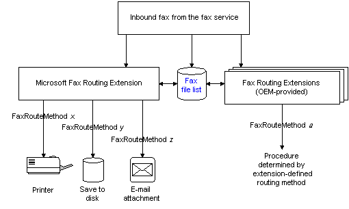

# About the Fax Routing Extension API

The Fax Routing Extension API allows you to add routing functionality to the fax service. The API provides software vendors with a flexible way to connect software applications that route received fax transmissions through multiple routing methods. These routing methods can include, but are not limited to:

-   Printing faxes
-   Storing faxes
-   Converting fax graphic images to text files
-   Delivering faxes in electronic mail attachments

The following diagram provides an overview of the fax routing process.

You must include the appropriate fax routing extension header in your source files. If you are programming on Windows 2000 or later versions, you must include FaxRoute.h.

For more information, see [**FaxRouteMethod**](/previous-versions/windows/desktop/api/FaxRoute/) and [About Fax Routing Methods](-mfax-about-fax-routing-methods.md).

In this documentation a fax routing "method" refers to a procedure defined and supported by a fax routing extension DLL. For more information, see [About Fax Routing Methods](-mfax-about-fax-routing-methods.md).

This section includes the following topics:

-   [About Fax Routing Methods](-mfax-about-fax-routing-methods.md)
-   [Fax File Lists](-mfax-fax-file-lists.md)
-   [Fax Routing Extension Software Requirements](-mfax-fax-routing-extension-software-requirements.md)
-   [Fax Routing Extensions](-mfax-fax-routing-extensions.md)

 

 

