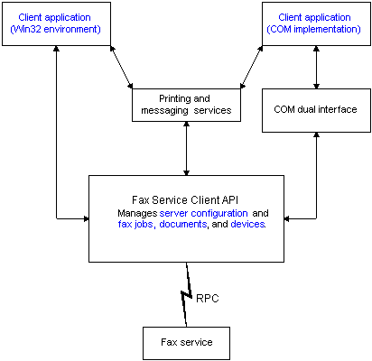

# About the Fax Service Client API

The fax service provides fax services to clients on a local area network. The Fax Service Client API allows developers to incorporate these services and enable basic fax functionality in their applications.

The Fax Service Client API includes both Microsoft Win32 functions and Component Object Model (COM) interfaces.

## In the Win32 Environment

The Win32 functions are implemented as a DLL. This is a client/server implementation that permits a fax client to communicate with the fax server using remote procedure call (RPC). The client computer can use a shared fax printer on the network to access outbound fax services, or the application can call functions in the Fax Service Client API to connect to the local fax server to transmit a fax.

## In the COM Implementation Environment

The COM interfaces are implemented as dual interfaces to accommodate both Microsoft Visual Basic programmers and C/C++ programmers. This document provides reference material for both programming languages. For more information, see [Using the Fax Client COM Implementation](-mfax-using-the-fax-client-com-implementation.md).

The following diagram illustrates an overview of the fax client application environment.

You must include the WinFax.h header file in your source code files. To use the fax client COM implementation that Microsoft supplies, you must include FaxCom.h.

 

 

