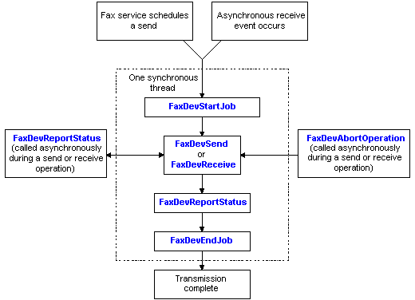

# Fax Job Overview

A fax *job* is a set of fax operations. A fax *operation* can be a send operation or a receive operation. At the beginning of every fax job the fax service calls [**FaxDevStartJob**](/previous-versions/windows/desktop/api/FaxDev/nf-faxdev-faxdevstartjob) to provide an opportunity for the fax service provider (FSP) to perform call setup, and to initialize the new fax job. The fax service also calls **FaxDevStartJob** at the beginning of each fax operation because each operation executes in a separate thread.

The following diagram illustrates the sequence of function calls the fax service makes during a fax send operation or a fax receive operation. The FSP must export these functions.

The fax service calls the following functions sequentially in one synchronous thread.

1.  [**FaxDevStartJob**](/previous-versions/windows/desktop/api/FaxDev/nf-faxdev-faxdevstartjob). Initializes a fax job and signals the beginning of a fax operation.
2.  [**FaxDevSend**](/previous-versions/windows/desktop/api/FaxDev/nf-faxdev-faxdevsend) (or [**FaxDevReceive**](/previous-versions/windows/desktop/api/FaxDev/nf-faxdev-faxdevreceive)). Signals the FSP to initiate an outgoing fax transmission (or to receive an incoming fax transmission).
3.  [**FaxDevReportStatus**](/previous-versions/windows/desktop/api/FaxDev/nf-faxdev-faxdevreportstatus). Queries the FSP for status information about an active fax operation.
4.  [**FaxDevEndJob**](/previous-versions/windows/desktop/api/FaxDev/nf-faxdev-faxdevendjob). Closes the active fax job.

The fax service can also call the [**FaxDevReportStatus**](/previous-versions/windows/desktop/api/FaxDev/nf-faxdev-faxdevreportstatus) and the [**FaxDevAbortOperation**](/previous-versions/windows/desktop/api/FaxDev/nf-faxdev-faxdevabortoperation) functions asynchronously, on an execution thread that is independent of the fax operation, during a send or a receive operation. **FaxDevAbortOperation** requests that the FSP terminate an active operation.

## Related topics

<dl> <dt>

[Initializing a Fax Service Provider](-mfax-initializing-a-fax-service-provider.md)
</dt> <dt>

[Transmitting a Fax](-mfax-transmitting-a-fax.md)
</dt> <dt>

[Terminating a Fax](-mfax-terminating-a-fax.md)
</dt> <dt>

[Obtaining a Fax Status](-mfax-obtaining-a-fax-status.md)
</dt> </dl>

 

 

