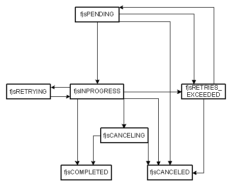
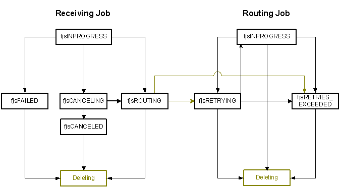

# Fax Job Status

The fax service extended Component Object Model (COM) API provides job status values that indicate the status of a fax that is being sent or received. The values are listed in the enumeration [**FAX\_JOB\_STATUS\_ENUM**](-mfax-fax-job-status-enum.md) and are retrieved as the **Status** property of the [**FaxJobStatus**](-mfax-faxjobstatus.md), [**FaxIncomingJob**](-mfax-faxincomingjob.md) and [**FaxOutgoingJob**](-mfax-faxoutgoingjob.md) objects.

## Sent Jobs

The following is a state diagram for fax jobs that are being sent.

> [!Note]  
> Two outgoing job status modifiers can be combined with the Pending or Retrying state. The two modifiers are [****fjsPAUSED****](-mfax-fax-job-status-enum.md) and [****fjsNOLINE****](-mfax-fax-job-status-enum.md).

 

## Received Jobs

The following is a state diagram for fax jobs that are being received.

> [!Note]  
> Though this diagram includes the *Deleting* status, this status is not exposed to the user. Deleting is an internal status that the fax job passes through before it is deleted.

 

In addition to the values shown here, there are extended status values that are available for use by fax service providers. These are listed in the [**FAX\_JOB\_EXTENDED\_STATUS\_ENUM**](-mfax-fax-job-extended-status-enum.md) enumeration.

 

 

