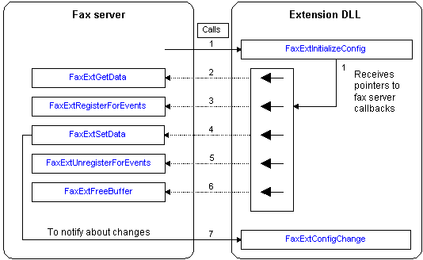

# Fax Service and Configuration Extension Interaction

The following diagram shows the interaction between the fax service and a fax extension DLL if the extension DLL exports the [**FaxExtInitializeConfig**](/windows/previous-versions/FaxExt/nf-faxext-faxextinitializeconfig?branch=master) function. The numbers in the diagram refer to the event numbers in the table that follows the diagram.

> [!Note]  
> With the exception of Event 1, the numbered events in the following diagram do not imply a sequence of steps or the order in which the function calls must occur. The numbers relate only to the events in the table that follows the diagram.

 

The following table lists the primary events that can occur if you use the fax extension configuration API to retrieve and set fax device configuration data.

<table>
<colgroup>
<col style="width: 50%" />
<col style="width: 50%" />
</colgroup>
<thead>
<tr class="header">
<th>Event</th>
<th>Description</th>
</tr>
</thead>
<tbody>
<tr class="odd">
<td>1</td>
<td>Except in the case of a virtual fax service provider (FSP), the fax service calls the [<strong>FaxExtInitializeConfig</strong>](/windows/previous-versions/FaxExt/nf-faxext-faxextinitializeconfig?branch=master) function before it calls the extension's general initialization routine. In the case of a virtual FSP, the fax service calls [<strong>FaxDevVirtualDeviceCreation</strong>](/windows/previous-versions/FaxDev/nf-faxdev-faxdevvirtualdevicecreation?branch=master) before it calls <strong>FaxExtInitializeConfig</strong>. <strong>FaxExtInitializeConfig</strong> passes pointers to the fax service's callback functions. The extension DLL must store the pointers. </td>
</tr>
<tr class="even">
<td>2</td>
<td>To retrieve configuration data, the extension DLL must call the fax service's [<strong>FaxExtGetData</strong>](/windows/previous-versions/FaxExt/nf-faxext-faxextgetdata?branch=master) callback function, using the callback function pointer provided by the fax service in Event 1. The fax service allocates any memory required for the data and returns the information to the fax extension.  For more information, see Event 6. </td>
</tr>
<tr class="odd">
<td>3</td>
<td>To register to receive notifications about configuration data changes, the extension DLL must call the fax service's [<strong>FaxExtRegisterForEvents</strong>](/windows/previous-versions/FaxExt/nf-faxext-faxextregisterforevents?branch=master) callback function. (The fax service provides a pointer to this callback function in Event 1.) When you call <strong>FaxExtRegisterForEvents</strong>, you must supply the pointer to a [<strong>FaxExtConfigChange</strong>](/windows/previous-versions/FaxExt/nf-faxext-faxextconfigchange?branch=master) callback routine that you implement. The fax service calls this routine to send notifications to the extension.  For more information, see Event 7. </td>
</tr>
<tr class="even">
<td>4</td>
<td>To set configuration data, the extension DLL must call the fax service's [<strong>FaxExtSetData</strong>](/windows/previous-versions/FaxExt/nf-faxext-faxextsetdata?branch=master) callback function, using the callback function pointer provided by the fax service in Event 1. </td>
</tr>
<tr class="odd">
<td>5</td>
<td>To stop receiving notifications about configuration data changes (after registering for notifications as outlined in Event 3), the extension DLL can unregister by calling the fax service's [<strong>FaxExtUnregisterForEvents</strong>](/windows/previous-versions/FaxExt/nf-faxext-faxextunregisterforevents?branch=master) callback function, using the callback function pointer provided by the fax service in Event 1. </td>
</tr>
<tr class="even">
<td>6</td>
<td>If the extension DLL previously called the [<strong>FaxExtGetData</strong>](/windows/previous-versions/FaxExt/nf-faxext-faxextgetdata?branch=master) function, the extension must deallocate the data after it processes the data returned in Event 2. 
<blockquote>
[!Note] 
The extension must deallocate the data by calling the fax service's [<strong>FaxExtFreeBuffer</strong>](/windows/previous-versions/FaxExt/nf-faxext-faxextfreebuffer?branch=master) callback function, using the callback function pointer provided by the fax service in Event 1.
</blockquote>
 </td>
</tr>
<tr class="odd">
<td>7</td>
<td>If the extension DLL previously registered to receive notifications about configuration data changes (as in Event 3), the fax service notifies the extension by calling the extension's [<strong>FaxExtConfigChange</strong>](/windows/previous-versions/FaxExt/nf-faxext-faxextconfigchange?branch=master) callback function. </td>
</tr>
</tbody>
</table>

 

Examples of instances when the fax service might send configuration change notifications include when another extension sets a new value for a device and data GUID for which the extension DLL has already set a value.

 

 

