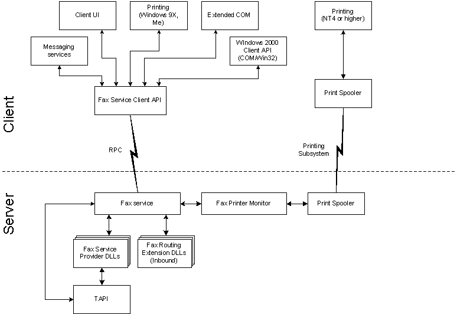

# Fax Service Architecture Overview

The following illustration provides an overview of the basic architecture of the fax service.

The client UI includes the fax console, Microsoft Management Console (MMC) snap-ins, fax wizards, printer properties, and the fax monitor.

The fax service provider (FSP) and fax routing extension DLLs can be provided by Microsoft or by an OEM.

For more information about Telephony Application Programming Interface (TAPI), see the [Microsoft Telephony Overview](http://msdn.microsoft.com/library/en-us/tapi/tapi3/microsoft_telephony_overview.asp) and the *Telephony Application Programming Interface (TAPI) Programmer's Reference*.

 

 

