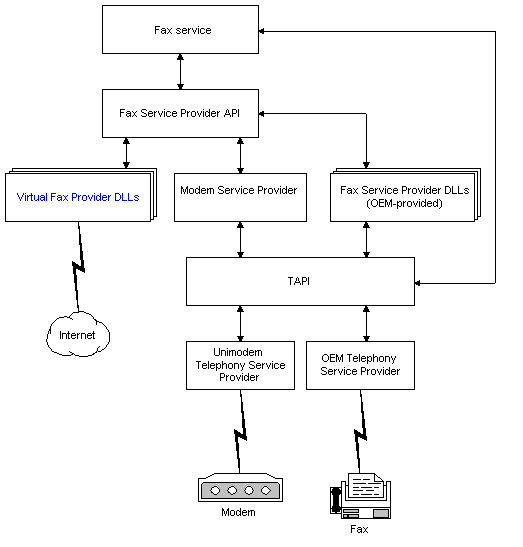

# Fax Service Provider Architecture Overview

The following illustration provides an overview of the fax service provider (FSP) environment.

You must include the FSP header (FaxDev.h) in your source code files.

For more information, see [Fax Service Provider Registration](-mfax-fax-service-provider-registration.md) and [Programming Guidelines for the Fax Service Provider](-mfax-programming-guidelines-for-the-fax-service-provider.md). For more information about virtual fax devices, see [Using a Virtual Device to Transmit a Fax](-mfax-using-a-virtual-device-to-transmit-a-fax.md).

For more information about Telephony Application Programming Interface (TAPI), see the [Microsoft Telephony Overview](http://msdn.microsoft.com/library/en-us/tapi/tapi3/microsoft_telephony_overview.asp) and the *Telephony Application Programming Interface (TAPI) Programmer's Reference*.

## Related topics

<dl> <dt>

[Virtual Fax Devices](-mfax-virtual-fax-devices.md)
</dt> </dl>

 

 

