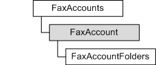

---
Description: 'Represents a fax account on the server, including the account''s name, folders, and the events for which it is listening. It also provides a method for setting those events.'
ms.assetid: '85adc440-3dc8-47ce-aae8-dfb04f824b09'
title: FaxAccount object
---

# FaxAccount object

Represents a fax account on the server, including the account's name, folders, and the events for which it is listening. It also provides a method for setting those events.

## Members

The **FaxAccount** object has these types of members:

-   [Methods](#methods)
-   [Properties](#properties)

### Methods

The **FaxAccount** object has these methods.

| Method                                                                     | Description                                                                                                                                                                           |
|:---------------------------------------------------------------------------|:--------------------------------------------------------------------------------------------------------------------------------------------------------------------------------------|
| [**ListenToAccountEvents**](-mfax-faxaccount-listentoaccountevents-vb.md) | Sets the flags of a [**FAX\_ACCOUNT\_EVENTS\_TYPE\_ENUM**](-mfax-fax-account-events-type-enum.md) variable that represents the events for which the account is listening.  |

 

### Properties

The **FaxAccount** object has these properties.

| Property                                                                    | Access type          | Description                                                                                                                          |
|:----------------------------------------------------------------------------|:---------------------|:-------------------------------------------------------------------------------------------------------------------------------------|
| [**AccountName**](-mfax-faxaccount-accountname-vb.md)            | Read-only  | Retrieves the name of a particular fax account on the server.                                                              |
| [**Folders**](-mfax-faxaccount-folders-vb.md)                    | Read-only  | Represents the folders of the account, including the incoming and outgoing archives and the incoming and outgoing queues.  |
| [**RegisteredEvents**](-mfax-faxaccount-registeredevents-vb.md)  | Read-only  | A set of flags indicating the type of events for which the account is listening.                                           |

 

## Remarks

To create a **FaxAccount** object in Microsoft Visual Basic or C++, call the [**AddAccount**](-mfax-faxaccountset-addaccount-vb.md) or [**GetAccount**](-mfax-faxaccountset-getaccount-vb.md) methods of the [**IFaxAccountSet**](-mfax-faxaccountset-cpp.md) interface.

## Requirements

|                                     |                                                                                         |
|-------------------------------------|-----------------------------------------------------------------------------------------|
| Minimum supported client  | Windows Vista \[desktop apps only\]                                           |
| Minimum supported server  | Windows Server 2008 \[desktop apps only\]                                     |
| Header                    | <dl> <dt>Faxcomex.h</dt> </dl>   |
| DLL                       | <dl> <dt>Fxscomex.dll</dt> </dl> |
| IID                       | CLSID\_FaxAccount                                                             |

## See also

<dl> <dt>

[**IFaxAccount**](-mfax-faxaccount-cpp.md)
</dt> </dl>

 

 

