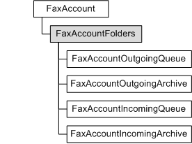

# FaxAccountFolders object

Used by a fax client application to access the folders, queued jobs, and archived messages for a particular fax account.

## Members

The **FaxAccountFolders** object has these types of members:

-   [Properties](#properties)

### Properties

The **FaxAccountFolders** object has these properties.

| Property                                                                         | Access type          | Description                                                                                                                                          |
|:---------------------------------------------------------------------------------|:---------------------|:-----------------------------------------------------------------------------------------------------------------------------------------------------|
| [**IncomingArchive**](-mfax-faxaccountfolders-incomingarchive-vb.md)  | Read-only  | Represents the archive of incoming faxes for a particular fax account. These are the faxes that have been received.                        |
| [**IncomingQueue**](-mfax-faxaccountfolders-incomingqueue-vb.md)      | Read-only  | Represents the queue of incoming faxes for a particular fax account. These are the incoming faxes that have not yet been fully processed.  |
| [**OutgoingArchive**](-mfax-faxaccountfolders-outgoingarchive-vb.md)  | Read-only  | Represents the archive of outgoing faxes for a particular fax account that have been sent.                                                 |
| [**OutgoingQueue**](-mfax-faxaccountfolders-outgoingqueue-vb.md)      | Read-only  | Represents the queue of outgoing faxes for a particular fax account. These are the faxes that have not yet been sent.                      |

 

## Remarks

Use the **FaxAccountFolders** object to create and access the following objects:

-   [**FaxAccountIncomingArchive**](-mfax-faxaccountincomingarchive.md), which is the archive of inbound fax messages received successfully by the fax service for a particular user account.
-   [**FaxAccountIncomingQueue**](-mfax-faxaccountincomingqueue.md), which is the queue of inbound fax jobs for a particular user account.
-   [**FaxAccountOutgoingArchive**](-mfax-faxaccountoutgoingarchive.md), which is the archive of outbound fax messages sent successfully by the fax service for a particular user account.
-   [**FaxAccountOutgoingQueue**](-mfax-faxaccountoutgoingqueue.md), which is the queue of outbound fax jobs for a particular user account.

A **FaxAccountFolders** object is accessed through a [**FaxAccount**](-mfax-faxaccount.md) object.

To create a **FaxAccountFolders** object in Microsoft Visual Basic, call the [**Folders**](-mfax-faxaccount-folders-vb.md) property of the [**FaxAccount**](-mfax-faxaccount.md) object.

To create a **FaxAccountFolders** object in C++, call the [**Folders**](-mfax-faxaccount-folders-vb.md) method.

## Requirements

|                                     |                                                                                         |
|-------------------------------------|-----------------------------------------------------------------------------------------|
| Minimum supported client  | Windows Vista \[desktop apps only\]                                           |
| Minimum supported server  | Windows Server 2008 \[desktop apps only\]                                     |
| Header                    | <dl> <dt>Faxcomex.h</dt> </dl>   |
| DLL                       | <dl> <dt>Fxscomex.dll</dt> </dl> |
| IID                       | CLSID\_FaxAccountFolders                                                      |

## See also

<dl> <dt>

[Fax Service object hierarchy](-mfax-fax-service-extended-com-object-model.md)
</dt> <dt>

[**IFaxAccountFolders**](/previous-versions/windows/desktop/api/FaxComex/nn-faxcomex-ifaxaccountfolders)
</dt> </dl>

 

 

