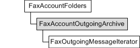

# FaxAccountOutgoingArchive object

Accesses and configures the archive of outbound fax messages, for a particular fax account, sent successfully by the fax service. You can also use the **FaxAccountOutgoingArchive** object to retrieve a message from the archive by specifying its message ID.

A **FaxAccountOutgoingArchive** object is accessed through a [**FaxAccountFolders**](-mfax-faxaccountfolders.md) object. **FaxAccountOutgoingArchive** objects provide access to [**FaxOutgoingMessageIterator**](-mfax-faxoutgoingmessageiterator.md) objects and [**IFaxOutgoingMessage2**](-mfax-faxoutgoingmessage2-cpp.md) objects.

## Members

The **FaxAccountOutgoingArchive** object has these types of members:

-   [Methods](#methods)
-   [Properties](#properties)

### Methods

The **FaxAccountOutgoingArchive** object has these methods.

| Method                                                                | Description                                                                                                                    |
|:----------------------------------------------------------------------|:-------------------------------------------------------------------------------------------------------------------------------|
| [**GetMessage**](-mfax-faxaccountoutgoingarchive-getmessage-vb.md)   | Returns a fax message from the archive of outbound faxes for a particular fax account, by using the fax message ID.  |
| [**GetMessages**](-mfax-faxaccountoutgoingarchive-getmessages-vb.md) | Returns a new iterator (archive cursor) for the archive of outbound fax messages for a particular fax account.       |
| [**Refresh**](-mfax-faxaccountoutgoingarchive-refresh-vb.md)         | Refreshes **FaxAccountOutgoingArchive** object information for a particular fax account from the fax server.         |

 

### Properties

The **FaxAccountOutgoingArchive** object has these properties.

| Property                                                                   | Access type          | Description                                                                                                                                   |
|:---------------------------------------------------------------------------|:---------------------|:----------------------------------------------------------------------------------------------------------------------------------------------|
| [**SizeHigh**](-mfax-faxaccountoutgoingarchive-sizehigh-vb.md)  | Read-only  | Specifies the high-order 32-bit value of the size (in bytes) of the archive of outbound fax messages for a particular fax account.  |
| [**SizeLow**](-mfax-faxaccountoutgoingarchive-sizelow-vb.md)    | Read-only  | Specifies the low-order 32-bit value of the size (in bytes) of the archive of outbound fax messages for a particular fax account.   |

 

## Requirements

|                                     |                                                                                         |
|-------------------------------------|-----------------------------------------------------------------------------------------|
| Minimum supported client  | Windows Vista \[desktop apps only\]                                           |
| Minimum supported server  | Windows Server 2008 \[desktop apps only\]                                     |
| Header                    | <dl> <dt>Faxcomex.h</dt> </dl>   |
| DLL                       | <dl> <dt>Fxscomex.dll</dt> </dl> |
| IID                       | CLSID\_FaxAccountOutgoingArchive                                              |

## See also

<dl> <dt>

[Fax Service object hierarchy](-mfax-fax-service-extended-com-object-model.md)
</dt> <dt>

[**IFaxAccountOutgoingArchive**](-mfax-faxaccountoutgoingarchive-cpp.md)
</dt> </dl>

 

 

