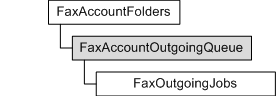

# FaxAccountOutgoingQueue object

Used by a fax client application to get the outbound fax jobs ([**FaxOutgoingJobs**](-mfax-faxoutgoingjobs.md) object) in the outbound job queue of a particular fax account.

A **FaxAccountOutgoingQueue** object is accessed through a [**FaxAccountFolders**](-mfax-faxaccountfolders.md) object.

## Members

The **FaxAccountOutgoingQueue** object has these types of members:

-   [Methods](#methods)

### Methods

The **FaxAccountOutgoingQueue** object has these methods.

| Method                                                      | Description                                                                                                   |
|:------------------------------------------------------------|:--------------------------------------------------------------------------------------------------------------|
| [**GetJob**](-mfax-faxaccountoutgoingqueue-getjob-vb.md)   | Returns an outgoing fax job in the job queue of the current fax account according to the job's ID.  |
| [**GetJobs**](-mfax-faxaccountoutgoingqueue-getjobs-vb.md) | Returns the collection of outbound fax jobs in the queue for the current fax account.               |

 

## Requirements

|                                     |                                                                                         |
|-------------------------------------|-----------------------------------------------------------------------------------------|
| Minimum supported client  | Windows Vista \[desktop apps only\]                                           |
| Minimum supported server  | Windows Server 2008 \[desktop apps only\]                                     |
| Header                    | <dl> <dt>Faxcomex.h</dt> </dl>   |
| DLL                       | <dl> <dt>Fxscomex.dll</dt> </dl> |
| IID                       | CLSID\_FaxAccountOutgoingQueue                                                |

## See also

<dl> <dt>

[**FaxAccountFolders**](-mfax-faxaccountfolders.md)
</dt> <dt>

[**IFaxAccountOutgoingQueue**](/previous-versions/windows/desktop/api/FaxComex/nn-faxcomex-ifaxaccountoutgoingqueue)
</dt> </dl>

 

 

