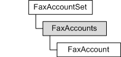

---
Description: 'Represents the collection of fax accounts on the fax server. It provides a default implementation of the IFaxAccounts interface.'
ms.assetid: 'bf26e82e-af97-43a1-81be-1bcb61b6cf98'
title: FaxAccounts object
---

# FaxAccounts object

Represents the collection of fax accounts on the fax server. It provides a default implementation of the [**IFaxAccounts**](-mfax-faxaccounts-cpp.md) interface.

## Members

The **FaxAccounts** object has these types of members:

-   [Properties](#properties)

### Properties

The **FaxAccounts** object has these properties.

| Property                                                   | Access type          | Description                                                                                                                          |
|:-----------------------------------------------------------|:---------------------|:-------------------------------------------------------------------------------------------------------------------------------------|
| [**Count**](-mfax-faxaccounts-count-vb.md)      | Read-only  | Holds the number of items in the [**IFaxAccounts**](-mfax-faxaccounts-cpp.md) collection.                                 |
| [**Item**](-mfax-faxaccounts-item.md)           | Read-only  | Returns a [**FaxAccount**](-mfax-faxaccount.md) object from a [**IFaxAccounts**](-mfax-faxaccounts-cpp.md) collection.   |
| [**NewEnum**](-mfax-faxaccounts-newenum-vb.md)  | Read-only  | Holds the enumerator for the [**IFaxAccounts**](-mfax-faxaccounts-cpp.md) object.                                         |

 

## Remarks

To create a **FaxAccounts** object in Microsoft Visual Basic or C++, call the [**GetAccounts**](-mfax-faxaccountset-getaccounts-vb.md) method of the [**FaxAccountSet**](-mfax-faxaccountset.md) object.

## Requirements

|                                     |                                                                                         |
|-------------------------------------|-----------------------------------------------------------------------------------------|
| Minimum supported client  | Windows Vista \[desktop apps only\]                                           |
| Minimum supported server  | Windows Server 2008 \[desktop apps only\]                                     |
| Header                    | <dl> <dt>Faxcomex.h</dt> </dl>   |
| DLL                       | <dl> <dt>Fxscomex.dll</dt> </dl> |
| IID                       | CLSID\_FaxAccounts                                                            |

## See also

<dl> <dt>

[**IFaxAccounts**](-mfax-faxaccounts-cpp.md)
</dt> </dl>

 

 

