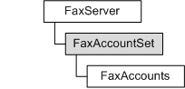

# FaxAccountSet object

Represents the set of all fax accounts on the server. It provides methods for adding, removing, and retrieving fax accounts.

## Members

The **FaxAccountSet** object has these types of members:

-   [Methods](#methods)

### Methods

The **FaxAccountSet** object has these methods.

| Method                                                        | Description                                                                                                                        |
|:--------------------------------------------------------------|:-----------------------------------------------------------------------------------------------------------------------------------|
| [**AddAccount**](-mfax-faxaccountset-addaccount-vb.md)       | Adds a fax account to the fax server and returns the new [**IFaxAccount**](/windows/previous-versions/FaxComex/nn-faxcomex-ifaxaccount?branch=master) object.             |
| [**GetAccount**](-mfax-faxaccountset-getaccount-vb.md)       | Returns an [**IFaxAccount**](/windows/previous-versions/FaxComex/nn-faxcomex-ifaxaccount?branch=master) object by using the account name.                                 |
| [**GetAccounts**](-mfax-faxaccountset-getaccounts-vb.md)     | Returns an [**IFaxAccounts**](/windows/previous-versions/FaxComex/nn-faxcomex-ifaxaccounts?branch=master) object that represents all the fax accounts on the fax server.  |
| [**RemoveAccount**](-mfax-faxaccountset-removeaccount-vb.md) | Removes a fax account from the fax server.                                                                               |

 

## Remarks

To create a **FaxAccountSet** object in Microsoft Visual Basic, call the [**FaxAccountSet**](-mfax-faxserver2-faxaccountset-vb.md) property of the [**IFaxServer2**](/windows/previous-versions/FaxComex/nn-faxcomex-ifaxserver2?branch=master) interface.

To create a **FaxAccountSet** object in C++, call the [**FaxAccountSet**](-mfax-faxserver2-faxaccountset-vb.md) method.

## Requirements

|                                     |                                                                                         |
|-------------------------------------|-----------------------------------------------------------------------------------------|
| Minimum supported client  | Windows Vista \[desktop apps only\]                                           |
| Minimum supported server  | Windows Server 2008 \[desktop apps only\]                                     |
| Header                    | <dl> <dt>Faxcomex.h</dt> </dl>   |
| DLL                       | <dl> <dt>Fxscomex.dll</dt> </dl> |
| IID                       | CLSID\_FaxAccountSet                                                          |

## See also

<dl> <dt>

[**IFaxAccountSet**](/windows/previous-versions/FaxComex/nn-faxcomex-ifaxaccountset?branch=master)
</dt> </dl>

 

 

