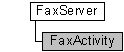

---
Description: 'The FaxActivity configuration object is a read-only object.'
ms.assetid: '5d3a10cb-64ef-4b20-a882-7f5e2738a8a0'
title: FaxActivity object
---

# FaxActivity object

The **FaxActivity** configuration object is a read-only object. The object permits a fax client application to access information about the activity on a connected fax server. For example, you can retrieve information about the number of outbound routing jobs that are currently executing, those that are pending processing, and those that are waiting in the job queue.

## Members

The **FaxActivity** object has these types of members:

-   [Methods](#methods)
-   [Properties](#properties)

### Methods

The **FaxActivity** object has these methods.

| Method                                          | Description                                                                                                                                                                                                                                                                                     |
|:------------------------------------------------|:------------------------------------------------------------------------------------------------------------------------------------------------------------------------------------------------------------------------------------------------------------------------------------------------|
| [**Refresh**](-mfax-faxactivity-refresh-vb.md) | The [**Refresh**](-mfax-faxactivity-refresh-vb.md) method refreshes **FaxActivity** information from the fax server.  The [**Refresh**](-mfax-faxactivity-refresh-vb.md) method refreshes [**IFaxActivity**](-mfax-faxactivity-cpp.md) information from the fax server.  |

 

### Properties

The **FaxActivity** object has these properties.

| Property                                                                     | Access type          | Description                                                                                                                                                                                                                                                                    |
|:-----------------------------------------------------------------------------|:---------------------|:-------------------------------------------------------------------------------------------------------------------------------------------------------------------------------------------------------------------------------------------------------------------------------|
| [**IncomingMessages**](-mfax-faxactivity-incomingmessages-vb.md)  | Read-only  | The [**IncomingMessages**](-mfax-faxactivity-incomingmessages-vb.md) property is a number that represents the total number of incoming fax jobs that the fax service is currently in the process of receiving.                                                      |
| [**OutgoingMessages**](-mfax-faxactivity-outgoingmessages-vb.md)  | Read-only  | The [**OutgoingMessages**](-mfax-faxactivity-outgoingmessages-vb.md) property is a number that represents the total number of outgoing fax jobs that the fax service is in the process of sending.                                                                  |
| [**QueuedMessages**](-mfax-faxactivity-queuedmessages-vb.md)      | Read-only  | The [**QueuedMessages**](-mfax-faxactivity-queuedmessages-vb.md) property is a number that represents the total number of fax jobs in the fax job queue that are pending processing. This does not include jobs for which the number of retries has been exceeded.  |
| [**RoutingMessages**](-mfax-faxactivity-routingmessages-vb.md)    | Read-only  | The [**RoutingMessages**](-mfax-faxactivity-routingmessages-vb.md) property is a number that represents the total number of incoming fax jobs that the fax service is currently routing.                                                                            |

 

## Remarks

A **FaxActivity** object is accessed through a [**FaxServer**](-mfax-faxserver.md) object.

To create a **FaxActivity** object in Microsoft Visual Basic, call the [**Activity**](-mfax-faxserver-activity.md) property of the [**FaxServer**](-mfax-faxserver.md) object.

To create a **FaxActivity** object in C++, call the [**Activity**](-mfax-faxserver-activity.md) method.

You can configure whether the fax service logs information about incoming and outgoing fax jobs in an activity log database. The [**FaxActivityLogging**](-mfax-faxactivitylogging.md) configuration object permits configuration of the activity logging options that the fax service uses.

## Requirements

|                                     |                                                                                         |
|-------------------------------------|-----------------------------------------------------------------------------------------|
| Minimum supported client  | Windows XP \[desktop apps only\]                                              |
| Minimum supported server  | Windows Server 2003 \[desktop apps only\]                                     |
| Header                    | <dl> <dt>Faxcomex.h</dt> </dl>   |
| DLL                       | <dl> <dt>Fxscomex.dll</dt> </dl> |
| IID                       | CLSID\_FaxActivity                                                            |

## See also

<dl> <dt>

[Fax Service object hierarchy](-mfax-fax-service-extended-com-object-model.md)
</dt> <dt>

[**IFaxActivity**](-mfax-faxactivity-cpp.md)
</dt> </dl>

 

 

