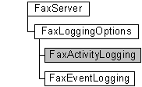

# FaxActivityLogging object

The **FaxActivityLogging** configuration object is used by a fax client application to retrieve and set options for activity logging. This includes setting whether entries for incoming and outgoing faxes should be logged and the location of the log file.

## Members

The **FaxActivityLogging** object has these types of members:

-   [Methods](#methods)
-   [Properties](#properties)

### Methods

The **FaxActivityLogging** object has these methods.

| Method                                                 | Description                                                                                                                                           |
|:-------------------------------------------------------|:------------------------------------------------------------------------------------------------------------------------------------------------------|
| [**Refresh**](-mfax-faxactivitylogging-refresh-vb.md) | The [**Refresh**](-mfax-faxactivitylogging-refresh-vb.md) method refreshes **FaxActivityLogging** object information from the fax server.  |
| [**Save**](-mfax-faxactivitylogging-save-vb.md)       | The [**Save**](-mfax-faxactivitylogging-save-vb.md) method saves the **FaxActivityLogging** object's data.                                 |

 

### Properties

The **FaxActivityLogging** object has these properties.

| Property                                                                    | Access type           | Description                                                                                                                                                                                                    |
|:----------------------------------------------------------------------------|:----------------------|:---------------------------------------------------------------------------------------------------------------------------------------------------------------------------------------------------------------|
| [**DatabasePath**](-mfax-faxactivitylogging-databasepath-vb.md)  | Read/write  | The [**DatabasePath**](-mfax-faxactivitylogging-databasepath-vb.md) property is a null-terminated string that contains the path to the activity log database file.                                  |
| [**LogIncoming**](-mfax-faxactivitylogging-logincoming-vb.md)    | Read/write  | The [**LogIncoming**](-mfax-faxactivitylogging-logincoming-vb.md) property is a Boolean value that indicates whether the fax service logs entries for incoming faxes in the activity log database.  |
| [**LogOutgoing**](-mfax-faxactivitylogging-logoutgoing-vb.md)    | Read/write  | The [**LogOutgoing**](-mfax-faxactivitylogging-logoutgoing-vb.md) property is a Boolean value that indicates whether the fax service logs entries for outgoing faxes in the activity log database.  |

 

## Remarks

A **FaxActivityLogging** object is accessed through a [**FaxLoggingOptions**](-mfax-faxloggingoptions.md) object.

> [!Note]  
> Changes made to the **FaxActivityLogging** object will not be saved until you call the [**Save**](-mfax-faxactivitylogging-save-vb.md) method.

 

To create a **FaxActivityLogging** object in Microsoft Visual Basic, call the [**ActivityLogging**](-mfax-faxloggingoptions-activitylogging-vb.md) property of the [**FaxLoggingOptions**](-mfax-faxloggingoptions.md) object.

To create a **FaxActivityLogging** object in C++, call the [**ActivityLogging**](-mfax-faxloggingoptions-activitylogging-vb.md) method.

## Requirements

|                                     |                                                                                         |
|-------------------------------------|-----------------------------------------------------------------------------------------|
| Minimum supported client  | Windows XP \[desktop apps only\]                                              |
| Minimum supported server  | Windows Server 2003 \[desktop apps only\]                                     |
| Header                    | <dl> <dt>Faxcomex.h</dt> </dl>   |
| DLL                       | <dl> <dt>Fxscomex.dll</dt> </dl> |
| IID                       | CLSID\_FaxActivityLogging                                                     |

## See also

<dl> <dt>

[Fax Service object hierarchy](-mfax-fax-service-extended-com-object-model.md)
</dt> <dt>

[**IFaxActivityLogging**](/previous-versions/windows/desktop/api/FaxComex/nn-faxcomex-ifaxactivitylogging)
</dt> </dl>

 

 

