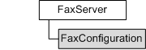

---
Description: 'Represents various objects that provide configuration options for the fax service.'
ms.assetid: '381e098b-d130-4e15-9aba-cb0048cc5b98'
title: FaxConfiguration object
---

# FaxConfiguration object

Represents various objects that provide configuration options for the fax service.

## Members

The **FaxConfiguration** object has these types of members:

-   [Methods](#methods)
-   [Properties](#properties)

### Methods

The **FaxConfiguration** object has these methods.

| Method                                               | Description                      |
|:-----------------------------------------------------|:---------------------------------|
| [**Refresh**](-mfax-faxconfiguration-refresh-vb.md) | Refreshes the object.  |
| [**Save**](-mfax-faxconfiguration-save-vb.md)       | Saves the object.      |

 

### Properties

The **FaxConfiguration** object has these properties.

| Property                                                                                              | Access type           | Description                                                                                                                                              |
|:------------------------------------------------------------------------------------------------------|:----------------------|:---------------------------------------------------------------------------------------------------------------------------------------------------------|
| [**AllowPersonalCoverPages**](-mfax-faxconfiguration-allowpersonalcoverpages-vb.md)        | Read/write  | Sets or retrieves a value that indicates whether personal cover pages are allowed.                                                             |
| [**ArchiveAgeLimit**](-mfax-faxconfiguration-archiveagelimit-vb.md)                        | Read/write  | Sets or retrieves a value that indicates how long a fax message is kept on the server.                                                         |
| [**ArchiveLocation**](-mfax-faxconfiguration-archivelocation-vb.md)                        | Read/write  | Sets or retrieves a value that indicates the location of the archive on the server.                                                            |
| [**ArchiveSizeHigh**](-mfax-faxconfiguration-archivesizehigh-vb.md)                        | Read-only   | The value that specifies the high-order 32-bit value (in bytes) for the size of the fax message archive.                                       |
| [**ArchiveSizeLow**](-mfax-faxconfiguration-archivesizelow-vb.md)                          | Read-only   | The value that specifies the low-order 32-bit value (in bytes) for the size of the fax message archive.                                        |
| [**AutoCreateAccountOnConnect**](-mfax-faxconfiguration-autocreateaccountonconnect-vb.md)  | Read/write  | Sets or retrieves a value that indicates whether the server automatically creates a fax account once a connection is initiated.                |
| [**Branding**](-mfax-faxconfiguration-branding-vb.md)                                      | Read/write  | Sets or retrieves a value that indicates whether the fax server generates a branding mark on outgoing faxes.                                   |
| [**DiscountRateEnd**](-mfax-faxconfiguration-discountrateend-vb.md)                        | Read/write  | Sets or retrieves a value that indicates the time at which the discount rate period ends.                                                      |
| [**DiscountRateStart**](-mfax-faxconfiguration-discountratestart-vb.md)                    | Read/write  | Sets or retrieves a value that indicates the time at which the discount rate period begins.                                                    |
| [**HighQuotaWaterMark**](-mfax-faxconfiguration-highquotawatermark-vb.md)                  | Read/write  | Sets or retrieves a value that indicates the maximum allotted size of a watermark.                                                             |
| [**IncomingFaxesArePublic**](-mfax-faxconfiguration-incomingfaxesarepublic-vb.md)          | Read/write  | Indicates whether incoming faxes are either viewable by everyone or private.                                                                   |
| [**IncomingQueueBlocked**](-mfax-faxconfiguration-blockincomingqueue-vb.md)                | Read/write  | Sets or retrieves a value that indicates whether the fax server queue for incoming faxes has been blocked.                                     |
| [**LowQuotaWaterMark**](-mfax-faxconfiguration-lowquotawatermark-vb.md)                    | Read/write  | Sets or retrieves a value that indicates the minimum size of a watermark.                                                                      |
| [**OutgoingQueueAgeLimit**](-mfax-faxconfiguration-outgoingqueueagelimit-vb.md)            | Read/write  | Sets or retrieves a value that indicates the length of time that an undeliverable fax message is kept on the fax server before it is deleted.  |
| [**OutgoingQueueBlocked**](-mfax-faxconfiguration-blockoutgoingqueue-vb.md)                | Read/write  | Sets or retrieves a value that indicates whether the fax server queue for outgoing faxes has been blocked.                                     |
| [**OutgoingQueuePaused**](-mfax-faxconfiguration-pauseoutgoingqueue-vb.md)                 | Read/write  | Sets or retrieves a value that indicates whether the outgoing queue has been paused.                                                           |
| [**Retries**](-mfax-faxconfiguration-retries-vb.md)                                        | Read/write  | Sets or retrieves a value that indicates the number of redial attempts for a given fax job.                                                    |
| [**RetryDelay**](-mfax-faxconfiguration-retrydelay-vb.md)                                  | Read/write  | Sets or retrieves a value that indicates the length of time the fax service should wait before retrying a failed fax transmission.             |
| [**SizeQuotaWarning**](-mfax-faxconfiguration-sizequotawarning-vb.md)                      | Read/write  | Sets or retrieves a value that indicates whether the size quota warning is turned on.                                                          |
| [**UseArchive**](-mfax-faxconfiguration-usearchive-vb.md)                                  | Read/write  | Sets or retrieves a value that indicates whether faxes should be archived.                                                                     |
| [**UseDeviceTSID**](-mfax-faxconfiguration-usedevicetsid-vb.md)                            | Read/write  | Sets or retrieves a value that indicates whether the TSID is used.                                                                             |

 

## Remarks

To create a **FaxConfiguration** object in Microsoft Visual Basic, call the [**Configuration**](-mfax-faxserver2-configuration-vb.md) property of the [**IFaxServer2**](-mfax-faxserver2-cpp.md) object.

To create a **FaxConfiguration** object in C++, call the [**Configuration**](-mfax-faxserver2-configuration-vb.md) method.

## Requirements

|                                     |                                                                                         |
|-------------------------------------|-----------------------------------------------------------------------------------------|
| Minimum supported client  | Windows Vista \[desktop apps only\]                                           |
| Minimum supported server  | Windows Server 2008 \[desktop apps only\]                                     |
| Header                    | <dl> <dt>Faxcomex.h</dt> </dl>   |
| DLL                       | <dl> <dt>Fxscomex.dll</dt> </dl> |
| IID                       | CLSID\_FaxConfiguration                                                       |

## See also

<dl> <dt>

[**IFaxConfiguration**](-mfax-ifaxconfiguration.md)
</dt> </dl>

 

 

